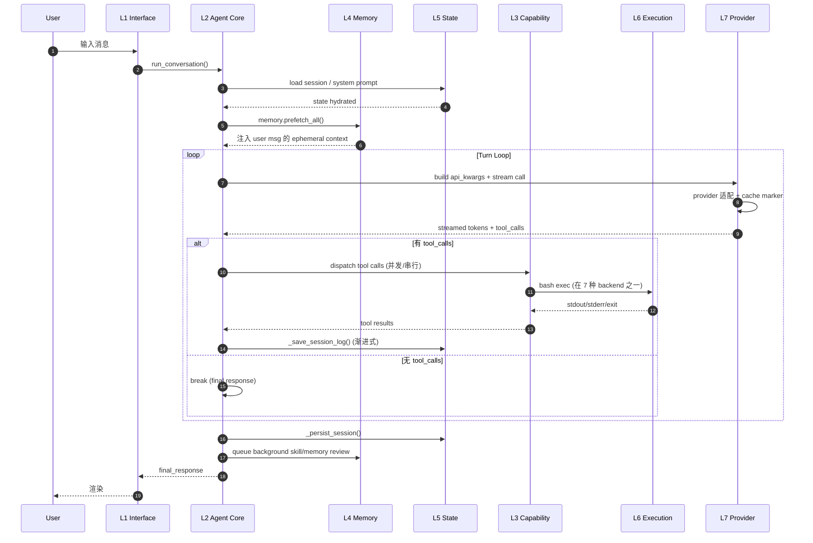
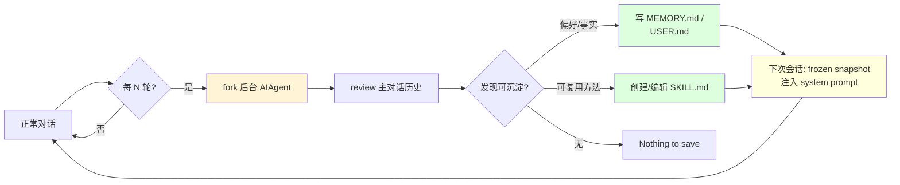

# Hermes Agent 技术架构总览

> 本文件是整个 `docs-tech/` 系列文档的**入口与导航中心**。
>
> 它回答三个问题：**(1) Hermes 是什么？(2) Hermes 的整体技术架构是什么？(3) 后续 Phase 文档怎么读？**
>
> 所有引用的文件路径、行数、目录结构均已**逐项核对**仓库实际状态（基于 v0.13.0 主分支快照）。

---

## 目录

- [一、项目定位](#一项目定位)
- [二、代码规模与目录结构（已核对）](#二代码规模与目录结构已核对)
- [三、总体技术架构（七层 + 三横切）](#三总体技术架构七层--三横切)
- [四、各层一句话简介](#四各层一句话简介)
- [五、贯穿全栈的三大主题](#五贯穿全栈的三大主题)
- [六、核心架构命题](#六核心架构命题)
- [七、与同类系统的对比定位](#七与同类系统的对比定位)
- [八、代码地标速查图](#八代码地标速查图)
- [九、文档导航](#九文档导航)
- [十、汇报"30 秒电梯演讲"卡](#十汇报30-秒电梯演讲卡)

---

## 一、项目定位

```
┌─────────────────────────────────────────────────────────────────┐
│                                                                 │
│   Hermes Agent  ☤                                               │
│   ───────────                                                   │
│   Nous Research 开源的"自我改进型"通用 AI Agent                  │
│                                                                 │
│   本质：一套完整的 Agent Harness 工程                            │
│   ────                                                          │
│   把"如何让一个 LLM 在真实世界里持续、稳定、自我演进地工作"       │
│   这件事，从一个研究问题做成一套可部署的工程系统。                │
│                                                                 │
└─────────────────────────────────────────────────────────────────┘
```

### 1.1 五个工程定位

```
┌─────────────────────────┬──────────────────────────────────────┐
│  维度                    │  Hermes 的取舍                        │
├─────────────────────────┼──────────────────────────────────────┤
│  Harness 与模型解耦      │  4 种 transport 抽象，支持 109+       │
│                          │  provider (OpenAI / Anthropic /       │
│                          │  Bedrock / OpenRouter / NIM / Codex / │
│                          │  小米 / GLM / Kimi / MiniMax / ...)   │
├─────────────────────────┼──────────────────────────────────────┤
│  不只是 CLI              │  同一份 Agent Core 被 7 种 interface  │
│                          │  复用：CLI / TUI / Gateway /          │
│                          │  ACP (IDE) / MCP Server / Cron /       │
│                          │  Batch Runner                          │
├─────────────────────────┼──────────────────────────────────────┤
│  持久化是一等公民         │  SQLite + Markdown 全量落盘，         │
│                          │  $5 VPS 跑 7×24，Modal/Daytona 上     │
│                          │  serverless 冷启复活                   │
├─────────────────────────┼──────────────────────────────────────┤
│  学习闭环内置             │  不靠 fine-tune，靠四种正交记忆        │
│                          │  ＋每 N 轮后台 review 飞轮            │
├─────────────────────────┼──────────────────────────────────────┤
│  多端可达                 │  20+ 即时通讯平台、Cron 调度、         │
│                          │  Web Dashboard、IDE 协议、MCP 暴露     │
└─────────────────────────┴──────────────────────────────────────┘
```

---

## 二、代码规模与目录结构（已核对）

### 2.1 核心文件行数

```
┌────────────────────────────────┬──────────┬──────────────────────────┐
│  文件                            │  行数    │  作用                     │
├────────────────────────────────┼──────────┼──────────────────────────┤
│  run_agent.py                   │  15,700  │  Agent Core 主循环         │
│  cli.py                         │  13,540  │  CLI 入口 + 命令解析       │
│  hermes_state.py                │   2,966  │  状态层（SQLite + FTS5）   │
│  trajectory_compressor.py       │   1,508  │  RL 训练数据离线压缩       │
│  mcp_serve.py                   │     897  │  MCP Server（对外暴露）    │
│  model_tools.py                 │     865  │  工具总入口 + async 桥接   │
│  toolsets.py                    │     855  │  工具集定义与组合          │
│  agent/context_compressor.py    │  ~1,400  │  Context 4 Pass 压缩       │
│  agent/prompt_builder.py        │  ~1,500  │  System Prompt 组装        │
│  agent/memory_manager.py        │    ~400  │  外部记忆 provider 编排    │
│  tools/registry.py              │    ~400  │  工具注册与派发            │
└────────────────────────────────┴──────────┴──────────────────────────┘
```

### 2.2 关键目录构成（已核对）

```
hermes-agent/
├── run_agent.py                ★ 主循环 (Phase 1)
├── cli.py                      ★ CLI 命令体系
├── hermes_state.py             ★ 状态层 (Phase 3)
├── trajectory_compressor.py    ★ 离线 RL 数据流水线
├── mcp_serve.py                ★ MCP Server
├── model_tools.py              ★ 工具总入口
├── toolsets.py                 ★ Toolset 定义
│
├── agent/        (50+ 文件)    ★ Agent 内核子模块
│   ├── transports/             ★ 4 种 LLM transport (Phase 2)
│   │   ├── anthropic.py
│   │   ├── bedrock.py
│   │   ├── chat_completions.py
│   │   └── codex.py
│   ├── context_compressor.py   ★ Context 压缩 (Phase 3)
│   ├── prompt_caching.py       ★ Anthropic cache 策略 (Phase 1)
│   ├── prompt_builder.py       ★ System Prompt 组装
│   ├── memory_manager.py       ★ 记忆 provider 编排 (Phase 4)
│   ├── memory_provider.py      ★ MemoryProvider 抽象基类
│   ├── context_engine.py       ★ ContextEngine 抽象基类
│   ├── retry_utils.py
│   ├── nous_rate_guard.py
│   ├── error_classifier.py
│   └── ...
│
├── tools/        (78 文件)     ★ 工具系统 (Phase 5)
│   ├── registry.py             ★ 工具注册中心
│   ├── *_tool.py (23+)         ★ 各类工具实现
│   └── environments/           ★ 7 种执行 backend (Phase 6)
│       ├── local.py
│       ├── docker.py
│       ├── ssh.py
│       ├── singularity.py
│       ├── modal.py
│       ├── daytona.py
│       └── vercel_sandbox.py
│
├── gateway/      (25 文件)     ★ 多平台 Gateway (Phase 7)
│   └── platforms/ (~20 平台)   ★ 各 IM 平台 adapter
│
├── hermes_cli/                 ★ CLI 子命令体系
├── ui-tui/ + tui_gateway/      ★ Ink TUI 前端 + Python 后端
├── acp_adapter/                ★ ACP IDE 协议适配
├── acp_registry/
├── cron/                       ★ Cron 调度器
│
├── plugins/                    ★ 可插拔扩展
│   ├── memory/ (8 providers)   ★ Honcho / mem0 / hindsight / ...
│   ├── context_engine/
│   └── ...
│
├── skills/ + optional-skills/  ★ 内置技能 (Phase 4)
├── environments/               ★ RL 训练环境（与 tools/environments 不同）
└── tinker-atropos/ + rl_cli.py ★ RL 训练接入
```

---

## 三、总体技术架构（七层 + 三横切）

> 这是整个 Hermes 系统的"北极星图"——请反复看，看到能脱稿画出为止。

```
╔══════════════════════════════════════════════════════════════════════════════╗
║                          Hermes Agent 总体架构                                ║
╠══════════════════════════════════════════════════════════════════════════════╣
║                                                                              ║
║  ┌────────────────────────────────────────────────────────────────────────┐ ║
║  │  L1  Interface Layer  ─  接入层                                         │ ║
║  │   CLI │ TUI(Ink+RPC) │ Gateway(20+ IM) │ ACP(IDE) │ MCP Server │ Cron  │ ║
║  │   Batch Runner │ Web Dashboard │ Voice Pipeline                        │ ║
║  └────────────────────────────────────────────────────────────────────────┘ ║
║                              │ (统一通过 AIAgent 实例 + 同一份命令体系)        ║
║                              ▼                                                ║
║  ┌────────────────────────────────────────────────────────────────────────┐ ║
║  │  L2  Agent Core  ─  ReAct Loop / Harness 核心  (run_agent.py)            │ ║
║  │   • Turn Loop + Iteration Budget                                        │ ║
║  │   • System Prompt 四段缓存 (stable/context/volatile/ephemeral)          │ ║
║  │   • Streaming + Health Poll + Stale Detection                           │ ║
║  │   • 30+ 失败模式 Retry / Provider Fallback                              │ ║
║  │   • Interrupt / Steer / Subagent Delegation                             │ ║
║  └────────────────────────────────────────────────────────────────────────┘ ║
║                              │                                                ║
║                              ▼                                                ║
║  ┌────────────────────────────────────────────────────────────────────────┐ ║
║  │  L3  Capability Layer  ─  能力层                                        │ ║
║  │   ┌─ Tool Registry (50+ 工具名, 模块级 self-register, check_fn TTL)    │ ║
║  │   ├─ Toolsets (web/terminal/browser/vision/messaging/cloud/…)          │ ║
║  │   ├─ Toolset Distributions (RL batch 用的概率采样)                      │ ║
║  │   ├─ Subagent / Delegate (强隔离 + 工具黑名单 + 深度限制)              │ ║
║  │   └─ Approval & Permission Gates (allowlist + dangerous pattern)        │ ║
║  └────────────────────────────────────────────────────────────────────────┘ ║
║                              │                                                ║
║                              ▼                                                ║
║  ┌────────────────────────────────────────────────────────────────────────┐ ║
║  │  L4  Memory & Learning Layer  ─  记忆与学习闭环  ★核心差异化★          │ ║
║  │   ┌─ 陈述性记忆: MEMORY.md (2200ch) + USER.md (1375ch) + SOUL.md       │ ║
║  │   ├─ 程序性记忆: Skills (agentskills.io 标准, 三层渐进披露)            │ ║
║  │   ├─ 情景记忆: SQLite + FTS5 双索引 (unicode61 + trigram)              │ ║
║  │   ├─ 用户建模: Honcho 辩证模型 (5 工具 + reasoning_level 5 档)         │ ║
║  │   ├─ Nudge 自演进飞轮: 每 N 轮后台 review → 自写 memory & skill        │ ║
║  │   └─ Skills Hub (GitHub/Clawhub/Lobehub/Claude Marketplace 拉取)       │ ║
║  └────────────────────────────────────────────────────────────────────────┘ ║
║                              │                                                ║
║                              ▼                                                ║
║  ┌────────────────────────────────────────────────────────────────────────┐ ║
║  │  L5  Context & State Layer  ─  上下文与状态层                           │ ║
║  │   ┌─ Session Store (SQLite WAL + jittered retry + 自动 NFS 降级)       │ ║
║  │   ├─ Schema v11 (sessions / messages / state_meta / fts / fts_trigram) │ ║
║  │   ├─ Session Lineage (parent_session_id, 压缩触发 session 分裂)        │ ║
║  │   ├─ Context Compressor (4 Pass: Prune→Head→Tail→LLM Summary)         │ ║
║  │   ├─ Session Search (FTS5 → 100K 截窗 → 辅助模型 focused summary)     │ ║
║  │   └─ Trajectory Compressor (离线 RL 训练数据流水线，与 runtime 解耦)  │ ║
║  └────────────────────────────────────────────────────────────────────────┘ ║
║                              │                                                ║
║                              ▼                                                ║
║  ┌────────────────────────────────────────────────────────────────────────┐ ║
║  │  L6  Execution Environment Layer  ─  执行环境层                         │ ║
║  │   统一接口 BaseEnvironment._run_bash() → ProcessHandle (鸭子类型)      │ ║
║  │   ┌─ local │ docker │ ssh │ singularity                                │ ║
║  │   └─ modal (snapshot) │ daytona (stop/resume) │ vercel-sandbox         │ ║
║  │   Session Snapshot 模式: env+cwd 序列化, 跨 backend 一致语义           │ ║
║  └────────────────────────────────────────────────────────────────────────┘ ║
║                              │                                                ║
║                              ▼                                                ║
║  ┌────────────────────────────────────────────────────────────────────────┐ ║
║  │  L7  Provider / Transport Layer  ─  模型供应商抽象层                    │ ║
║  │   HermesOverlay × models.dev catalog (109+ providers)                  │ ║
║  │   4 种 transport:                                                        │ ║
║  │     • openai_chat        • anthropic_messages                           │ ║
║  │     • codex_responses    • bedrock_converse                             │ ║
║  │   Prompt Cache 自适应 (Anthropic 5min rolling + 1h long-lived prefix)  │ ║
║  └────────────────────────────────────────────────────────────────────────┘ ║
║                                                                              ║
║  ┌─── 三横切 ──────────────────────────────────────────────────────────────┐║
║  │  X1  Configuration / Profile  (~/.hermes, env vars, cli-config.yaml)   │║
║  │  X2  Observability  (logging, insights engine, RL 指标, cost tracking) │║
║  │  X3  Security  (DM Pairing, Approval, Skills Guard, Secrets Vault)     │║
║  └────────────────────────────────────────────────────────────────────────┘║
╚══════════════════════════════════════════════════════════════════════════════╝
```

### 3.1 各层职责与边界

| 层 | 名称 | 是 | 不是 |
|---|---|---|---|
| **L1** | Interface | "用户/平台对话内核的入口" | 不做任何 AI 推理逻辑 |
| **L2** | Agent Core | "一次 turn 内部的 LLM ↔ Tools 协调" | 不持久化状态 / 不直接连模型 |
| **L3** | Capability | "Agent 能做什么" 的清单 + 派发 | 不决定何时调 / 不管执行环境 |
| **L4** | Memory & Learning | "跨会话变好" 的机制 | 不是普通的 RAG (没有静态知识库) |
| **L5** | Context & State | 会话级和跨会话状态 | 不缓存 LLM 调用结果（那是 L7） |
| **L6** | Execution Env | 工具命令的"宿主" | 不知道工具内容，只跑 bash |
| **L7** | Provider/Transport | 跟 LLM 的"南向接口" | 不管 prompt 内容 / 不管 retry 策略 |

### 3.2 数据流方向（请求-响应）



---

## 四、各层一句话简介

### L1：Interface Layer（接入层）

```
┌────────────────────────────────────────────────────────────────┐
│  "把 Agent 对话能力分发给所有可能的人机交互形态"                 │
│                                                                │
│  特性：                                                         │
│   • 单进程多 Adapter (Gateway 同时 mux 20+ IM 平台)             │
│   • Session key 格式: agent:main:{platform}:{type}:{id}        │
│   • 斜杠命令跨平台统一解析 (hermes_cli/commands.py)             │
│   • 两级消息守卫 (adapter pending_messages + runner 命令直通)    │
│   • Cron 嵌入式调度器 (每 60s tick, 每 job 起独立 AIAgent)      │
│   • ACP = async JSON-RPC 把同步 AIAgent 桥接给 IDE              │
│   • MCP Server = 把对话 expose 给 Claude Code / Cursor          │
│                                                                │
│  关键文件:                                                      │
│    gateway/run.py, gateway/platforms/*.py (~20 个),             │
│    hermes_cli/commands.py, cron/scheduler.py,                  │
│    acp_adapter/server.py, mcp_serve.py                         │
└────────────────────────────────────────────────────────────────┘
```

### L2：Agent Core（ReAct Loop / Harness 核心）

```
┌────────────────────────────────────────────────────────────────┐
│  "一次 turn 内部，把 LLM、工具、状态、人机交互编排好"            │
│                                                                │
│  特性：                                                         │
│   • Turn Loop = 结构化 Tool-Calling Loop (ReAct 后裔)           │
│   • 双重预算 (max_iterations + IterationBudget)                │
│   • System Prompt 4 段缓存 (stable 1h + 滚动 5m + tools 1h)    │
│   • 强制 Streaming + 90s Stale Detection                       │
│   • Retry Matrix: 30+ 失败模式 × 差异化恢复动作                  │
│   • Interrupt 三级传播 (主循环/工具线程/子 Agent)                │
│   • Steer 延迟合并 (双 drain + 塞 tool result)                  │
│                                                                │
│  关键文件:                                                      │
│    run_agent.py (15700 行, class AIAgent @ L1028),              │
│    agent/prompt_caching.py, agent/retry_utils.py,              │
│    agent/error_classifier.py                                   │
└────────────────────────────────────────────────────────────────┘
```

### L3：Capability Layer（能力层 / 工具系统）

```
┌────────────────────────────────────────────────────────────────┐
│  "把所有 Agent 能做的事情，做成统一注册 + 派发的工具"            │
│                                                                │
│  特性：                                                         │
│   • 50+ 工具名 (23+ _tool.py 模块, 模块级自注册)                │
│   • check_fn 30s TTL 缓存 (Docker/Modal/SSH 慢探测)             │
│   • Toolsets = 命名的工具组合; Distributions = 概率采样          │
│   • Subagent: 黑名单工具 + 空历史 + max_spawn_depth=2          │
│   • Permission Gate 三层 (check_fn / pre-hook / allowlist)     │
│   • async/sync 桥接四上下文 (CLI / Gateway / Worker / Timeout) │
│   • MCP 双角色: 既是 server (mcp_serve) 也可是 client (mcp_tool)│
│                                                                │
│  关键文件:                                                      │
│    tools/registry.py (ToolRegistry @ L151),                     │
│    model_tools.py, toolsets.py,                                │
│    tools/delegate_tool.py, tools/approval.py                   │
└────────────────────────────────────────────────────────────────┘
```

### L4：Memory & Learning Layer ★

```
┌────────────────────────────────────────────────────────────────┐
│  "跨会话越用越懂你——不靠 fine-tune，靠四种正交记忆 + 飞轮"      │
│                                                                │
│  四种记忆：                                                      │
│   ① 陈述性: MEMORY.md (2200ch) + USER.md (1375ch) — frozen      │
│      snapshot 注入 system, 文件级 fcntl 锁                       │
│   ② 程序性: Skills (agentskills.io 标准, YAML frontmatter)     │
│      三层渐进披露 (manifest → SKILL.md → scripts)              │
│   ③ 情景: SQLite + FTS5 双索引 (unicode61 + trigram CJK)       │
│   ④ 用户建模: Honcho 5 工具 (profile/search/reasoning/         │
│      context/conclude), reasoning_level 5 档                   │
│                                                                │
│  飞轮：                                                         │
│   每 ~10 轮触发后台 review thread (forked AIAgent)              │
│    → 自动写 memory / 创建/编辑 skill                            │
│    → 不污染主对话, 标记 _memory_write_origin="background_review"│
│                                                                │
│  关键文件:                                                      │
│    agent/memory_manager.py, agent/memory_provider.py,           │
│    tools/memory_tool.py, tools/skills_tool.py,                 │
│    tools/skill_manager_tool.py,                                │
│    plugins/memory/ (8 providers), skills/, optional-skills/    │
└────────────────────────────────────────────────────────────────┘
```

### L5：Context & State Layer

```
┌────────────────────────────────────────────────────────────────┐
│  "Agent 能 7×24 跑下去的状态基础设施"                            │
│                                                                │
│  特性：                                                         │
│   • SQLite Schema v11 (sessions / messages / state_meta)        │
│   • WAL 模式 + 应用层抖动重试 + NFS/SMB 自动降级 DELETE journal │
│   • PASSIVE WAL checkpoint 每 50 次写触发                       │
│   • 双 FTS5 索引 (标准 unicode61 + trigram CJK substring)       │
│   • Session lineage (parent_session_id, 压缩触发 session 分裂)  │
│   • Context Compressor 4 Pass (Prune→Head→Tail→LLM Summary)    │
│   • Anti-thrash: 连续压缩节省<10% 拒绝再压                       │
│   • Session Search: FTS5 → 100K 字符窗口 → 辅助模型 summary    │
│                                                                │
│  ★ 注意区分两种"压缩":                                            │
│   • 运行时压缩 (agent/context_compressor.py): 给 LLM 用          │
│   • 离线压缩 (trajectory_compressor.py): 给 RL 训练数据用        │
│                                                                │
│  关键文件:                                                      │
│    hermes_state.py (2966 行, SCHEMA_VERSION=11 @ L36),          │
│    agent/context_compressor.py, agent/context_engine.py,        │
│    tools/session_search_tool.py                                │
└────────────────────────────────────────────────────────────────┘
```

### L6：Execution Environment Layer

```
┌────────────────────────────────────────────────────────────────┐
│  "工具命令的宿主——同一个 bash 工具能跑在 7 种环境上"             │
│                                                                │
│  七种 backend (统一接口 BaseEnvironment._run_bash):              │
│   ┌─────────────┬───────────┬─────────┬──────────────────────┐ │
│   │ Backend     │ Isolation │ Latency │ 持久化模式            │ │
│   ├─────────────┼───────────┼─────────┼──────────────────────┤ │
│   │ local       │ 无         │ ~10ms   │ 原生 FS              │ │
│   │ docker      │ 容器       │ ~1s     │ Volume mount         │ │
│   │ ssh         │ 远程       │ ~200ms  │ 远程 FS              │ │
│   │ singularity │ Overlay FS │ ~500ms  │ Host scratch + SIF   │ │
│   │ modal       │ 云沙箱     │ ~30s    │ Snapshot ID 持久化 ★ │ │
│   │ daytona     │ 云沙箱     │ ~5s     │ stop/resume (非 kill) │ │
│   │ vercel      │ Serverless │ ~2s     │ 共享 ephemeral       │ │
│   └─────────────┴───────────┴─────────┴──────────────────────┘ │
│                                                                │
│   • Session snapshot 模式: env / functions / aliases / cwd     │
│   • Spawn-per-call (非长连接 shell) — 隔离 vs 性能权衡          │
│   • CWD 同步: stdout marker (远程) vs temp file (local)         │
│   • Local "CWD 自愈": 工具删了自己的 CWD 自动回退到祖先目录      │
│                                                                │
│  关键文件:                                                      │
│    tools/environments/base.py, local.py, docker.py, ssh.py,    │
│    singularity.py, modal.py, daytona.py, vercel_sandbox.py     │
└────────────────────────────────────────────────────────────────┘
```

### L7：Provider / Transport Layer

```
┌────────────────────────────────────────────────────────────────┐
│  "把 109+ LLM provider 归一到 4 种 transport 协议"               │
│                                                                │
│  三层配置融合：                                                  │
│   ① models.dev catalog (基线，自动)                            │
│   ② HermesOverlay (仓库内, transport 类型 / 额外 env vars)      │
│   ③ 用户 config.yaml (最终覆盖)                                 │
│                                                                │
│  四种 Transport：                                                │
│   ┌──────────────────────┬──────────────────────────────────┐  │
│   │ transport             │ 代表 provider                     │  │
│   ├──────────────────────┼──────────────────────────────────┤  │
│   │ openai_chat          │ OpenAI / OpenRouter / NIM / GLM / │  │
│   │                      │ Kimi / 小米 / Fireworks / ...     │  │
│   │ anthropic_messages   │ Anthropic native / Nous Portal    │  │
│   │ codex_responses      │ OpenAI Codex Responses API        │  │
│   │ bedrock_converse     │ AWS Bedrock Converse              │  │
│   └──────────────────────┴──────────────────────────────────┘  │
│                                                                │
│  三种认证：api_key / oauth_device_code / external_process       │
│  Credential pool 多 key 轮换 + 雪崩防护                          │
│                                                                │
│  关键文件:                                                      │
│    hermes_cli/providers.py, agent/transports/,                  │
│    agent/credential_pool.py, agent/credential_sources.py,       │
│    agent/anthropic_adapter.py, agent/bedrock_adapter.py,        │
│    agent/codex_responses_adapter.py                            │
└────────────────────────────────────────────────────────────────┘
```

### 三横切（X1 / X2 / X3）

```
┌────────────────────────────────────────────────────────────────┐
│  X1  Configuration / Profile                                    │
│  ─────────────────────────                                      │
│   • ~/.hermes/ 目录全局状态                                      │
│   • cli-config.yaml.example (45KB, 所有可配置项)                │
│   • .env.example (22KB, env var 全集)                          │
│   • Profile = 命名的配置 set (hermes_cli/profiles.py)           │
│   • 优先级: env > config.yaml > overlay > catalog               │
└────────────────────────────────────────────────────────────────┘

┌────────────────────────────────────────────────────────────────┐
│  X2  Observability                                              │
│  ─────────────────                                              │
│   • hermes_logging.py (13KB)                                    │
│   • agent/trajectory.py — 轨迹记录                              │
│   • agent/insights.py + /insights 命令 — 用量聚合              │
│   • agent/account_usage.py + agent/usage_pricing.py — 成本     │
│   • agent/redact.py — 日志脱敏                                  │
│   • Per-turn _turn_exit_reason 标签 (可分析诊断遗产)            │
└────────────────────────────────────────────────────────────────┘

┌────────────────────────────────────────────────────────────────┐
│  X3  Security                                                   │
│  ──────────                                                     │
│   • 命令审批: tools/approval.py + 危险命令 regex (Phase 1 § 10.5)│
│   • Skills Guard: hermes_cli/skills_hub.py 注入扫描             │
│   • DM Pairing: gateway/pairing.py (8 位无歧义码 + 速率限制)    │
│   • Secrets: tools/credential_files.py                          │
│   • 文件路径白名单 (各 tool 内)                                  │
│   • Subagent 强隔离 (独立 task_id + 黑名单工具)                  │
└────────────────────────────────────────────────────────────────┘
```

---

## 五、贯穿全栈的三大主题

> 有些工程思想不属于任何单层，而是**贯穿整个系统**的设计 DNA。

### 主题 1：状态外置（Stateless Compute Core）

```
   ┌──────────────────────────────────────────────────────┐
   │                                                      │
   │   AIAgent 实例本身是"轻状态"的：                       │
   │     • 进程级状态：iteration_budget._used / 计数器      │
   │     • Session 级状态：messages / cached_system_prompt │
   │                                                      │
   │   所有"重状态"全部外置：                               │
   │     • Session 历史 → SQLite (state.db)                │
   │     • Memory → MEMORY.md / USER.md (文件)             │
   │     • Skills → ~/.hermes/skills/*/SKILL.md            │
   │     • Cron Jobs → jobs.json                          │
   │     • Pairing → ~/.hermes/pairing/                    │
   │     • Modal snapshot ID → modal_snapshots.json        │
   │                                                      │
   │   收益：                                              │
   │     ✓ Gateway 崩溃可恢复                              │
   │     ✓ 跨 interface 同一会话                            │
   │     ✓ 多个 Agent 实例（subagent / gateway 多用户）共存 │
   │     ✓ $5 VPS 也能 7×24 跑                            │
   └──────────────────────────────────────────────────────┘
```

### 主题 2：自演进闭环（Self-Improving Flywheel）

> Hermes **跟一般 Agent 框架最大的差异**就在这里。



```
┌──────────────────────────────────────────────────────────┐
│  关键设计：                                                │
│   • 后台 review 跑在独立线程，不污染主对话                  │
│   • 写入标记 _memory_write_origin="background_review"    │
│   • prompt 中显式要求 "Be ACTIVE — 大多数会话都该产生     │
│     至少一个 skill 更新"（对抗模型默认惰性）               │
│   • frozen snapshot 意味着本次会话不读新写入的 MEMORY.md  │
│     → 不打穿 Anthropic prompt cache                      │
│   • Skill 是"程序性记忆"，比 MEMORY.md 表达力更强          │
│                                                          │
│  这才是真正不靠 fine-tune 的"模型自演进"路径。             │
└──────────────────────────────────────────────────────────┘
```

### 主题 3：可插拔的五个平面（5 Pluggable Planes）

```
┌──────────────────────────────────────────────────────────┐
│  Hermes = 五个解耦平面的乐高积木                           │
│                                                          │
│  ① Interface Plane (L1)                                  │
│     CLI / TUI / Gateway / ACP / MCP / Cron / Batch       │
│     ↑ 都是同一个 AIAgent 的客户端                          │
│                                                          │
│  ② Provider Plane (L7)                                   │
│     4 种 transport × 109+ provider                       │
│     ↑ 4 种适配器 + Overlay 描述就能新接一家厂商           │
│                                                          │
│  ③ Tool Plane (L3)                                       │
│     模块级 self-register，加文件即扩工具                   │
│                                                          │
│  ④ Memory Provider Plane (L4)                            │
│     MemoryProvider 抽象基类，8 个 plugin (Honcho/mem0...) │
│                                                          │
│  ⑤ Execution Backend Plane (L6)                          │
│     BaseEnvironment 接口，7 个 backend                    │
│                                                          │
│  共同特征：抽象基类 + 模块发现 + 配置驱动                   │
└──────────────────────────────────────────────────────────┘
```

---

## 六、核心架构命题

> 如果把整个 Hermes 浓缩成一句话，就是这个命题。

```
╔══════════════════════════════════════════════════════════════════╗
║                                                                  ║
║   "把 Agent 设计为                                                ║
║                                                                  ║
║       【无状态计算核 (L2)】                                       ║
║     + 【外置状态 (L4 / L5)】                                      ║
║     + 【可插拔接入 (L1)】                                         ║
║     + 【可插拔执行 (L6)】                                         ║
║     + 【可插拔模型 (L7)】                                         ║
║                                                                  ║
║    五个解耦平面，                                                  ║
║    再用 Nudge 闭环 (L4) 让系统跨会话自演进。"                      ║
║                                                                  ║
╚══════════════════════════════════════════════════════════════════╝
```

### 6.1 命题的工程含义

```
┌──────────────────────────────────────────────────────────────────┐
│                                                                  │
│  "无状态计算核" → 多实例并发 / 重启容错                              │
│       ↓                                                          │
│  "外置状态"     → 跨 interface 一致 / 跨重启持久                    │
│       ↓                                                          │
│  "可插拔接入"   → 一份逻辑，七种入口                                │
│       ↓                                                          │
│  "可插拔执行"   → \$5 VPS 到 GPU 集群的部署连续谱                   │
│       ↓                                                          │
│  "可插拔模型"   → 不被任何模型厂商绑死                              │
│       ↓                                                          │
│  "Nudge 飞轮"   → 不靠 fine-tune 的自演进                          │
│                                                                  │
│  ──── 五个独立但协同的属性，构成了完整的"Agent Harness"产品力 ──── │
│                                                                  │
└──────────────────────────────────────────────────────────────────┘
```

---

## 七、与同类系统的对比定位

```
┌─────────────────┬───────────┬───────────┬───────────┬──────────┐
│ 维度             │ Hermes    │ Claude    │ OpenAI    │ LangChain│
│                  │           │ Code      │ Agents SDK│ Agent    │
├─────────────────┼───────────┼───────────┼───────────┼──────────┤
│ 主要场景         │ 通用 Agent│ 编码助手   │ 应用集成   │ 框架     │
│ 多 provider     │ 109+ ✓    │ Claude only│ OpenAI 优先│ 100+ ✓  │
│ Prompt Cache    │ 4 段 ✓    │ ✓         │ 自动       │ ✗       │
│ Streaming Stale │ 90s ✓     │ ?         │ ?         │ ✗       │
│ Retry Matrix    │ 30+ 模式 ✓│ 较少       │ 基本       │ 简单    │
│ Interrupt 三级  │ ✓         │ ✓         │ ?         │ ✗       │
│ Steer 延迟      │ ✓ 独特    │ ✗         │ ✗         │ ✗       │
│ Subagent 隔离   │ ✓ 强      │ ✓         │ ✗         │ ✓ 弱    │
│ 自演进飞轮       │ ✓ 独特    │ ✗         │ ✗         │ ✗       │
│ 多 interface    │ 7 种 ✓    │ CLI/IDE    │ API only  │ 自建    │
│ 7 种执行 backend│ ✓         │ Local only│ ✗         │ 部分    │
│ Skills 标准     │ agentskill│ Skills    │ 类似       │ Tools 化│
│ Memory 多 prov  │ 8 ✓       │ 内置       │ 内置       │ 多种    │
│ 开源            │ MIT ✓     │ 闭源       │ 部分       │ MIT ✓   │
└─────────────────┴───────────┴───────────┴───────────┴──────────┘
```

**结论**：
- Hermes 不是"功能更多"的 Agent，而是**工程深度上对标 Claude Code，但更开放、更通用、自带学习闭环**的 Agent。
- 它的差异化护城河是：**自演进闭环（飞轮）+ 多 interface 复用 + 7 种执行 backend 的部署连续谱**。

---

## 八、代码地标速查图

> 一张图速查"哪个文件干什么"。已核对所有路径与行数。

```
                          【接入入口】
┌─────────────────────────────────────────────────────────────┐
│  cli.py (13540)               ─ CLI 命令派发                  │
│  hermes_cli/main.py           ─ Hermes CLI 顶层入口          │
│  hermes_cli/commands.py       ─ 斜杠命令注册表                │
│  ui-tui/                      ─ Ink TS 前端                  │
│  tui_gateway/entry.py         ─ TUI Python 后端              │
│  gateway/run.py               ─ Gateway 主进程                │
│  gateway/platforms/*.py       ─ ~20 个 IM 平台 adapter        │
│  acp_adapter/server.py        ─ ACP (IDE) JSON-RPC server     │
│  mcp_serve.py (897)           ─ MCP Server (对外暴露)          │
│  cron/scheduler.py            ─ Cron 嵌入式调度器              │
│  batch_runner.py (56K)        ─ 批生成入口                    │
└─────────────────────────────────────────────────────────────┘
                            │
                            ▼
                          【Agent Core】
┌─────────────────────────────────────────────────────────────┐
│  run_agent.py (15700)                                        │
│    ├─ L283  class IterationBudget                            │
│    ├─ L388  _should_parallelize_tool_batch                   │
│    ├─ L1028 class AIAgent                                    │
│    ├─ L5196 interrupt() / clear_interrupt()                 │
│    ├─ L5297 steer() / _drain_pending_steer()                │
│    ├─ L7323 _interruptible_api_call (非流式)                 │
│    ├─ L7641 _interruptible_streaming_api_call (流式)         │
│    ├─ L8534 _try_activate_fallback                          │
│    ├─ L10194 _compress_context                               │
│    ├─ L10410 _execute_tool_calls                             │
│    ├─ L10564 _execute_tool_calls_concurrent                  │
│    ├─ L10965 _execute_tool_calls_sequential                  │
│    └─ L11613 run_conversation ★ 主入口                      │
│                                                              │
│  agent/prompt_caching.py     ─ Anthropic cache 策略           │
│  agent/prompt_builder.py     ─ 4 段 system prompt 组装         │
│  agent/retry_utils.py        ─ 抖动退避                       │
│  agent/error_classifier.py   ─ 错误分类                       │
│  agent/curator.py            ─ 消息消毒 / orphan 修复          │
│  agent/think_scrubber.py     ─ thinking 块清洗                │
└─────────────────────────────────────────────────────────────┘
              │              │             │              │
              ▼              ▼             ▼              ▼
       【南向】        【状态】         【记忆】         【工具】
┌────────────────┐ ┌───────────┐ ┌──────────────┐ ┌──────────────┐
│ agent/         │ │hermes_    │ │agent/        │ │tools/        │
│  transports/   │ │ state.py  │ │ memory_      │ │ registry.py  │
│ ├─anthropic.py │ │(2966)     │ │ manager.py   │ │ (ToolRegistry│
│ ├─bedrock.py   │ │           │ │              │ │  @ L151)     │
│ ├─chat_complet.│ │SCHEMA v11 │ │memory_       │ │              │
│ └─codex.py     │ │@ L36      │ │ provider.py  │ │tools/        │
│                │ │sessions   │ │              │ │ *_tool.py    │
│hermes_cli/     │ │@ L190    │ │tools/        │ │ (23+ 文件)   │
│ providers.py   │ │messages   │ │ memory_tool  │ │              │
│                │ │@ L224    │ │              │ │tools/        │
│agent/          │ │FTS5       │ │tools/        │ │ delegate_    │
│ credential_    │ │@ L254    │ │ skills_tool  │ │ tool.py      │
│  pool.py       │ │FTS5       │ │ skill_mgr_   │ │              │
│ credential_    │ │trigram    │ │ tool         │ │tools/        │
│  sources.py    │ │@ L283    │ │              │ │ approval.py  │
│                │ │           │ │plugins/      │ │              │
│agent/          │ │agent/     │ │ memory/      │ │model_tools.py│
│ anthropic_     │ │ context_  │ │ (8 providers)│ │ (865)        │
│ bedrock_       │ │ compressor│ │              │ │              │
│ codex_         │ │  .py      │ │skills/ +     │ │toolsets.py   │
│ adapter.py     │ │ context_  │ │ optional-    │ │ (855)        │
│                │ │ engine.py │ │ skills/      │ │              │
│                │ │           │ │              │ │tools/        │
│                │ │trajectory │ │              │ │ environments/│
│                │ │_compres.. │ │              │ │ (7 backend)  │
│                │ │ (1508)    │ │              │ │              │
└────────────────┘ └───────────┘ └──────────────┘ └──────────────┘
   Phase 2          Phase 3        Phase 4          Phase 5/6
```

---

## 九、文档导航

> `docs-tech/` 系列采用"**总览 + Phase 分册**"结构：

```
docs-tech/
├── 00_ARCHITECTURE_OVERVIEW.md     ← 你在这里
│   └─ 全局架构 + 文档导航
│
├── HERMES_LEARNING_ROADMAP.md      ← 在仓库根目录
│   └─ 11.5 天递进式学习路线
│
├── PHASE_1_AGENT_CORE.md           ✅ 已完成 (1986 行)
│   └─ ReAct 主循环 + Retry + Interrupt + Steer + Cache
│
├── PHASE_2_PROVIDER_TRANSPORT.md   ⏳ 待生成
│   └─ 4 种 transport + 109+ provider + 认证 + 凭证池
│
├── PHASE_3_CONTEXT_STATE.md        ⏳ 待生成 ★
│   └─ SQLite + FTS5 + Context Compressor + Session Lineage
│      ★ 生产级 Agent 长跑能力的基石 (长会话 / 崩溃恢复 / 跨会话搜)
│
├── PHASE_4_MEMORY_LEARNING.md      ⏳ 待生成 ★
│   └─ 四种记忆 + Skills + Honcho + Nudge 飞轮
│      ★ 与一般 Agent 框架的核心差异 (自演进飞轮)
│
├── PHASE_5_CAPABILITY.md           ⏳ 待生成
│   └─ Tool Registry + Toolsets + Subagent + MCP
│
├── PHASE_6_EXECUTION_ENV.md        ⏳ 待生成
│   └─ 7 种 backend + Session Snapshot + Serverless 持久化
│
├── PHASE_7_INTERFACE.md            ⏳ 待生成
│   └─ Gateway + CLI/TUI + ACP + MCP + Cron + Voice
│
└── PHASE_8_CROSS_CUTTING.md        ⏳ 待生成
    └─ Config + Observability + Security
```

### 9.1 推荐阅读顺序

```
   学习者路径 (从零到全)：
   ─────────────────
   00 (本文)
     ↓
   ROADMAP (在仓库根) — 看建议节奏
     ↓
   Phase 1 → 2 → 3 → 4 ★ → 5 → 6 → 7 → 8
```

```
   汇报者路径 (优先讲故事)：
   ─────────────────
   00 (本文) — 让领导先理解全局
     ↓
   Phase 4 ★ — 直接讲差异化 (自演进)
     ↓
   Phase 1 — 讲工程深度 (主循环)
     ↓
   选讲 (按时间 / 听众): 2/3/5/6/7
```

```
   工程师参考路径 (按需查阅)：
   ─────────────────
   00 § 八 (代码地标) → 直接定位到目标文件
     ↓
   对应 Phase 文档的"关键代码地图"小节
```

### 9.2 各 Phase 文档承诺的产出

每份 Phase 文档都保证产出以下"工程交付物"：

```
┌──────────────────────────────────────────────────────────────┐
│  ① 架构图 (Mermaid + ASCII)                                   │
│  ② 时序图 (Mermaid sequence)                                  │
│  ③ 状态机/决策树 (Mermaid stateDiagram / flowchart)           │
│  ④ 对照表 (技术取舍 / 失败模式 / 配置项)                       │
│  ⑤ 端到端示例 (一次真实操作的全链路)                            │
│  ⑥ 关键代码地图 (file:line 速查)                              │
│  ⑦ 高频 Q&A 储备 (汇报现场弹药)                                │
│  ⑧ 自检清单 (白板能力检测)                                     │
│  ⑨ 衔接下一 Phase 的预告                                       │
└──────────────────────────────────────────────────────────────┘
```

---

## 十、汇报"30 秒电梯演讲"卡

> 直接背下来用。

```
╔══════════════════════════════════════════════════════════════════════╗
║                                                                      ║
║  "Hermes Agent 是 Nous Research 开源的自演进型通用 AI Agent，          ║
║   本质上是一套生产级 Agent Harness 工程。                              ║
║                                                                      ║
║   它不是一个 Chat Bot，也不是一个 RAG 应用，                          ║
║   而是把 LLM 在真实世界长期工作的全部工程问题——                       ║
║   主循环加固、Prompt 缓存、失败恢复、人机交互、状态持久化、             ║
║   多端接入、跨会话演进——全部解决了一遍。                              ║
║                                                                      ║
║   它的核心架构是七层 + 三横切：                                         ║
║   接入层 / Agent 核 / 能力层 / 记忆层 / 状态层 / 执行层 / 模型层。     ║
║                                                                      ║
║   它跟其他 Agent 框架最大的差异是【自演进闭环】——                     ║
║   不靠 fine-tune，靠四种正交记忆（陈述性/程序性/情景/用户模型）        ║
║   + 每 N 轮后台 review 飞轮，让 Agent 真正越用越懂你。"                ║
║                                                                      ║
╚══════════════════════════════════════════════════════════════════════╝
```

---

## 附：本文档维护规则

| 规则 | 说明 |
|---|---|
| **源码同步** | 引用的行号 / 文件 / 类名必须**逐项核对**当前主分支 |
| **图形优先** | 任何概念优先用图（mermaid / ASCII / 表），文字仅作图的注解 |
| **不放代码** | 代码块只在"行号定位"场合使用，不放大段实现代码 |
| **版本快照** | 文档头部标注基于的 Hermes 版本（当前 v0.13.0） |
| **导航完整** | 每次新增 Phase 文档，更新本文 § 九 的导航清单 |

---

*文档生成时间：基于 Hermes Agent v0.13.0 主分支快照。*
*下一站：[Phase 1 — Agent Core 主循环](./PHASE_1_AGENT_CORE.md)*
