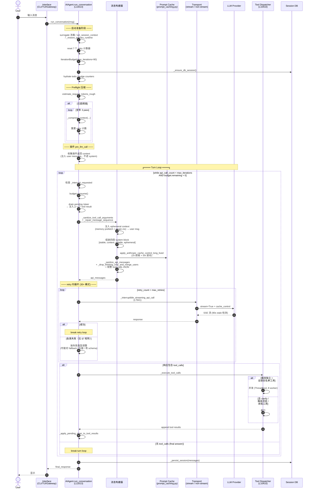
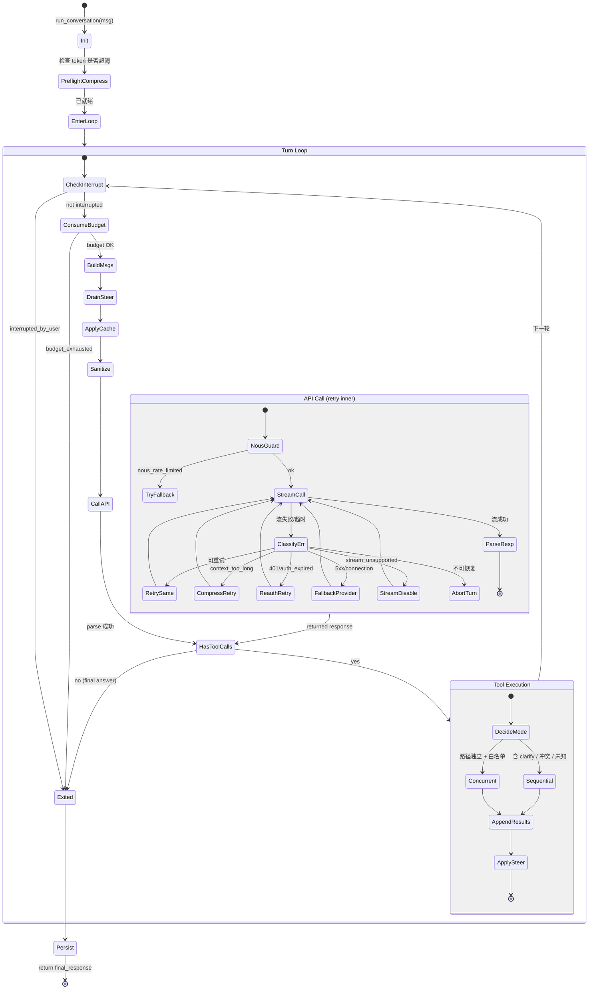
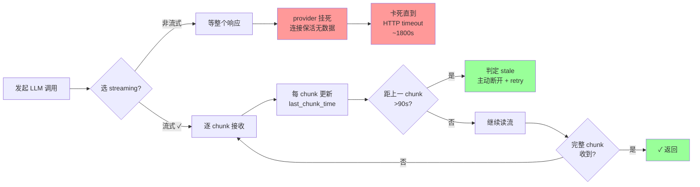
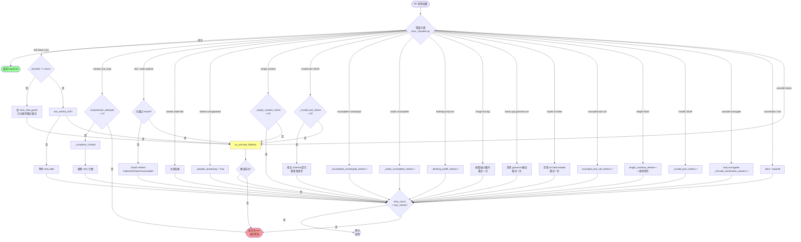
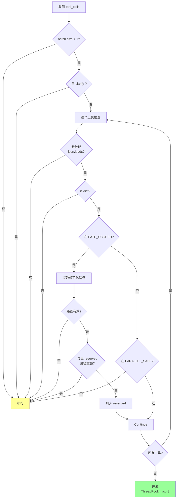
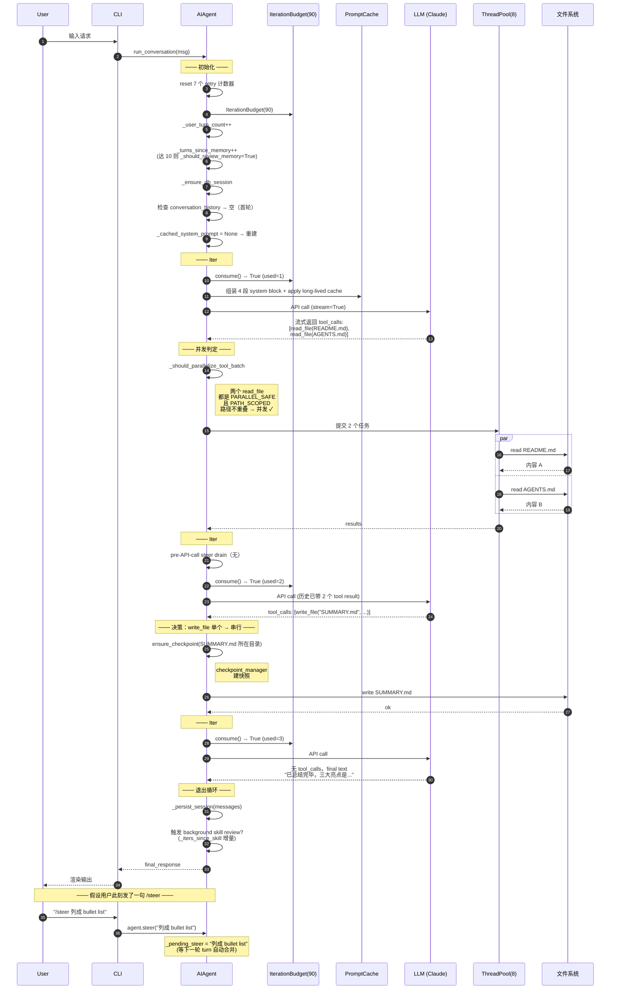
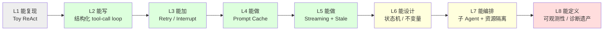

# Phase 1 技术方案：Agent Core — ReAct 主循环

> 本文件以**图形化方式**讲解 Hermes Agent 的核心 ReAct 主循环。
>
> 所有引用的函数与行号均已在 `run_agent.py`（15,700 行）与 `agent/prompt_caching.py` 中**逐行核对**。

---

## 0. 本文件目录

- [0. 本文件目录](#0-本文件目录)
- [1. AIAgent 在系统中的位置](#1-aiagent-在系统中的位置)
- [2. Turn Loop 总时序图](#2-turn-loop-总时序图)
- [3. 主循环状态机](#3-主循环状态机)
- [4. 双重预算（IterationBudget × max\_iterations）](#4-双重预算iterationbudget--max_iterations)
- [5. System Prompt 四段缓存](#5-system-prompt-四段缓存)
- [6. Streaming 强制 + 三种 Stale 检测](#6-streaming-强制--三种-stale-检测)
- [7. Retry 矩阵（一图速览）](#7-retry-矩阵一图速览)
- [8. Interrupt 三级传播](#8-interrupt-三级传播)
- [9. Steer 延迟合并](#9-steer-延迟合并)
- [10. 工具并发 vs 串行决策](#10-工具并发-vs-串行决策)
- [11. 端到端示例：一次完整 turn](#11-端到端示例一次完整-turn)
- [12. 设计取舍总结表](#12-设计取舍总结表)
- [13. 汇报金句卡](#13-汇报金句卡)
- [14. 关键代码地图](#14-关键代码地图)

---

## 1. AIAgent 在系统中的位置

```
┌────────────────────────────────────────────────────────────────────────┐
│                    Interface Layer (北向)                                │
│   CLI │ TUI │ Gateway (20+ IM) │ ACP (IDE) │ MCP Server │ Cron │ Batch │
└────────────────────────────────────────────────────────────────────────┘
                              │
                              │ run_conversation(user_message, ...)
                              ▼
            ╔═══════════════════════════════════════╗
            ║      ★ class AIAgent (本文焦点) ★      ║
            ║         run_agent.py: L1028           ║
            ║                                       ║
            ║   ┌──────────────────────────────┐    ║
            ║   │  run_conversation @ L11613   │    ║◄── Phase 1
            ║   │  ─── 内含 5 个核心子系统 ───   │    ║
            ║   │   • Turn Loop (ReAct)         │    ║
            ║   │   • Prompt Cache (4 段)       │    ║
            ║   │   • Stream + Stale Detect    │    ║
            ║   │   • Retry Matrix (30+ 模式)  │    ║
            ║   │   • Interrupt / Steer        │    ║
            ║   └──────────────────────────────┘    ║
            ╚════════╤══════════════════════════════╝
                    │ 南向：调下面所有层
   ┌────────────┬───┴────┬─────────┬───────────┬────────────┐
   ▼            ▼        ▼         ▼           ▼            ▼
Provider     State    Memory    Tools      Environment   Plugin
Transport    DB       /Skills   Registry   (7 backend)   Hooks
(Phase 2)   (Phase 3) (Phase 4) (Phase 5)  (Phase 6)
```

**核心命题**：Hermes 的 AIAgent 是一个**无状态计算核**——所有持久化状态外置到 SQLite/文件系统，所有外部连接通过 transport / registry / hooks 解耦。Phase 1 解决的问题是：**"在一个 Turn 内部，如何稳健地让 LLM 思考、调工具、再回到 LLM"**。

---

## 2. Turn Loop 总时序图

> 这是整个 Phase 1 最重要的一张图。请花时间逐步看。



---

## 3. 主循环状态机



---

## 4. 双重预算（IterationBudget × max_iterations）

> 同时有两套预算保护机制，回答了"为什么 Hermes Agent 不会卡死/无限烧钱"。

### 4.1 概念图

```
┌──────────────────────────────────────────────────────────┐
│  while ( api_call_count < max_iterations                  │
│          AND iteration_budget.remaining > 0 )             │
│        OR _budget_grace_call:                             │
│                                                            │
│      ──────┬──────────────────────┬──────────────────     │
│            │                       │                       │
│         硬上限                    软预算                    │
│      max_iterations          IterationBudget               │
│     (per turn, ~90)        (per AGENT instance)            │
│                                                            │
│      "本 turn 最多调      "本 Agent 实例累计 (含 execute    │
│       几次 LLM"            _code refund) 最多多少次"        │
└──────────────────────────────────────────────────────────┘
```

### 4.2 IterationBudget 类（L283-325）

```
┌─────────────────────────────────────────────────┐
│  class IterationBudget                          │
│  ─────────────────────────────────────          │
│   • max_total       : int   (固定上限)          │
│   • _used           : int   (已用)              │
│   • _lock           : Lock  (线程安全)          │
│                                                  │
│   方法：                                         │
│   ┌─ consume()  ─► True / False                 │
│   ├─ refund()   ─► (execute_code 退还一次)      │
│   ├─ used       ─► int (property)               │
│   └─ remaining  ─► int (property)               │
└─────────────────────────────────────────────────┘
```

### 4.3 父-子 Agent 预算独立性

```
       Parent Agent
       ┌──────────────────────┐
       │ IterationBudget(90)  │   ← max_iterations
       │ used=12              │
       └──────────────────────┘
                │
                │ delegate_task
                ▼
       Child Agent #1
       ┌──────────────────────┐
       │ IterationBudget(50)  │   ← delegation.max_iterations
       │ used=8               │     (独立预算！)
       └──────────────────────┘

  父 + 子的总迭代次数可以超过父的 90 上限。
  这是 Hermes 设计的有意为之：子 Agent 用自己的预算干活，
  父 Agent 只看到一次 delegate_task 调用 + 一段摘要。
```

### 4.4 Grace Call 机制

```
api_call_count   ┃   budget.remaining   ┃   _budget_grace_call   ┃   行为
─────────────────╋──────────────────────╋────────────────────────╋───────────────
   < max        ┃        > 0           ┃         任意           ┃   正常进入循环
   < max        ┃        = 0           ┃          True          ┃   宽限一次
   < max        ┃        = 0           ┃          False         ┃   退出 (budget_exhausted)
   >= max       ┃        任意          ┃         任意           ┃   退出 (条件不成立)
```

`_budget_grace_call` 是"模型还在干活但预算刚耗尽"时给的最后一次礼貌机会，让它**写一句收尾**或**主动报错**给用户，而不是粗暴打断。

---

## 5. System Prompt 四段缓存

> Hermes 缓存策略的精髓——**用四段结构换取 75% 的输入 token 成本下降**。

### 5.1 两种缓存策略一图对比

```
┌─────────────────────────────────────────────────────────────────┐
│                                                                 │
│  策略 A: system_and_3 (默认)                                     │
│  ─────────────────────────                                       │
│  适用：大多数 OpenAI-compatible / Anthropic 端点                  │
│                                                                 │
│  ┌───────┐  ┌──────┐  ┌──────┐ ... ┌─tail-2─┐ ┌─tail-1─┐ ┌─cur─┐│
│  │SYSTEM │  │msg 1 │  │msg 2 │     │msg n-2 │ │msg n-1 │ │msg n││
│  │ ⬛ 5m │  │      │  │      │     │ ⬛ 5m  │ │ ⬛ 5m  │ │⬛ 5m││
│  └───────┘  └──────┘  └──────┘     └────────┘ └────────┘ └─────┘│
│      ↑                                  ↑          ↑       ↑   │
│      └──── 4 breakpoints, 全 5m TTL ────┴──────────┴───────┘    │
│                                                                 │
│  ─────────────────────────────────────────────────────────────  │
│                                                                 │
│  策略 B: prefix_and_2 (Claude on Anthropic / OpenRouter / Nous) │
│  ────────────────────────────────────────────────────────────   │
│  适用：长期会话、跨会话稳定的系统提示                              │
│                                                                 │
│  Tools:                                                          │
│  [tool_1, tool_2, ..., tool_N]                                  │
│                              ↑                                  │
│                          🟧 1h TTL  (mark_tools_for_long_lived) │
│                                                                 │
│  Messages:                                                       │
│  ┌─SYSTEM (split into 4 blocks)─┐ ┌msg 1┐ ... ┌─tail-1┐ ┌─cur─┐ │
│  │ ┌───────┐ ┌──────┐ ┌──────┐ │ │     │     │ ⬛ 5m │ │⬛ 5m│ │
│  │ │stable │ │ctx   │ │volat-│ │ │     │     │       │ │     │ │
│  │ │🟧 1h  │ │      │ │ile   │ │ │     │     │       │ │     │ │
│  │ └───────┘ └──────┘ └──────┘ │ │     │     │       │ │     │ │
│  └────────────────────────────┘ └─────┘     └───────┘ └─────┘ │
│      ↑                                          ↑        ↑    │
│   长 TTL (1h)                              短 TTL (5m, x2)     │
│                                                                 │
│  4 breakpoints budget：                                          │
│    1 × tools[-1]  (1h)                                          │
│    1 × system block[0] = stable  (1h)                           │
│    2 × 最近 2 条 message  (5m, 滚动)                            │
└─────────────────────────────────────────────────────────────────┘
```

### 5.2 四段 system block 内容分配

```
┌──────────────────────────────────────────────────────────────┐
│  System Prompt 内容分布（self._build_system_prompt_parts）    │
└──────────────────────────────────────────────────────────────┘

  Block 0: STABLE       ┃  内容（跨会话稳定）：
  🟧 1h cache_control   ┃   • Hermes 系统级身份提示
                        ┃   • 工具使用规范
                        ┃   • SOUL.md (人格)
                        ┃   • MEMORY.md / USER.md frozen snapshot
                        ┃   • Skills manifest (Tier 1)
                        ┃
  ─────────────────────╂────────────────────────────────────
                        ┃
  Block 1: CONTEXT      ┃   • 项目 AGENTS.md / CLAUDE.md / .cursorrules
  (no cache marker)     ┃   • HERMES.md
                        ┃   • 当前 cwd / git root
                        ┃   • environment hints (backend 信息)
                        ┃
  ─────────────────────╂────────────────────────────────────
                        ┃
  Block 2: VOLATILE     ┃   • Nous 订阅状态
  (no cache marker)     ┃   • 当前时间 / 时区
                        ┃   • 平台特定状态
                        ┃
  ─────────────────────╂────────────────────────────────────
                        ┃
  Block 3: EPHEMERAL    ┃   • 调用方传入的 ephemeral_system_prompt
  (optional)            ┃     (CLI 命令行 --system, cron job, etc.)
                        ┃
  ─────────────────────╂────────────────────────────────────

  关键：插件 pre_llm_call 返回的 context 和外部 memory 的
        prefetch 结果【绝不进入 system】，而是注入到本轮的
        user message 末尾（防止打穿稳定 prefix cache）。
```

### 5.3 缓存命中流量图

```
  第 1 次 turn          第 2 次 turn          第 N 次 turn (N>>2)
  ┌──────────┐         ┌──────────┐          ┌──────────┐
  │ stable   │ MISS    │ stable   │ HIT 🟢   │ stable   │ HIT 🟢
  │ context  │ MISS    │ context  │ HIT 🟢   │ context  │ HIT 🟢
  │ volatile │ MISS    │ volatile │ HIT 🟢   │ volatile │ HIT 🟢
  │ msg 1    │ MISS    │ msg 1    │ HIT 🟢   │ msg 1    │ ▼ 不再 cache
  └──────────┘         │ msg 2    │ MISS     │ ...
                       └──────────┘          │ msg N-1  │ HIT 🟢
                                             │ msg N    │ MISS (新)
                                             └──────────┘

  跨会话场景 (1h 内重新打开)：
  Block 0 (stable) + Tools 都还在 1h TTL 内
  → 即使是新 session 的第 1 个 turn，stable prefix 也直接 HIT
  → "热启动" 的 Agent 不付重复的系统提示成本
```

---

## 6. Streaming 强制 + 三种 Stale 检测

> Hermes 一个**反直觉**的设计：**即使下游不消费流，也强制走 streaming**。

### 6.1 为什么强制 streaming？



**关键洞察**：HTTP 连接保活（SSE keep-alive ping）能让 connection 看起来是健康的，但实际没有数据。**只有 streaming 才能在应用层看到"有 chunk vs 无 chunk"的差异**。

### 6.2 三种超时阈值矩阵

```
┌──────────────────────────────────────────────────────────────┐
│  各类超时（单位：秒，来源 L7758-7795）                          │
├──────────────────────────────────────────────────────────────┤
│  类型               │ 默认  │ env / config                    │
├─────────────────────┼───────┼──────────────────────────────────┤
│  Connect (建连)     │   30  │ 硬编码                          │
│  Pool (连接池)      │   30  │ 硬编码                          │
│  Write (发请求)     │ 1800  │ HERMES_API_TIMEOUT              │
│  Read (单次读)      │  120  │ HERMES_STREAM_READ_TIMEOUT      │
│  本地端点 Read      │ 1800  │ 自动延长 (Ollama/llama.cpp/vLLM) │
│  Stale 流检测       │   90  │ 应用层心跳: last_chunk_time     │
│  Provider 级覆盖    │   --  │ providers[X].request_timeout    │
└──────────────────────────────────────────────────────────────┘
```

### 6.3 Stale 检测的实现机制

```
  ┌──── Provider 端 ────┐         ┌──── Hermes 端 ────┐
  │                     │         │                   │
  │ SSE Stream:         │         │ for chunk in stream:│
  │   data: {chunk 1}   │ ────►   │   last_chunk_time   │
  │                     │         │     = now()         │
  │   (keep-alive ping) │ ────►   │   _touch_activity   │
  │   (keep-alive ping) │ ────►   │                   │
  │                     │         │ ───轮询线程───      │
  │ ❌ 此时 provider    │         │   if now() -        │
  │    已挂死，但 TCP   │         │     last_chunk > 90:│
  │    连接没断         │         │       raise Stale   │
  │                     │         │                   │
  │   (no more chunks)  │         │   ↓                │
  │                     │         │   重试 / 切 fallback│
  └─────────────────────┘         └───────────────────┘
```

### 6.4 4 种 transport 的 streaming 适配

```
┌──────────────────┬──────────────────────────────────────────┐
│ api_mode         │ 流式实现路径                              │
├──────────────────┼──────────────────────────────────────────┤
│ chat_completions │ httpx + openai SDK stream=True           │
│                  │ on_first_delta + chunk loop + diag       │
├──────────────────┼──────────────────────────────────────────┤
│ anthropic_messages│ client.messages.stream() (Anthropic SDK) │
├──────────────────┼──────────────────────────────────────────┤
│ codex_responses  │ _run_codex_stream（内置流式）             │
├──────────────────┼──────────────────────────────────────────┤
│ bedrock_converse │ boto3 converse_stream + thread + 0.3s     │
│                  │ poll loop (因为 boto3 非 async)           │
└──────────────────┴──────────────────────────────────────────┘
```

### 6.5 Fallback 链（Stream → Non-stream）

```
┌─────────────────────────────────────┐
│ _use_streaming = True (默认)        │
└─────────────┬───────────────────────┘
              │
              ▼
   provider 返回 "stream not supported"?
              │
       ┌──────┴──────┐
       │             │
      No            Yes
       │             │
       │             ▼
       │   ┌─────────────────────────────────┐
       │   │ self._disable_streaming = True  │
       │   │ (本 session 永久切非流式)       │
       │   │                                  │
       │   │ 后续走 _interruptible_api_call  │
       │   │   - 起 background thread        │
       │   │   - 主循环 0.3s 轮询 interrupt   │
       │   │   - 无 stale 检测能力           │
       │   └─────────────────────────────────┘
       │
       ▼
  正常流式
```

---

## 7. Retry 矩阵（一图速览）

> 这是 Hermes 跟一般 Agent demo 最大的差距——**30+ 种失败模式有 30+ 种细分处理**。



### 7.1 计数器与上限（来自 L11702-11713）

```
┌────────────────────────────────────────────────────────────┐
│  Per-turn 重试计数器（每轮 run_conversation 起始处归零）    │
├────────────────────────────────────────────────────────────┤
│   _invalid_tool_retries          ← tool_call JSON 损坏      │
│   _invalid_json_retries          ← assistant content 非 JSON│
│   _empty_content_retries         ← 空响应                   │
│   _incomplete_scratchpad_retries ← scratchpad 截断          │
│   _codex_incomplete_retries      ← Codex Responses 不完整   │
│   _thinking_prefill_retries     ← 仅 thinking 块无内容      │
│   _unicode_sanitization_passes   ← surrogate 字符清洗       │
│   _post_tool_empty_retried       ← bool, 工具后空响应       │
└────────────────────────────────────────────────────────────┘

  独立标志位（每轮内仅触发一次）：
   codex_auth_retry_attempted
   anthropic_auth_retry_attempted
   nous_auth_retry_attempted
   copilot_auth_retry_attempted
   thinking_sig_retry_attempted
   image_shrink_retry_attempted
   oauth_1m_beta_retry_attempted
   llama_cpp_grammar_retry_attempted
   has_retried_429
   primary_recovery_attempted
   restart_with_compressed_messages
   restart_with_length_continuation
```

### 7.2 设计哲学：分类 × 上限 × 不同动作

```
┌──────────────────────────────────────────────────────────────┐
│  Hermes 的 retry 哲学（不是"统一退避，N 次后放弃"）：           │
│                                                              │
│  ① 错误分类：先识别"这是什么类型的失败"                       │
│  ② 计数分桶：每种类型独立计数 + 独立上限                       │
│  ③ 差异化动作：                                              │
│     - 可恢复但需 mutate input → 改 input 再重试               │
│       (image shrink, surrogate strip, schema repair)         │
│     - 可恢复但需切环境 → 切 provider / 切非流式               │
│     - 可恢复但需扩容 → 触发 compression                       │
│     - 可恢复但需刷凭证 → reauth                              │
│     - 不可恢复 → fallback 或 abort                          │
│  ④ 关键不变量：每种失败都不能"无限重试"——上限即是熔断器       │
└──────────────────────────────────────────────────────────────┘
```

---

## 8. Interrupt 三级传播

> 中断不是简单地"停下"——它要**穿透多层并发结构**。

### 8.1 三级传播拓扑

```
                ┌──────────────────────────────┐
                │ Iface 线程 (CLI/TUI/Gateway)  │
                │ 用户按 Ctrl+C / 收新消息       │
                └─────────────┬────────────────┘
                              │ agent.interrupt(msg)
                              ▼
        ╔═══════════════════════════════════════╗
        ║  Level 1: Agent 主循环线程             ║
        ║  ───────────────────────────           ║
        ║   _interrupt_requested = True          ║
        ║   _interrupt_message = msg             ║
        ║   _set_interrupt(True, exec_thread_id) ║
        ║                                         ║
        ║   循环顶检测：                          ║
        ║   if self._interrupt_requested:        ║
        ║       _turn_exit_reason="interrupted_  ║
        ║                          by_user"      ║
        ║       break                            ║
        ╚═════════════════╤═════════════════════╝
                          │
              ┌───────────┴──────────┐
              ▼                       ▼
   ╔══════════════════╗   ╔══════════════════════╗
   ║ Level 2:         ║   ║ Level 3:             ║
   ║ 并发工具 Worker  ║   ║ 子 Agent             ║
   ║ ───────────      ║   ║ ───────────          ║
   ║ for tid in       ║   ║ with _active_        ║
   ║   _tool_worker_  ║   ║      children_lock:  ║
   ║   threads:       ║   ║   for child in       ║
   ║   _set_interrupt ║   ║     _active_children:║
   ║     (True, tid)  ║   ║       child.interrupt║
   ║                  ║   ║         (msg)        ║
   ║ 工具内部:        ║   ║                       ║
   ║   if is_         ║   ║ 子 Agent 的 Level 1/2 ║
   ║   interrupted(): ║   ║ 又会递归传播            ║
   ║     abort        ║   ║                       ║
   ╚══════════════════╝   ╚══════════════════════╝
```

### 8.2 race condition 处理：早到的 interrupt

```
情景：interrupt() 在 run_conversation 还没绑定 _execution_thread_id 之前到达

  时间轴 ─────────────────────────────────────────►

  T0: agent 对象创建
  T1: interrupt() 被调用      ┌─ _execution_thread_id == None
                              │   ↓
                              │   不能 _set_interrupt(True, None)
                              │   否则会误伤调用方线程
                              │   ↓
                              │   _interrupt_thread_signal_pending = True
                              │
  T2: run_conversation 启动   │
  T3: 绑定 thread_id          ↓
       检测 _interrupt_thread_signal_pending == True
       → _set_interrupt(True, _execution_thread_id)
       → _interrupt_thread_signal_pending = False
```

### 8.3 clear_interrupt() 时的副作用

```
clear_interrupt() 触发的清理动作：
  ┌──────────────────────────────────────────────────┐
  │ 1. _interrupt_requested = False                  │
  │ 2. _interrupt_message = None                     │
  │ 3. _interrupt_thread_signal_pending = False      │
  │ 4. _set_interrupt(False, exec_thread_id)         │
  │ 5. 遍历 _tool_worker_threads:                    │
  │      _set_interrupt(False, tid)   ← 清残留状态   │
  │ 6. ★ 丢弃 _pending_steer ★                      │
  │      硬中断语义优于 steer——steer 是给"下个         │
  │      tool 迭代"的，既然下个迭代不来了，就别让      │
  │      它在中断后突然冒出来干扰用户                 │
  └──────────────────────────────────────────────────┘
```

---

## 9. Steer 延迟合并

> Steer 是一个**非中断的引导**——不打断当前工作，但在下次 API 调用前合并进上下文。

### 9.1 Steer 与 Interrupt 的语义对比

```
┌───────────────────┬─────────────────────┬─────────────────────┐
│   维度            │   interrupt()       │   steer()           │
├───────────────────┼─────────────────────┼─────────────────────┤
│  打断当前工具？   │   是                │   否                │
│  打断主循环？     │   是                │   否                │
│  消耗当前工作？   │   是 (丢弃)         │   否 (保留)         │
│  下次模型看见？   │   作为新 user 消息  │   塞到上个 tool 结果 │
│  多次调用合并？   │   N/A               │   是 (\n 拼接)      │
│  线程安全？       │   是                │   是 (_pending_     │
│                   │                     │       steer_lock)   │
│  跟 interrupt    │  hard interrupt 会  │  会自动让位          │
│  冲突时？         │  丢弃 pending steer │                     │
└───────────────────┴─────────────────────┴─────────────────────┘
```

### 9.2 Steer 时序图

```mermaid
sequenceDiagram
    participant U as User
    participant Iface as Interface
    participant Steer as _pending_steer<br/>(锁保护)
    participant Loop as 主循环 (执行中)
    participant Tools as 工具批
    participant LLM as LLM

    Loop->>LLM: 第 N 次 API 调用
    activate LLM
    U->>Iface: 输入 "/steer 加点细节"
    Iface->>Steer: agent.steer("加点细节")
    Note over Steer: cleaned = "加点细节"<br/>concat 到 _pending_steer<br/>(同时多 steer 用 \n 拼)

    LLM-->>Loop: 返回 tool_calls
    deactivate LLM

    Loop->>Tools: 执行工具批
    Tools-->>Loop: tool results 已 append

    Note over Loop: _apply_pending_steer_to_<br/>tool_results

    Loop->>Steer: _drain_pending_steer()
    Steer-->>Loop: "加点细节"
    Steer->>Steer: _pending_steer = None

    Loop->>Loop: 找最后一个 role:tool 消息<br/>(从 tail 反向查 num_tool_msgs)
    Loop->>Loop: 追加 "\n\nUser guidance: 加点细节"

    Note over Loop: 下次进循环顶部还有<br/>"pre-API-call steer drain"<br/>(L12099) 兜底

    Loop->>LLM: 第 N+1 次 API 调用<br/>(消息历史已带 User guidance)
    LLM-->>Loop: 按引导回答
```

### 9.3 双重 drain 兜底

```
┌────────────────────────────────────────────────────────────┐
│  Steer 有两个 drain 点（防止漏处理）：                       │
│                                                            │
│  ┌─ Drain 点 1: 工具批结束时 ─┐                            │
│  │  _apply_pending_steer_to_  │                            │
│  │  tool_results()            │   主路径                   │
│  │  L5349                    │                            │
│  │                            │                            │
│  │  - 找最后一个 tool 消息    │                            │
│  │  - 追加 "User guidance:"   │                            │
│  │  - 找不到则 puts back      │                            │
│  └────────────────────────────┘                            │
│                                                            │
│  ┌─ Drain 点 2: 循环顶部 ──────┐                            │
│  │  Pre-API-call steer drain  │                            │
│  │  L12099-12147             │   兜底路径                 │
│  │                            │                            │
│  │  情况：steer 在上次 API    │                            │
│  │  调用过程中到达，但没有    │                            │
│  │  tool 输出可附着           │                            │
│  │  → 提前合并避免丢失         │                            │
│  └────────────────────────────┘                            │
│                                                            │
│  极端情况：两个 drain 点都附着不上                          │
│  → _pending_steer 继续保留，                               │
│     等下次有 tool 输出再附着                                │
└────────────────────────────────────────────────────────────┘
```

### 9.4 为什么塞到 tool result 而不是新增 user message？

```
方案 A: 新增 user message                方案 B: 塞 tool result (Hermes 选这个)
─────────────────────────                ───────────────────────────
                                         
[assistant: tool_calls]                  [assistant: tool_calls]
[tool: result_1]                         [tool: result_1
[tool: result_2]                          + "User guidance: 加点细节"]
[user: 加点细节]   ❌                    [tool: result_2]
[assistant: ...?]                        [assistant: 已接收到引导]

问题：                                   优点：
• 破坏 tool→assistant 的连续序列         • 不破坏角色交替
• 部分 provider 不接受                   • 模型自然把它当作"用户对工具
  user→user 或 tool→user                   结果的反馈"
• 多步骤工作会被切断                     • 失败时可降级 (puts back)
• KV cache prefix 被打断                 • 多次 steer 自然 concat
```

---

## 10. 工具并发 vs 串行决策

### 10.1 三种工具分类（L328-348）

```
                  ┌──────────────────────────────────────┐
                  │ 工具批 (tool_calls from LLM)         │
                  └──────────────────────────────────────┘
                                  │
                                  ▼
              ┌───────────────────────────────────────────┐
              │ _should_parallelize_tool_batch (L388)     │
              └───────────────────────────────────────────┘
                                  │
        ┌─────────────────────────┼─────────────────────────┐
        ▼                         ▼                         ▼

┌──────────────────┐    ┌─────────────────────┐   ┌──────────────────┐
│ NEVER_PARALLEL   │    │ PARALLEL_SAFE       │   │ PATH_SCOPED      │
│ ───────────      │    │ ───────────         │   │ ───────────      │
│  • clarify       │    │  • read_file        │   │  • read_file     │
│                  │    │  • search_files     │   │  • write_file    │
│ (用户交互        │    │  • session_search   │   │  • patch         │
│  必须串行)       │    │  • skill_view       │   │                  │
│                  │    │  • skills_list      │   │ (路径不重叠时    │
│                  │    │  • vision_analyze   │   │  才能并发)       │
│                  │    │  • web_extract      │   │                  │
│                  │    │  • web_search       │   │ (read_file 同时  │
│                  │    │  • ha_get_state     │   │  存在于两类)     │
│                  │    │  • ha_list_entities │   │                  │
│                  │    │  • ha_list_services │   │                  │
└──────────────────┘    └─────────────────────┘   └──────────────────┘
```

### 10.2 并发决策算法（来自 L388-429）



### 10.3 路径重叠判定（L449-457）

> 这是一个**前缀重叠**判定，不是字符串相等。

```
┌─────────────────────────────────────────────────────────────┐
│  _paths_overlap(left, right):                                │
│    取两路径的 parts (路径段)                                  │
│    common_len = min(len(left_parts), len(right_parts))      │
│    return left_parts[:common_len] == right_parts[:common_len]│
└─────────────────────────────────────────────────────────────┘

  例子：
  ─────────────────────────────────────────────
   left                       right                  重叠?
  ─────────────────────────────────────────────
   /a/b/c/file.py             /a/b/c/other.py        ✓
   /a/b                       /a/b/c/file.py         ✓ (前缀)
   /a/b/c                     /x/y/z                 ✗
   /a/b/file.py               /a/b/file.py           ✓ (相等)
   /a/b/c                     /a/x/c                 ✗ (b≠x)
  ─────────────────────────────────────────────
```

### 10.4 并发执行的额外护栏

```
┌──────────────────────────────────────────────────────┐
│ _execute_tool_calls_concurrent (L10564)              │
│                                                      │
│ Pre-flight:                                          │
│   if self._interrupt_requested:                      │
│       for each tool_call:                            │
│           append "[Tool execution cancelled —        │
│                    skipped due to user interrupt]"   │
│       return  ← 不真的执行                            │
│                                                      │
│ Per-tool 检查点（before 执行）:                       │
│   • write_file / patch  → ensure_checkpoint          │
│   • terminal (destructive cmd) → ensure_checkpoint   │
│   • 任何工具 → plugin pre_tool_call block check       │
│                                                      │
│ 工具计数器重置：                                       │
│   • memory 调用 → _turns_since_memory = 0            │
│   • skill_manage 调用 → _iters_since_skill = 0       │
│                                                      │
│ 线程池：                                              │
│   ThreadPoolExecutor(max_workers=8)                  │
│   每个 worker 进入时把自己的 tid 注册到                │
│   _tool_worker_threads（interrupt 时统一发信号）       │
└──────────────────────────────────────────────────────┘
```

### 10.5 危险命令模式（L360-374）

```
   _DESTRUCTIVE_PATTERNS 正则匹配：
   ┌──────────────────────────────────────────────┐
   │ rm     rmdir    cp     install               │
   │ mv     sed -i   truncate                     │
   │ dd     shred                                 │
   │ git reset / git clean / git checkout         │
   └──────────────────────────────────────────────┘

   _REDIRECT_OVERWRITE 正则匹配：
   ┌──────────────────────────────────────────────┐
   │  > (单个，覆盖)   但不匹配 >> (追加)          │
   │  示例：                                       │
   │   echo "x" > file.txt          ← 命中         │
   │   echo "x" >> file.txt         ← 不命中       │
   │   make 2>&1                    ← 不命中       │
   └──────────────────────────────────────────────┘

   匹配后 → 强制创建 checkpoint（before 命令执行）
   这是 Hermes 的 "destructive ops 自动可回滚" 机制
```

---

## 11. 端到端示例：一次完整 turn

> 把前面所有图整合到一个真实场景里。

**场景**：用户输入 "请读 README.md 和 AGENTS.md，总结技术亮点，并把结果写到 SUMMARY.md"



---

## 12. 设计取舍总结表

| # | 设计选择 | 替代方案 | 为什么 Hermes 选这个 |
|---|---|---|---|
| 1 | **强制 streaming** 即使下游不消费 | 仅在需要时 streaming | 应用层 90s stale 检测能力 = 防止 provider 假性挂活 |
| 2 | **4 段 system block** + 1h/5m 双 TTL | 单段 system + 5m 滚动 | 跨会话热启动；输入 token 成本 -75% |
| 3 | **ephemeral 注入 user msg** 而非 system | 直接拼到 system 末尾 | 不打穿稳定 prefix cache |
| 4 | **30+ 失败模式分桶 retry** | 统一 N 次退避 | 不同错误需要不同恢复动作（mutate input / 切 provider / 压缩） |
| 5 | **双重预算** max_iter × IterationBudget | 仅一个上限 | execute_code refund 不吃 iter 预算 + 父子 Agent 预算独立 |
| 6 | **Grace call** budget=0 时多给一次 | 直接打断 | 让模型有机会说一句"我没干完"，而非冷启暴力 |
| 7 | **Steer 塞 tool result** 而非新增 user msg | 新增 user msg | 不破坏 tool→assistant 序列；多 provider 兼容；KV cache 友好 |
| 8 | **Steer 双重 drain** (循环顶 + 工具批结束) | 单一 drain 点 | 兜底——steer 在 API 调用过程中到达时仍能合并 |
| 9 | **interrupt clear 时丢 pending steer** | 保留以待下次 | "硬停" 语义优于"软引导"，避免冷启时突然冒出旧引导 |
| 10 | **interrupt 三级传播** | 仅设全局 flag | 并发工具 + 子 Agent 的网络阻塞才能被快速打断 |
| 11 | **thread-id 绑定后才发 interrupt** | 直接 set | 防止把 interrupt 误发到 Iface 调用方线程 |
| 12 | **并发判定 = 三类工具白名单** | 全并发 / 全串行 | 只有真正"无副作用 + 路径不重叠"才并发；保守安全 |
| 13 | **路径重叠 = 前缀比较** | 字符串相等 | `/a/b` 与 `/a/b/c/x.py` 也判定为重叠 |
| 14 | **clarify 永远串行** | 跟其他工具并发 | 交互式工具并发会让用户看到错乱提示 |
| 15 | **destructive cmd 自动 checkpoint** | 用户手动 backup | 失败时一键回滚；模型操作有"安全网" |
| 16 | **stored_prompt 优先于重建** | 每次重建 system | 续会话不打穿 Anthropic prefix cache（关键！） |
| 17 | **preflight 最多 3 pass 压缩** | 单 pass 或无限 | 上限防卡死；多 pass 应对超小 ctx window |
| 18 | **per-turn 重置 retry 计数** | 全局累计 | 防止子 Agent 用量污染父 Agent 的下一轮 |
| 19 | **provider-specific timeout 覆盖** | 全局默认 | 本地 provider (Ollama/llama.cpp) 需要分钟级 prefill |
| 20 | **tool_call args 规整 (sort_keys)** | 保留原样 | 让本地推理引擎 (vLLM/llama.cpp) KV cache 命中率最大化 |

---

## 13. 汇报金句卡

> 这些是 Phase 1 汇报最有"信息密度 / 反直觉感"的几句话。

```
╔═══════════════════════════════════════════════════════════════╗
║                                                               ║
║  "Hermes 的主循环不是 100 行的 ReAct 范式 demo，                ║
║   而是 400+ 行的工程化加固——这就是研究 demo 和生产 harness    ║
║   的差距。"                                                    ║
║                                                               ║
╠═══════════════════════════════════════════════════════════════╣
║                                                               ║
║  "Hermes 即使不需要流式输出也强制走 streaming——只为                ║
║   拿到一个 90 秒的应用层心跳，因为 HTTP 连接保活骗不了人，      ║
║   只有数据 chunk 不撒谎。"                                     ║
║                                                               ║
╠═══════════════════════════════════════════════════════════════╣
║                                                               ║
║  "Hermes 把 system prompt 切成 4 段，stable 段挂 1h cache，    ║
║   滚动尾巴挂 5m cache——一个 100 轮会话的输入 token 成本被      ║
║   压到原来的 25%，且每开新会话第一轮就直接 cache hit。"        ║
║                                                               ║
╠═══════════════════════════════════════════════════════════════╣
║                                                               ║
║  "Hermes 把 LLM 失败拆成 30+ 类，每类有独立计数 + 独立动作——    ║
║   这不是一个 try/except retry，是一台'失败分类机'。"           ║
║                                                               ║
╠═══════════════════════════════════════════════════════════════╣
║                                                               ║
║  "Steer 不是 interrupt 的弱化版——它是一个完全不同的语义：     ║
║   '不打断你，但下次模型抬头时把这句话塞给它'。塞的地方不是新   ║
║   user message，是上一个 tool 结果——这样既保留了 role          ║
║   交替的合法性，又让模型自然把它当作用户对工具结果的反馈。"    ║
║                                                               ║
╠═══════════════════════════════════════════════════════════════╣
║                                                               ║
║  "中断不是设一个布尔——它是三级传播：主循环线程、并发工具      ║
║   worker 池、递归到所有子 Agent。这是真实场景下能在 1 秒内    ║
║   停下 Agent 的工程结构。"                                     ║
║                                                               ║
╠═══════════════════════════════════════════════════════════════╣
║                                                               ║
║  "Hermes 的并发不是激进的'能并就并'——它有三层闸门：           ║
║   ① 白名单（只有 10 个无副作用读工具）                         ║
║   ② 路径前缀比较（read_file 同时读父目录与子文件 = 不可并发） ║
║   ③ clarify 永久串行。这是'宁可慢一点，绝不让 LLM 把同一个    ║
║   文件读到不一致版本'的保守工程哲学。"                         ║
║                                                               ║
╚═══════════════════════════════════════════════════════════════╝
```

---

## 14. 关键代码地图

> 一张速查表，方便后续 Phase 引用。

```
┌─────────────────────────────────────────────────────────────────────────┐
│  Phase 1 关键定位                                                         │
├──────────────────────────────┬──────────────────────────────────────────┤
│  位置                         │  作用                                     │
├──────────────────────────────┼──────────────────────────────────────────┤
│  run_agent.py                                                            │
│  ├ L283  class IterationBudget │  线程安全的迭代预算容器                  │
│  ├ L328  _NEVER_PARALLEL_TOOLS │  永久串行工具集合 {clarify}              │
│  ├ L333  _PARALLEL_SAFE_TOOLS  │  10 个并发安全工具                       │
│  ├ L348  _PATH_SCOPED_TOOLS    │  3 个路径敏感工具                        │
│  ├ L351  _MAX_TOOL_WORKERS     │  并发上限 = 8                            │
│  ├ L360  _DESTRUCTIVE_PATTERNS │  危险命令正则                            │
│  ├ L377  _is_destructive_command│ 危险命令探测                            │
│  ├ L388  _should_parallelize_  │  并发判定算法                            │
│  │       tool_batch            │                                          │
│  ├ L432  _extract_parallel_    │  规范化路径提取                          │
│  │       scope_path            │                                          │
│  ├ L449  _paths_overlap        │  路径前缀重叠判定                        │
│  ├ L1028 class AIAgent         │  主 Agent 类                             │
│  ├ L5196 interrupt             │  三级中断传播                            │
│  ├ L5264 clear_interrupt       │  清中断 + 丢 pending steer               │
│  ├ L5297 steer                 │  非中断引导                              │
│  ├ L5333 _drain_pending_steer  │  原子 read+clear                         │
│  ├ L5349 _apply_pending_steer_ │  把 steer 塞到 tool result               │
│  │       to_tool_results       │                                          │
│  ├ L7323 _interruptible_       │  非流式 API call (带 background thread)  │
│  │       api_call              │                                          │
│  ├ L7641 _interruptible_       │  流式 API call (含 stale 检测)           │
│  │       streaming_api_call    │                                          │
│  ├ L8534 _try_activate_fallback│  切换到 fallback provider                │
│  ├ L10194 _compress_context    │  上下文压缩入口                          │
│  ├ L10410 _execute_tool_calls  │  分发到并发/串行                         │
│  ├ L10564 _execute_tool_calls_ │  并发执行                                │
│  │        concurrent           │                                          │
│  ├ L10965 _execute_tool_calls_ │  串行执行                                │
│  │        sequential           │                                          │
│  └ L11613 run_conversation     │  主循环入口 (本 Phase 焦点)              │
│                                                                          │
│  agent/prompt_caching.py                                                 │
│  ├ L25   _apply_cache_marker   │  把 cache_control 写进消息               │
│  ├ L51   _build_marker         │  构造 marker (5m / 1h)                   │
│  ├ L59   apply_anthropic_cache_│  策略 A: system_and_3                    │
│  │       control               │                                          │
│  ├ L92   _mark_system_stable_  │  把 1h marker 打在 system block[0]       │
│  │       block                 │                                          │
│  ├ L133  apply_anthropic_cache_│  策略 B: prefix_and_2                    │
│  │       control_long_lived    │                                          │
│  └ L178  mark_tools_for_long_  │  tools[-1] 打 1h marker                  │
│          lived_cache           │                                          │
│                                                                          │
│  agent/retry_utils.py                                                    │
│  └ L19   jittered_backoff      │  抖动退避算法                            │
│                                                                          │
│  agent/nous_rate_guard.py      │  Nous Portal 跨进程 rate 守卫            │
│  agent/error_classifier.py     │  错误分类 (供 retry matrix 用)           │
│  agent/rate_limit_tracker.py   │  rate limit 状态机                       │
│  agent/curator.py              │  消息消毒、修复 orphan tool_call         │
│  agent/think_scrubber.py       │  reasoning/thinking 块清洗               │
└─────────────────────────────────────────────────────────────────────────┘
```

---

## 15. Tool Call 循环的终结判定与中间状态恢复

> 本节回答两个关键问题：**(1) 每次 LLM 调用后如何决定继续 vs 终结？(2) 12 种"中间状态"分别走哪条恢复路径？**

### 15.1 决策的本质：不是"有 tool_calls 就继续"

```
┌─────────────────────────────────────────────────────────────────┐
│                                                                 │
│  ★ 真正的判定标准：                                              │
│                                                                 │
│   "本轮 LLM 输出是否构成可呈现给用户的【最终响应】？"             │
│                                                                 │
│  ──────────────────────────────────────────────                 │
│                                                                 │
│  有 tool_calls 也可能终结：                                       │
│     • Guardrail halt (工具防护决定停)                            │
│     • Invalid tool name 重试 3 次仍非法                          │
│     • JSON args 截断 (输出长度溢出)                              │
│                                                                 │
│  没有 tool_calls 也可能继续：                                     │
│     • 空响应 + 上轮是 tool 结果 → nudge user msg 后继续           │
│     • 仅有 reasoning 无 text → prefill 继续                      │
│     • Codex intermediate ack ("好的我做") → 注入 "Continue now"  │
│     • 空响应 + 有 fallback → 切 fallback                         │
│                                                                 │
└─────────────────────────────────────────────────────────────────┘
```

### 15.2 完整决策树（基于源码 L14503-15146）

```mermaid
flowchart TD
    Start([API 调用返回<br/>assistant_message]) --> HasTC{assistant_message.<br/>tool_calls 存在?}

    %% ===== 有 tool_calls 分支 =====
    HasTC -->|yes| ValidName{tool 名称<br/>合法?}
    ValidName -->|no| RepairName[尝试 _repair_tool_call<br/>纠正常见错字]
    RepairName --> StillBad{仍非法?}
    StillBad -->|是 & retries < 3| InjectErr1[append assistant<br/>+ error tool results]
    StillBad -->|是 & retries >= 3| Abort1((放弃<br/>return partial))
    StillBad -->|否| ValidJson
    ValidName -->|yes| ValidJson{args 是<br/>合法 JSON?}

    ValidJson -->|no & 截断了| Abort2((放弃<br/>truncated))
    ValidJson -->|no & retries < 3| RetryRaw[纯重试<br/>不改 messages]
    ValidJson -->|no & retries >= 3| InjectErr2[append assistant<br/>+ error tool results]
    ValidJson -->|yes| Guardrail
    InjectErr1 -.continue.-> Loop
    RetryRaw -.continue.-> Loop
    InjectErr2 -.continue.-> Loop

    Guardrail{post-call<br/>guardrail halt?}
    Guardrail -->|yes| Halt[break<br/>_turn_exit_reason<br/>= guardrail_halt]
    Guardrail -->|no| ExecTools[append assistant<br/>_execute_tool_calls<br/>append tool results]
    ExecTools --> AfterTools{should_compress?<br/>last_prompt_tokens 判定}
    AfterTools -->|yes| Compress[就地压缩<br/>重置部分 retry]
    AfterTools -->|no| SaveLog
    Compress --> SaveLog[_save_session_log<br/>渐进落盘]
    SaveLog -.continue.-> Loop[(回到 while 顶部<br/>下一轮 LLM)]

    %% ===== 无 tool_calls 分支 =====
    HasTC -->|no| ContentEmpty{content 非空<br/>且非纯 think?}

    ContentEmpty -->|yes 正常| Strip[strip think blocks<br/>append final_msg]
    Strip --> FinalOK[break ✓<br/>text_response]

    ContentEmpty -->|no 空响应| RecoverChain{走"空响应<br/>恢复链"}

    RecoverChain --> R1{已流式发出<br/>部分内容?}
    R1 -->|yes| UsePartial[用已流出的部分]
    UsePartial --> BreakPS[break<br/>partial_stream_recovery]

    R1 -->|no| R2{上轮 assistant 有内容<br/>且工具都是 housekeeping?}
    R2 -->|yes| UsePrior[用上轮 content]
    UsePrior --> BreakFB[break<br/>fallback_prior_turn_content]

    R2 -->|no| R3{上轮是 tool 结果<br/>且没 nudge 过?}
    R3 -->|yes| Nudge[append empty assistant<br/>+ append nudge user]
    Nudge -.continue.-> Loop

    R3 -->|no| R4{有 reasoning 无 text<br/>prefill_retries < 2?}
    R4 -->|yes| Prefill[append incomplete msg<br/>prefill 继续 text]
    Prefill -.continue.-> Loop

    R4 -->|no| R5{还能切<br/>fallback?}
    R5 -->|yes| FallbackP[切 fallback<br/>重置计数]
    FallbackP -.continue.-> Loop

    R5 -->|no| ExhaustEmpty[append (empty) sentinel]
    ExhaustEmpty --> BreakE[break<br/>empty_response_exhausted]

    style FinalOK fill:#9f9
    style BreakPS fill:#9f9
    style BreakFB fill:#9f9
    style BreakE fill:#f99
    style Abort1 fill:#f99
    style Abort2 fill:#f99
    style Halt fill:#f99
    style Loop fill:#ffd
    style Nudge fill:#fff5d6
    style Prefill fill:#fff5d6
    style FallbackP fill:#fff5d6
    style InjectErr1 fill:#fff5d6
    style InjectErr2 fill:#fff5d6
    style RetryRaw fill:#fff5d6
```

### 15.3 退出原因 (`_turn_exit_reason`) 分类表

> Hermes 把每次 turn 的退出都打上诊断标签——这是事后分析与可观测性的基础。

| `_turn_exit_reason` | 触发位置 | 类型 | 含义 |
|---|---|---|---|
| `text_response(finish_reason=...)` | L15143 | ✅ 正常 | 最常见 — 无 tool_calls + 有内容 |
| `partial_stream_recovery` | L14838 | ✅ 恢复 | 流断了但已流出有效内容 |
| `fallback_prior_turn_content` | L14865 | ✅ 恢复 | 用上轮 content 兜底 |
| `interrupted_by_user` | L12045 | 🟡 用户主动 | 循环顶检测到 interrupt |
| `interrupted_during_api_call` | L14295 | 🟡 用户主动 | API 调用中被中断 |
| `budget_exhausted` | L12060 | 🟡 预算 | iteration budget 用完且无 grace |
| `guardrail_halt` | L14738 | 🟡 工具防护 | tool guardrail 决定停 |
| `empty_response_exhausted` | L15043 | ❌ 失败 | 所有空响应恢复都失败 |
| `all_retries_exhausted_no_response` | L14321 | ❌ 失败 | retry 全用完 |
| `error_near_max_iterations(...)` | L15192 | ❌ 失败 | 抛异常 + 接近预算上限 |
| `unknown` | L11997 | ⚠️ 兜底 | 应永不出现 |

### 15.4 7 种 continue 场景

> 同样 `continue` 语义，但 messages 列表的演化路径完全不同。

```
                      ┌─────────────────────────────┐
                      │ continue (回到 while 顶部) │
                      └─────────────────────────────┘
                                    ▲
       ┌────────────┬──────────────┼──────────────┬─────────────┐
       │            │              │              │             │
   ① 工具批      ② Tool name    ③ Tool args   ④ 工具批后     ⑤ 空响应
   正常执行       不合法纯重试     重试 / 注入   触发压缩       (上轮是 tool)
   + 追加结果     (≤3)           错误结果        改 messages    nudge user msg
                                  (≤3)
       │            │              │              │             │
       │            │              │          ⑥ Reasoning   ⑦ Codex
       │            │              │          only          ack 中间
       │            │              │          prefill (≤2)  态注入 "继续"
       └────────────┴──────────────┴──────────────┴─────────────┘
            一致的 continue 语义，但 messages 演化路径不同
```

---

## 16. messages 列表的演化与不变量

> 在 `run_conversation` 内部，**所有"中间状态"都凝结到一个 Python 局部变量 `messages` 上**——是函数式无副作用风格的体现。

### 16.1 messages 列表的形态演化

```
   t0：进入 turn（user 已 append）
   ┌──────────────────────────────────────────────────┐
   │ messages = [                                     │
   │   {role: system, ...},                           │
   │   {role: user, ...},          ← 历史             │
   │   {role: assistant, content: ...},                │
   │   {role: user, content: NEW_MSG}, ← 本轮 user idx│
   │ ]                                                 │
   └──────────────────────────────────────────────────┘
                       │
                       │ 第 1 次 LLM 调用 + 工具执行
                       ▼
   t1：tool_calls 已执行
   ┌──────────────────────────────────────────────────┐
   │   ... (前面同上) ...                              │
   │   {role: assistant,                               │
   │    tool_calls: [tc1, tc2],     ← 新增             │
   │    reasoning: "...",                              │
   │    finish_reason: "tool_calls"},                  │
   │   {role: tool, tool_call_id: tc1.id, ...},        │
   │   {role: tool, tool_call_id: tc2.id, ...},        │
   │ ]                                                 │
   └──────────────────────────────────────────────────┘
                       │
                       │ 第 2 次 LLM 调用 → final answer
                       ▼
   t2：final
   ┌──────────────────────────────────────────────────┐
   │   ... (前面同上) ...                              │
   │   {role: assistant,                               │
   │    content: "答案是 ...",       ← 新增            │
   │    finish_reason: "stop"}                         │
   │ ]                                                 │
   └──────────────────────────────────────────────────┘
                       ↓
              final_response = "..."
              break 退出循环
```

### 16.2 三条不变量（每轮必须维护）

```
┌──────────────────────────────────────────────────────────────┐
│  不变量 #1：角色交替合法                                       │
│  ─────────────────                                            │
│   合法序列模板：                                               │
│     system, user,                                            │
│     [assistant(tool_calls), tool*, ]+                        │
│     assistant(content)?                                      │
│                                                              │
│   非法（由 _repair_message_sequence 修复）：                  │
│     ❌ tool → user (没有 assistant 收尾)                      │
│     ❌ user → user (连续 user msg)                            │
│     ❌ assistant(tool_calls) → 没有对应 tool 消息             │
└──────────────────────────────────────────────────────────────┘

┌──────────────────────────────────────────────────────────────┐
│  不变量 #2：tool_call_id 配对完整                              │
│  ──────────────────────────                                   │
│   每个 assistant.tool_calls[i].id 必须有 role:"tool" +        │
│   tool_call_id 与之配对。                                      │
│                                                              │
│   破坏来源：                                                   │
│    • 工具异常后没补 result                                     │
│    • 用户在工具执行中按 interrupt                              │
│                                                              │
│   修复（L15160-15182, except 分支）：                          │
│    for tc in 未应答的 tool_calls:                              │
│        append {role:"tool", content:"Error: ..."} 占位         │
└──────────────────────────────────────────────────────────────┘

┌──────────────────────────────────────────────────────────────┐
│  不变量 #3：API call 副本与本体分离                            │
│  ────────────────────────────                                  │
│   原 messages 永远是"对用户呈现的对话"。                       │
│   送 API 前会先 copy 出 api_messages 副本，做：                │
│    • orphan tool result 清理                                  │
│    • thinking-only 合并                                       │
│    • surrogate strip                                          │
│    • tool_call args sort_keys                                 │
│   修改副本，绝不污染本体。                                      │
└──────────────────────────────────────────────────────────────┘
```

### 16.3 脚手架字段（messages 中的临时占位）

> Hermes 在 messages 里**插入"内部消息"，并用元字段标记**，最后在落盘前 pop 掉。

```
┌───────────────────────────────┬──────────────────────────────┐
│  字段                          │  用途                         │
├───────────────────────────────┼──────────────────────────────┤
│  _thinking_prefill             │ reasoning 有内容但 text 为空 │
│                                │ → append 占位，下轮 prefill   │
│                                │ assistant 让它继续输出 text  │
├───────────────────────────────┼──────────────────────────────┤
│  _empty_recovery_synthetic    │ 空响应后注入的 user nudge     │
│                                │ ("请处理工具结果继续")        │
│                                │ 对应的 (empty) assistant 也   │
│                                │ 打这个标签                    │
├───────────────────────────────┼──────────────────────────────┤
│  _empty_terminal_sentinel     │ "(empty)" 终结哨兵            │
│                                │ 防止重启会话时被当成真响应    │
└───────────────────────────────┴──────────────────────────────┘
```

### 16.4 脚手架的生命周期（sequence diagram）

```mermaid
sequenceDiagram
    participant Loop as Turn Loop
    participant Msgs as messages 列表
    participant LLM as LLM

    Loop->>LLM: 第 N 次调用
    LLM-->>Loop: reasoning 有内容<br/>但 content 为空

    Note over Loop: 触发 prefill 路径
    Loop->>Msgs: append({<br/>  role: assistant,<br/>  content: '',<br/>  reasoning: '...',<br/>  _thinking_prefill: true<br/>})

    Loop->>LLM: 第 N+1 次调用 (prefill)
    LLM-->>Loop: 这次有 content 了

    Note over Loop: 准备 break，但先清场
    Loop->>Msgs: while last has _thinking_prefill:<br/>    messages.pop()<br/>(L15130-15139)

    Loop->>Msgs: append 真正的 final_msg

    Loop->>Loop: break ✓<br/>落盘时看不到 prefill 痕迹
```

**关键设计**：脚手架字段**只在 messages 内部存在**——
- API 调用前的 `api_messages` 副本会丢弃这些字段
- 最终 break 前用 `while ... pop()` 清掉
- 落盘到 session DB 时不会出现

### 16.5 渐进式落盘策略

```
┌─────────────────────────────────────────────────────────────────┐
│                                                                 │
│   方案 A (常见错误)：一次性落盘                                    │
│   ─────────────────────                                          │
│      while loop:                                                │
│          ... 跑很多轮 ...                                        │
│      finally:                                                   │
│          db.save(messages)   ← 中途崩了就全丢                    │
│                                                                 │
│   方案 B (Hermes 选)：渐进式落盘 (L14809-14811)                  │
│   ──────────────────────────────────                            │
│      while loop:                                                │
│          ... LLM + tool exec ...                                │
│          self._session_messages = messages                      │
│          self._save_session_log(messages)   ← 每个工具批后写一次  │
│          continue                                               │
│                                                                 │
│   收益：                                                          │
│    • Gateway 进程被 kill → 重启后看到上一个工具批结果             │
│    • 跨平台 handoff → 接管时拿到最新状态                          │
│    • 中途 OOM → 用户能继续不丢工作                                │
└─────────────────────────────────────────────────────────────────┘
```

### 16.6 13 个并行计数器（3 层级）+ 软重置

```
                  ┌─────────────────────────────────┐
                  │     run_conversation 一次调用    │
                  └─────────────────────────────────┘
                              │
        ┌─────────────────────┼──────────────────────┐
        ▼                     ▼                      ▼

  ┌─────────────┐    ┌─────────────────┐   ┌──────────────────┐
  │ Turn 级状态 │    │ Iteration 级状态│   │ Retry 级状态     │
  │ ───────     │    │ ────────────    │   │ ─────────        │
  │ 每 turn 重置│    │ 每次 LLM 调用    │   │ 每次 retry inner │
  │             │    │ 内重置或更新     │   │ loop 内的状态    │
  │ _invalid_   │    │ api_call_count   │   │ retry_count      │
  │  tool_      │    │ codex_ack_       │   │ has_retried_429  │
  │  retries    │    │  continuations   │   │ codex_auth_retry │
  │ _invalid_   │    │ length_continue  │   │  _attempted      │
  │  json_      │    │  _retries        │   │ anthropic_auth_  │
  │  retries    │    │ truncated_tool_  │   │  retry_attempted │
  │ _empty_     │    │  call_retries    │   │ image_shrink_    │
  │  content_   │    │ truncated_       │   │  retry_attempted │
  │  retries    │    │  response_prefix │   │ oauth_1m_beta_   │
  │ _thinking_  │    │ compression_     │   │  retry_attempted │
  │  prefill_   │    │  attempts        │   │ thinking_sig_    │
  │  retries    │    │                  │   │  retry_attempted │
  │ _codex_     │    │                  │   │ llama_cpp_       │
  │  incomplete │    │                  │   │  grammar_retry_  │
  │ _unicode    │    │                  │   │  attempted       │
  │ _post_tool_ │    │                  │   │ primary_recovery │
  │  empty_     │    │                  │   │                  │
  │  retried    │    │                  │   │                  │
  └─────────────┘    └─────────────────┘   └──────────────────┘
```

**软重置规则（很重要！）**：

```
┌────────────────────────────────────────────────────────────┐
│  成功事件 → 触发计数器"软重置"，让 retry 预算续命           │
│                                                            │
│  ┌─ 成功事件 ───────────┬─ 重置项 ─────────────────────┐   │
│  │ 工具名验证通过       │ _invalid_tool_retries = 0    │   │
│  │ JSON args 合法       │ _invalid_json_retries = 0    │   │
│  │ 工具批执行成功       │ truncated_tool_call_retries=0│   │
│  │                      │ _post_tool_empty_retried=False│   │
│  │ prefill 后成功       │ _thinking_prefill_retries = 0│   │
│  │                      │ _empty_content_retries = 0   │   │
│  │ content 有内容       │ _empty_content_retries = 0   │   │
│  │ Codex ack 收尾       │ codex_ack_continuations = 0  │   │
│  │ Context 压缩         │ 多个 retry + 标志全部重置    │   │
│  └──────────────────────┴──────────────────────────────┘   │
│                                                            │
│  设计哲学：                                                  │
│   "一次失败的代价是 1 次预算；一次成功还回 1 次。            │
│    这样长会话不会被偶发问题逐渐磨干预算。"                   │
└────────────────────────────────────────────────────────────┘
```

### 16.7 Context 压缩在循环内的时机

```
┌─────────────────────────────────────────────────────────────┐
│  压缩判定发生在【工具批执行之后】(L14797)，不是 LLM 调用之前  │
│                                                             │
│  if _compressor.last_prompt_tokens > 0:                     │
│      _real_tokens = _compressor.last_prompt_tokens          │
│      # 用真实 API 返回的 prompt_tokens（最准）                │
│  else:                                                       │
│      _real_tokens = estimate_request_tokens_rough(          │
│          messages, tools=self.tools)                        │
│      # 失联兜底：必须包含 tool schema (20-30K tokens)        │
│                                                             │
│  if compression_enabled and should_compress(_real_tokens):  │
│      messages, active_system_prompt = _compress_context(...)│
│      conversation_history = None                            │
│      # ↑ 强制下次落盘写全量到 child session                  │
│                                                             │
│  为什么是【工具批后】而不是【LLM 调用前】？                  │
│   • 工具结果可能极大（如读 100MB 日志）                     │
│   • 压缩判定要等结果就位才有意义                              │
│   • 同时已存在 preflight 压缩负责"进入 turn 前"那次          │
└─────────────────────────────────────────────────────────────┘
```

### 16.8 完整状态空间全景图

```
┌────────────────────────────────────────────────────────────────────┐
│                                                                    │
│             ┌─ Persistent (turn 边界外) ──────────┐                 │
│             │  • self._cached_system_prompt        │                 │
│             │  • self._user_turn_count             │                 │
│             │  • self._turns_since_memory          │                 │
│             │  • self._iters_since_skill           │                 │
│             │  • self._memory_store (frozen)       │                 │
│             │  • self.context_compressor.last_*    │                 │
│             │  • self.iteration_budget._used       │                 │
│             │    (跨 turn 累积，subagent 独立)     │                 │
│             │  • self._pending_steer (跨 turn 保留)│                 │
│             └──────────────────────────────────────┘                 │
│                              │                                       │
│                              │ 进入 turn 时部分重置                  │
│                              ▼                                       │
│             ┌─ Per-turn (run_conversation 局部) ──┐                  │
│             │                                      │                 │
│             │  ┌─ Per-iteration (while 内部) ───┐ │                  │
│             │  │                                 │ │                  │
│             │  │  ┌─ Per-retry (retry inner) ─┐ │ │                  │
│             │  │  │  • retry_count            │ │ │                  │
│             │  │  │  • 各种 _attempted        │ │ │                  │
│             │  │  └───────────────────────────┘ │ │                  │
│             │  │                                 │ │                  │
│             │  │  • api_call_count               │ │                  │
│             │  │  • response / api_kwargs        │ │                  │
│             │  │  • messages (主状态!)           │ │                  │
│             │  └─────────────────────────────────┘ │                  │
│             │                                      │                 │
│             │  • _empty_content_retries            │                 │
│             │  • _invalid_tool_retries             │                 │
│             │  • _invalid_json_retries             │                 │
│             │  • _thinking_prefill_retries         │                 │
│             │  • _codex_incomplete_retries         │                 │
│             │  • _post_tool_empty_retried          │                 │
│             │  • _last_content_with_tools          │                 │
│             │  • _vision_supported                 │                 │
│             │  • truncated_response_prefix         │                 │
│             │  • truncated_tool_call_retries       │                 │
│             │  • compression_attempts              │                 │
│             │  • _execution_thread_id              │                 │
│             │  • _ext_prefetch_cache               │                 │
│             │  • _turn_exit_reason                 │                 │
│             └──────────────────────────────────────┘                 │
│                              │                                       │
│                              │ break 退出                            │
│                              ▼                                       │
│             ┌─ Return ─────────────────────────────┐                 │
│             │  • final_response (字符串)            │                 │
│             │  • messages (落盘 + 给上层)           │                 │
│             │  • api_calls                          │                 │
│             │  • completed / failed / partial       │                 │
│             └──────────────────────────────────────┘                 │
└────────────────────────────────────────────────────────────────────┘
```

---

## 17. Phase 1 技术全景汇总（Agent 工程师必备）

### 17.1 本 Phase 涉及的 13 类技术点（速览）

```
┌──────────────────────────────────────────────────────────────────────┐
│                                                                      │
│   ① Agent Harness 主循环                  ⑧ Tool Call 终结判定        │
│      (ReAct 后裔 / Tool-Calling Loop)        (多分支决策树)           │
│                                                                      │
│   ② 双重预算 + Grace Call                 ⑨ 中间状态恢复 (12 种)      │
│      (max_iterations × IterationBudget)      (nudge / prefill /      │
│                                              fallback / ...)         │
│                                                                      │
│   ③ Prompt Cache 四段分层                 ⑩ messages 不变量          │
│      (stable / context / volatile /          (角色交替 / tool_call_id │
│       ephemeral + 1h/5m 双 TTL)              / api 副本分离)         │
│                                                                      │
│   ④ Streaming 强制 + 90s Stale 检测       ⑪ 脚手架字段               │
│      (应用层心跳，不信 TCP 保活)             (_thinking_prefill / ...)│
│                                                                      │
│   ⑤ Retry Matrix (30+ 失败模式)           ⑫ 渐进式落盘               │
│      (分类 × 计数 × 差异化动作)              (_save_session_log)     │
│                                                                      │
│   ⑥ Interrupt 三级传播                    ⑬ 计数器分层 + 软重置       │
│      (主循环 / 工具线程 / 子 Agent)          (Turn / Iter / Retry)   │
│                                                                      │
│   ⑦ Steer 延迟合并                                                    │
│      (双 drain + 塞 tool result)                                     │
│                                                                      │
└──────────────────────────────────────────────────────────────────────┘
```

### 17.2 Agent 工程师必须掌握的 8 个核心能力

> 这是从"看懂 Hermes"上升到"能自己设计 Agent harness"的能力分层。



每个层级具体应该会什么：

| 层级 | 能力 | 必须能回答的问题 |
|---|---|---|
| **L1** | 复现 Toy ReAct | 一个 LLM 怎么调一个 search 工具？怎么 parse Action？ |
| **L2** | 结构化 tool-call loop | OpenAI/Anthropic 协议层 tool_calls 的角色交替规则？tool_call_id 配对？ |
| **L3** | Retry & Interrupt | 30+ 失败模式怎么分类？interrupt 怎么穿透到运行中的工具？ |
| **L4** | Prompt Cache | Anthropic cache_control 在哪打？为什么 ephemeral 不能进 system？ |
| **L5** | Streaming + Stale | TCP 保活骗不了的应用层检测怎么写？90s 是怎么定的？ |
| **L6** | 状态机 / 不变量 | 哪些状态在哪一层维护？什么是软重置？怎么证明 messages 始终合法？ |
| **L7** | 子 Agent 编排 | 怎么让子 Agent 的预算不污染父？怎么传 interrupt 到子？ |
| **L8** | 可观测性 / 诊断 | `_turn_exit_reason` 这种"诊断遗产"为什么重要？日志埋哪些点？ |

### 17.3 Phase 1 必背的 5 张图

> 进入 Phase 2 前，请确保能在白板上脱稿画出这 5 张核心图：

```
   ╔════════════════════════════════════════════════════════════╗
   ║                                                            ║
   ║   📊 图 ①：Turn Loop 总时序                               ║
   ║      ─────────────────                                     ║
   ║      User → Bootstrap → Preflight → 进入循环               ║
   ║      → API call (retry inner) → Tool exec                  ║
   ║      → continue / break → Persist → Return                 ║
   ║      (§ 2)                                                 ║
   ║                                                            ║
   ║   📊 图 ②：System Prompt 4 段缓存策略                       ║
   ║      ───────────────────────                               ║
   ║      stable (1h) │ context │ volatile │ ephemeral?         ║
   ║      + 滚动尾巴 2 条 5m TTL                                 ║
   ║      + tools[-1] 1h                                        ║
   ║      (§ 5)                                                 ║
   ║                                                            ║
   ║   📊 图 ③：Tool Call 终结决策树（12 种中间状态）            ║
   ║      ────────────────────                                   ║
   ║      有 tool_calls → 验证 → 执行 → continue                ║
   ║      无 tool_calls → 内容是否 OK → 否则走恢复链 ×5         ║
   ║      (§ 15)                                                ║
   ║                                                            ║
   ║   📊 图 ④：Interrupt 三级传播                              ║
   ║      ──────────────                                         ║
   ║      Iface → 主循环 → 工具 worker 池 → 子 Agent             ║
   ║      (§ 8)                                                 ║
   ║                                                            ║
   ║   📊 图 ⑤：状态空间分层                                    ║
   ║      ──────                                                 ║
   ║      Persistent / Per-turn / Per-iter / Per-retry          ║
   ║      + 13 个计数器 + 软重置                                 ║
   ║      (§ 16.8)                                              ║
   ║                                                            ║
   ╚════════════════════════════════════════════════════════════╝
```

### 17.4 Phase 1 必懂的 12 个设计取舍

> 这是面试 / 汇报时**最能体现深度**的弹药。每条都要能讲"为什么 Hermes 这样选"。

```
 #1  强制 streaming                  vs  按需 streaming
 #2  4 段 system block               vs  扁平 system
 #3  ephemeral 注入 user 末尾        vs  追加到 system
 #4  分桶 retry (30+)                vs  统一 N 次退避
 #5  双重预算 + Grace call           vs  单一上限
 #6  Steer 塞 tool result            vs  新增 user msg
 #7  interrupt clear 丢 steer        vs  保留 pending
 #8  并发 = 三类白名单 + 路径前缀重叠 vs  全并发 / 全串行
 #9  Destructive cmd 自动 checkpoint vs  用户手动 backup
 #10 stored_prompt 优先于重建        vs  每次重建 system
 #11 渐进式落盘 (每工具批)            vs  finally 一次落
 #12 软重置 (成功还预算)              vs  全局累计 retry
```

### 17.5 高频问答储备（汇报现场 Q&A）

```
┌────────────────────────────────────────────────────────────────────┐
│ Q: Hermes 是 ReAct 吗？                                             │
│ A: 严格说不是经典 ReAct (Yao 2022 的文本 interleave)。              │
│    它是【结构化 Tool-Calling Loop】——ReAct 思想的工业产物，         │
│    用 JSON tool_calls 替代文本 Action，叠加 5 种现代模式：          │
│    Steerable / Interruptible / Hierarchical / Reflective / Cached。│
├────────────────────────────────────────────────────────────────────┤
│ Q: 怎么决定何时结束 turn？                                          │
│ A: 不是"有没有 tool_calls"二元判定。真正判定是                       │
│    "本轮 LLM 输出是否构成可呈现的最终响应？"                         │
│    有 tool_calls 也可能终结 (guardrail / 验证失败)。                │
│    无 tool_calls 也可能继续 (空响应 nudge / prefill / fallback)。   │
├────────────────────────────────────────────────────────────────────┤
│ Q: 怎么防止 Agent 无限烧钱？                                        │
│ A: 三道闸门：                                                       │
│    ① max_iterations (硬上限 90)                                     │
│    ② IterationBudget (软预算 + execute_code refund)                │
│    ③ 30+ retry 子计数器各有上限                                     │
│    + 每个上限都是"分类 × 独立计数"，避免一类失败把所有预算磨干。      │
├────────────────────────────────────────────────────────────────────┤
│ Q: Anthropic Prompt Cache 怎么用？                                  │
│ A: 4 个 cache_control breakpoints，两种策略：                        │
│    • system_and_3：4 个全 5m，常见 provider                         │
│    • prefix_and_2：tools[-1] (1h) + system block[0] (1h)           │
│      + 最近 2 条 (5m)，用于跨会话稳定的系统提示                      │
│    ★ 关键：ephemeral 内容（memory prefetch / 插件 ctx）              │
│    塞 user message 而不是 system，否则打穿 prefix cache。           │
├────────────────────────────────────────────────────────────────────┤
│ Q: Interrupt 怎么穿透到正在运行的工具？                              │
│ A: 三级传播：                                                       │
│    ① 主循环线程 (_interrupt_requested + _execution_thread_id)       │
│    ② 并发工具 worker (_tool_worker_threads 集合广播)                │
│    ③ 子 Agent (_active_children 递归 .interrupt())                  │
│    + race condition：interrupt 比 run_conversation 启动还早时       │
│      用 _interrupt_thread_signal_pending 推迟绑定。                 │
├────────────────────────────────────────────────────────────────────┤
│ Q: Steer 跟 Interrupt 有什么不同？                                  │
│ A: Steer 不打断当前工具/循环，把文字 stash 起来，                    │
│    在下次 API 调用前合并到【上一个 tool result】末尾，               │
│    带 "User guidance:" 前缀。模型自然把它当作"用户对工具结果         │
│    的补充指引"，不破坏角色交替合法性。                                │
├────────────────────────────────────────────────────────────────────┤
│ Q: messages 怎么不被脏数据污染？                                     │
│ A: 关键不变量：                                                     │
│    ① 角色交替合法 (sanitize/repair)                                 │
│    ② tool_call_id 配对完整 (except 分支补错误占位)                  │
│    ③ API 调用前 copy 出 api_messages 副本做清洗，                   │
│      绝不污染本体                                                   │
│    + 脚手架字段用元字段标记，break 前 pop 掉，落盘看不到。            │
├────────────────────────────────────────────────────────────────────┤
│ Q: Context 压缩什么时候触发？                                       │
│ A: 两个时机：                                                       │
│    ① Preflight (进入 turn 前): preflight 估算 + 最多 3 pass        │
│    ② 工具批后 (循环内):                                             │
│       使用真实 prompt_tokens (last_prompt_tokens) 判定              │
│       + Anti-thrash 守门 (连续压缩节省 <10% 就拒绝再压)             │
└────────────────────────────────────────────────────────────────────┘
```

### 17.6 Phase 1 自检清单（进入 Phase 2 前必过）

> ✅ 能在白板上**脱稿画出**这些图，且**能用一句话解释 "为什么这样设计"**：

- [ ] Turn Loop 总时序图（user → bootstrap → preflight → loop → persist → return）
- [ ] 双重预算 + Grace Call 的判定表
- [ ] 4 段 System Block 结构 + 两种缓存策略对比
- [ ] Streaming 强制 + 90s Stale 检测的"为什么"
- [ ] Retry 矩阵至少 10 种失败模式分类
- [ ] Interrupt 三级传播链
- [ ] Steer 双 drain 时序图
- [ ] 并发判定算法（三类工具 + 路径前缀重叠）
- [ ] Tool Call 终结决策树（含 12 种中间状态）
- [ ] messages 三条不变量 + 三种脚手架字段
- [ ] 状态空间四层 + 13 计数器 + 软重置规则
- [ ] 端到端 "读两文件 + 写一文件" 全链路时序图

### 17.7 一句话总结 Phase 1

```
╔════════════════════════════════════════════════════════════════════╗
║                                                                    ║
║   Phase 1 的本质：                                                  ║
║                                                                    ║
║   "如何把一个【LLM + Tools】的 100 行 ReAct demo，                  ║
║    工程化为一个【生产级 Agent Harness】？"                          ║
║                                                                    ║
║   答案是：                                                          ║
║   • 在循环外注入【可缓存的稳定上下文】（System Prompt 4 段）         ║
║   • 在循环内做【可恢复的失败处理】（Retry 30+ 模式 + 12 种中间态）  ║
║   • 在循环侧做【可控制的人机交互】（Interrupt 三级 + Steer 延迟）   ║
║   • 在循环底做【可观测的状态维护】（messages 不变量 + 诊断标签）    ║
║   • 在循环顶做【可扩展的预算管理】（双预算 + 软重置 + 子 Agent 独立）║
║                                                                    ║
║   ──── 这就是 Tool-Calling Agent 从【研究 demo】走向                ║
║         【商业部署】之间的工程鸿沟。Phase 1 把它讲透了。            ║
║                                                                    ║
╚════════════════════════════════════════════════════════════════════╝
```

---

## 18. 衔接 Phase 2 预告

Phase 1 讲清了**主循环内部的工程**。但有一些"南向"细节我们刻意推迟到 Phase 2：

```
┌──────────────────────────────────────────────────────────────┐
│  Phase 2 要回答的问题（基于 Phase 1 已建立的基础）：           │
│                                                              │
│  • _build_api_kwargs 内部到底干什么？                         │
│  • 4 种 transport (chat / anthropic / codex / bedrock)        │
│    各自的协议差异？                                            │
│  • OAuth device flow 怎么走？token refresh 自动化？           │
│  • models.dev catalog × HermesOverlay × user config           │
│    三层 merge 的真实行为？                                      │
│  • Credential pool 多 key 轮换 + 雪崩防护？                    │
│  • Prompt Cache 怎么跨 provider 适配（同一份代码兼容           │
│    Anthropic native / OpenRouter proxy / Nous Portal proxy）？│
│  • 4 种 transport 的 streaming 协议差异在 Phase 1 § 6.4 提及，│
│    但具体 SSE event 解析 / boto3 → openai-format 归一化       │
│    在 Phase 2 详讲。                                          │
└──────────────────────────────────────────────────────────────┘
```

---

*文档生成时间：基于 Hermes Agent v0.13.0 主分支快照。*
*所有行号均已逐行核对。后续版本演进时行号可能漂移，但模块定位保持稳定。*
*Phase 1 完。下一站：[Phase 2 — Provider / Transport Layer](./PHASE_2_PROVIDER_TRANSPORT.md)*
