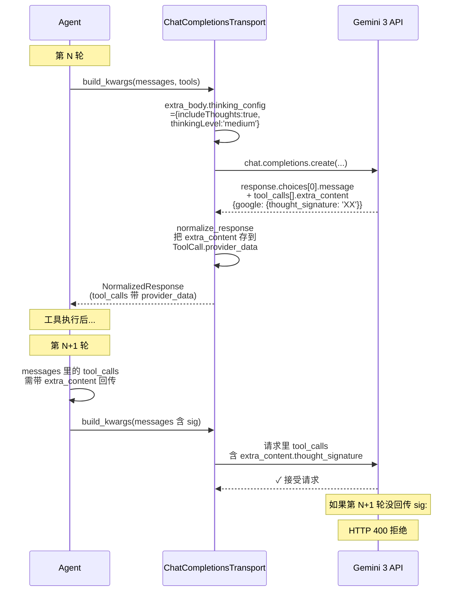
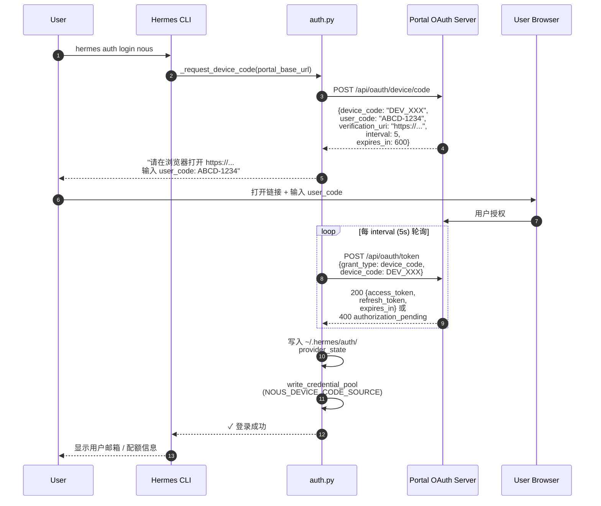
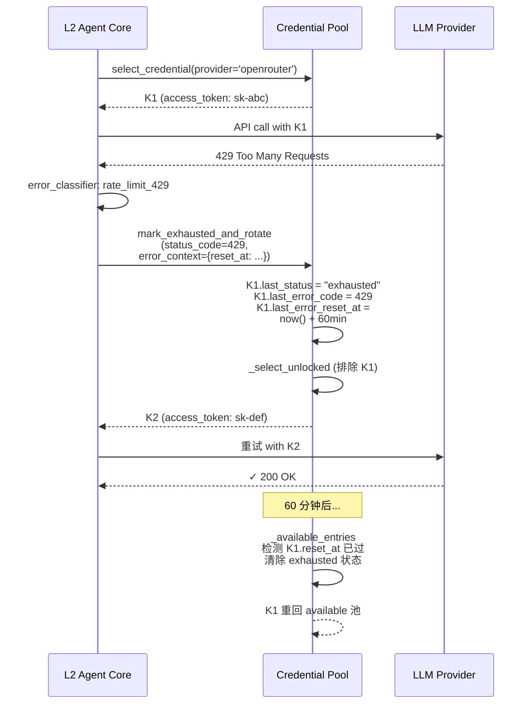
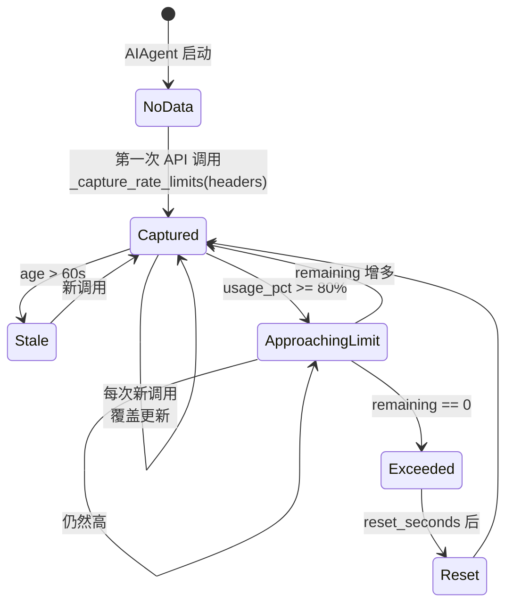
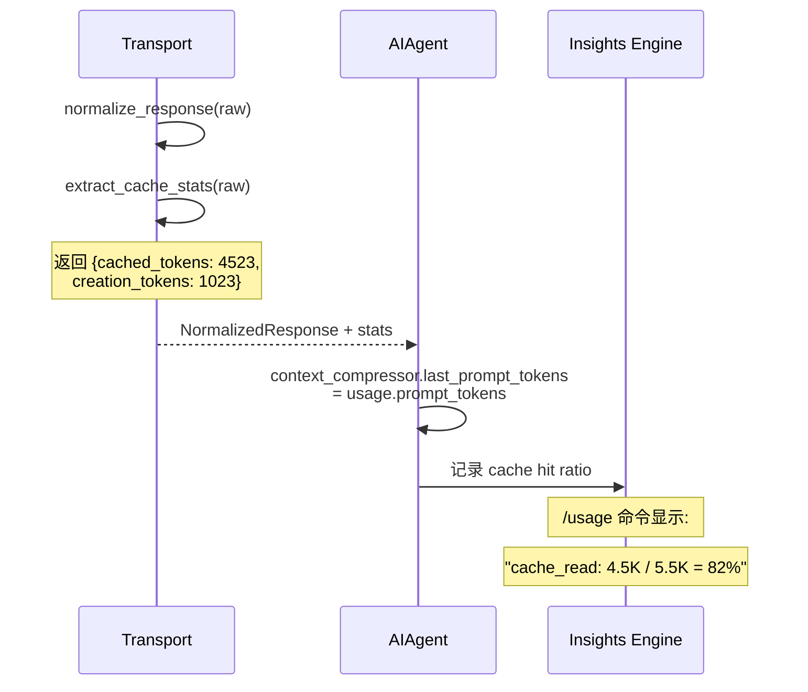
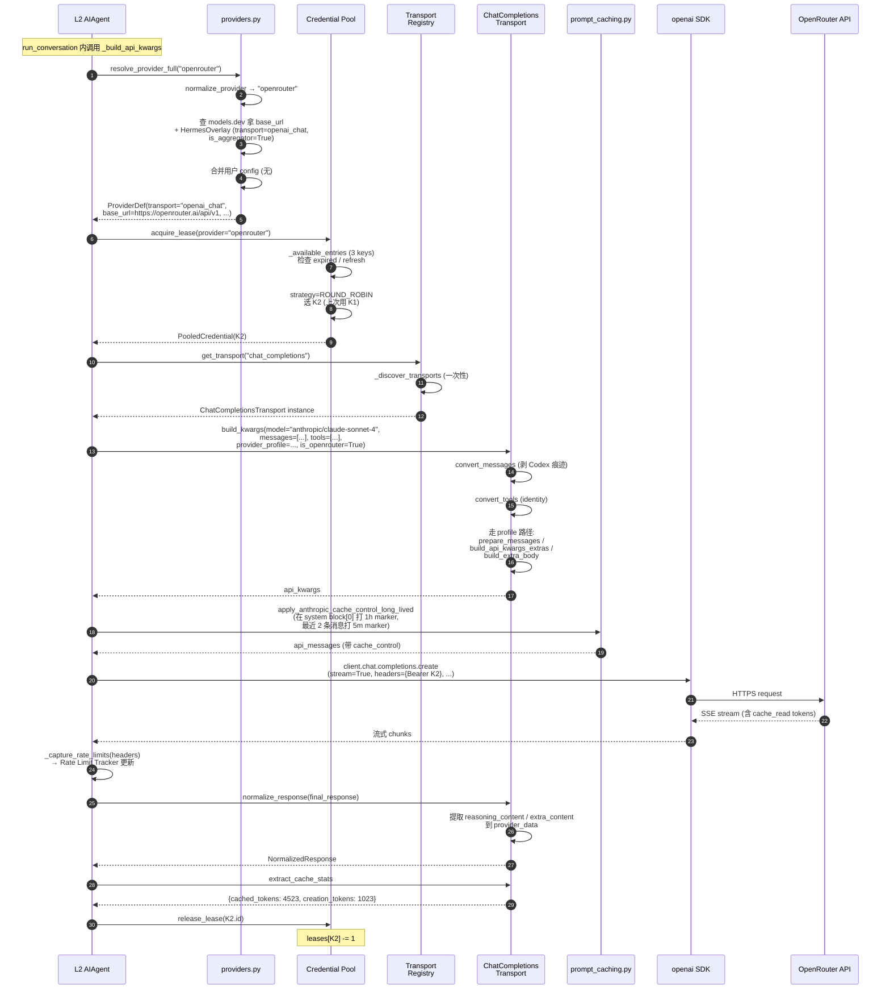

# Phase 2 技术方案：Provider / Transport Layer

> 本文件以**图形化方式**讲解 Hermes Agent 的"南向接口"——如何把 109+ LLM provider 抽象成 4 种 transport 协议、3 种认证机制，外加多 key 凭证池与速率限制追踪。
>
> 所有引用的文件路径、行号、字段名均已**逐项核对**仓库源码。

---

## 0. 本文件目录

- [1. L7 在系统中的位置](#1-l7-在系统中的位置)
- [2. 三层 Provider 配置融合](#2-三层-provider-配置融合)
- [3. ProviderTransport 抽象基类](#3-providertransport-抽象基类)
- [4. NormalizedResponse 统一回包](#4-normalizedresponse-统一回包)
- [5. 四种 Transport 协议详细对比](#5-四种-transport-协议详细对比)
- [6. 三种认证机制](#6-三种认证机制)
- [7. Credential Pool 多 Key 轮换](#7-credential-pool-多-key-轮换)
- [8. Rate Limit Tracker](#8-rate-limit-tracker)
- [9. Prompt Cache 在四种 Transport 的差异](#9-prompt-cache-在四种-transport-的差异)
- [10. 端到端示例：一次 LLM 调用穿越 L7](#10-端到端示例一次-llm-调用穿越-l7)
- [11. 设计取舍总结表](#11-设计取舍总结表)
- [12. 高频 Q&A 储备](#12-高频-qa-储备)
- [13. 必背图 + 自检清单](#13-必背图--自检清单)
- [14. 关键代码地图](#14-关键代码地图)
- [15. 一句话总结 + 衔接 Phase 3](#15-一句话总结--衔接-phase-3)

---

## 1. L7 在系统中的位置

> Phase 2 解决的核心命题：**让 L2 (Agent Core) 调 LLM 不用关心是哪家厂商**。

```
              ┌─────────────────────────────────────────┐
              │     L2  Agent Core (run_agent.py)        │
              │                                          │
              │   _interruptible_streaming_api_call      │
              │              │                           │
              │              ▼                           │
              │      _build_api_kwargs(api_messages)     │
              └────────────┬──────────────────────────┬──┘
                           │                           │
        (依赖 ① api_mode 路由)              (依赖 ② provider 元信息)
                           │                           │
                           ▼                           ▼
   ┌─────────────────────────────────────────────────────────────┐
   │                  L7  Provider / Transport Layer              │
   │                                                              │
   │  ┌──────────────────┐    ┌─────────────────────────────┐   │
   │  │  Provider Side    │    │  Transport Side              │   │
   │  │  (元信息)         │    │  (协议适配)                   │   │
   │  │                   │    │                              │   │
   │  │  hermes_cli/      │    │  agent/transports/           │   │
   │  │   providers.py    │    │   ├─ base.py                 │   │
   │  │  (701 行)         │    │   ├─ types.py                │   │
   │  │                   │    │   ├─ anthropic.py            │   │
   │  │  • HermesOverlay  │    │   ├─ chat_completions.py     │   │
   │  │  • ProviderDef    │    │   ├─ codex.py                │   │
   │  │  • ALIASES        │    │   └─ bedrock.py              │   │
   │  │  • TRANSPORT_TO_  │    │                              │   │
   │  │    API_MODE       │    │                              │   │
   │  └──────────────────┘    └─────────────────────────────┘   │
   │           │                              │                  │
   │           └──────────────┬───────────────┘                  │
   │                          ▼                                  │
   │  ┌──────────────────────────────────────────────────────┐  │
   │  │           供应链支撑层                                  │  │
   │  │                                                       │  │
   │  │  agent/credential_pool.py (1603) — 多 key 池          │  │
   │  │  hermes_cli/auth.py — OAuth device flow / 4 类认证    │  │
   │  │  agent/credential_sources.py (418) — env / config /   │  │
   │  │                                       pool 三处来源    │  │
   │  │  agent/rate_limit_tracker.py — 12 头解析              │  │
   │  │  agent/models_dev.py (722) — models.dev catalog 缓存  │  │
   │  │  agent/usage_pricing.py (866) — 各 provider 计费规则  │  │
   │  └──────────────────────────────────────────────────────┘  │
   └─────────────────────────────────────────────────────────────┘
                              │
                              ▼ 实际网络调用
              ┌──────────────────────────────┐
              │   109+ LLM Providers          │
              │   ─────────────              │
              │   OpenAI / Anthropic / xAI    │
              │   OpenRouter / Nous / GLM     │
              │   Kimi / 小米 / DeepSeek / ... │
              │   AWS Bedrock / Codex / ...   │
              └──────────────────────────────┘
```

### 1.1 L7 的两个解耦面

```
┌─────────────────────────────────────────────────────────────────┐
│                                                                 │
│  L7 同时承担两个相关但独立的职责：                                │
│                                                                 │
│  ① 元信息层 (Provider Side)                                      │
│     "这家厂商叫什么、用什么 base_url、要什么 env var、            │
│      用什么 transport 协议、用什么认证方式"                       │
│     → hermes_cli/providers.py + agent/models_dev.py             │
│                                                                 │
│  ② 协议层 (Transport Side)                                       │
│     "怎么把统一格式的 messages/tools 转成厂商协议、               │
│      怎么把厂商响应归一回 NormalizedResponse"                    │
│     → agent/transports/                                          │
│                                                                 │
│  这两层独立设计：                                                  │
│   • 加一个新 provider (用现有协议) → 只改 providers.py            │
│   • 加一个新协议 (服务多个 provider) → 只加 transports/xxx.py    │
└─────────────────────────────────────────────────────────────────┘
```

---

## 2. 三层 Provider 配置融合

> 一个 provider 的最终运行时配置是**三层数据源融合**的结果，不是单一来源。

### 2.1 三层数据源对比

```
┌──────────────────────────────────────────────────────────────────────┐
│  Layer 1: models.dev catalog (基线，自动)                              │
│  ────────────────────────────────                                      │
│  • 109+ provider 的开源元信息库                                         │
│  • 字段: id / name / api (base URL) / env (env var) / doc / models    │
│  • 每个 model 含: context_length / cost / capabilities                 │
│  • 通过 agent/models_dev.py 拉取并本地缓存                              │
│                                                                       │
│  ★ 一句话：models.dev 知道 "OpenAI 用 https://api.openai.com，         │
│            env var 是 OPENAI_API_KEY"，但不知道 "OpenAI 走             │
│            chat_completions 还是 codex_responses"。                   │
└──────────────────────────────────────────────────────────────────────┘
                                  ▼
┌──────────────────────────────────────────────────────────────────────┐
│  Layer 2: HermesOverlay (Hermes 内置补强)                              │
│  ────────────────────────────────────                                  │
│  • 33 个 overlay 在 hermes_cli/providers.py:46-202                    │
│  • 5 个字段:                                                            │
│    - transport: openai_chat | anthropic_messages | codex_responses |   │
│                 bedrock_converse                                       │
│    - is_aggregator: True 表示一家服务卖多家模型 (OpenRouter / HF)      │
│    - auth_type: api_key | oauth_device_code | oauth_external |        │
│                 external_process | aws_sdk                            │
│    - extra_env_vars: models.dev 没列出的额外 env var                   │
│    - base_url_override: 覆盖 models.dev 的 URL                         │
│    - base_url_env_var: 用户自定义 URL 的 env var                       │
│                                                                       │
│  ★ 这层补充 "Anthropic 走 anthropic_messages 协议、Codex 用            │
│     OAuth external、Nous 用 device_code、xAI 走 codex_responses"。     │
└──────────────────────────────────────────────────────────────────────┘
                                  ▼
┌──────────────────────────────────────────────────────────────────────┐
│  Layer 3: 用户 config.yaml (最终覆盖)                                  │
│  ────────────────────────────────                                      │
│  • providers: 段 — 已知 provider 的字段覆盖                            │
│  • custom_providers: 段 — 完全自定义的 endpoint                        │
│  • 优先级最高，可以改任何字段（包括 transport!）                         │
│                                                                       │
│  ★ 用户可以说 "我的私有 Anthropic-compatible 端点叫 my-llm，           │
│     base_url 是 https://internal.com/v1，走 chat_completions"。       │
└──────────────────────────────────────────────────────────────────────┘
```

### 2.2 融合流程

```mermaid
flowchart TD
    Start([用户/代码请求 provider X]) --> Norm[normalize_provider<br/>查 ALIASES 表归一]
    Norm --> ModelsDev{在 models.dev?}

    ModelsDev -->|是| MdevInfo[读 models.dev 元信息]
    MdevInfo --> Overlay{有 HermesOverlay?}

    Overlay -->|是| MergeAB[融合 models.dev<br/>+ overlay]
    Overlay -->|否| OnlyMdev[只用 models.dev<br/>默认 transport=openai_chat]

    MergeAB --> ResolveAB[ProviderDef<br/>source='models.dev']
    OnlyMdev --> ResolveAB

    ModelsDev -->|否| HermesOnly{有 HermesOverlay?}
    HermesOnly -->|是| OnlyOverlay[Hermes-only provider<br/>未在 models.dev<br/>例如 nous / openai-codex]
    OnlyOverlay --> ResolveB[ProviderDef<br/>source='hermes']

    HermesOnly -->|否| UserCfg{用户 config<br/>有同名 provider?}
    UserCfg -->|是| FromUser[从用户 config 读]
    UserCfg -->|否| NotFound([返回 None])

    FromUser --> ResolveC[ProviderDef<br/>source='user-config']

    ResolveAB --> Apply[应用用户 config 覆盖<br/>(若有)]
    ResolveB --> Apply
    ResolveC --> Final([返回 ProviderDef])
    Apply --> Final

    NotFound -.如果是 OpenAI 兼容 URL.-> Heuristic[URL 启发式判定<br/>determine_api_mode]
    Heuristic --> Final

    style Final fill:#9f9
    style NotFound fill:#fdd
```

### 2.3 HermesOverlay 数据结构（已核对 L34-44）

```
┌──────────────────────────────────────────────────────────────────┐
│  @dataclass(frozen=True)                                          │
│  class HermesOverlay:                                             │
│                                                                   │
│      transport: str = "openai_chat"                              │
│      │  ──► 4 个枚举值: openai_chat | anthropic_messages           │
│      │      | codex_responses | bedrock_converse                  │
│      │                                                            │
│      is_aggregator: bool = False                                  │
│      │  ──► OpenRouter / HuggingFace / Vercel 等 "卖多家模型"     │
│      │      的中转商                                                │
│      │                                                            │
│      auth_type: str = "api_key"                                  │
│      │  ──► 5 个枚举值: api_key | oauth_device_code               │
│      │      | oauth_external | external_process | aws_sdk        │
│      │                                                            │
│      extra_env_vars: Tuple[str, ...] = ()                         │
│      │  ──► models.dev 未列的 env var (OPENAI_API_KEY 回退等)     │
│      │                                                            │
│      base_url_override: str = ""                                  │
│      │  ──► 覆盖 models.dev 的 URL (xAI / Stepfun / NVIDIA 等)    │
│      │                                                            │
│      base_url_env_var: str = ""                                   │
│      │  ──► 用户自定义 URL 的 env var (用户改 OPENROUTER_BASE_URL)│
└──────────────────────────────────────────────────────────────────┘
```

### 2.4 33 个 HermesOverlay 的分布（已核对 L46-202）

```
┌────────────────────────────────────────────────────────────┐
│  按 transport 分类:                                           │
│                                                            │
│  openai_chat (22 家)                                       │
│  ──────────                                                │
│  openrouter / nous / qwen-oauth / google-gemini-cli /      │
│  lmstudio / github-copilot / zai / kimi-for-coding /       │
│  stepfun / deepseek / alibaba / alibaba-coding-plan /      │
│  vercel / opencode / opencode-go / kilo / huggingface /    │
│  nvidia / xiaomi / tencent-tokenhub / arcee / gmi /        │
│  ollama-cloud / azure-foundry (default)                    │
│                                                            │
│  anthropic_messages (3 家)                                  │
│  ──────────                                                │
│  anthropic / minimax / minimax-oauth / minimax-cn          │
│                                                            │
│  codex_responses (3 家)                                     │
│  ──────────                                                │
│  openai-codex / copilot-acp / xai                          │
│                                                            │
│  bedrock_converse (1 家)                                    │
│  ──────────                                                │
│  bedrock                                                   │
└────────────────────────────────────────────────────────────┘
```

### 2.5 ALIASES：用户友好命名解析

```
       用户输入            归一化前         归一化后
   ─────────────────  ───────────────  ───────────────
   "grok"          →  ALIASES['grok']  →  "xai"
   "claude"        →  不在 ALIASES     →  "claude" (没找到 → None)
   "anthropic"     →  不在 ALIASES     →  "anthropic" (匹配)
   "z.ai"          →  ALIASES['z.ai']  →  "zai"
   "kimi"          →  ALIASES['kimi']  →  "kimi-for-coding"
   "mimo"          →  ALIASES['mimo']  →  "xiaomi"
   "tencent"       →  ALIASES['tencent']→  "tencent-tokenhub"
   "openai"        →  ALIASES['openai']→  "openrouter" (★ 重要！)
   "aws"           →  ALIASES['aws']   →  "bedrock"

   ★ 注意 "openai" 别名指向 "openrouter"——Hermes 默认让用户
     用 OpenAI 模型也走 OpenRouter 聚合，享受多 provider 故障转移。
```

### 2.6 URL 启发式 fallback（已核对 L483-499）

```
   determine_api_mode(provider, base_url) 的 fallback 链:

   ① 先看 provider 在 HERMES_OVERLAYS 里查到的 transport
   ② 若 provider 是 'custom' 或未知，看 base_url:
       ─ 含 'api.kimi.com/coding'        → anthropic_messages
       ─ 以 '/anthropic' 结尾             → anthropic_messages
       ─ 含 'api.anthropic.com'           → anthropic_messages
       ─ 否则                              → chat_completions (默认)
```

---

## 3. ProviderTransport 抽象基类

> 这是整个 L7 协议层的**北极星接口**——所有 transport 都实现同一组方法。

### 3.1 ProviderTransport ABC（已核对 transports/base.py 全文）

```
┌─────────────────────────────────────────────────────────────────┐
│  class ProviderTransport(ABC):                                  │
│  ─────────────────────────                                       │
│  4 个抽象方法（每个 transport 必须实现）：                          │
│                                                                 │
│  @abstractmethod                                                │
│  def api_mode(self) -> str:                                     │
│  │   返回这个 transport 处理的 api_mode 标识                       │
│  │   (anthropic_messages / chat_completions / codex_responses / │
│  │    bedrock_converse)                                          │
│                                                                 │
│  @abstractmethod                                                │
│  def convert_messages(messages, **kwargs):                      │
│  │   OpenAI-format messages → provider-native format             │
│  │   (例: Anthropic 要 (system, messages) tuple)                 │
│                                                                 │
│  @abstractmethod                                                │
│  def convert_tools(tools):                                      │
│  │   OpenAI tool schema → provider-native (例: input_schema)      │
│                                                                 │
│  @abstractmethod                                                │
│  def build_kwargs(model, messages, tools, **params):            │
│  │   ★ 主入口 — 通常内部调用 convert_messages + convert_tools     │
│  │   返回 ready-to-call 的 kwargs dict 给 SDK                    │
│                                                                 │
│  @abstractmethod                                                │
│  def normalize_response(response, **kwargs) -> NormalizedResponse:│
│  │   厂商原始响应 → NormalizedResponse (跨厂商统一类型)            │
│                                                                 │
│  ─────────────────────────────────────────                       │
│  3 个可选方法（默认实现即可）：                                     │
│                                                                 │
│  def validate_response(response) -> bool:                       │
│  │   "结构上合法吗？" (默认 True)                                  │
│                                                                 │
│  def extract_cache_stats(response) -> Optional[Dict]:           │
│  │   提取 cache hit/creation 统计 (默认 None)                     │
│                                                                 │
│  def map_finish_reason(raw_reason) -> str:                      │
│  │   厂商 stop reason → OpenAI 等价 (默认透传)                    │
└─────────────────────────────────────────────────────────────────┘
```

### 3.2 transport 不该做什么（关键边界）

```
┌──────────────────────────────────────────────────────────────────┐
│  ProviderTransport 严格规定的 "我不做":                            │
│                                                                  │
│  ✘ client 构造          — 在 AIAgent 里 (_create_request_*_client) │
│  ✘ streaming 处理       — 在 _interruptible_streaming_api_call    │
│  ✘ credential refresh   — 在 credential_pool                     │
│  ✘ prompt caching       — 在 prompt_caching.py                   │
│  ✘ interrupt 处理       — 在 AIAgent.interrupt()                  │
│  ✘ retry 逻辑           — 在 run_conversation 的 retry inner loop │
│                                                                  │
│  ✔ transport 只做:                                                │
│     convert_messages → convert_tools → build_kwargs              │
│                       → normalize_response                       │
│                                                                  │
│  这种严格的"只做格式转换"边界 = transport 是【纯函数】，可独立单测  │
└──────────────────────────────────────────────────────────────────┘
```

### 3.3 自动发现与注册（已核对 __init__.py）

```mermaid
flowchart LR
    A[get_transport<br/>'anthropic_messages'] --> B{已 _discovered?}
    B -->|否| C[_discover_transports]
    C --> D[import 4 个模块]

    D --> D1[anthropic.py<br/>register]
    D --> D2[codex.py<br/>register]
    D --> D3[chat_completions.py<br/>register]
    D --> D4[bedrock.py<br/>register]

    D1 --> E[_REGISTRY 填充]
    D2 --> E
    D3 --> E
    D4 --> E

    B -->|是| E
    E --> F[查 cls = _REGISTRY.get<br/>'anthropic_messages']
    F --> G{找到?}
    G -->|是| H([返回 AnthropicTransport()])
    G -->|否| I[再 _discover 一次<br/>(覆盖 partial 注册)]
    I --> J{还是没?}
    J -->|是| K([返回 None])
    J -->|否| H

    style H fill:#9f9
    style K fill:#fdd
```

**注册时机**：每个 transport 模块文件**末尾**有：

```python
# Auto-register on import
from agent.transports import register_transport
register_transport("anthropic_messages", AnthropicTransport)
```

这是模块级 side-effect，**import 即注册，无需手动维护**。

---

## 4. NormalizedResponse 统一回包

> 4 种 transport 接收的厂商响应**格式各异**，全部归一为这一个数据类。

### 4.1 NormalizedResponse 三段结构

```
┌────────────────────────────────────────────────────────────────────┐
│  @dataclass                                                        │
│  class NormalizedResponse:                                         │
│                                                                    │
│   ┌─── 共享字段（所有 transport 都填）────────────────────────┐    │
│   │                                                            │    │
│   │  content: str | None                                       │    │
│   │  tool_calls: list[ToolCall] | None                         │    │
│   │  finish_reason: str  # "stop" / "tool_calls" /             │    │
│   │                      #  "length" / "content_filter"        │    │
│   │  reasoning: str | None                                     │    │
│   │  usage: Usage | None                                       │    │
│   │                                                            │    │
│   └────────────────────────────────────────────────────────────┘    │
│                                                                    │
│   ┌─── 协议特异数据（只有协议感知代码才读）─────────────────────┐    │
│   │                                                            │    │
│   │  provider_data: dict[str, Any] | None                      │    │
│   │                                                            │    │
│   │  ✦ Anthropic: {"reasoning_details": [...]}                 │    │
│   │  ✦ Codex: {"codex_reasoning_items": [...],                 │    │
│   │            "codex_message_items": [...]}                   │    │
│   │  ✦ ChatCompletions: {"reasoning_content": "...",            │    │
│   │            "reasoning_details": [...]}                     │    │
│   │  ✦ Bedrock: 当前为 None                                     │    │
│   │                                                            │    │
│   └────────────────────────────────────────────────────────────┘    │
│                                                                    │
│   ┌─── 向后兼容 properties ─────────────────────────────────────┐    │
│   │  (45+ 处旧代码用 tc.function.name, msg.reasoning_content)   │    │
│   │  (这些 @property 让 NormalizedResponse 直接喂给旧代码)       │    │
│   │  reasoning_content / reasoning_details /                   │    │
│   │  codex_reasoning_items / codex_message_items               │    │
│   └────────────────────────────────────────────────────────────┘    │
└────────────────────────────────────────────────────────────────────┘
```

### 4.2 ToolCall 数据结构 + 协议特异字段（已核对 types.py:19-77）

```
┌─────────────────────────────────────────────────────────────────┐
│  @dataclass                                                     │
│  class ToolCall:                                                │
│                                                                 │
│   ┌─ 共享字段 ────────────────────────────────────┐             │
│   │  id: str | None         ← tool_call_id / tool_use_id        │
│   │  name: str              ← 工具名                             │
│   │  arguments: str         ← JSON 字符串                        │
│   └──────────────────────────────────────────────┘              │
│                                                                 │
│   ┌─ 协议特异数据 (provider_data dict) ──────────────────┐       │
│   │                                                      │       │
│   │  ✦ Codex: {                                          │       │
│   │      "call_id": "call_XXX",                          │       │
│   │      "response_item_id": "fc_XXX"                    │       │
│   │    }                                                 │       │
│   │  ★ 必须在下一轮 API 调用时回传，否则 Codex 报错        │       │
│   │                                                      │       │
│   │  ✦ Gemini: {                                         │       │
│   │      "extra_content": {                              │       │
│   │        "google": {                                   │       │
│   │          "thought_signature": "..."                  │       │
│   │        }                                             │       │
│   │      }                                               │       │
│   │    }                                                 │       │
│   │  ★ Gemini 3 thinking 模型必须回传 thought_signature，  │       │
│   │     否则 HTTP 400 拒绝                                │       │
│   │                                                      │       │
│   │  ✦ 其他厂商: None                                     │       │
│   └──────────────────────────────────────────────────────┘       │
│                                                                 │
│   ┌─ 向后兼容（旧代码用 tc.function.name）────────────┐          │
│   │   @property type    → "function"                  │          │
│   │   @property function → self (这样 tc.function.name  │          │
│   │                       仍可用)                       │          │
│   │   @property call_id  → provider_data['call_id']   │          │
│   │   @property response_item_id  → 同上              │          │
│   │   @property extra_content     → 同上              │          │
│   └──────────────────────────────────────────────────┘          │
└─────────────────────────────────────────────────────────────────┘
```

### 4.3 finish_reason 归一映射表（已核对各 transport 的 _STOP_REASON_MAP）

```
┌──────────────────────────┬─────────────────────────────────────┐
│  归一目标 (OpenAI 标准)   │  各 transport 的原始值                │
├──────────────────────────┼─────────────────────────────────────┤
│  "stop"                   │  Anthropic: end_turn / stop_sequence│
│                           │  Codex: completed / failed / cancelled│
│                           │  Bedrock: end_turn / stop_sequence  │
│                           │  ChatCompletions: stop (透传)        │
├──────────────────────────┼─────────────────────────────────────┤
│  "tool_calls"             │  Anthropic: tool_use                │
│                           │  Bedrock: tool_use                  │
│                           │  其他: tool_calls (透传)             │
├──────────────────────────┼─────────────────────────────────────┤
│  "length"                 │  Anthropic: max_tokens /            │
│                           │             model_context_window_   │
│                           │             exceeded                │
│                           │  Codex: incomplete                  │
│                           │  Bedrock: max_tokens                │
│                           │  ChatCompletions: length (透传)      │
├──────────────────────────┼─────────────────────────────────────┤
│  "content_filter"         │  Anthropic: refusal                 │
│                           │  Bedrock: guardrail_intervened /    │
│                           │           content_filtered          │
│                           │  ChatCompletions: content_filter    │
└──────────────────────────┴─────────────────────────────────────┘
```

---

## 5. 四种 Transport 协议详细对比

> 这是 Phase 2 最重要的一张矩阵。

### 5.1 全维度差异矩阵

```
┌───────────────────┬──────────────────┬──────────────────┬──────────────────┬──────────────────┐
│ 维度              │ chat_completions │ anthropic_messages│ codex_responses │ bedrock_converse │
├───────────────────┼──────────────────┼──────────────────┼──────────────────┼──────────────────┤
│ 文件行数          │ 614              │ 179              │ 255              │ 154              │
│ 适用 provider 数  │ 22+ (最多)       │ 3 (Anthropic 系) │ 3 (OpenAI/xAI)   │ 1 (AWS Bedrock)  │
├───────────────────┼──────────────────┼──────────────────┼──────────────────┼──────────────────┤
│ 网络 SDK          │ httpx + openai   │ Anthropic SDK    │ openai SDK       │ boto3            │
│ Auth              │ Bearer header    │ x-api-key /      │ Bearer +         │ AWS Sigv4        │
│                   │                  │ Authorization    │ extra_headers    │ (boto3 自动)     │
├───────────────────┼──────────────────┼──────────────────┼──────────────────┼──────────────────┤
│ Messages 格式     │ OpenAI 原生      │ (system,         │ Responses input  │ Converse messages│
│ (convert_messages)│ (近 identity，仅 │  messages) tuple │ items 数组       │ 列表 + 单独      │
│                   │  剥 Codex 痕迹)  │                  │                  │ system           │
├───────────────────┼──────────────────┼──────────────────┼──────────────────┼──────────────────┤
│ Tools 格式        │ OpenAI 原生      │ input_schema     │ Responses tools  │ toolConfig dict  │
│ (convert_tools)   │ (identity)       │                  │                  │                  │
├───────────────────┼──────────────────┼──────────────────┼──────────────────┼──────────────────┤
│ Streaming         │ stream=True +    │ messages.stream()│ 内置 SSE         │ converse_stream  │
│                   │ stream_options   │                  │ (_run_codex_     │ + boto3 events   │
│                   │ ={include_usage} │                  │  stream)         │                  │
├───────────────────┼──────────────────┼──────────────────┼──────────────────┼──────────────────┤
│ Reasoning 处理    │ provider_data:   │ thinking block / │ codex_reasoning_ │ msg.reasoning_   │
│                   │  reasoning_      │ reasoning_       │ items 数组       │ content          │
│                   │  content +       │ details          │                  │                  │
│                   │  reasoning_      │                  │                  │                  │
│                   │  details         │                  │                  │                  │
├───────────────────┼──────────────────┼──────────────────┼──────────────────┼──────────────────┤
│ 多模态支持        │ image_url        │ image content    │ image input      │ image (Bedrock   │
│                   │                  │ block            │                  │ format)          │
├───────────────────┼──────────────────┼──────────────────┼──────────────────┼──────────────────┤
│ 工具 args 编码    │ JSON string      │ dict (转 JSON)   │ JSON string      │ Bedrock toolUse  │
│                   │ (provider 端)    │ in tool_use      │                  │ input dict       │
├───────────────────┼──────────────────┼──────────────────┼──────────────────┼──────────────────┤
│ Prompt Caching    │ 部分 (OpenRouter │ ★ 4 breakpoints  │ prompt_cache_key │ 不支持显式标记    │
│                   │  自动 cache_     │ cache_control    │ (session_id) +   │ (依赖底层模型)    │
│                   │  control 传递)   │ markers + 1h/5m  │ session_id header│                  │
├───────────────────┼──────────────────┼──────────────────┼──────────────────┼──────────────────┤
│ 价格/计费透传     │ extra_body 可加  │ usage 含 cache_  │ usage 含 cached_ │ Bedrock 平台计费  │
│                   │ usage_tracking   │ read/creation    │ tokens / output  │ 不暴露分项        │
│                   │                  │ tokens           │ tokens 等        │                  │
├───────────────────┼──────────────────┼──────────────────┼──────────────────┼──────────────────┤
│ 协议特异机制       │ Provider Profile │ thinking 签名 +  │ encrypted_       │ Guardrail 配置   │
│                   │ (按厂商定制 ↓)   │ OAuth 1m beta    │ content +        │ + Region 路由    │
│                   │                  │                  │ store=False      │                  │
└───────────────────┴──────────────────┴──────────────────┴──────────────────┴──────────────────┘
```

### 5.2 chat_completions 复杂度地图（为什么 614 行）

> ChatCompletions 是 4 个 transport 里最复杂的，因为它要处理 22+ 个 OpenAI-compatible provider 的差异。

```
┌─────────────────────────────────────────────────────────────────┐
│  chat_completions.py 内部分支:                                    │
│                                                                  │
│  build_kwargs() 有两条路径：                                       │
│                                                                  │
│  ┌─── 路径 A: provider_profile 已知 ────────────────┐            │
│  │                                                 │            │
│  │  _build_kwargs_from_profile(profile, ...)       │            │
│  │     ├─ profile.prepare_messages()               │            │
│  │     ├─ profile.build_api_kwargs_extras()        │            │
│  │     └─ profile.build_extra_body()               │            │
│  │                                                 │            │
│  │  所有厂商怪癖 (tags/metadata/reasoning_effort)   │            │
│  │  都封装在 ProviderProfile 对象里                  │            │
│  └─────────────────────────────────────────────────┘            │
│                                                                  │
│  ┌─── 路径 B: provider_profile 为 None (legacy fallback)──┐      │
│  │                                                        │      │
│  │  内联 if/elif 分支:                                     │      │
│  │   • is_kimi → 顶层 reasoning_effort + thinking         │      │
│  │   • is_tokenhub → 顶层 reasoning_effort                │      │
│  │   • is_lmstudio + supports_reasoning → reasoning_effort│      │
│  │   • is_openrouter + pareto-code → plugins              │      │
│  │   • is_github_models → extra_body.reasoning            │      │
│  │   • is_gemini OpenAI-compat → extra_body.extra_body    │      │
│  │   • is_gemini native → extra_body.thinking_config      │      │
│  │   • google-gemini-cli → extra_body.thinking_config     │      │
│  │   • DEVELOPER_ROLE_MODELS (GPT-5/Codex) →             │      │
│  │     system → developer role                            │      │
│  │   • is_moonshot_model → sanitize_moonshot_tools        │      │
│  └────────────────────────────────────────────────────────┘      │
│                                                                  │
│  ★ 演进方向：把 legacy 路径 (B) 的所有厂商逐步迁到 (A)，            │
│     最终每个 provider 都有自己的 ProviderProfile。                  │
└─────────────────────────────────────────────────────────────────┘
```

### 5.3 Gemini 3 thinking 签名链路



### 5.4 Bedrock 特殊：boto3 + 哨兵字段

```
   Bedrock 跟其他 3 个不同：它不用 OpenAI SDK，用 AWS boto3
   ──────────────────────────────────────────────────────────

   build_kwargs() 末尾埋两个"哨兵字段"：

   ┌─────────────────────────────────────────────────────────┐
   │  kwargs["__bedrock_converse__"] = True                  │
   │  kwargs["__bedrock_region__"] = "us-east-1"             │
   └─────────────────────────────────────────────────────────┘

   AIAgent._interruptible_streaming_api_call 看到这两个哨兵：
   ──────────────────────────────────────────────────
   1. pop 出 region
   2. _get_bedrock_runtime_client(region)
   3. client.converse_stream(**api_kwargs)
   4. stream_converse_with_callbacks 把 boto3 event 流
      翻译为 (on_text, on_tool, on_reasoning) 回调

   这样：boto3 的 sync API 也能放进 streaming + interrupt 框架里
```

### 5.5 Codex 特殊：双层 ID 系统

```
   Codex Responses API 的 tool_call 有 *两个* ID：
   ──────────────────────────────────────

   ① id: 通常用于 tool_call_id (OpenAI 标准做法)
   ② call_id: Codex 内部 ID
   ③ response_item_id: 该工具调用所属的 response 项 ID

   在 messages 里:
   ──────────
   tool_call = {
       "id": "call_abc",           # 标准
       "call_id": "call_xyz",      # ★ Codex 独有
       "response_item_id": "fc_qq", # ★ Codex 独有
       "function": {...}
   }

   在 messages 历史里这两个字段必须保留并回传，
   否则下一轮 Codex 报错 "missing response item"。

   ★ 这也是为什么 chat_completions transport 的 convert_messages 要 
     主动 strip 这些字段——不剥除会让 ChatCompletions 兼容端报 400。
```

---

## 6. 三种认证机制

> Hermes 把所有认证方式归纳为 **5 种 auth_type**，对应 3 大类机制。

### 6.1 auth_type 全集

```
┌──────────────────────────┬───────────────────────────────────────┐
│  auth_type               │  含义 / 典型 provider                  │
├──────────────────────────┼───────────────────────────────────────┤
│  api_key                  │  最常见：从 env var / config 读 key    │
│                           │  → OpenRouter / NVIDIA / GLM / Kimi / │
│                           │     DeepSeek / Stepfun / 等           │
├──────────────────────────┼───────────────────────────────────────┤
│  oauth_device_code        │  设备码流：CLI 给一个 user_code，用户 │
│                           │  浏览器打开 verification_uri，Hermes  │
│                           │  轮询拿 access_token                  │
│                           │  → Nous Portal                       │
├──────────────────────────┼───────────────────────────────────────┤
│  oauth_external           │  借用其他 CLI 的 OAuth state         │
│                           │  → OpenAI Codex (借 chatgpt.com 会话) │
│                           │  → Qwen OAuth (借 qwen CLI)          │
│                           │  → Google Gemini CLI (借 gemini CLI) │
│                           │  → MiniMax (官方 OAuth 工具)         │
├──────────────────────────┼───────────────────────────────────────┤
│  external_process         │  通过子进程 stdio 拿 token           │
│                           │  → GitHub Copilot ACP                │
├──────────────────────────┼───────────────────────────────────────┤
│  aws_sdk                  │  完全交给 boto3 走 IAM / SSO / Env    │
│                           │  → AWS Bedrock                        │
└──────────────────────────┴───────────────────────────────────────┘
```

### 6.2 OAuth Device Code 流程（已核对 hermes_cli/auth.py:2744+）



### 6.3 OAuth Token 自动刷新链路

```
   ┌──────────────────────────────────────────────────────────┐
   │  每次取凭证前的健康检查 (在 _select_unlocked):              │
   │                                                          │
   │  ① available = _available_entries(clear_expired=True,    │
   │                                   refresh=True)          │
   │                                                          │
   │  ② 对每个 entry:                                          │
   │     ┌─ 若 last_error_reset_at 已过 → 清错误状态           │
   │     ├─ 若 _entry_needs_refresh(entry) → _refresh_entry   │
   │     │     │                                              │
   │     │     ▼                                              │
   │     │  按 provider 类型分别处理:                           │
   │     │  • Nous: 用 refresh_token 换新 access_token         │
   │     │  • Codex: skew=30s 提前刷新 (_codex_access_token_  │
   │     │           is_expiring)                             │
   │     │  • Qwen: 调 _refresh_qwen_cli_tokens               │
   │     │  • Anthropic OAuth: refresh 端点                   │
   │     │                                                    │
   │     ├─ 刷新失败 → 跳过该 entry                            │
   │     └─ 刷新成功 → 用新 token 加入可用列表                 │
   │                                                          │
   │  ③ 按 strategy 从 available 里选一个                      │
   └──────────────────────────────────────────────────────────┘
```

### 6.4 凭证三处来源（已核对 credential_sources.py 418 行）

```
   一个 provider 的"凭证来源" 优先级（高 → 低）：
   ─────────────────────────────────────

   ┌─ ① Credential Pool (~/.hermes/auth/) ──────┐
   │  • read_credential_pool(provider_id)        │
   │  • 多 key + 状态追踪 + 自动轮换              │
   │  • 通过 hermes auth add 写入                 │
   └─────────────────────────────────────────────┘
                       │
                       ▼ 没找到则
   ┌─ ② Env Var ────────────────────────────────┐
   │  • models.dev 列的 env 字段                  │
   │  • + HermesOverlay.extra_env_vars            │
   │  • 例: ANTHROPIC_API_KEY, OPENROUTER_API_KEY │
   └─────────────────────────────────────────────┘
                       │
                       ▼ 没找到则
   ┌─ ③ config.yaml ────────────────────────────┐
   │  • providers: 段下的 api_key                 │
   │  • 不推荐 (明文存储 secret 风险)              │
   └─────────────────────────────────────────────┘
                       │
                       ▼ 都没找到
                  AuthError: "no credentials for X"
```

---

## 7. Credential Pool 多 Key 轮换

> 一家厂商可以**配多个 key**，Hermes 自动按策略轮换 + 单 key 用尽自动切下一个。

### 7.1 PooledCredential 数据结构（已核对 L92-172）

```
┌──────────────────────────────────────────────────────────────────────┐
│  @dataclass                                                          │
│  class PooledCredential:                                             │
│                                                                      │
│   ┌─ 身份字段 ────────────────────────────────────────┐               │
│   │  provider: str         ← "openrouter" / "nous" / etc │               │
│   │  id: str               ← 短 uuid (6 字符)             │               │
│   │  label: str            ← 显示名 (邮箱 / "Manual #1") │               │
│   │  auth_type: str        ← "oauth" | "api_key"        │               │
│   │  priority: int         ← 0 优先 (排序键)              │               │
│   │  source: str           ← "manual" / "device_code" /  │               │
│   │                          "import"                   │               │
│   └─────────────────────────────────────────────────────┘               │
│                                                                      │
│   ┌─ 凭证内容 ────────────────────────────────────────┐               │
│   │  access_token: str     ← API key / Bearer token   │               │
│   │  refresh_token: str?   ← OAuth refresh            │               │
│   │  expires_at: str?      ← ISO 时间                  │               │
│   │  expires_at_ms: int?   ← epoch ms                  │               │
│   │  agent_key: str?       ← Nous 临时 agent key      │               │
│   │  agent_key_expires_at: │                          │               │
│   │  inference_base_url:   ← Nous portal-routed URL   │               │
│   │  base_url: str?        ← 凭证绑定的 base URL      │               │
│   └─────────────────────────────────────────────────────┘               │
│                                                                      │
│   ┌─ 状态字段 ────────────────────────────────────────┐               │
│   │  last_status: str?     ← "ok" | "exhausted"         │               │
│   │  last_status_at: float?                            │               │
│   │  last_error_code: int?  ← 401 / 402 / 429           │               │
│   │  last_error_reason: str?                            │               │
│   │  last_error_message: str?                           │               │
│   │  last_error_reset_at: float? ← 何时可重试           │               │
│   │  request_count: int    ← 用于 LEAST_USED 策略        │               │
│   │  last_refresh: str?    ← 上次刷新时间                │               │
│   └─────────────────────────────────────────────────────┘               │
└──────────────────────────────────────────────────────────────────────┘
```

### 7.2 四种选择策略（已核对 L913-944）

```mermaid
flowchart TD
    Start([_select_unlocked]) --> Avail[_available_entries<br/>clear_expired=True<br/>refresh=True]
    Avail --> Empty{available 为空?}
    Empty -->|是| Null([返回 None<br/>所有 key 都耗尽])

    Empty -->|否| Strategy{self._strategy?}

    Strategy -->|RANDOM| Rand[random.choice<br/>available]
    Strategy -->|LEAST_USED| LU[min by request_count<br/>++ request_count]
    Strategy -->|ROUND_ROBIN| RR[取 available 0<br/>把它移到 entries 末尾]
    Strategy -->|FILL_FIRST<br/>(默认)| FF[直接取 available 0<br/>不重排]

    Rand --> Return([返回选中的 entry])
    LU --> Return
    RR --> Persist[_persist 保存新顺序]
    Persist --> Return
    FF --> Return

    style Return fill:#9f9
    style Null fill:#fdd
```

### 7.3 四种策略对比

```
┌──────────────────┬──────────────────────────────────────────────────┐
│  策略             │  特征 / 适用场景                                  │
├──────────────────┼──────────────────────────────────────────────────┤
│  FILL_FIRST       │  按 priority 优先级顺序，**前面的用爆才轮到后面**  │
│  (默认)           │  适合：有"主 key + 备 key" 场景                   │
│                   │  风险：主 key 容易触顶                              │
├──────────────────┼──────────────────────────────────────────────────┤
│  ROUND_ROBIN      │  每次取首位，用过的移到末尾                          │
│                   │  适合：均匀使用所有 key                             │
│                   │  风险：失败后需要等一圈才再试同一 key                │
├──────────────────┼──────────────────────────────────────────────────┤
│  RANDOM           │  随机选一个                                        │
│                   │  适合：极端简单，避免任何状态偏差                    │
├──────────────────┼──────────────────────────────────────────────────┤
│  LEAST_USED       │  按 request_count 取最少使用的，++计数                │
│                   │  适合：长期均衡负载，避免单 key 过热                 │
│                   │  代价：每次需要 min() 扫描 + 写 request_count       │
└──────────────────┴──────────────────────────────────────────────────┘
```

### 7.4 冷却 TTL 矩阵（已核对 L74-76）

```
   key 触发错误后被标记 exhausted，多久后才再试？
   ────────────────────────────────────────

   ┌────────────────────┬─────────────────┬──────────────────┐
   │  错误类型           │  冷却时长        │  恢复语义         │
   ├────────────────────┼─────────────────┼──────────────────┤
   │  401 (auth 失败)    │  5 分钟          │  可能是 token    │
   │  EXHAUSTED_TTL_401  │                 │  暂时刷新失败     │
   ├────────────────────┼─────────────────┼──────────────────┤
   │  429 (rate limit)   │  60 分钟         │  按小时配额恢复   │
   │  EXHAUSTED_TTL_429  │                 │                  │
   ├────────────────────┼─────────────────┼──────────────────┤
   │  其他错误            │  60 分钟         │  默认保守         │
   │  EXHAUSTED_TTL_     │                 │                  │
   │  DEFAULT            │                 │                  │
   ├────────────────────┼─────────────────┼──────────────────┤
   │  Provider-supplied  │  按 provider 给  │  从 X-RateLimit- │
   │  reset_at           │  的具体时间      │  Reset 等 header │
   │  (优先级最高)         │                 │  提取             │
   └────────────────────┴─────────────────┴──────────────────┘
```

### 7.5 并发租约模型（acquire_lease / release_lease，已核对 L976-1014）

> Gateway 多用户并发场景下，**多个对话同时用同一池**，怎么避免某个 key 被打爆？

```
┌─────────────────────────────────────────────────────────────────┐
│  软租约机制 (soft lease)                                          │
│  ──────────────────                                              │
│  每个凭证维护一个 _active_leases[id] 计数。                       │
│                                                                 │
│  acquire_lease():                                               │
│    ① 列出 available_entries                                      │
│    ② below_cap = [e for e in available                         │
│                   if leases[e.id] < _max_concurrent]            │
│    ③ candidates = below_cap if below_cap else available         │
│    ④ chosen = min by (lease 数, priority)                       │
│                                                                 │
│  release_lease(id):                                             │
│    leases[id] -= 1                                              │
│                                                                 │
│  ┌─ 行为示例 ──────────────────────────────────────────┐         │
│  │   pool = [K1, K2, K3], _max_concurrent = 5          │         │
│  │                                                     │         │
│  │   时刻 t0: leases = {K1:0, K2:0, K3:0}              │         │
│  │           → 第 1 个请求拿到 K1                        │         │
│  │                                                     │         │
│  │   t1: leases = {K1:1, K2:0, K3:0}                  │         │
│  │       第 2 个请求 → K2 (因为 K2 lease 最少)            │         │
│  │                                                     │         │
│  │   ...继续直到所有 key 都到 cap, 再回到 min           │         │
│  │                                                     │         │
│  │   t5: leases = {K1:5, K2:5, K3:5}                  │         │
│  │       仍能返回 (不阻塞), 但每个 key 都已满负载         │         │
│  └─────────────────────────────────────────────────────┘         │
│                                                                 │
│  ★ "软"租约：超过 cap 不阻塞，只是把"轻度过载"视为正常              │
└─────────────────────────────────────────────────────────────────┘
```

### 7.6 故障恢复：mark_exhausted_and_rotate



---

## 8. Rate Limit Tracker

> Hermes 把厂商响应里的 12 个 x-ratelimit-* header **全部解析、存储、可视化**。

### 8.1 12 头解析（已核对 rate_limit_tracker.py:7-21）

```
┌─────────────────────────────────────────────────────────────────┐
│  Header schema (4 资源 × 3 字段 = 12 个 header):                  │
│                                                                 │
│  ┌─────────────────┬──────────┬──────────┬──────────┐           │
│  │  资源            │  limit    │ remaining│  reset   │           │
│  ├─────────────────┼──────────┼──────────┼──────────┤           │
│  │  请求数 (1 分钟) │  ✓        │  ✓        │  ✓        │           │
│  │  请求数 (1 小时) │  ✓ (-1h)  │  ✓ (-1h)  │  ✓ (-1h)  │           │
│  │  Token (1 分钟)  │  ✓        │  ✓        │  ✓        │           │
│  │  Token (1 小时)  │  ✓ (-1h)  │  ✓ (-1h)  │  ✓ (-1h)  │           │
│  └─────────────────┴──────────┴──────────┴──────────┘           │
│                                                                 │
│  header 名规则: x-ratelimit-{limit|remaining|reset}-{resource}   │
│  例:                                                            │
│   x-ratelimit-limit-requests       → 1 分钟 RPM 上限             │
│   x-ratelimit-remaining-tokens-1h  → 本小时剩余 token             │
│   x-ratelimit-reset-requests-1h    → 多少秒后 RPH 窗口重置        │
└─────────────────────────────────────────────────────────────────┘
```

### 8.2 RateLimitState 数据结构

```
┌──────────────────────────────────────────────────────────────┐
│  RateLimitBucket (4 个实例 per state)                          │
│  ──────────────────                                            │
│   limit: int             ← 配额上限                            │
│   remaining: int         ← 剩余                                │
│   reset_seconds: float   ← 多少秒后重置                         │
│   captured_at: float     ← 抓取时间 (用于计算剩余时间)            │
│                                                              │
│   @property used = limit - remaining                          │
│   @property usage_pct = used / limit * 100                    │
│   @property remaining_seconds_now = max(0, reset -            │
│                                          (now - captured))   │
└──────────────────────────────────────────────────────────────┘

┌──────────────────────────────────────────────────────────────┐
│  RateLimitState                                              │
│  ───────────                                                  │
│   requests_min: RateLimitBucket   ← RPM                       │
│   requests_hour: RateLimitBucket  ← RPH                       │
│   tokens_min: RateLimitBucket     ← TPM                       │
│   tokens_hour: RateLimitBucket    ← TPH                       │
│   captured_at: float                                         │
│   provider: str                                              │
└──────────────────────────────────────────────────────────────┘
```

### 8.3 `/usage` 命令的 ASCII 进度条

```
   Nous Portal Rate Limits (captured 12s ago):

     Requests/min   [████░░░░░░░░░░░░░░░░] 20.0%   2/10 used  (8 left, resets in 48s)
     Requests/hr    [██░░░░░░░░░░░░░░░░░░] 10.0%  60/600 used  (540 left, resets in 47m)

     Tokens/min     [████████░░░░░░░░░░░░] 40.0%  120K/300K used  (180K left, resets in 48s)
     Tokens/hr      [░░░░░░░░░░░░░░░░░░░░]  3.3%  500K/15M used  (14.5M left, resets in 47m)

     ⚠ requests/min at 80% — resets in 12s   (★ 仅当 ≥80% 时显示警告)
```

### 8.4 状态生命周期



---

## 9. Prompt Cache 在四种 Transport 的差异

> Phase 1 § 5 讲了 cache 策略，这里讲**各 transport 实际如何承载**。

### 9.1 实现差异矩阵

```
┌──────────────────────────┬──────────────────────────────────────┐
│  Transport               │  Prompt Cache 实现细节                │
├──────────────────────────┼──────────────────────────────────────┤
│  anthropic_messages       │  ★ 显式 cache_control                 │
│  ─────────                │   • 4 breakpoints                     │
│                           │   • ttl: "5m" / "1h"                  │
│                           │   • 在 message.content 块上打标记      │
│                           │   • extract_cache_stats:             │
│                           │     usage.cache_read_input_tokens +  │
│                           │     usage.cache_creation_input_tokens │
├──────────────────────────┼──────────────────────────────────────┤
│  chat_completions         │  半显式 (依赖 provider)                │
│  ─────────                │   • OpenAI: 自动 prefix caching        │
│                           │     (无需 marker)                      │
│                           │   • OpenRouter: 透传 Anthropic 的     │
│                           │     cache_control 到底层 Claude         │
│                           │   • DeepSeek: 自动 prefix caching      │
│                           │   • Nous Portal: 透传到 OpenRouter     │
│                           │   • extract_cache_stats:              │
│                           │     usage.prompt_tokens_details.      │
│                           │     cached_tokens                     │
├──────────────────────────┼──────────────────────────────────────┤
│  codex_responses          │  会话级缓存键                          │
│  ─────────                │   • kwargs["prompt_cache_key"] =      │
│                           │     session_id                        │
│                           │   • 同一个 session_id 内的请求自动     │
│                           │     共享缓存                            │
│                           │   • extra_headers session_id /        │
│                           │     x-client-request-id (Codex backend)│
├──────────────────────────┼──────────────────────────────────────┤
│  bedrock_converse         │  ✗ 无显式 prompt caching API           │
│  ─────────                │   • 依赖底层模型自身的隐式 caching      │
│                           │   • (Claude on Bedrock 有部分支持)    │
└──────────────────────────┴──────────────────────────────────────┘
```

### 9.2 命中率上报路径



---

## 10. 端到端示例：一次 LLM 调用穿越 L7

> 场景：CLI 中输入对话给 OpenRouter 上的 Claude Sonnet，已配置 3 个 OpenRouter key。



---

## 11. 设计取舍总结表

| # | 设计选择 | 替代方案 | 为什么 Hermes 这样选 |
|---|---|---|---|
| 1 | **三层 Provider 融合**（models.dev × overlay × user config） | 单一 hard-code 表 | 加 provider 只改一层；社区 catalog 自动同步 |
| 2 | **HermesOverlay frozen=True** | 可变 dict | 编译期就把"协议归属"钉死，运行时不被改 |
| 3 | **transport 不管 client/streaming/retry** | transport 自包含 | 协议层 = 纯函数，可独立单测；横切逻辑只在 L2 写一次 |
| 4 | **NormalizedResponse + provider_data** | 各 transport 返回各自类型 | 99% 代码不分支；1% 协议感知代码读 dict 拿特异字段 |
| 5 | **ToolCall.provider_data 保存 Codex/Gemini 特异字段** | 丢弃这些字段 | 不回传 → 下一轮 HTTP 400；必须保留全链路 |
| 6 | **transports 自动发现 + 注册** | 中心 registry 表 | import 即注册，加新 transport 不动 \_\_init\_\_ |
| 7 | **ProviderProfile 路径 + legacy fallback** | 全统一 | 已知 provider 用 profile（优雅），未知 provider 用 if/elif（兼容） |
| 8 | **4 种凭证策略 + 软租约** | 单一策略 | 不同场景需求不同（均衡负载 vs 主备 vs 抗污染） |
| 9 | **冷却 TTL 按错误类型分** （401=5m, 429=60m） | 统一冷却 | 401 可能只是 token 刷新失败（应快速重试），429 是真配额（应长冷却） |
| 10 | **Provider-supplied reset_at 优先** | 总用本地 TTL | 厂商给的 reset 时间最准，无谓的过早重试浪费 |
| 11 | **凭证三处来源（pool > env > config）** | 单一来源 | 满足 "命令行临时切 / 长期 oauth / 团队共享" 三种场景 |
| 12 | **OAuth 自动 refresh 在 select 时机** | 调用前每次 refresh | 减少 refresh 调用次数；30s skew 防边缘 |
| 13 | **streaming 失败回退非流式** | 直接报错 | provider 不支持 stream 时不打死 (\_disable_streaming) |
| 14 | **prompt_cache_key = session_id**（Codex） | 不显式标记 | 同 session 内自动命中；不同 session 不互扰 |
| 15 | **Bedrock 用哨兵字段 + boto3** | 同一个 SDK | boto3 是 AWS 唯一支持 sigv4 / IAM / SSO 的 SDK；用哨兵让分发逻辑解耦 |
| 16 | **Rate Limit 解析 12 个 header** | 只看 retry-after | RPM/RPH/TPM/TPH 四维信息能预判限流；80% 警告比 100% 才挨打有用 |

---

## 12. 高频 Q&A 储备

```
┌────────────────────────────────────────────────────────────────────┐
│ Q: 怎么新加一家 LLM provider？                                       │
│ A: 三种情况:                                                        │
│   ① 已在 models.dev (大部分主流): 加 HermesOverlay 即可             │
│   ② 不在 models.dev: 加 HermesOverlay (含 base_url_override)        │
│   ③ 完全自定义: 用户在 config.yaml 的 custom_providers: 配          │
│   全部不动 transport 代码 (除非协议是新的)                            │
├────────────────────────────────────────────────────────────────────┤
│ Q: 怎么新加一种 transport 协议？                                     │
│ A: 4 步:                                                            │
│   ① agent/transports/xxx.py 实现 ProviderTransport 4 个抽象方法     │
│   ② 文件末尾 register_transport("xxx_api", XxxTransport)             │
│   ③ providers.py TRANSPORT_TO_API_MODE 加映射                       │
│   ④ run_agent.py 的 api_mode 分支加调用 (streaming + non-stream)    │
├────────────────────────────────────────────────────────────────────┤
│ Q: 为什么 anthropic transport 才 179 行而 chat_completions 614 行？  │
│ A: anthropic 委托给 agent/anthropic_adapter.py (2072 行) 做重活，    │
│    transport 只是薄封装。chat_completions 自己承担 22+ provider      │
│    的差异处理，加 Gemini thinkingConfig / Moonshot schema /         │
│    Kimi reasoning_effort 等内联分支。                                │
├────────────────────────────────────────────────────────────────────┤
│ Q: 凭证池里 5 个 key 怎么避免被同时打到 rate limit？                  │
│ A: 三层防护:                                                        │
│   ① ROUND_ROBIN / LEAST_USED 策略均匀使用                            │
│   ② acquire_lease 软租约让并发请求落到不同 key                       │
│   ③ 一旦某 key 触发 429 立刻 mark_exhausted_and_rotate              │
│   ④ Rate Limit Tracker 在 80% 时就警告 (提前减载)                   │
├────────────────────────────────────────────────────────────────────┤
│ Q: OAuth token 过期了 Hermes 会自动刷新吗？                          │
│ A: 会。在 _select_unlocked 取凭证前会做:                             │
│   • 检查 expires_at (含 30s skew)                                   │
│   • 若快过期 → _refresh_entry → 用 refresh_token 换新 access_token  │
│   • 写回 pool 持久化                                                │
│   • 刷新失败的 entry 被跳过 (不会进入 available 列表)               │
├────────────────────────────────────────────────────────────────────┤
│ Q: 同一个 Claude Sonnet 模型，在 Anthropic native / OpenRouter /     │
│    Nous Portal 各走哪个 transport？                                  │
│ A: 全是 anthropic_messages (Nous Portal 是 OpenRouter 代理也走        │
│    Anthropic 协议)。不同点:                                          │
│   • base_url 不同 (各家自己)                                         │
│   • cache_control 都接 (透传到底层 Anthropic)                        │
│   • Anthropic native 享受 1h OAuth beta                             │
│   • Nous Portal 多一层 prompt_cache_key / agent_key 处理            │
├────────────────────────────────────────────────────────────────────┤
│ Q: Codex 的 call_id 和 response_item_id 不传会怎样？                │
│ A: 下一轮 API 请求 Codex 返回 400 "missing response item"。Hermes    │
│    在 ToolCall.provider_data 保留它们，build_assistant_message 时    │
│    写回到 messages，下次 build_kwargs 时再放进 input items。         │
│    转 chat_completions transport 时 (例如切 fallback)，主动 strip   │
│    这两个字段以免被严格的 OpenAI-compat 端口拒绝。                    │
├────────────────────────────────────────────────────────────────────┤
│ Q: prompt cache 命中率怎么看？                                       │
│ A: /usage 命令显示 cache_read / cache_creation tokens 比率。         │
│    Hermes 在每次 normalize_response 后调 extract_cache_stats，       │
│    Anthropic 读 usage.cache_read_input_tokens，                     │
│    OpenAI/OpenRouter 读 usage.prompt_tokens_details.cached_tokens。 │
└────────────────────────────────────────────────────────────────────┘
```

---

## 13. 必背图 + 自检清单

### 13.1 Phase 2 必背的 5 张图

```
   ╔════════════════════════════════════════════════════════════╗
   ║                                                            ║
   ║   📊 图 ①：三层 Provider 配置融合                          ║
   ║      ────────────────                                       ║
   ║      models.dev catalog                                     ║
   ║      + HermesOverlay (33 个内置)                             ║
   ║      + 用户 config.yaml                                      ║
   ║      → ProviderDef                                          ║
   ║      (§ 2)                                                 ║
   ║                                                            ║
   ║   📊 图 ②：ProviderTransport 4+3 方法接口                  ║
   ║      ────────────────                                       ║
   ║      4 个抽象方法 (convert_messages/convert_tools/         ║
   ║      build_kwargs/normalize_response)                      ║
   ║      + 3 个可选方法 (validate/extract_cache/map_finish)    ║
   ║      (§ 3)                                                 ║
   ║                                                            ║
   ║   📊 图 ③：4 种 Transport 差异矩阵                          ║
   ║      ────────────                                           ║
   ║      Network SDK / Messages 格式 / Tools 格式 /             ║
   ║      Streaming / Reasoning / Cache 实现                     ║
   ║      (§ 5.1)                                               ║
   ║                                                            ║
   ║   📊 图 ④：Credential Pool 状态机                          ║
   ║      ──────────                                            ║
   ║      _select_unlocked 4 策略分支                            ║
   ║      + mark_exhausted_and_rotate                            ║
   ║      + acquire_lease/release_lease 并发                     ║
   ║      + 自动 OAuth refresh                                   ║
   ║      (§ 7.2 + § 7.6)                                       ║
   ║                                                            ║
   ║   📊 图 ⑤：端到端 LLM 调用穿越 L7                          ║
   ║      ──────                                                ║
   ║      provider 解析 → 取凭证 → 取 transport →                ║
   ║      build_kwargs → apply cache → API call →                ║
   ║      normalize_response → 取 cache stats →                  ║
   ║      release lease                                          ║
   ║      (§ 10)                                                ║
   ║                                                            ║
   ╚════════════════════════════════════════════════════════════╝
```

### 13.2 Phase 2 自检清单

> 进入 Phase 3 前必过的能力检测。

- [ ] 能在白板画出三层 Provider 配置融合流程
- [ ] 能说出 HermesOverlay 的 6 个字段以及它们各自的含义
- [ ] 能解释 transport 为什么"不该"管 client / streaming / retry / cache
- [ ] 能背出 ProviderTransport 的 4 个抽象方法 + 3 个可选方法
- [ ] 能说出 4 种 transport 各自适配多少 provider 以及代表性厂商
- [ ] 能解释 NormalizedResponse.provider_data 的设计意图（为什么不放共享字段里）
- [ ] 能说出 ToolCall.provider_data 必须保留 Codex/Gemini 特异字段的原因
- [ ] 能列举 5 种 auth_type 以及它们对应的典型 provider
- [ ] 能画出 OAuth Device Code 流程
- [ ] 能说出 Credential Pool 4 种选择策略的差异
- [ ] 能写出 3 个冷却 TTL 数字（401=5m / 429=60m / default=60m）
- [ ] 能解释 acquire_lease/release_lease 的"软"租约语义
- [ ] 能说出 12 个 x-ratelimit-* header 的命名规则
- [ ] 能说出 4 种 transport 各自的 prompt cache 实现路径
- [ ] 能讲清端到端"一次调用穿越 L7"的全链路

---

## 14. 关键代码地图

```
┌─────────────────────────────────────────────────────────────────────────┐
│  Phase 2 关键文件 (按行数)                                                │
├─────────────────────────────────────────────────────────────────────────┤
│                                                                          │
│  agent/transports/                          (1377 行 总)                 │
│  ├─ __init__.py             68     ─ register / get / _discover          │
│  ├─ base.py                 89     ─ ProviderTransport ABC               │
│  ├─ types.py               162     ─ NormalizedResponse / ToolCall       │
│  ├─ anthropic.py           179     ─ Anthropic Messages transport        │
│  ├─ bedrock.py             154     ─ AWS Bedrock transport               │
│  ├─ codex.py               255     ─ Codex Responses transport           │
│  └─ chat_completions.py    614 ★   ─ OpenAI-compat transport (最大)      │
│                                                                          │
│  hermes_cli/providers.py    701                                          │
│  ├─ L34   HermesOverlay (dataclass)                                      │
│  ├─ L46   HERMES_OVERLAYS (33 个)                                        │
│  ├─ L209  ProviderDef                                                    │
│  ├─ L228  ALIASES                                                        │
│  ├─ L352  _LABEL_OVERRIDES                                               │
│  ├─ L369  TRANSPORT_TO_API_MODE                                          │
│  ├─ L389  get_provider                                                   │
│  ├─ L477  is_aggregator                                                  │
│  ├─ L483  determine_api_mode                                             │
│  └─ L645  resolve_provider_full                                          │
│                                                                          │
│  agent/credential_pool.py  1603                                          │
│  ├─ L51   STATUS_OK / STATUS_EXHAUSTED                                   │
│  ├─ L59   4 种 STRATEGY_* 常量                                            │
│  ├─ L74   3 个 EXHAUSTED_TTL_* 常量                                       │
│  ├─ L92   PooledCredential (dataclass)                                   │
│  ├─ L913  _select_unlocked (4 策略分支)                                  │
│  ├─ L953  mark_exhausted_and_rotate                                      │
│  ├─ L976  acquire_lease                                                  │
│  ├─ L1007 release_lease                                                  │
│  └─ L1020 _try_refresh_current_unlocked                                  │
│                                                                          │
│  hermes_cli/auth.py                                                      │
│  ├─ L133  ProviderConfig                                                 │
│  ├─ L458  get_anthropic_key                                              │
│  ├─ L689  AuthError                                                      │
│  ├─ L945  _load_auth_store                                               │
│  ├─ L1081 read_credential_pool                                           │
│  ├─ L1128 write_credential_pool                                          │
│  ├─ L1344 resolve_provider                                               │
│  ├─ L1519 _decode_jwt_claims                                             │
│  ├─ L1610 _refresh_qwen_cli_tokens                                       │
│  └─ L2744 _request_device_code                                           │
│                                                                          │
│  agent/rate_limit_tracker.py 246                                         │
│  ├─ L30   RateLimitBucket                                                │
│  ├─ L57   RateLimitState                                                 │
│  ├─ L92   parse_rate_limit_headers                                       │
│  ├─ L182  format_rate_limit_display                                      │
│  └─ L226  format_rate_limit_compact                                      │
│                                                                          │
│  agent/credential_sources.py  418   ─ env / config / pool 三源融合       │
│  agent/anthropic_adapter.py  2072   ─ Anthropic 重型适配 (transport 委托) │
│  agent/bedrock_adapter.py    1276   ─ Bedrock 重型适配                    │
│  agent/codex_responses_adapter.py 1050 ─ Codex 重型适配                  │
│  agent/models_dev.py          722   ─ models.dev catalog 本地缓存         │
│  agent/usage_pricing.py       866   ─ 各 provider 计费规则                │
└─────────────────────────────────────────────────────────────────────────┘
```

---

## 15. 一句话总结 + 衔接 Phase 3

### 15.1 Phase 2 一句话总结

```
╔══════════════════════════════════════════════════════════════════════╗
║                                                                      ║
║   Phase 2 的本质：                                                    ║
║                                                                      ║
║   "如何让一个 Agent harness 在【不被任何 LLM 厂商绑死】的前提下，     ║
║    支持 109+ provider 的完整 production 部署？"                       ║
║                                                                      ║
║   答案是：                                                            ║
║                                                                      ║
║   • 元信息层用【三层融合】(models.dev + HermesOverlay + user config) ║
║   • 协议层用【4 个 transport 实现一个 ABC】 + 自动发现注册              ║
║   • 跨协议数据用【NormalizedResponse + provider_data】既统一又灵活    ║
║   • 凭证层用【多 key 池 + 4 种策略 + 软租约 + 自动 refresh】          ║
║   • 限流层用【12 头解析 + 80% 警告 + provider-supplied reset 优先】   ║
║                                                                      ║
║   这是【LLM 应用工程化】教科书级的"南向接口"设计。                     ║
║                                                                      ║
╚══════════════════════════════════════════════════════════════════════╝
```

### 15.2 衔接 Phase 3 预告

Phase 1 + 2 已经讲清了"单 turn 内部一次 LLM 调用怎么稳健完成"。但 Agent 还有一个根本问题：**对话变长了怎么办**？

```
┌──────────────────────────────────────────────────────────────┐
│  Phase 3 要回答的问题（基于 Phase 1+2 已建立的基础）：          │
│                                                              │
│  • SQLite Schema v11 全表结构与设计选择                       │
│  • WAL + 应用层 jittered retry 怎么在 Gateway 多并发下不打架  │
│  • 双 FTS5 索引（unicode61 + trigram）解决了 CJK 什么问题     │
│  • Context Compressor 4 Pass 算法的全细节                     │
│  • should_compress 的 anti-thrash 守门规则                    │
│  • Session 分裂时 parent_session_id 怎么形成 lineage 链       │
│  • Session Search 怎么从 FTS5 → 100K 字符窗口 →                │
│    辅助模型 focused summary 三段处理                          │
│  • Trajectory Compressor 跟 runtime 压缩有什么本质区别        │
└──────────────────────────────────────────────────────────────┘
```

---

*文档生成时间：基于 Hermes Agent v0.13.0 主分支快照。*
*所有行号均已逐行核对。后续版本演进时行号可能漂移，但模块定位保持稳定。*
*Phase 2 完。下一站：[Phase 3 — Context & State Layer](./PHASE_3_CONTEXT_STATE.md)*
