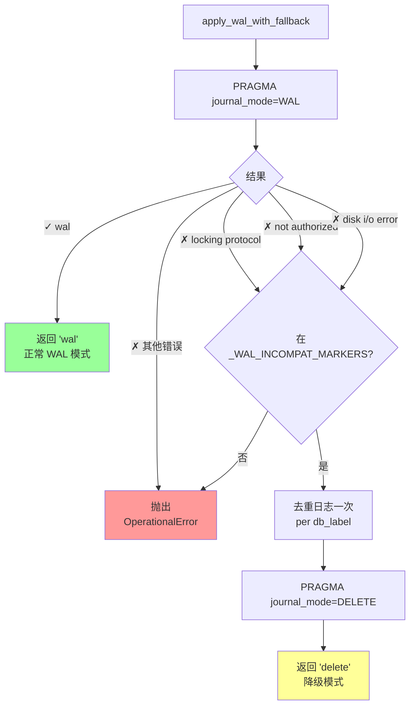
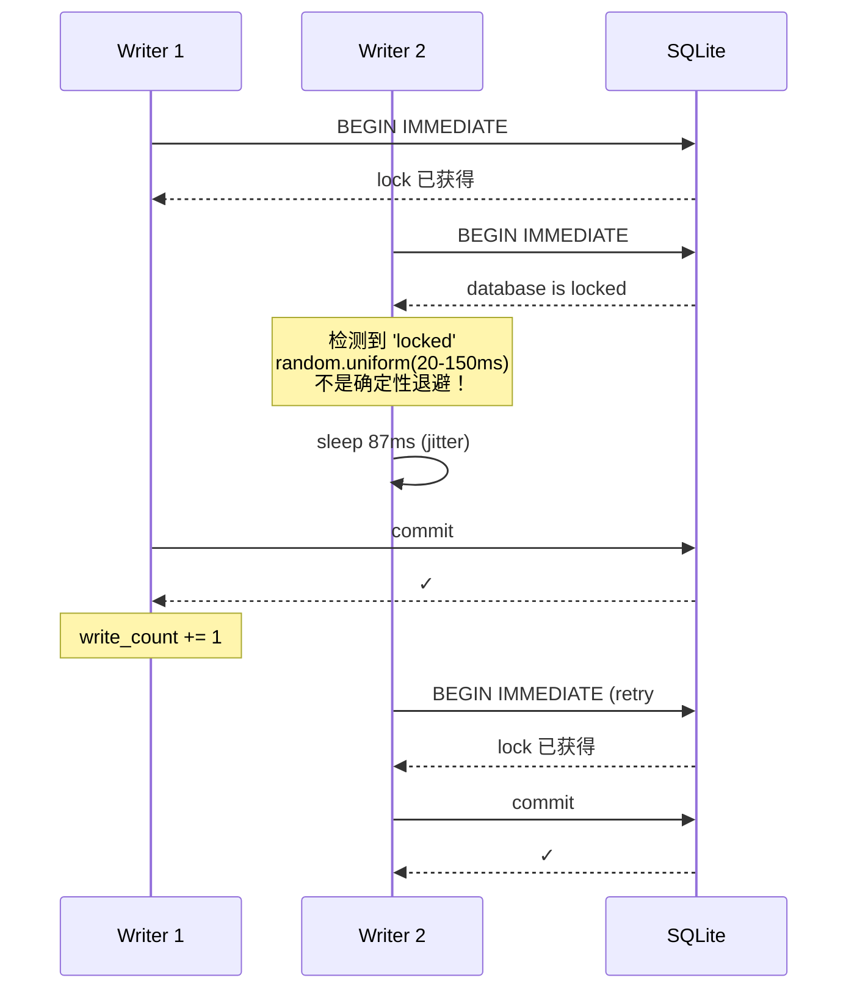
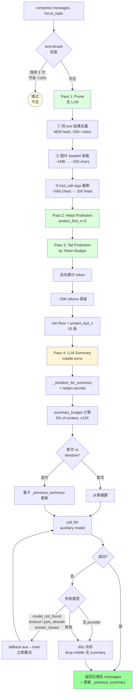
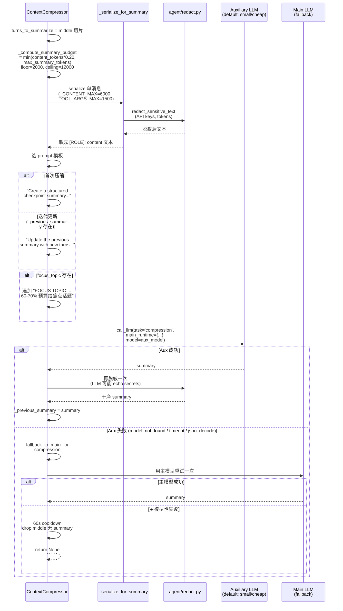
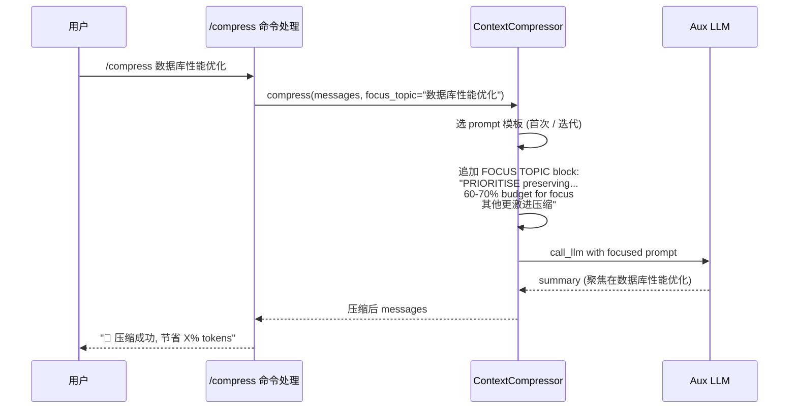
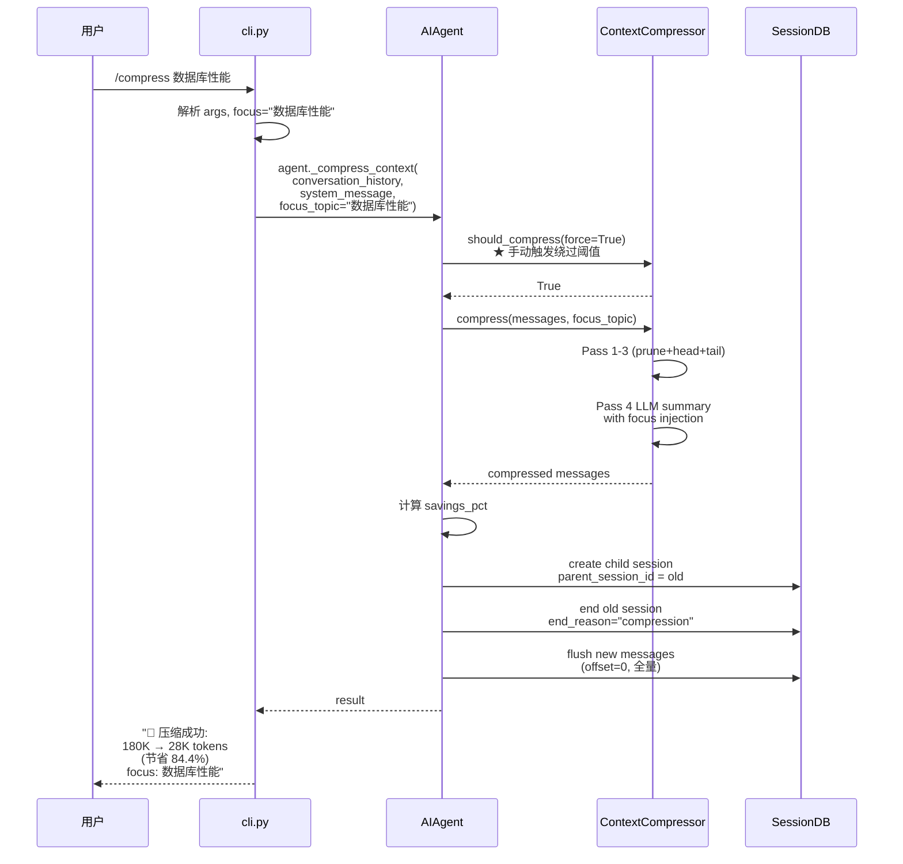
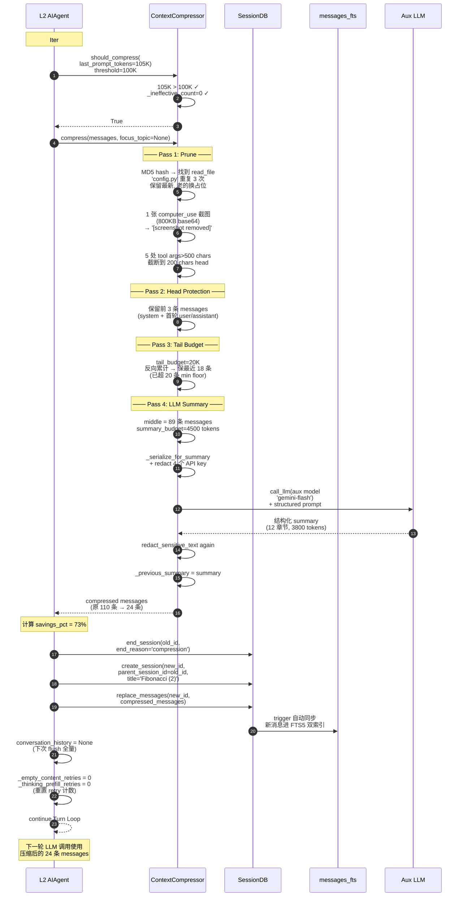

# Phase 3 技术方案：Context & State Layer ★

> 本文件以**图形化方式**讲解 Hermes Agent **生产级长跑能力的基石**——上下文管理 + 会话管理。
>
> 这是 Phase 1 / 2 之后的关键能力：让 Agent 能**跨小时、跨重启、跨进程**地工作，而不是只能跑一个对话就丢。
>
> 所有引用的文件路径、行号、字段名均已**逐项核对**仓库源码。

---

## 0. 本文件目录

- [1. L5 在系统中的位置](#1-l5-在系统中的位置)
- [2. 上下文 vs 会话 vs 记忆：三个概念的边界](#2-上下文-vs-会话-vs-记忆三个概念的边界)
- [3. SQLite Schema v11 全表剖析](#3-sqlite-schema-v11-全表剖析)
- [4. 持久化工程细节](#4-持久化工程细节)
- [5. 双 FTS5 索引（CJK 友好的全文搜索）](#5-双-fts5-索引cjk-友好的全文搜索)
- [6. Session Lineage：压缩触发的会话分裂](#6-session-lineage压缩触发的会话分裂)
- [7. ContextEngine 抽象基类（可插拔）](#7-contextengine-抽象基类可插拔)
- [8. ContextCompressor 4 Pass 算法详细](#8-contextcompressor-4-pass-算法详细)
- [9. 摘要 Prompt 模板深剖](#9-摘要-prompt-模板深剖)
- [10. Anti-thrash 守门 + Token 预算计算](#10-anti-thrash-守门--token-预算计算)
- [11. focus_topic 主题导向压缩](#11-focus_topic-主题导向压缩)
- [12. Session Search Tool（跨会话召回）](#12-session-search-tool跨会话召回)
- [13. Trajectory Compressor（离线 RL，与 runtime 解耦）](#13-trajectory-compressor离线-rl与-runtime-解耦)
- [14. /compress / /usage / /insights 命令实现](#14-compress--usage--insights-命令实现)
- [15. 端到端示例：一次完整压缩穿越 L5](#15-端到端示例一次完整压缩穿越-l5)
- [16. 设计取舍总结表](#16-设计取舍总结表)
- [17. 高频 Q&A 储备](#17-高频-qa-储备)
- [18. 必背图 + 自检清单](#18-必背图--自检清单)
- [19. 关键代码地图](#19-关键代码地图)
- [20. 一句话总结 + 衔接 Phase 4](#20-一句话总结--衔接-phase-4)

---

## 1. L5 在系统中的位置

> Phase 3 解决两个看似不同但**共享同一 SQLite 存储层**的问题。

```
              ┌────────────────────────────────────────────┐
              │   L2  Agent Core (run_agent.py)             │
              │                                             │
              │   run_conversation 内部:                     │
              │   ① _ensure_db_session                       │
              │   ② preflight compression (L11891-11950)    │
              │   ③ _save_session_log (每工具批后)           │
              │   ④ _compress_context (循环内, L10194)      │
              │   ⑤ _persist_session (退出前)                │
              └────────────────────┬───────────────────────┘
                                   │
                                   │ 调用 L5 的两套 API
                                   │
       ┌───────────────────────────┴───────────────────────────┐
       ▼                                                       ▼
  ┌─────────────────────────────┐              ┌────────────────────────────┐
  │  ★ 上下文管理 (Context)      │              │  ★ 会话管理 (Session)       │
  │  ────────────                │              │  ────────────              │
  │                              │              │                            │
  │  ContextEngine ABC          │              │  SessionDB (hermes_state.py│
  │  (agent/context_engine.py)   │              │  L309, 2966 行)             │
  │                              │              │                            │
  │  ContextCompressor          │              │  • SQLite WAL              │
  │  (agent/context_            │              │  • 应用层抖动重试 (20-150ms)│
  │   compressor.py, ~1400 行)   │              │  • NFS/SMB 自动降级         │
  │                              │              │  • PASSIVE WAL checkpoint  │
  │  • 4 Pass 压缩算法           │              │  • 双 FTS5 (unicode61 +   │
  │  • Anti-thrash 守门         │              │    trigram CJK)            │
  │  • Token 预算计算            │              │  • Session lineage         │
  │  • focus_topic 主题导向      │              │    (parent_session_id 链) │
  │  • 辅助模型摘要+回退          │              │  • 14 字段成本/token       │
  │                              │              │    counter                 │
  │                              │              │                            │
  │  ContextReferences          │              │  Search:                   │
  │  (agent/context_            │              │  • search_messages (FTS5)  │
  │   references.py)             │              │  • search_sessions         │
  │  Trajectory 引用化            │              │                            │
  └─────────────────────────────┘              └────────────────────────────┘
                  │                                           │
                  └─────────────┬─────────────────────────────┘
                                ▼
              ┌─────────────────────────────────────┐
              │       共同的底层：SQLite              │
              │       ~/.hermes/state.db             │
              │                                     │
              │   表:                                │
              │   • sessions  (28 列, 元数据)         │
              │   • messages  (14 列, 对话原文)       │
              │   • state_meta (kv, 全局状态)        │
              │   • messages_fts (unicode61)         │
              │   • messages_fts_trigram (CJK)       │
              │   • schema_version                   │
              │   + 业务表 (telegram_dm_topic_*)     │
              └─────────────────────────────────────┘

                                ▼ 独立子系统
              ┌─────────────────────────────────────┐
              │  trajectory_compressor.py (1508 行)  │
              │  ───────────────────                  │
              │  ★ 离线 RL 训练数据压缩 (与 runtime  │
              │     完全解耦)                         │
              │  Input: JSONL 轨迹文件                │
              │  Output: 压缩后的 JSONL              │
              │  跑在 batch 模式，不在 Agent 进程内    │
              └─────────────────────────────────────┘
```

---

## 2. 上下文 vs 会话 vs 记忆：三个概念的边界

> 这是工程师**最常踩坑的概念区分**。Phase 3 管前两个，Phase 4 管第三个。

### 2.1 三个概念的本质对比

```
┌────────────────────────────────────────────────────────────────────┐
│                                                                    │
│  ┌───────────────┬─────────────────┬─────────────────┬───────────┐ │
│  │  维度          │  上下文 Context │  会话 Session   │  记忆 Memory│ │
│  │                │  (Phase 3)      │  (Phase 3)      │  (Phase 4) │ │
│  ├───────────────┼─────────────────┼─────────────────┼───────────┤ │
│  │  本质          │  对话原文流      │  对话的         │  抽取出的   │ │
│  │                │                  │  持久化形态     │  高浓度知识 │ │
│  ├───────────────┼─────────────────┼─────────────────┼───────────┤ │
│  │  喂给 LLM?    │  ★ 直接喂        │  间接 (转换为   │  ★ 注入到   │ │
│  │                │  (messages list) │   messages 后)  │  system    │ │
│  │                │                  │                 │  prompt)    │ │
│  ├───────────────┼─────────────────┼─────────────────┼───────────┤ │
│  │  存储介质      │  Python 内存     │  SQLite          │  Markdown +│ │
│  │                │  (messages 局部  │  (state.db)      │  外部服务   │ │
│  │                │   变量)          │                  │            │ │
│  ├───────────────┼─────────────────┼─────────────────┼───────────┤ │
│  │  时间尺度      │  秒级 (一次回答) │  分钟-小时级    │  长期      │ │
│  │                │                  │                 │  (跨天/月) │ │
│  ├───────────────┼─────────────────┼─────────────────┼───────────┤ │
│  │  生命周期      │  临时，会压缩、  │  长期，谨慎删除 │  累积，几乎│ │
│  │                │  会被丢弃        │                 │  不删       │ │
│  ├───────────────┼─────────────────┼─────────────────┼───────────┤ │
│  │  典型操作      │  压缩 / 截窗 /   │  落盘 / 检索 /  │  抽取 /    │ │
│  │                │  截取 / 注入     │  分裂 / 归档    │  更新 /     │ │
│  │                │                  │                 │  注入       │ │
│  ├───────────────┼─────────────────┼─────────────────┼───────────┤ │
│  │  典型例子      │  第 12 条消息是  │  会话 ID:        │  MEMORY.md │ │
│  │                │  "今天天气如何"  │  20250513_1430_  │  "用户偏好  │ │
│  │                │                  │  abc123, 含 230  │  简洁回答" │ │
│  │                │                  │  条消息          │            │ │
│  └───────────────┴─────────────────┴─────────────────┴───────────┘ │
└────────────────────────────────────────────────────────────────────┘
```

### 2.2 同一段对话的"三视图"

```
   用户发言："写一个 Python 函数计算斐波那契数列"
   Agent 调 write_file 工具 → 写完
   用户再发："改成迭代版本"
   Agent 改完
   用户："好的，谢谢"

   ═══════════════════════════════════════════════════════════════

   视图 ① 上下文 (Context) - 在 Python messages 列表里
   ─────────────────────────────────────
   [
     {role: system, content: "..."},
     {role: user, content: "写一个 Python 函数..."},
     {role: assistant, tool_calls: [write_file(...)]},
     {role: tool, content: "已写入 fib.py"},
     {role: assistant, content: "已完成"},
     {role: user, content: "改成迭代版本"},
     {role: assistant, tool_calls: [write_file(...)]},
     {role: tool, content: "已更新 fib.py"},
     {role: assistant, content: "已改完"},
     {role: user, content: "好的，谢谢"},
     {role: assistant, content: "不客气"}
   ]
   ↑ 11 条消息全文，喂 LLM 输入

   ═══════════════════════════════════════════════════════════════

   视图 ② 会话 (Session) - 在 SQLite 里
   ─────────────────────────────────────
   sessions 表:
     id: 20250513_1430_abc123
     source: cli
     started_at: 1715582400
     model: claude-sonnet-4
     title: "Fibonacci function"
     input_tokens: 1234
     output_tokens: 567
     api_call_count: 3
     message_count: 11
     tool_call_count: 2
     ...

   messages 表 (11 行):
     id=1, role=system, content="..."
     id=2, role=user, content="写一个 Python 函数..."
     ...
     id=11, role=assistant, content="不客气"

   messages_fts 索引:
     "Python 斐波那契 函数 迭代 fib.py..."
   ↑ 完整持久化 + 可搜索

   ═══════════════════════════════════════════════════════════════

   视图 ③ 记忆 (Memory, Phase 4) - 在文件里
   ─────────────────────────────────────
   MEMORY.md (Agent 主动写):
     §2025-05-13 用户 chauminhthach 写 Python 时偏好迭代风格胜过递归
     §他常用 fib.py 作为示例文件名

   USER.md (用户画像):
     §简洁回答，不要长篇大论
     §使用中文沟通

   SKILL.md (沉淀的方法):
     [可能没产生新 skill，因为这次任务太简单]
   ↑ 跨会话不丢的"高浓度知识"
```

### 2.3 三者协同工作

```mermaid
flowchart LR
    U[用户输入<br/>新一轮对话] --> Agent[Agent Core]

    Agent --> ReadCtx[① 读上下文<br/>messages 列表]
    Agent --> ReadMem[② 读记忆<br/>MEMORY.md frozen<br/>Honcho prefetch]
    Agent --> ReadSess[③ 读会话<br/>SessionDB.get_session<br/>(续会话时)]

    ReadCtx --> LLM
    ReadMem --> LLM
    ReadSess --> LLM

    LLM[LLM 调用] --> NewMsg[新消息]

    NewMsg --> AppendCtx[追加到 messages]
    AppendCtx --> WriteSess[写 SessionDB<br/>渐进式落盘]
    AppendCtx --> CheckCompress{需压缩?}
    CheckCompress -->|是| Compress[ContextCompressor<br/>4 Pass]
    Compress --> WriteSess
    CheckCompress -->|否| Done

    NewMsg --> Nudge{触发 nudge?}
    Nudge -->|是| ReviewMem[后台 review →<br/>更新 MEMORY/<br/>USER/SKILL]

    style ReadCtx fill:#dfd
    style WriteSess fill:#dfd
    style Compress fill:#fff5d6
    style ReadMem fill:#ffd
    style ReviewMem fill:#ffd
```

---

## 3. SQLite Schema v11 全表剖析

> 所有持久化状态的 single source of truth。

### 3.1 sessions 表（已核对 hermes_state.py L190-222）

```
┌─────────────────────────────────────────────────────────────────────┐
│  CREATE TABLE sessions (                                             │
│  ───────────                                                          │
│                                                                      │
│   ┌─── 身份字段 ────────────────────────────────────────┐             │
│   │  id TEXT PRIMARY KEY                                              │
│   │  source TEXT NOT NULL    ← cli/telegram/discord/cron/...          │
│   │  user_id TEXT             ← 平台用户 ID                            │
│   │  model TEXT               ← 当前模型                                │
│   │  model_config TEXT        ← provider/api_mode/temp 等 JSON         │
│   │  system_prompt TEXT       ← ★ 缓存用！续会话从这读                  │
│   └─────────────────────────────────────────────────────┘             │
│                                                                      │
│   ┌─── Lineage / 生命周期 ──────────────────────────────┐              │
│   │  parent_session_id TEXT  ← ★ 压缩触发的会话链         │              │
│   │   FOREIGN KEY → sessions(id)                                       │
│   │  started_at REAL NOT NULL                                          │
│   │  ended_at REAL                                                      │
│   │  end_reason TEXT          ← null/user_exit/compression/             │
│   │                              timeout/error                          │
│   │  title TEXT                ← Agent 自动起的标题                     │
│   └─────────────────────────────────────────────────────┘              │
│                                                                      │
│   ┌─── 计数字段 ────────────────────────────────────────┐              │
│   │  message_count INTEGER DEFAULT 0                                   │
│   │  tool_call_count INTEGER DEFAULT 0                                 │
│   │  api_call_count INTEGER DEFAULT 0                                  │
│   └─────────────────────────────────────────────────────┘              │
│                                                                      │
│   ┌─── Token / 成本字段 ────────────────────────────────┐              │
│   │  input_tokens INTEGER DEFAULT 0                                    │
│   │  output_tokens INTEGER DEFAULT 0                                   │
│   │  cache_read_tokens INTEGER DEFAULT 0                               │
│   │  cache_write_tokens INTEGER DEFAULT 0                              │
│   │  reasoning_tokens INTEGER DEFAULT 0                                │
│   │  billing_provider TEXT    ← 计费 provider                          │
│   │  billing_base_url TEXT                                              │
│   │  billing_mode TEXT                                                  │
│   │  estimated_cost_usd REAL                                            │
│   │  actual_cost_usd REAL                                               │
│   │  cost_status TEXT          ← estimated / actual / failed           │
│   │  cost_source TEXT                                                   │
│   │  pricing_version TEXT      ← 计费规则版本                          │
│   └─────────────────────────────────────────────────────┘              │
│                                                                      │
│   ┌─── Handoff 字段 (跨 Agent / 跨平台移交) ─────────────┐              │
│   │  handoff_state TEXT       ← JSON, 等待接管的状态                   │
│   │  handoff_platform TEXT    ← 目标平台                               │
│   │  handoff_error TEXT       ← 失败原因                               │
│   └─────────────────────────────────────────────────────┘              │
│  );                                                                  │
└─────────────────────────────────────────────────────────────────────┘
```

### 3.2 messages 表（已核对 L224-240）

```
┌──────────────────────────────────────────────────────────────────┐
│  CREATE TABLE messages (                                          │
│  ───────────                                                       │
│                                                                  │
│   id INTEGER PRIMARY KEY AUTOINCREMENT                            │
│   session_id TEXT NOT NULL REFERENCES sessions(id)               │
│   role TEXT NOT NULL              ← system/user/assistant/tool   │
│   content TEXT                                                    │
│                                                                  │
│   ┌─ Tool call 相关 ─────────────────────────────────┐            │
│   │  tool_call_id TEXT  ← role=tool 时配对的 ID        │            │
│   │  tool_calls TEXT     ← assistant 的 tool_calls    │            │
│   │                        (JSON 序列化)                │            │
│   │  tool_name TEXT      ← role=tool 时工具名         │            │
│   └────────────────────────────────────────────────┘             │
│                                                                  │
│   timestamp REAL NOT NULL                                         │
│   token_count INTEGER             ← 单条消息 token 数              │
│   finish_reason TEXT                                              │
│                                                                  │
│   ┌─ Reasoning 字段 (多 provider 兼容) ──────────────┐            │
│   │  reasoning TEXT           ← OpenAI / Anthropic    │            │
│   │  reasoning_content TEXT   ← DeepSeek / Moonshot   │            │
│   │  reasoning_details TEXT   ← OpenRouter unified    │            │
│   │  codex_reasoning_items TEXT ← Codex 数组          │            │
│   │  codex_message_items TEXT  ← Codex 消息项         │            │
│   └────────────────────────────────────────────────┘             │
│  );                                                              │
└──────────────────────────────────────────────────────────────────┘
```

### 3.3 state_meta + 业务表

```
┌────────────────────────────────────────────────────────┐
│  state_meta — 全局 key-value 配置                       │
│  ──────────                                            │
│   key TEXT PRIMARY KEY                                 │
│   value TEXT                                           │
│                                                        │
│  用途：跨进程共享的全局状态 (last_active_session_id /   │
│        cron_last_tick_at / migration_marker / 等)      │
└────────────────────────────────────────────────────────┘

┌────────────────────────────────────────────────────────┐
│  Telegram 业务表 (L2403+)                               │
│  ──────────                                            │
│   telegram_dm_topic_mode          ← 是否开启 topic 模式 │
│   telegram_dm_topic_bindings      ← topic → session 绑定│
│                                                        │
│  ★ 这些不是核心 schema，但是 Gateway 在 SQLite 落盘       │
│     的业务状态，跟着 state.db 走                          │
└────────────────────────────────────────────────────────┘
```

### 3.4 4 个索引（已核对 L247-250）

```
   CREATE INDEX idx_sessions_source
       ON sessions(source)
       ─► 加速 "查 telegram 来的所有会话"

   CREATE INDEX idx_sessions_parent
       ON sessions(parent_session_id)
       ─► 加速 lineage 链回溯

   CREATE INDEX idx_sessions_started
       ON sessions(started_at DESC)
       ─► 加速 "最近 N 个会话" 查询

   CREATE INDEX idx_messages_session
       ON messages(session_id, timestamp)
       ─► 加速 "某 session 的有序消息" 查询
       (复合索引：session_id 等值 + timestamp 排序)
```

### 3.5 Schema 自愈：声明式列对齐（已核对 L506-548）

> Hermes 用 Beets/sqlite-utils 的"**声明即真理**"模式，避免大量版本化迁移代码。

```mermaid
flowchart TD
    Start[SessionDB.__init__] --> Script[executescript SCHEMA_SQL<br/>CREATE TABLE IF NOT EXISTS]
    Script --> Reconcile[_reconcile_columns<br/>对比期望 vs 实际列]

    Reconcile --> ParseExpected[内存 SQLite 解析 SCHEMA_SQL<br/>提取每表期望列]
    ParseExpected --> ParseLive[PRAGMA table_info<br/>读取当前 DB 实际列]

    ParseLive --> Diff{对比 declared vs live}
    Diff -->|缺列| AlterAdd[ALTER TABLE ADD COLUMN<br/>自动补齐]
    Diff -->|齐全| Skip[跳过]
    AlterAdd --> Skip

    Skip --> Version[读 schema_version 表]
    Version --> NewDB{新库?}
    NewDB -->|是| InsertV[INSERT SCHEMA_VERSION=11]
    NewDB -->|否| DataMig{需数据迁移?}
    DataMig -->|是<br/>(v<10)| Backfill[FTS5 trigram 表<br/>一次性 backfill]
    DataMig -->|否| Done
    InsertV --> Done
    Backfill --> Done

    style AlterAdd fill:#dfd
    style Backfill fill:#fff5d6
```

```
   ┌──────────────────────────────────────────────────────────────┐
   │  好处:                                                         │
   │   ✓ 加列只改 SCHEMA_SQL, 不写 migration                        │
   │   ✓ 跳版本号也能自愈 (e.g. 老版本机器升 v9→v11 一次到位)        │
   │   ✓ 幂等 (反复执行无副作用)                                    │
   │                                                              │
   │  代价:                                                         │
   │   ✗ 数据迁移 (行级转换) 仍需手写 (那是 schema_version 的活)    │
   │   ✗ 删列 / 改类型 需要手动处理                                  │
   └──────────────────────────────────────────────────────────────┘
```

---

## 4. 持久化工程细节

> SQLite 是单机 DB，但 Hermes 在多进程 / 网络挂载下要稳定。

### 4.1 WAL 模式 + 三条防御



### 4.2 WAL 不兼容的文件系统

```
┌──────────────────────────────────────────────────────┐
│  以下场景 WAL 不工作 → 自动降级到 DELETE:              │
│                                                      │
│   ✗ NFS 网络挂载         "locking protocol"           │
│   ✗ SMB/CIFS Windows 共享 "locking protocol"          │
│   ✗ 部分 FUSE 挂载        "not authorized"            │
│   ✗ WSL1                 "locking protocol"           │
│   ✗ 网络 FS 短暂故障      "disk i/o error"             │
│                                                      │
│  降级到 DELETE journal 后:                            │
│   • 不再支持并发读 + 写                                │
│   • 但**所有功能继续工作**                              │
│   • 一次性 WARNING 日志 (不刷屏)                       │
└──────────────────────────────────────────────────────┘
```

### 4.3 应用层抖动重试（核对 L375-425）

> Hermes 不信 SQLite 的内置 busy handler——**自己重试**。

```
┌────────────────────────────────────────────────────────────────────┐
│  为什么不用 SQLite 的内置 busy timeout？                              │
│                                                                    │
│   SQLite 的内置 busy handler 使用 *确定性* 退避（sleep 1ms, 2ms,    │
│   4ms, 8ms, 16ms... 或固定间隔）。                                   │
│                                                                    │
│   ★ 后果：高并发下出现【convoy effect 车队效应】                     │
│      多个 writer 在同一时刻退避 → 同一时刻重试 → 全部失败 → 又同时   │
│      退避 → 永远撞车                                                 │
│                                                                    │
│   Hermes 方案：应用层 jittered retry                                 │
│   ─────────                                                         │
│   • SQLite timeout 调到 1s (短)                                     │
│   • 应用层用 random.uniform(20ms, 150ms) 抖动                       │
│   • 最多重试 15 次                                                   │
│   • BEGIN IMMEDIATE 把锁拿到事务开头 (失败立刻报错而非提交时)         │
│                                                                    │
└────────────────────────────────────────────────────────────────────┘
```



### 4.4 PASSIVE WAL Checkpoint

```
┌────────────────────────────────────────────────────────────┐
│  每 50 次写触发一次 PASSIVE checkpoint (L405-407):           │
│                                                            │
│  if self._write_count % 50 == 0:                           │
│      PRAGMA wal_checkpoint(PASSIVE)                        │
│                                                            │
│  PASSIVE 含义:                                              │
│   • 把已提交的 WAL 帧刷回主 DB 文件                          │
│   • 仅 checkpoint 当前**没有其他连接**正在用的帧             │
│   • 不阻塞，不抢锁                                          │
│   • "尽力而为"——失败也无所谓 (写继续)                       │
│                                                            │
│  为什么需要：                                                │
│   ✗ 不 checkpoint → WAL 文件无限增长                        │
│   ✗ 用 FULL/RESTART checkpoint → 会阻塞 reader              │
│   ✓ PASSIVE 折中：渐进刷回，不打扰任何人                     │
└────────────────────────────────────────────────────────────┘
```

### 4.5 渐进式落盘（与 Phase 1 § 16.5 呼应）

```
┌──────────────────────────────────────────────────────────────┐
│  每个工具批执行完后立即 _save_session_log:                     │
│                                                              │
│  while loop:                                                 │
│      ... LLM call + tool exec ...                            │
│      self._session_messages = messages                       │
│      self._save_session_log(messages)   ← 立即落盘            │
│      continue                                                │
│                                                              │
│  容错效益:                                                    │
│   • Gateway 进程被 kill → 重启后看到最新                      │
│   • 跨平台 handoff → 接管时拿到最新                           │
│   • 中途 OOM → 用户能继续不丢工作                              │
│                                                              │
│  代价:                                                       │
│   • 每次 _save_session_log 都触发一次 SQLite 写              │
│   • 抖动重试 + WAL checkpoint 摊薄影响                        │
└──────────────────────────────────────────────────────────────┘
```

---

## 5. 双 FTS5 索引（CJK 友好的全文搜索）

> 这是 Hermes 解决"**英文 phrase search 和中日韩 substring search 同时工作**"的工程方案。

### 5.1 为什么需要两个 FTS 表

```
┌────────────────────────────────────────────────────────────────┐
│                                                                │
│  问题：FTS5 默认 unicode61 tokenizer 对 CJK 失效                │
│  ─────                                                          │
│  "大别山项目" → tokenize → ["大", "别", "山", "项", "目"]      │
│  搜索 "大别山" → AND 所有字符 → 漏掉真正的"大别山"phrase 匹配   │
│                                                                │
│  解决：第二个 trigram FTS 表                                    │
│  ─────                                                          │
│  "大别山项目" → 3-byte 序列重叠 → 任何 3+ 字符的 CJK 子串      │
│                  都能匹配                                       │
│                                                                │
│  ★ 不能只用 trigram 替换 unicode61:                              │
│     trigram 对英文 phrase 搜索效果差 (短词如 "if" 不能 index)   │
│                                                                │
│  所以保留两个 FTS 表 + 智能路由                                 │
└────────────────────────────────────────────────────────────────┘
```

### 5.2 双索引同步（trigger 机制）

```mermaid
flowchart LR
    Insert[INSERT INTO messages] --> T1[messages_fts_insert<br/>trigger]
    Insert --> T2[messages_fts_trigram_insert<br/>trigger]

    T1 --> FTS1[messages_fts<br/>(unicode61)]
    T2 --> FTS2[messages_fts_trigram<br/>(trigram)]

    Update[UPDATE messages] --> TU1[messages_fts_update<br/>trigger]
    Update --> TU2[messages_fts_trigram_update<br/>trigger]

    TU1 --> FTS1
    TU2 --> FTS2

    Delete[DELETE FROM messages] --> TD1[messages_fts_delete]
    Delete --> TD2[messages_fts_trigram_delete]

    TD1 --> FTS1
    TD2 --> FTS2
```

> 注意：trigger 把 `content + tool_name + tool_calls` **三个字段拼接**索引，所以搜 "write_file" 既能匹配 content 里提到的，也能匹配 tool_name。

### 5.3 查询路由策略（已核对 search_messages L1880-2079）

```mermaid
flowchart TD
    Query[query 字符串] --> Sanitize[_sanitize_fts5_query<br/>escape 特殊字符]
    Sanitize --> CJK{_contains_cjk?}

    CJK -->|否 - 纯英文| FTS1[messages_fts<br/>unicode61<br/>标准 FTS5 syntax]
    FTS1 --> Result1([返回 matches])

    CJK -->|是| Count[_count_cjk]
    Count --> Tokens[拆分非 OR/AND/NOT token]
    Tokens --> Check{所有 token<br/>都 >= 3 CJK?}

    Check -->|是 + 总 CJK >= 3| FTS2[messages_fts_trigram<br/>每个 token 加 ""]
    FTS2 --> Result2([返回 matches])

    Check -->|否<br/>(有短 CJK token)| LIKE[LIKE %token%<br/>substring 搜索<br/>per-token OR clauses]
    LIKE --> Result3([返回 matches])

    style FTS1 fill:#dfd
    style FTS2 fill:#fff5d6
    style LIKE fill:#ffd
```

### 5.4 三条查询路径对比

```
┌──────────────────┬────────────────┬──────────────────┬─────────────────┐
│  路径             │  适用场景       │  性能             │  代价             │
├──────────────────┼────────────────┼──────────────────┼─────────────────┤
│  messages_fts    │  纯英文 / 拉丁文 │  FTS5 原生         │  CJK 不能 phrase │
│  (unicode61)     │  prefix / phrase │  极快 + rank      │  匹配             │
├──────────────────┼────────────────┼──────────────────┼─────────────────┤
│  messages_fts_   │  CJK 长度 >=3   │  FTS5 trigram     │  英文短词 (<3 字)│
│   trigram        │  且每 token >=3 │  快 + rank        │  无法 index      │
├──────────────────┼────────────────┼──────────────────┼─────────────────┤
│  LIKE substring  │  短 CJK token    │  全表扫描        │  无 rank          │
│                  │  (如"广西")     │  (有索引但不是    │  慢，但能搜       │
│                  │                  │   FTS rank)       │                  │
└──────────────────┴────────────────┴──────────────────┴─────────────────┘
```

### 5.5 实例：同一查询的不同路径

```
   ┌─────────────────────────────────────────────────────────────┐
   │  查询: "docker deployment"                                    │
   │  _contains_cjk → False                                       │
   │  → 走 messages_fts (unicode61)                               │
   │  ─► 快速 phrase match, FTS5 rank 排序                        │
   ├─────────────────────────────────────────────────────────────┤
   │  查询: "大别山项目"  (4 CJK chars, single token)              │
   │  _contains_cjk → True                                        │
   │  cjk_count = 5 >= 3 ✓                                         │
   │  per-token check: 单 token 5 >= 3 ✓                          │
   │  → 走 messages_fts_trigram                                   │
   │  ─► trigram 匹配 "大别山项目" 任意 3 字符子串                  │
   ├─────────────────────────────────────────────────────────────┤
   │  查询: "广西 OR 桂林 OR 漓江"  (每个 token 只有 2 CJK)         │
   │  _contains_cjk → True                                        │
   │  cjk_count = 6 >= 3 ✓                                         │
   │  per-token check: 每个 token 都 < 3 ✗                         │
   │  → 走 LIKE substring (per-token OR clauses)                  │
   │  ─► 拼 LIKE '%广西%' OR LIKE '%桂林%' OR LIKE '%漓江%'         │
   │     #20494 fix                                                │
   └─────────────────────────────────────────────────────────────┘
```

---

## 6. Session Lineage：压缩触发的会话分裂

> Hermes 把"上下文压缩"建模为**一次会话结束、新会话开始**。

### 6.1 lineage 链的形成

```
   时间轴 ────────────────────────────────────────────────►

   T0     T1 (压缩 #1)        T2 (压缩 #2)          T3 (用户/exit)
   │      │                    │                      │
   ▼      ▼                    ▼                      ▼
   ┌──────────┐  ┌──────────┐  ┌──────────┐  ┌──────────┐
   │ Session A│  │ Session B│  │ Session C│  │ Session D│
   │  ───────  │  │  ───────  │  │  ───────  │  │  ───────  │
   │ 110 条消息│ │ 60 条消息  │ │ 50 条消息  │ │ 35 条消息  │
   │ 230K tokens│  │ 145K tokens │  │ 100K tokens  │ │ 70K tokens   │
   │           │ │             │ │              │ │              │
   │ end_reason│  │ end_reason  │ │ end_reason   │  │ end_reason   │
   │ ="compres │  │ ="compres  │ │ ="compres   │  │ ="user_exit"│
   │  sion"    │  │  sion"     │ │  sion"      │  │              │
   │           │ │             │ │              │ │              │
   │parent=null│  │parent=A     │ │parent=B      │ │parent=C      │
   └──────────┘  └──────────┘  └──────────┘  └──────────┘
        ▲              ▲              ▲              ▲
        │              │              │              │
        └──────────────┴──────────────┴──────────────┘
                       chain (DAG, 不一定线性)

   ✦ 每次压缩 → 老 session 标 end_reason="compression" 关闭
                 新 session 创建，parent_session_id = 老 ID
                 老 session 的最后一条 summary 复制到新 session 作为首消息

   ✦ Title 自动递增：
     "Fibonacci function"  →  "Fibonacci function (2)"  →  "(3)"  →  "(4)"
```

### 6.2 lineage 工程细节

```
┌──────────────────────────────────────────────────────────────────┐
│  压缩时的连续性保证 (run_agent.py:11932 / 14807):                │
│                                                                  │
│  conversation_history = None     # 强制下次 flush 写全量          │
│                                                                  │
│  why?                                                            │
│  ─────                                                            │
│  原本 _flush_messages_to_session_db 只写 "新增" 消息             │
│   (按 conversation_history 长度算 offset)                        │
│                                                                  │
│  压缩后 messages 列表已经"凭空换骨"了：                            │
│   • 原 110 条 → 现 60 条 (含 summary)                            │
│   • 旧 session 还是 110 条状态                                    │
│   • 必须在新 session 里写【新的 60 条】，从 offset 0 开始          │
│                                                                  │
│  设 conversation_history = None 触发"全量写"模式                   │
└──────────────────────────────────────────────────────────────────┘
```

### 6.3 lineage 相关 API（hermes_state.py）

```
┌──────────────────────────────────────────────────────────────┐
│  • resolve_resume_session_id(id)         L1621                │
│    ─► 给一个老 session ID，沿 lineage 链找到 tip (最新)        │
│                                                              │
│  • _session_lineage_root_to_tip(id)      L1756                │
│    ─► 从根到 tip 的完整链                                      │
│                                                              │
│  • get_messages_as_conversation(id, ...)  L1686                │
│    ─► 按链拼接所有 messages (跨多个 sessions 复原对话)         │
│                                                              │
│  • get_next_title_in_lineage(base_title) L1091                │
│    ─► 自动 "(2)" "(3)" 递增                                  │
│                                                              │
│  • finalize_orphaned_compression_sessions L893                │
│    ─► 启动时清理"压缩中崩了" 的中间态 session                  │
└──────────────────────────────────────────────────────────────┘
```

---

## 7. ContextEngine 抽象基类（可插拔）

> Hermes 把"上下文管理策略"抽象成基类——默认 `ContextCompressor`，但**可以被插件替换**（如 LCM = Logic Context Model）。

### 7.1 ContextEngine ABC 全貌（已核对 context_engine.py）

```
┌──────────────────────────────────────────────────────────────────┐
│  class ContextEngine(ABC):                                       │
│                                                                  │
│   ┌─ 身份 ────────────────────────────────────┐                  │
│   │  @abstractmethod                            │                  │
│   │  def name(self) -> str                      │                  │
│   └─────────────────────────────────────────────┘                  │
│                                                                  │
│   ┌─ Token 状态字段 (run_agent.py 直接读) ──────┐                  │
│   │  last_prompt_tokens: int     = 0            │                  │
│   │  last_completion_tokens: int = 0            │                  │
│   │  last_total_tokens: int      = 0            │                  │
│   │  threshold_tokens: int       = 0            │                  │
│   │  context_length: int         = 0            │                  │
│   │  compression_count: int      = 0            │                  │
│   └─────────────────────────────────────────────┘                  │
│                                                                  │
│   ┌─ 压缩参数 (preflight 用) ─────────────────────┐                │
│   │  threshold_percent: float = 0.75              │                │
│   │  protect_first_n: int     = 3                 │                │
│   │  protect_last_n: int      = 6                 │                │
│   │                                              │                │
│   │  ★ ContextCompressor 覆盖:                    │                │
│   │     threshold_percent=0.50, protect_last_n=20  │                │
│   └─────────────────────────────────────────────┘                  │
│                                                                  │
│   ┌─ 核心接口 (必须实现) ───────────────────────┐                  │
│   │  @abstractmethod                              │                │
│   │  def update_from_response(usage: dict)        │                │
│   │  ─► 每次 LLM 调用后更新 token 计数            │                │
│   │                                              │                │
│   │  @abstractmethod                              │                │
│   │  def should_compress(prompt_tokens=None)      │                │
│   │  ─► 是否该压缩                                 │                │
│   │                                              │                │
│   │  @abstractmethod                              │                │
│   │  def compress(messages, current_tokens=None,  │                │
│   │               focus_topic=None)               │                │
│   │  ─► 压缩，返回新 messages list                 │                │
│   └─────────────────────────────────────────────┘                  │
│                                                                  │
│   ┌─ 可选接口 ────────────────────────────────────┐                │
│   │  def should_compress_preflight(messages)      │                │
│   │  def has_content_to_compress(messages)        │                │
│   │  def on_session_start(session_id, **kwargs)    │                │
│   │  def on_session_end(session_id, messages)     │                │
│   │  def on_session_reset()                       │                │
│   │  def get_tool_schemas()        ← 可暴露工具    │                │
│   │  def handle_tool_call(name, args, **kwargs)   │                │
│   │  def get_status()                             │                │
│   │  def update_model(model, ctx_length, ...)     │                │
│   └─────────────────────────────────────────────┘                  │
│  ────                                                            │
└──────────────────────────────────────────────────────────────────┘
```

### 7.2 引擎选择 → 插件化

```
   config.yaml:
     context:
       engine: "compressor"   ← 默认 (built-in ContextCompressor)
       # engine: "lcm"        ← 替换为 LCM 插件

   plugins/context_engine/<name>/__init__.py:
     def register():
         return MyContextEngine(...)

   ★ 只能有一个 engine 活跃 (避免多种压缩策略打架)
```

---

## 8. ContextCompressor 4 Pass 算法详细

> 这是默认 `ContextEngine` 实现，核心算法。

### 8.1 算法总览



### 8.2 Pass 1: Prune（无 LLM，最便宜）

```
┌────────────────────────────────────────────────────────────────┐
│  _prune_old_tool_results (L519)                                 │
│                                                                │
│  ┌─── Step 1: Tool 结果去重 ────────────────────────┐           │
│  │   走完所有 messages, role="tool", content >= 200 │           │
│  │   chars                                          │           │
│  │   MD5 hash content (12-char prefix)               │           │
│  │                                                  │           │
│  │   {同 hash 出现多次} → 保留最新, 老的换成        │           │
│  │   "[Duplicate tool output — same content as a   │           │
│  │    more recent call]"                           │           │
│  │                                                  │           │
│  │   场景: read_file 同一文件 5 次 → 仅保留最新     │           │
│  └─────────────────────────────────────────────────┘           │
│                                                                │
│  ┌─── Step 2: 图片剥离 ───────────────────────────┐            │
│  │   role="tool", content 是 list (multimodal)     │            │
│  │     → _strip_image_parts_from_parts             │            │
│  │   role="tool", content 是 dict(_multimodal)     │            │
│  │     → 替换为 "[screenshot removed] {summary}"   │            │
│  │                                                  │            │
│  │   场景: computer_use 截图 ~1MB base64           │            │
│  │         → ~200 chars 占位                        │            │
│  └─────────────────────────────────────────────────┘            │
│                                                                │
│  ┌─── Step 3: Tool args 截断 ─────────────────────┐            │
│  │   role="assistant" 的 tool_calls                │            │
│  │   args > 500 chars → _truncate_tool_call_args_  │            │
│  │   json (保留 200 chars head, 解析 JSON 内部缩)  │            │
│  │                                                  │            │
│  │   ★ 必须保持 JSON 合法! 否则后续 provider 直接   │            │
│  │     拒绝整个会话                                 │            │
│  │                                                  │            │
│  │   场景: write_file 内容 50KB → 保留前 200 chars  │            │
│  └─────────────────────────────────────────────────┘            │
└────────────────────────────────────────────────────────────────┘
```

### 8.3 Pass 2/3: 头尾保护

```
┌──────────────────────────────────────────────────────────────────┐
│  Messages 数组保护区:                                              │
│                                                                  │
│      ┌── HEAD ──┐  ┌─── MIDDLE ───┐  ┌─── TAIL ───┐              │
│   ┌──┬──┬──┬───┬──┬──┬──┬──┬──┬───┬──┬──┬──┬──┬──┐               │
│   │S │U │A │ T │A │U │A │T │A │ T │U │A │T │A │U │               │
│   │  │  │  │   │  │  │  │ │  │   │  │  │ │  │   │               │
│   └──┴──┴──┴───┴──┴──┴──┴──┴──┴───┴──┴──┴──┴──┴──┘               │
│   └─ protect_first_n=3 ─┘    │      └─ Token budget tail ─┘      │
│                              │                                   │
│                       压缩对象 = middle, 用 LLM summary           │
│                                                                  │
│  ─────────────────────────────────────────                       │
│                                                                  │
│  Tail 计算 (token-budget, 非条数):                                 │
│                                                                  │
│      tail_token_budget = threshold_tokens * 0.20                 │
│                        ≈ 20K tokens (assume 100K ctx, 50% thresh)│
│                                                                  │
│      walk 反向, 累计 token:                                       │
│        msg_tokens = content_len // 4 + 10                        │
│                   + sum(args_len // 4 for tc)                    │
│        when accumulated > budget AND protected >= min_floor:     │
│            boundary = i                                          │
│                                                                  │
│      min_floor = protect_last_n=20                              │
│      ─► 即使 budget 小，也至少保 20 条                           │
└──────────────────────────────────────────────────────────────────┘
```

### 8.4 Pass 4: LLM Summary



### 8.5 Compress 后 messages 形态

```
   压缩前:
   ┌──┬──┬──┬──┬───┬──┬──┬───┬──┬──┬──┬───┬──┬──┬──┐
   │S │U │A │ T │A  │U │A │ T │A │U │A │ T │A │U │A │ ...
   └──┴──┴──┴──┴───┴──┴──┴───┴──┴──┴──┴───┴──┴──┴──┘
    └─ HEAD ─┘    └────── MIDDLE ────────┘  └─ TAIL ─┘
                       压缩目标

   压缩后:
   ┌──┬──┬──┬──┬───────────────┬──┬──┬──┬───┬──┬──┬──┐
   │S │U │A │ T │  USER summary │A │U │A │ T │A │U │A │ ...
   └──┴──┴──┴──┴───────────────┴──┴──┴──┴───┴──┴──┴──┘
    └─ HEAD ─┘    ▲                └─── TAIL (保留) ───┘
                  │
   单一 user role 消息, content 是 structured summary
   (Active Task / Goal / Completed Actions / ...)
```

### 8.6 ContextCompressor 状态变量

```
┌──────────────────────────────────────────────────────────────┐
│  per-Agent 持久变量:                                            │
│                                                              │
│   self.model              ← 主模型 (失败回退用)              │
│   self.summary_model      ← 辅助模型 (默认空 = 用主)          │
│   self.context_length     ← 模型 ctx 上限                    │
│   self.threshold_tokens   ← context_length * 0.50            │
│   self.threshold_percent  ← 0.50 默认                        │
│   self.tail_token_budget  ← threshold * 0.20 ≈ 20K          │
│   self.max_summary_tokens ← min(ctx*0.05, 12000)             │
│   self.protect_first_n    ← 3                               │
│   self.protect_last_n     ← 20                               │
│                                                              │
│   self.last_prompt_tokens     ← API 真实返回的               │
│   self.last_completion_tokens                                │
│   self.compression_count       ← 累计压缩次数                │
│                                                              │
│   self._previous_summary       ← 上次摘要 (用于 iterative)   │
│   self._summary_failure_cooldown_until  ← 60s 冷却            │
│   self._ineffective_compression_count   ← anti-thrash 计数   │
│   self._last_compression_savings_pct                         │
│   self._summary_model_fallen_back                             │
│   self._last_aux_model_failure_error  ← 给 /usage 报告        │
│   self._last_aux_model_failure_model                          │
└──────────────────────────────────────────────────────────────┘
```

---

## 9. 摘要 Prompt 模板深剖

> 这是 Hermes **真正决定压缩质量**的部分——12 个章节的结构化模板。

### 9.1 摘要 prompt 模板（已核对 L840-897）

```
┌────────────────────────────────────────────────────────────────────┐
│  Preamble (所有摘要共享):                                            │
│                                                                    │
│   "You are a summarization agent creating a context checkpoint.    │
│    Treat the conversation turns below as source material for a     │
│    compact record of prior work.                                   │
│    Produce only the structured summary; do not add a greeting,     │
│    preamble, or prefix.                                            │
│    Write the summary in the same language the user was using ...   │
│    NEVER include API keys, tokens, passwords, secrets, ...         │
│    replace any that appear with [REDACTED]."                       │
│                                                                    │
│  ★ 关键约束：                                                       │
│   • 不打招呼 (避免污染输出)                                          │
│   • 跟用户语言一致 (CJK 输入要保 CJK 摘要)                           │
│   • 强制脱敏                                                        │
└────────────────────────────────────────────────────────────────────┘
```

### 9.2 12 个结构化章节

```
┌─────────────────────────────────────────────────────────────────────────┐
│                                                                         │
│  ## Active Task                                                          │
│  ★ 最重要！                                                              │
│   "Copy the user's most recent request VERBATIM"                        │
│   ▷ 确保 task continuity                                                │
│                                                                         │
│  ─────────────────                                                       │
│                                                                         │
│  ## Goal                                                                 │
│   "What the user is trying to accomplish overall"                        │
│                                                                         │
│  ## Constraints & Preferences                                           │
│   "User preferences, coding style, constraints, decisions"               │
│                                                                         │
│  ## Completed Actions  (★ 编号列表)                                      │
│   "1. READ config.py:45 — found `==` should be `!=` [tool: read_file]   │
│    2. PATCH config.py:45 — changed `==` to `!=` [tool: patch]            │
│    3. TEST `pytest tests/` — 3/50 failed: ... [tool: terminal]"          │
│                                                                         │
│  ## Active State                                                         │
│   "Working dir / branch, modified files, test status, processes"         │
│                                                                         │
│  ## In Progress                                                          │
│   "What was being done when compaction fired"                            │
│                                                                         │
│  ## Blocked                                                              │
│   "Blockers, errors. Include exact error messages."                      │
│                                                                         │
│  ## Key Decisions                                                        │
│   "Technical decisions AND WHY"                                          │
│                                                                         │
│  ## Resolved Questions                                                   │
│   "Q&A already answered (避免重复回答)"                                  │
│                                                                         │
│  ## Pending User Asks                                                    │
│   "未应答的用户请求"                                                     │
│                                                                         │
│  ## Relevant Files                                                       │
│   "Files read/modified/created"                                          │
│                                                                         │
│  ## Remaining Work                                                       │
│   "Framed as context, not instructions"                                  │
│                                                                         │
│  ## Critical Context                                                     │
│   "Specific values / errors / configs that would be lost.                │
│    NEVER include secrets — use [REDACTED]."                              │
│                                                                         │
│  ─────────────────                                                       │
│                                                                         │
│  Target ~{summary_budget} tokens. Be CONCRETE — include file paths,      │
│  command outputs, error messages, line numbers, specific values.         │
└─────────────────────────────────────────────────────────────────────────┘
```

### 9.3 首次 vs 迭代 prompt 差异

```
┌─────────────────────────────────────────────────────────────┐
│  首次压缩 (无 _previous_summary)                              │
│  ─────                                                       │
│   "Create a structured checkpoint summary for the           │
│    conversation after earlier turns are compacted."          │
│   + TURNS TO SUMMARIZE: {serialized}                         │
│   + Template                                                 │
└─────────────────────────────────────────────────────────────┘

┌─────────────────────────────────────────────────────────────┐
│  迭代更新 (有 _previous_summary)                              │
│  ─────                                                       │
│   "You are updating a context compaction summary.            │
│    Previous summary: ...                                     │
│    New turns to incorporate: ...                              │
│    PRESERVE all existing info still relevant.                │
│    ADD new completed actions to the numbered list.           │
│    Move 'In Progress' → 'Completed Actions' when done.       │
│    Move answered → 'Resolved Questions'.                     │
│    Update 'Active State'.                                    │
│    CRITICAL: Update '## Active Task' to most recent."        │
│                                                              │
│  ★ 迭代意义：摘要不会"丢失记忆"，而是不断累积                  │
└─────────────────────────────────────────────────────────────┘
```

### 9.4 focus_topic 注入（已核对 L929-933）

```
   prompt += f"""
   FOCUS TOPIC: "{focus_topic}"
   The user has requested that this compaction PRIORITISE preserving
   all information related to the focus topic above.
   For content related to "{focus_topic}", include full detail —
   exact values, file paths, command outputs, error messages,
   and decisions.
   For content NOT related to the focus topic, summarise more
   aggressively (brief one-liners or omit if truly irrelevant).
   The focus topic sections should receive roughly 60-70% of the
   summary token budget.
   Even for the focus topic, NEVER preserve API keys, tokens,
   passwords, or credentials — use [REDACTED]."""
```

---

## 10. Anti-thrash 守门 + Token 预算计算

### 10.1 Anti-thrash：防止"压了等于没压"

```
┌──────────────────────────────────────────────────────────────────┐
│  问题情景:                                                         │
│                                                                  │
│   长会话有 200K tokens, threshold 100K                            │
│   压缩一次 → 190K (节省 5%)                                       │
│   还是超阈值 → 立即又压 → 188K (节省 1%)                          │
│   还是超 → 又压... → 死循环                                       │
│                                                                  │
│   每次压缩都消耗 LLM 调用 (aux model 钱) + 时间                    │
│   实际"压缩"几乎没效果                                            │
│   用户体验：界面卡住、token 烧不停                                  │
│                                                                  │
└──────────────────────────────────────────────────────────────────┘
```

### 10.2 守门规则（已核对 should_compress L493-513）

```mermaid
flowchart TD
    Start[should_compress called] --> Tokens[tokens =<br/>prompt_tokens or<br/>last_prompt_tokens]
    Tokens --> Threshold{tokens < threshold?}
    Threshold -->|是| NoOp([返回 False<br/>不压])

    Threshold -->|否| ThrashCheck{_ineffective_<br/>compression_count<br/>>= 2?}

    ThrashCheck -->|是| LogWarn[WARNING:<br/>'Compression skipped...<br/>Consider /new'<br/>建议 /compress &lt;focus&gt;]
    LogWarn --> NoOp

    ThrashCheck -->|否| DoCompress([返回 True<br/>执行压缩])

    DoCompress -.压缩完成后.-> Track[_last_compression_savings_pct<br/>= (before - after) / before * 100<br/><br/>if savings < 10%:<br/>  _ineffective_compression_count++<br/>else:<br/>  reset = 0]

    style NoOp fill:#ffd
    style DoCompress fill:#9f9
    style Track fill:#dfd
```

### 10.3 节省百分比的计算

```
   每次压缩都计算节省百分比:

   before_tokens = estimate_messages_tokens_rough(messages_before)
   ...压缩...
   after_tokens = estimate_messages_tokens_rough(messages_after)

   savings_pct = (before - after) / before * 100

   if savings_pct < 10:
       _ineffective_compression_count++
   else:
       _ineffective_compression_count = 0

   ─► 连续两次节省 <10% 后，下次 should_compress 直接返回 False
   ─► 提示用户：用 /new 开新会话，或 /compress <focus> 主题压缩
```

### 10.4 Token 预算的两种来源（已核对 run_agent.py L14781-14796）

```
┌────────────────────────────────────────────────────────────────────┐
│  压缩判定用的 token 数有两种来源：                                    │
│                                                                    │
│  ┌─ 源 ① 优先：API 真实返回 ──────────────────────────┐             │
│  │  if context_compressor.last_prompt_tokens > 0:    │             │
│  │      real_tokens = last_prompt_tokens             │             │
│  │                                                  │             │
│  │  ★ 注意：只用 prompt_tokens, 不用 completion_     │             │
│  │     tokens (思考模型如 GLM-5.1 / QwQ / DeepSeek    │             │
│  │     R1 的 reasoning tokens 会膨胀 completion，    │             │
│  │     不算 ctx 窗口占用) — #12026                    │             │
│  └────────────────────────────────────────────────┘             │
│                                                                    │
│  ┌─ 源 ② 兜底：rough estimate ──────────────────────┐              │
│  │  else (API 断线 / 无 usage 数据):                │              │
│  │      real_tokens = estimate_request_tokens_     │              │
│  │                    rough(messages,               │              │
│  │                          tools=self.tools)       │              │
│  │                                                  │              │
│  │  ★ 必须包含 tools schema 估算！50+ 工具开启时    │              │
│  │     可能贡献 20-30K tokens, 不算入会漏触发压缩    │              │
│  │     (#14695)                                     │              │
│  └────────────────────────────────────────────────┘             │
│                                                                    │
│  ┌─ 估算公式 (粗略) ─────────────────────────────┐                  │
│  │  _CHARS_PER_TOKEN = 4                          │                  │
│  │  msg_tokens = content_chars // 4 + 10          │                  │
│  │             + sum(args_chars // 4 for tc)      │                  │
│  │                                                │                  │
│  │  _IMAGE_TOKEN_ESTIMATE ~1500 tokens per image  │                  │
│  └──────────────────────────────────────────────┘                  │
└────────────────────────────────────────────────────────────────────┘
```

---

## 11. focus_topic 主题导向压缩

> 灵感来自 Claude Code 的 `/compact <topic>`。

### 11.1 触发场景

```
   场景 ①: 自动压缩
   ────
   should_compress() = True
   call: compress(messages, current_tokens, focus_topic=None)
   ─► 默认无焦点，平均压缩

   场景 ②: /compress 命令
   ────
   用户输入: /compress 数据库性能优化
   call: compress(messages, current_tokens, focus_topic="数据库性能优化")
   ─► 摘要时 60-70% 预算给"数据库性能优化"相关内容
   ─► 其他内容更激进压缩

   场景 ③: Anti-thrash 后
   ────
   压缩失效后, 提示用户:
   "Consider /new to start a fresh session,
    or /compress <topic> for focused compression."
```

### 11.2 focus_topic 的 prompt 注入



### 11.3 没 focus_topic 与有 focus_topic 的对比

```
┌──────────────────────────────────────────────────────────────────┐
│  场景: 100 条消息历史, 30% 关于数据库, 70% 关于前端                │
│  目标: 压缩到 20K tokens                                          │
│                                                                  │
│  ┌── 默认压缩 (focus_topic=None) ──────────────────┐              │
│  │   summary 各章节平均分配:                         │              │
│  │   ▸ 数据库相关: ~6K tokens (30%)                  │              │
│  │   ▸ 前端相关:   ~14K tokens (70%)                 │              │
│  │   ▸ 用户看到的：均匀压缩                            │              │
│  └─────────────────────────────────────────────┘              │
│                                                                  │
│  ┌── focus_topic="数据库" ─────────────────────────┐              │
│  │   summary 偏向焦点:                               │              │
│  │   ▸ 数据库相关: ~13K tokens (65%)                 │              │
│  │   ▸ 前端相关:   ~7K  tokens (35%)                 │              │
│  │   ▸ 用户看到的：数据库细节保留全, 前端粗略         │              │
│  └─────────────────────────────────────────────┘              │
└──────────────────────────────────────────────────────────────────┘
```

---

## 12. Session Search Tool（跨会话召回）

> 一个工具调用，从 SQLite + FTS5 检索过去的所有对话。

### 12.1 工具流程（已核对 tools/session_search_tool.py）

```mermaid
flowchart TD
    Call[session_search query='X'<br/>role_filter=user/assistant<br/>limit=3] --> Auth{db 可用?}
    Auth -->|否| Err([返回错误<br/>format_session_db_unavailable])
    Auth -->|是| Search[SessionDB.search_messages<br/>FTS5 双索引路由]

    Search --> Match[返回 matches<br/>含 session_id, snippet, content]

    Match --> Group[按 session_id 分组<br/>取 top-N 不同 sessions]
    Group --> Filter[排除 hidden sources<br/>(tool, subagent)]
    Filter --> Exclude[排除 current_session_id]

    Exclude --> Loop{每个 session}
    Loop --> Load[load full session<br/>get_messages_as_conversation]
    Load --> Truncate[_truncate_around_matches<br/>~100K 字符窗口]

    Truncate --> Win[选 25%/75% 切分<br/>最大化覆盖匹配点]

    Win --> Summarize[call_llm aux model<br/>task='session_search'<br/>temp=0.1]

    Summarize --> Format[结构化输出:<br/>• Topic & 时间<br/>• 关键命令/路径<br/>• 错误消息<br/>• 未解决项]

    Format -.每 session 并发处理.-> Loop
    Format --> Combine[combine 3 个摘要<br/>+ 引用 session_id 让用户可追溯]

    Combine --> Return([返回工具结果<br/>~10K tokens])

    style Search fill:#dfd
    style Truncate fill:#fff5d6
    style Summarize fill:#ffd
    style Return fill:#9f9
```

### 12.2 跟 ContextCompressor 的差异

```
┌─────────────────────┬─────────────────────┬─────────────────────┐
│  维度                │  ContextCompressor │  Session Search Tool│
├─────────────────────┼─────────────────────┼─────────────────────┤
│  作用                │  当前会话上下文压缩  │  跨会话历史召回      │
│  触发                │  自动 (阈值)         │  Agent 主动调用      │
│                     │  + /compress       │  (工具)              │
│  输入               │  messages list      │  query 字符串         │
│  输出               │  压缩后的 messages    │  ~10K tokens 摘要    │
│                     │  list               │  (注入到下次回答)     │
│  搜索范围           │  当前 messages       │  整个 state.db        │
│  LLM 调用           │  aux 摘要 (压缩中段) │  aux 摘要 (top-N      │
│                     │                     │   sessions)           │
│  对当前会话副作用     │  改 messages         │  无 (只读)           │
└─────────────────────┴─────────────────────┴─────────────────────┘
```

### 12.3 100K 字符窗口算法

```
   一个 session 可能有几十万字符。喂给 aux LLM 不可能全送，要截断。
   ───────────────────────────────────────────────

   _truncate_around_matches(messages, query, max_chars=100_000):

   ① 找所有匹配位置 [pos_1, pos_2, ..., pos_K]
   ② 选 25% / 75% 切分:
      goal = 在 100K 窗口里覆盖最多匹配点
      左侧保 25K, 右侧保 75K (后部分通常更相关)
      移动 anchor 找最优解
   ③ 截取这 100K 字符区域作为 aux 输入
   ④ 边界对齐到完整消息 (不切断消息中间)

   ─► 比朴素 "取前 100K" 好的地方:
      • 匹配点分散在 session 中段也能取到
      • 上下文连贯
      • 不会全截在系统提示上
```

---

## 13. Trajectory Compressor（离线 RL，与 runtime 解耦）

> **完全独立**的子系统，跟 runtime 压缩**不要混淆**。

### 13.1 用途与边界

```
┌──────────────────────────────────────────────────────────────────┐
│                                                                  │
│  trajectory_compressor.py (1508 行)                               │
│  ─────────────                                                    │
│                                                                  │
│  ✗ 不是 runtime 用                                                │
│  ✗ 不动 SessionDB                                                 │
│  ✗ 不调用 ContextCompressor                                       │
│                                                                  │
│  ✓ 离线 RL 训练数据准备                                            │
│  ✓ Input: JSONL 文件 (trajectory 轨迹格式)                        │
│  ✓ Output: 压缩后的 JSONL                                          │
│  ✓ 跑在 batch 模式                                                 │
│                                                                  │
│  CLI:                                                            │
│     python trajectory_compressor.py --input=data/my_run \         │
│            --target_max_tokens=16000                              │
│                                                                  │
│  典型场景:                                                        │
│   • 收集 1000 条 agent trajectory                                  │
│   • 训练 tool-use 模型, 单条不能超 token 上限                       │
│   • 用 trajectory_compressor 把每条压到 16K                        │
│   • 喂给 SFT / RL pipeline                                         │
└──────────────────────────────────────────────────────────────────┘
```

### 13.2 算法跟 runtime 压缩的差异

```
┌─────────────────────┬───────────────────────┬─────────────────────┐
│  维度                │  runtime              │  trajectory         │
│                     │  (ContextCompressor)  │  (trajectory_       │
│                     │                       │   compressor)       │
├─────────────────────┼───────────────────────┼─────────────────────┤
│  目的                │  让 Agent 能继续     │  让训练样本能放进     │
│                     │  对话                  │  token 上限          │
├─────────────────────┼───────────────────────┼─────────────────────┤
│  保护首尾            │  protect_first_n + tail│  protect first +    │
│                     │  budget                │  last N turns       │
├─────────────────────┼───────────────────────┼─────────────────────┤
│  压缩中段方式         │  LLM aux 摘要 → 单个   │  LLM aux 摘要 → 单个 │
│                     │  user role 消息        │  human role 消息    │
│                     │  (结构化模板)          │  (结构化, 但更紧)    │
├─────────────────────┼───────────────────────┼─────────────────────┤
│  执行模式            │  in-process, sync     │  async, 50 并发     │
├─────────────────────┼───────────────────────┼─────────────────────┤
│  失败回退            │  Aux → Main → cooldown│  跳过该 trajectory  │
├─────────────────────┼───────────────────────┼─────────────────────┤
│  幂等性              │  累积更新             │  纯函数 (无状态)     │
│                     │  (_previous_summary)  │                     │
├─────────────────────┼───────────────────────┼─────────────────────┤
│  典型时长            │  单次 1-5s            │  数小时 (大批量)     │
└─────────────────────┴───────────────────────┴─────────────────────┘
```

---

## 14. /compress / /usage / /insights 命令实现

> 三个状态自省的斜杠命令。

### 14.1 三命令对比

```
┌──────────────────┬──────────────────────────────────────────────┐
│  命令             │  作用                                         │
├──────────────────┼──────────────────────────────────────────────┤
│  /compress [X]   │  手动触发当前会话压缩                            │
│                  │  X = focus_topic (可选)                       │
│                  │  入口: cli.py L8546                            │
│                  │  调用: agent._compress_context                 │
├──────────────────┼──────────────────────────────────────────────┤
│  /usage          │  当前会话用量 + 速率限制                         │
│                  │  • token: input/output/cache_read/             │
│                  │           cache_write/reasoning                │
│                  │  • compressor stats: last_prompt_tokens /      │
│                  │                       compression_count /     │
│                  │                       threshold_%              │
│                  │  • estimate_usage_cost                         │
│                  │  • Rate Limit Tracker 显示 (Phase 2 § 8.3)    │
│                  │  入口: cli.py L8650                            │
├──────────────────┼──────────────────────────────────────────────┤
│  /insights       │  跨会话历史聚合                                 │
│                  │  [--days N] [--source S]                       │
│                  │  默认 30 天 / 所有 sources                      │
│                  │  显示:                                          │
│                  │   • 总会话数 / 总消息数                          │
│                  │   • token 用量分布                              │
│                  │   • 模型分布                                    │
│                  │   • 成本趋势                                    │
│                  │   • 平台 source 分布                            │
│                  │  入口: cli.py L8768                            │
│                  │  调用: InsightsEngine (agent/insights.py)      │
└──────────────────┴──────────────────────────────────────────────┘
```

### 14.2 /compress 完整流程



### 14.3 /usage 输出示例

```
   📊 Session Usage
   ────────────
   Model: claude-sonnet-4 (Anthropic via OpenRouter)

   ┌─ Token Counts ──────────────────────────┐
   │  Input:        134,567 tokens             │
   │  Output:        12,345 tokens             │
   │  Cache Read:   123,456 tokens (★ 91.7%)  │
   │  Cache Write:   11,111 tokens             │
   │  Reasoning:      8,765 tokens             │
   └─────────────────────────────────────────┘

   ┌─ Compression Stats ─────────────────────┐
   │  Last prompt: 47,890 tokens               │
   │  Context length: 200,000                  │
   │  Threshold: 100,000 (50%)                 │
   │  Usage: 23.9% (47,890 / 200,000)         │
   │  Compression count: 2                     │
   │  Last savings: 84.4%                      │
   └─────────────────────────────────────────┘

   ┌─ Rate Limits (captured 12s ago) ────────┐
   │  Requests/min  [████░░░░░░] 20.0%        │
   │  Tokens/min    [████████░░] 40.0%        │
   │   ...                                    │
   └─────────────────────────────────────────┘

   ┌─ Estimated Cost ────────────────────────┐
   │  Input cost:   $0.4040                    │
   │  Output cost:  $0.1852                    │
   │  Cache savings: -$0.3704                   │
   │  ────────                                 │
   │  Total: $0.2188 USD                       │
   └─────────────────────────────────────────┘
```

### 14.4 /insights 输出示例

```
   📈 Insights — Last 30 days
   ────────────

   总会话数: 87
   总消息数: 3,420
   总 token: 2.3M (in) / 0.4M (out)
   总成本: ~$8.45 USD

   ┌─ By Source ──────┐    ┌─ By Model ──────────────┐
   │  cli       42    │    │  claude-sonnet-4    51  │
   │  telegram  31    │    │  gpt-4-turbo        18  │
   │  discord    8    │    │  deepseek-v3        13  │
   │  cron       6    │    │  kimi-k2             5  │
   └─────────────────┘    └─────────────────────────┘

   ┌─ Top 5 Sessions (by tokens) ──────────────────┐
   │  1. "Database refactoring"     1.2M tok       │
   │  2. "Fibonacci function"       340K           │
   │  3. ...                                       │
   └──────────────────────────────────────────────┘

   Compression events: 23 total
     Avg savings: 78.3%
     Failed: 1 (provider down)
```

---

## 15. 端到端示例：一次完整压缩穿越 L5

> 场景：长会话触发自动压缩 + Session 分裂的完整链路。



---

## 16. 设计取舍总结表

| # | 设计选择 | 替代方案 | 为什么 Hermes 这样选 |
|---|---|---|---|
| 1 | **SQLite 单文件而非分散 JSONL** | per-session JSONL files | FTS5 跨会话搜需要统一 DB；事务保证一致性 |
| 2 | **WAL + 应用层 jittered retry** | SQLite 内置 busy handler | 内置是确定性退避 → 高并发 convoy 效应；jitter 自然错开 |
| 3 | **NFS/SMB 自动降级 DELETE** | 报错退出 | 网络挂载是真实部署场景；降级 vs 完全失败的取舍 |
| 4 | **BEGIN IMMEDIATE 而非 DEFERRED** | DEFERRED (默认) | 锁在事务开头拿，失败立刻报；DEFERRED 在 commit 时才报 |
| 5 | **每 50 写做 PASSIVE checkpoint** | 不 checkpoint / FULL checkpoint | PASSIVE 不阻塞 reader；FULL 会卡读 |
| 6 | **声明式 schema 自愈** | 版本化 migration | 加列只改 SCHEMA_SQL；跳版本号也自愈；migration 只剩数据变换 |
| 7 | **双 FTS5 索引（unicode61 + trigram）** | 单一 trigram | 英文短词 trigram 失效；CJK unicode61 失效；两个互补 |
| 8 | **CJK 短 token 走 LIKE fallback** | 强制 trigram | 2 字 CJK 词 (广西/桂林) trigram 无法 index, LIKE 是兜底 |
| 9 | **Session lineage via parent_session_id** | 单 session 不分裂 | 让"无限长对话"工程上可表达；可追溯；标题自动 (2)(3) |
| 10 | **ContextEngine 抽象基类** | hard-code ContextCompressor | 可插拔；为未来 LCM / 其他策略留口子 |
| 11 | **4 Pass 压缩** | 单 LLM 摘要 | Prune 不要钱；Head/Tail 保关键性；LLM 摘要只对中段；省成本 |
| 12 | **结构化 12 章节 prompt** | 自由摘要 | 强制保 Active Task / Resolved Questions；标准化便于复用 |
| 13 | **iterative summary update** | 每次从零摘要 | 信息不断累积不丢；连续多次压缩仍能溯源最早决策 |
| 14 | **Aux model + main fallback chain** | 只用 main | aux model 便宜得多 (Gemini Flash vs Claude)；fallback 保稳健 |
| 15 | **Anti-thrash 10% 规则** | 无限制压 | 防死循环；连续 2 次 <10% 节省就提示用户开新会话 |
| 16 | **token budget 用真实 prompt_tokens** | 估算 | API 返回最准；fallback 估算包含 tools schema 是关键 |
| 17 | **focus_topic 60-70% 预算** | 平均分配 | 让用户能"导向式压缩"特定主题 |
| 18 | **secrets redact 两遍 (输入 + 输出)** | 只 redact 输入 | LLM 可能 echo back secrets；防御性 redact 输出 |
| 19 | **Session Search 100K 窗口截取** | 全 session 喂 LLM | 大 session 几十万字符，aux LLM 装不下；25%/75% 切分覆盖匹配点 |
| 20 | **trajectory_compressor 独立 CLI** | 复用 ContextCompressor | 离线 batch + RL 数据场景跟 runtime 完全不同 |

---

## 17. 高频 Q&A 储备

```
┌────────────────────────────────────────────────────────────────────┐
│ Q: Hermes 怎么实现"会话无限长"的？                                    │
│ A: 不是真无限——是【触发压缩 + Session 分裂 + lineage 链】:           │
│    • 超阈值 (默认 50%) → 触发 ContextCompressor                       │
│    • 老 session 标 end_reason='compression', 关闭                    │
│    • 新 session 创建, parent_session_id=老 ID                       │
│    • 老 session 的 summary 作为新 session 首消息                     │
│    • title 自动 "(2)" "(3)" 递增                                      │
│    用户感受像"一直在聊", 后台是多个 session 串成 DAG。                │
├────────────────────────────────────────────────────────────────────┤
│ Q: Phase 1 已经讲了 preflight compression, Phase 3 的 4 Pass        │
│    跟它什么关系？                                                    │
│ A: Phase 1 讲的是【触发时机】(进 turn 前 + 工具批后),                │
│    Phase 3 讲的是【触发后实际做什么】(4 Pass 算法).                  │
│    两者协同：Phase 1 的循环负责"什么时候压", Phase 3 负责"怎么压"。   │
├────────────────────────────────────────────────────────────────────┤
│ Q: 为什么压缩要写到新 session 而不是原 session 覆盖？                  │
│ A: 几个原因:                                                         │
│    • 不可逆: 压缩是有损; 保留老 session 可让用户 audit 原对话         │
│    • cache 友好: Anthropic prefix cache 跟随 system_prompt 字段,      │
│      新 session 的 system_prompt 是新 summary, 不打穿老 session       │
│      的 cache                                                       │
│    • lineage 可追溯: 通过 parent_session_id 链能复原全部历史         │
├────────────────────────────────────────────────────────────────────┤
│ Q: 双 FTS5 索引是不是写性能减半？                                     │
│ A: 写性能确实有 ~2x overhead (两个 trigger 同时跑)，但:                │
│    • 写入是 messages 表，频率不高 (每消息一次)                        │
│    • FTS5 trigger 是同 transaction 内的, 不增加网络/磁盘交互          │
│    • 收益是查询能正确支持英文 phrase + CJK substring                  │
│    • 这种"双倍写, 万倍查询" 的权衡是值得的                            │
├────────────────────────────────────────────────────────────────────┤
│ Q: 摘要质量如果差怎么办？                                              │
│ A: 三层防御:                                                          │
│    • 结构化 12 章节模板强制信息密度                                    │
│    • aux 模型失败自动 fallback 到 main 模型                            │
│    • Anti-thrash 检测无效压缩, 警告用户用 /new 或 /compress <focus>   │
│    • _last_aux_model_failure_error 暴露给 /usage 让用户看到           │
├────────────────────────────────────────────────────────────────────┤
│ Q: 跨会话搜索为什么不直接喂 aux model 全 session, 要 100K 窗口？      │
│ A: 单个长 session 可能有几十万字符，超 aux model 上下文限制 (Gemini   │
│    Flash 1M, 但成本高且慢)。100K 窗口 + 25%/75% 切分能覆盖最多匹配点，│
│    成本可控。如果一次搜 3 个 session, 总输入 ~300K 已经接近上限。      │
├────────────────────────────────────────────────────────────────────┤
│ Q: NFS 上 Hermes 真能正常跑吗？                                       │
│ A: 能, 但有限制:                                                       │
│    • WAL 自动降级到 DELETE journal                                    │
│    • 不再支持并发读写 (一时一个 writer, 读阻塞)                       │
│    • Gateway 多用户时性能下降明显                                      │
│    • 但所有功能都工作, 不会数据损坏                                    │
│    • 用 hermes_state.format_session_db_unavailable 给用户提示原因     │
├────────────────────────────────────────────────────────────────────┤
│ Q: trajectory_compressor 跟 runtime 压缩是不是重复工作？              │
│ A: 不是。两者解决的问题完全不同：                                       │
│    • runtime: 让活的 Agent 能继续跑 (在线, 单次, 累积状态)            │
│    • trajectory: 让训练样本符合模型 token 上限 (离线, 批量, 无状态)   │
│    实现上有相似 (都是首尾保护 + 中段摘要), 但运行环境/失败处理         │
│    完全不同。命名相似容易混淆，要严格区分。                            │
└────────────────────────────────────────────────────────────────────┘
```

---

## 18. 必背图 + 自检清单

### 18.1 Phase 3 必背的 6 张图

```
   ╔═══════════════════════════════════════════════════════════════╗
   ║                                                               ║
   ║   📊 图 ①：L5 整体结构 (上下文 vs 会话 vs 记忆边界)            ║
   ║      ────────────────                                          ║
   ║      Context (内存) vs Session (SQLite) vs Memory (文件)       ║
   ║      三者协同工作流程图                                          ║
   ║      (§ 1 + § 2)                                              ║
   ║                                                               ║
   ║   📊 图 ②：SQLite Schema v11 三主表                            ║
   ║      ─────────                                                 ║
   ║      sessions / messages / state_meta                          ║
   ║      + lineage 外键 + 4 索引 + 双 FTS5                         ║
   ║      (§ 3)                                                    ║
   ║                                                               ║
   ║   📊 图 ③：WAL + jittered retry + NFS fallback                ║
   ║      ─────                                                     ║
   ║      为什么不用内置 busy handler                                 ║
   ║      convoy effect 解释                                         ║
   ║      (§ 4)                                                    ║
   ║                                                               ║
   ║   📊 图 ④：双 FTS5 路由策略                                    ║
   ║      ─────                                                     ║
   ║      unicode61 (英文) / trigram (CJK 长) / LIKE (短 CJK)       ║
   ║      (§ 5)                                                    ║
   ║                                                               ║
   ║   📊 图 ⑤：4 Pass 压缩算法                                    ║
   ║      ─────                                                     ║
   ║      Prune → Head → Tail Budget → LLM Summary                  ║
   ║      + Aux fallback chain                                       ║
   ║      + Anti-thrash 10% 规则                                     ║
   ║      (§ 8)                                                    ║
   ║                                                               ║
   ║   📊 图 ⑥：Session 分裂 + lineage 链                          ║
   ║      ─────                                                     ║
   ║      压缩触发的多 session 串接                                   ║
   ║      title 自动递增                                              ║
   ║      跨链恢复对话                                                ║
   ║      (§ 6)                                                    ║
   ║                                                               ║
   ╚═══════════════════════════════════════════════════════════════╝
```

### 18.2 Phase 3 自检清单

> 进入 Phase 4 前必过的能力检测。

- [ ] 能在白板画出上下文 vs 会话 vs 记忆的三视图对比
- [ ] 能解释 Hermes 为什么用 SQLite 而非 per-session JSONL
- [ ] 能写出 sessions 表的核心字段（含 lineage / cost / handoff 三类）
- [ ] 能解释 WAL convoy effect 以及 jittered retry 怎么破它
- [ ] 能说出 WAL 不兼容的 4 个文件系统场景
- [ ] 能解释为什么需要双 FTS5 索引（不能只用 trigram 或只用 unicode61）
- [ ] 能描述 search_messages 的 3 条查询路径及触发条件
- [ ] 能解释 session 分裂的 conversation_history=None 的作用
- [ ] 能背出 4 Pass 压缩的每个 Pass 做什么、为什么这个顺序
- [ ] 能说出 ContextCompressor 跟 ContextEngine ABC 的关系
- [ ] 能解释 anti-thrash 10% 规则的设计意图
- [ ] 能说出 token budget 真实 vs 估算的兜底逻辑（含 tools schema）
- [ ] 能讲清摘要 prompt 12 章节中"Active Task"为什么是 ★ 最重要
- [ ] 能解释 focus_topic 的 60-70% 预算分配
- [ ] 能说出 Session Search Tool 跟 ContextCompressor 的本质差异
- [ ] 能解释 trajectory_compressor 跟 runtime 压缩为什么必须解耦

---

## 19. 关键代码地图

```
┌──────────────────────────────────────────────────────────────────────┐
│  Phase 3 关键文件 (按规模)                                              │
├──────────────────────────────────────────────────────────────────────┤
│                                                                      │
│  hermes_state.py   2966   ★ Session 持久化层                          │
│  ├ L36   SCHEMA_VERSION = 11                                          │
│  ├ L54   _WAL_INCOMPAT_MARKERS                                        │
│  ├ L128  apply_wal_with_fallback                                       │
│  ├ L185  SCHEMA_SQL (sessions/messages/state_meta + indexes)         │
│  ├ L253  FTS_SQL (messages_fts unicode61)                            │
│  ├ L282  FTS_TRIGRAM_SQL (messages_fts_trigram)                       │
│  ├ L309  class SessionDB                                              │
│  ├ L375  _execute_write (jittered retry)                              │
│  ├ L427  _try_wal_checkpoint (PASSIVE)                                │
│  ├ L506  _reconcile_columns (声明式 schema 自愈)                       │
│  ├ L550  _init_schema                                                  │
│  ├ L713  create_session                                                │
│  ├ L717  end_session                                                   │
│  ├ L744  update_system_prompt (★ cache 友好关键)                       │
│  ├ L753  update_token_counts                                           │
│  ├ L893  finalize_orphaned_compression_sessions                       │
│  ├ L1015 set_session_title                                             │
│  ├ L1091 get_next_title_in_lineage (自动 (2)(3))                      │
│  ├ L1433 append_message                                                │
│  ├ L1520 replace_messages                                              │
│  ├ L1621 resolve_resume_session_id (lineage tip)                       │
│  ├ L1686 get_messages_as_conversation (跨链复原)                       │
│  ├ L1756 _session_lineage_root_to_tip                                  │
│  ├ L1797 _sanitize_fts5_query                                          │
│  ├ L1861 _contains_cjk / _count_cjk                                    │
│  ├ L1880 search_messages (★ 三路径路由)                                │
│  ├ L2151 search_sessions                                                │
│  └ L2879 request_handoff / handoff_state 系列                          │
│                                                                      │
│  agent/context_engine.py   ★ ContextEngine ABC                        │
│  ├ L32   class ContextEngine(ABC)                                     │
│  ├ L66   update_from_response (abstract)                              │
│  ├ L73   should_compress (abstract)                                    │
│  ├ L77   compress (abstract)                                           │
│  ├ L100  should_compress_preflight (可选)                              │
│  ├ L125  on_session_start (可选)                                       │
│  ├ L139  on_session_reset (可选)                                       │
│  └ L151  get_tool_schemas / handle_tool_call (可选)                    │
│                                                                      │
│  agent/context_compressor.py   ~1400   ★ 默认实现                     │
│  ├ L55   _MIN_SUMMARY_TOKENS=2000                                     │
│  ├ L57   _SUMMARY_RATIO=0.20                                          │
│  ├ L59   _SUMMARY_TOKENS_CEILING=12_000                               │
│  ├ L65   _CHARS_PER_TOKEN=4                                           │
│  ├ L224  _summarize_tool_result (Pass 1 用)                            │
│  ├ L346  class ContextCompressor(ContextEngine)                       │
│  ├ L488  update_from_response                                         │
│  ├ L493  should_compress (★ anti-thrash 10%)                          │
│  ├ L519  _prune_old_tool_results (Pass 1)                              │
│  ├ L691  _compute_summary_budget                                       │
│  ├ L711  _serialize_for_summary                                       │
│  ├ L766  _fallback_to_main_for_compression                             │
│  ├ L793  _generate_summary (Pass 4)                                    │
│  ├ L1118 _sanitize_tool_pairs                                          │
│  ├ L1272 _find_tail_cut_by_tokens (Pass 3 核心)                       │
│  ├ L1339 has_content_to_compress                                       │
│  └ L1354 compress (主入口)                                             │
│                                                                      │
│  agent/context_references.py   ─ 文件路径引用化 (轨迹压缩用)            │
│  agent/manual_compression_feedback.py ─ /compress 反馈                 │
│                                                                      │
│  tools/session_search_tool.py   ─ 跨会话搜索工具                       │
│  ├ L113  _truncate_around_matches (100K 窗口)                         │
│  ├ L268  _list_recent_sessions                                         │
│  └ L325  session_search (主入口)                                       │
│                                                                      │
│  trajectory_compressor.py   1508   ★ 离线 RL (与 runtime 解耦)        │
│  agent/insights.py   ─ /insights 命令实现                              │
│                                                                      │
│  ─── 关联文件 ───                                                     │
│  agent/redact.py             ─ secrets 脱敏 (摘要前后两遍)             │
│  agent/auxiliary_client.py    ─ call_llm aux 入口                      │
│  agent/usage_pricing.py 866   ─ 成本计算                              │
└──────────────────────────────────────────────────────────────────────┘
```

---

## 20. 一句话总结 + 衔接 Phase 4

### 20.1 Phase 3 一句话总结

```
╔══════════════════════════════════════════════════════════════════════╗
║                                                                      ║
║   Phase 3 的本质：                                                    ║
║                                                                      ║
║   "如何让 Agent 在【真实生产环境】(多进程 / 网络挂载 /                 ║
║    超长对话 / 跨重启) 里把对话稳定持久化、可压缩、可搜索？"             ║
║                                                                      ║
║   答案是两个相互独立但共享 SQLite 的子系统：                            ║
║                                                                      ║
║   ① 【会话管理】                                                       ║
║      • SQLite Schema v11 (声明式自愈, 28+14 字段)                     ║
║      • WAL + jittered retry 防 convoy + NFS 自动降级                  ║
║      • 双 FTS5 (unicode61 + trigram) 双路+LIKE 兜底                   ║
║      • Session lineage (parent_session_id) 串成 DAG                  ║
║      • 渐进式落盘 + PASSIVE checkpoint                                ║
║                                                                      ║
║   ② 【上下文管理】                                                     ║
║      • ContextEngine ABC 可插拔                                       ║
║      • ContextCompressor 4 Pass:                                      ║
║         Prune (去重+图片+args) → Head → Tail Budget → LLM Summary    ║
║      • 12 章节结构化摘要 + iterative update                            ║
║      • Aux model fallback + Anti-thrash 10% + focus_topic 导向        ║
║      • Token 预算 (真实 + tools schema 估算兜底)                       ║
║                                                                      ║
║   外加一个【离线子系统】:                                                ║
║      trajectory_compressor — RL 训练数据准备, 跟 runtime 完全解耦      ║
║                                                                      ║
║   ──── 这是【生产级 Agent 长跑能力】的工程基石。                       ║
║         没有 Phase 3, Hermes 不能跨小时工作。                          ║
║                                                                      ║
╚══════════════════════════════════════════════════════════════════════╝
```

### 20.2 衔接 Phase 4 预告

Phase 1+2+3 解决了"Agent 能在生产环境稳定跑"。但 Hermes 真正的差异化护城河是 Phase 4——**自演进闭环**。

```
┌──────────────────────────────────────────────────────────────┐
│  Phase 4 要回答的问题（基于 Phase 1-3 已建立的基础）：           │
│                                                              │
│  ★★★ 这是 Hermes 与一般 Agent 框架最大的差异点 ★★★            │
│                                                              │
│  • 四种正交记忆怎么协同（陈述性/程序性/情景/用户模型）           │
│  • MEMORY.md / USER.md / SOUL.md 的 frozen snapshot 模式      │
│  • Skills 三层渐进披露 (manifest → SKILL.md → scripts)        │
│  • Nudge 后台 review 飞轮 — 每 N 轮自动 fork AIAgent          │
│  • Agent 怎么"自动写 memory" 和 "自动创建 Skill"               │
│  • Honcho 辩证用户建模的 5 工具与 5 档 reasoning              │
│  • Skills Hub 多源拉取 + Skills Guard 注入扫描                │
│  • 跟 Phase 3 的关系：                                         │
│    Phase 3 = 上下文+会话 (原文)                                │
│    Phase 4 = 从原文中【提炼沉淀】成长期记忆                     │
│                                                              │
│  ✦ 不靠 fine-tune 的"Agent 自演进"工程化路径 ✦                │
└──────────────────────────────────────────────────────────────┘
```

---

*文档生成时间：基于 Hermes Agent v0.13.0 主分支快照。*
*所有行号均已逐行核对。后续版本演进时行号可能漂移，但模块定位保持稳定。*
*Phase 3 完。下一站：[Phase 4 — Memory & Learning ★](./PHASE_4_MEMORY_LEARNING.md)*
