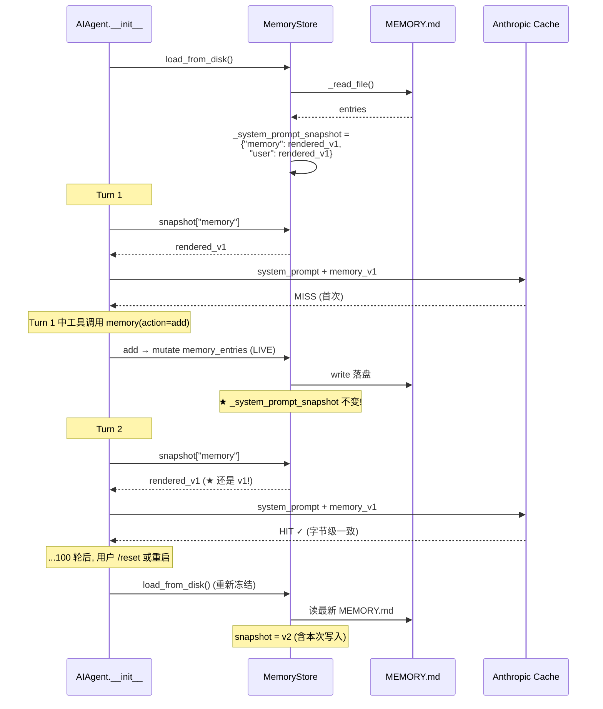
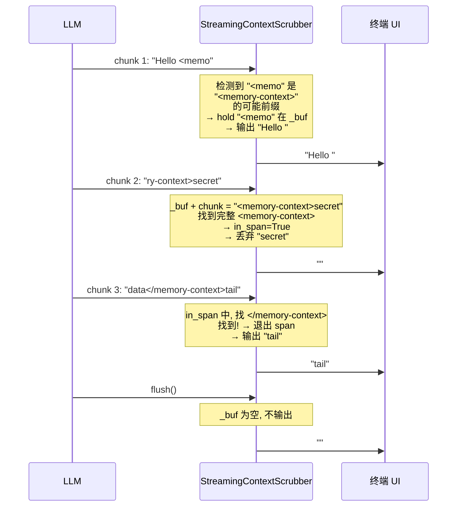
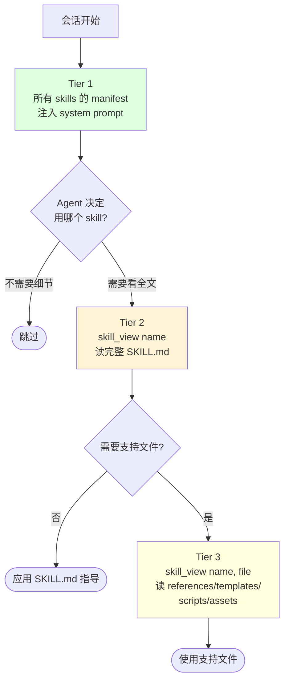
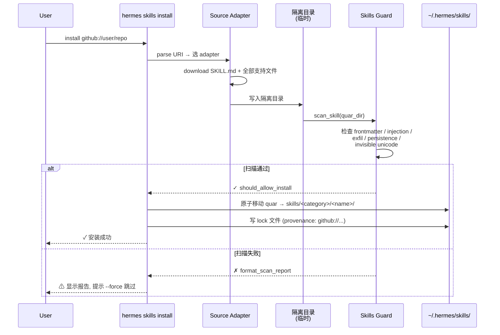
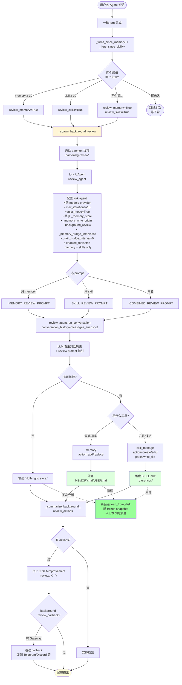
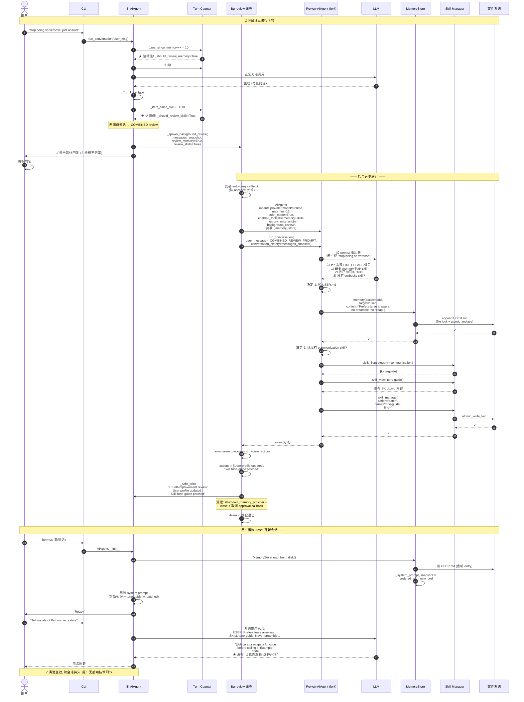

# Phase 4 技术方案：Memory & Learning — 自演进闭环 ★★★

> 本文件以**图形化方式**讲解 Hermes Agent **与一般 Agent 框架最大的差异点**——四种正交记忆 + Nudge 后台 review 飞轮。
>
> ★★★ **这是 Hermes 的真正护城河**——不靠 fine-tune 实现的"Agent 自演进"工程化路径。
>
> 所有引用的文件路径、行号、prompt 模板均已**逐项核对**仓库源码。

---

## 0. 本文件目录

- [1. L4 在系统中的位置 + 为什么是差异化护城河](#1-l4-在系统中的位置--为什么是差异化护城河)
- [2. 四种正交记忆全景](#2-四种正交记忆全景)
- [3. MemoryProvider ABC + MemoryManager 编排](#3-memoryprovider-abc--memorymanager-编排)
- [4. 内置 MemoryStore（MEMORY.md + USER.md）](#4-内置-memorystorememorymd--usermd)
- [5. Frozen Snapshot 模式（不打穿 KV cache 的关键）](#5-frozen-snapshot-模式不打穿-kv-cache-的关键)
- [6. `<memory-context>` 注入 + 流式 Scrubber](#6-memory-context-注入--流式-scrubber)
- [7. Skills 系统（agentskills.io 标准）](#7-skills-系统agentskillsio-标准)
- [8. Skills 三层渐进披露](#8-skills-三层渐进披露)
- [9. SKILL.md 完整生命周期](#9-skillmd-完整生命周期)
- [10. Skills Guard 注入扫描](#10-skills-guard-注入扫描)
- [11. Skills Hub 多源拉取](#11-skills-hub-多源拉取)
- [12. Honcho 辩证用户建模](#12-honcho-辩证用户建模)
- [13. ★ Nudge 后台 Review 飞轮 ★](#13--nudge-后台-review-飞轮-)
- [14. 后台 Review 工程细节](#14-后台-review-工程细节)
- [15. 三种 Review Prompt 深剖](#15-三种-review-prompt-深剖)
- [16. 记忆写入来源追踪（write_origin 元数据）](#16-记忆写入来源追踪write_origin-元数据)
- [17. 端到端示例：从用户偏好到跨会话生效](#17-端到端示例从用户偏好到跨会话生效)
- [18. 设计取舍总结表](#18-设计取舍总结表)
- [19. 高频 Q&A 储备](#19-高频-qa-储备)
- [20. 必背图 + 自检清单](#20-必背图--自检清单)
- [21. 关键代码地图](#21-关键代码地图)
- [22. 一句话总结 + 衔接 Phase 5](#22-一句话总结--衔接-phase-5)

---

## 1. L4 在系统中的位置 + 为什么是差异化护城河

### 1.1 跟其他 Agent 框架的本质差异

```
┌────────────────────────────────────────────────────────────────────┐
│                                                                    │
│  ★ 一般 Agent 框架的"演进"逻辑：                                     │
│  ─────                                                              │
│   ① 收集大量轨迹                                                     │
│   ② 用 SFT / RLHF / DPO 训练新模型                                  │
│   ③ 部署新模型                                                       │
│                                                                    │
│   特征:                                                              │
│   • 周期：以周/月为单位                                              │
│   • 成本：训练 + 部署 + 评估，几千美元起步                            │
│   • 颗粒：所有用户共享同一模型                                        │
│   • 可审计性：黑盒                                                    │
│                                                                    │
│  ─────────────────────────────────────────────                       │
│                                                                    │
│  ★ Hermes 的"演进"逻辑：                                             │
│  ─────                                                              │
│   ① 每 ~10 轮触发后台 review 线程 fork AIAgent                       │
│   ② review agent 看主对话 → 自动写 MEMORY.md / Skill                 │
│   ③ 下次会话自动 frozen snapshot 注入                                │
│                                                                    │
│   特征:                                                              │
│   • 周期：以"轮"为单位（实时演进！）                                  │
│   • 成本：一次 aux LLM 调用                                           │
│   • 颗粒：per-用户 / per-profile 独立                                 │
│   • 可审计性：纯文本文件，用户可读、可编辑、可 git diff               │
│                                                                    │
└────────────────────────────────────────────────────────────────────┘
```

### 1.2 L4 在整体架构中的位置

```
              ┌────────────────────────────────────────────┐
              │       L2  Agent Core (run_agent.py)         │
              │                                             │
              │   run_conversation 内部:                     │
              │   ① 系统提示组装时注入 MEMORY/USER snapshot │
              │   ② 每轮 prefetch_all 从 provider 拿 context │
              │   ③ 每轮 _turns_since_memory++              │
              │   ④ 工具执行后 sync_all                      │
              │   ⑤ 工具 iter 内 _iters_since_skill++       │
              │   ⑥ Turn 结束时检查阈值 → spawn 后台 review  │
              └────────────────┬───────────────────────────┘
                               │
       ┌───────────────────────┴───────────────────────┐
       ▼                                                 ▼
  ┌─────────────────────────────────┐  ┌────────────────────────────┐
  │  写入路径                         │  │  读出路径                   │
  │  ────                            │  │  ────                       │
  │                                  │  │                             │
  │  • memory_tool (内置)            │  │  • System prompt 注入        │
  │    MEMORY.md / USER.md           │  │    (frozen snapshot)         │
  │                                  │  │                             │
  │  • skill_manage (5 actions)       │  │  • prefetch_all → user msg  │
  │    SKILL.md + 支持文件            │  │    (per-turn ephemeral)     │
  │                                  │  │                             │
  │  • Honcho 5 tools                 │  │  • Skills tier 1 manifest    │
  │    profile/search/reasoning/      │  │    in system prompt          │
  │    context/conclude               │  │                             │
  │                                  │  │  • Skills tier 2/3 on-demand │
  │  • 后台 review fork ★            │  │    via skill_view tool       │
  └─────────────────────────────────┘  └────────────────────────────┘
              │                                         │
              └─────────────┬───────────────────────────┘
                            ▼
             ┌─────────────────────────────────────┐
             │       四种正交记忆载体                │
             │  ┌────────────────────────────────┐ │
             │  │ ① 陈述性 (MEMORY.md / USER.md) │ │
             │  │ ② 程序性 (~/.hermes/skills/)   │ │
             │  │ ③ 情景 (SQLite + FTS5, ←L5)    │ │
             │  │ ④ 用户模型 (Honcho 外部服务)   │ │
             │  └────────────────────────────────┘ │
             └─────────────────────────────────────┘
```

### 1.3 为什么这是真正的"护城河"

```
┌──────────────────────────────────────────────────────────────────┐
│                                                                  │
│  护城河 #1: 实时演进 vs 离线训练                                  │
│   "用户刚说'别长篇大论'，下一轮就生效。                            │
│    不用攒数据、不用训练、不用发版。"                                │
│                                                                  │
│  护城河 #2: 程序性记忆 (Skills) vs 仅陈述性                       │
│   "其他框架只能存'用户喜欢简洁回答'(陈述性)。                       │
│    Hermes 能存'写代码时遵循 X 风格 + Y 步骤'(程序性，可执行)。"    │
│                                                                  │
│  护城河 #3: 可审计的纯文本 vs 黑盒模型权重                         │
│   "用户能 cat ~/.hermes/memories/MEMORY.md 看 Agent 记了什么、     │
│    手动编辑、git diff 追踪、git revert 回滚。完全透明。"           │
│                                                                  │
│  护城河 #4: per-用户独立 vs 全用户共享                             │
│   "Profile = 一份独立的记忆 + 技能集。换用户名 = 换大脑，          │
│    不会被其他用户的偏好污染。"                                      │
│                                                                  │
│  护城河 #5: 跟 Anthropic Skills 标准对齐                          │
│   "agentskills.io 是开源标准，Hermes 既消费也贡献社区生态。        │
│    用户能从 Skills Hub 装别人写的 skill 立即用上。"                │
└──────────────────────────────────────────────────────────────────┘
```

---

## 2. 四种正交记忆全景

### 2.1 全景对比表

```
┌──────────────────┬──────────────────┬──────────────────┬──────────────────┬──────────────────┐
│ 维度             │ ① 陈述性          │ ② 程序性          │ ③ 情景            │ ④ 用户模型        │
│                  │ Declarative      │ Procedural       │ Episodic         │ User Model       │
├──────────────────┼──────────────────┼──────────────────┼──────────────────┼──────────────────┤
│ 存什么           │ 事实 / 偏好 /     │ "怎么做某类       │ 历史对话原文      │ 辩证人物画像      │
│                  │ 用户特征          │ 任务"的方法       │                  │                  │
├──────────────────┼──────────────────┼──────────────────┼──────────────────┼──────────────────┤
│ 载体             │ MEMORY.md         │ ~/.hermes/        │ SQLite + FTS5    │ Honcho 外部服务   │
│                  │ + USER.md         │ skills/           │ (Phase 3 已讲)   │                  │
│                  │ (本地文件)        │ (目录树)          │                  │                  │
├──────────────────┼──────────────────┼──────────────────┼──────────────────┼──────────────────┤
│ 字符上限         │ 2200 / 1375       │ 单 SKILL.md ~50K │ 无上限 (lineage  │ 后端管理          │
│ (默认)           │                  │ 支持文件不限      │  分裂处理)        │                  │
├──────────────────┼──────────────────┼──────────────────┼──────────────────┼──────────────────┤
│ 写入触发         │ Agent 主动调       │ Agent 主动调      │ 自动 (每轮)       │ Agent 主动调      │
│                  │ memory(action=    │ skill_manage     │                  │ honcho_*         │
│                  │  add/replace)    │ (5 actions)      │                  │                  │
├──────────────────┼──────────────────┼──────────────────┼──────────────────┼──────────────────┤
│ 读出方式         │ frozen snapshot   │ Tier 1: 列表注入  │ session_search   │ prefetch /        │
│                  │ 注入 system       │ system prompt    │ tool 主动查      │ reasoning /       │
│                  │ prompt           │ Tier 2/3: 工具调  │                  │ context tool      │
├──────────────────┼──────────────────┼──────────────────┼──────────────────┼──────────────────┤
│ 跨会话生效       │ ✓ 下次会话       │ ✓ 下次会话       │ ✓ 工具搜索回    │ ✓ Honcho 后端    │
│                  │ 自动             │ Tier 1 自动看到   │ 召回             │ 持久              │
├──────────────────┼──────────────────┼──────────────────┼──────────────────┼──────────────────┤
│ 可审计性         │ ★ 纯文本可看可改  │ ★ 目录可看可改    │ SQLite 可查询    │ 后端 dashboard   │
│                  │ git diff         │ git diff         │                  │                  │
├──────────────────┼──────────────────┼──────────────────┼──────────────────┼──────────────────┤
│ 删除/重置        │ memory(action=    │ skill_manage      │ /reset 命令      │ honcho 后端       │
│                  │ remove) /        │ (action=delete)  │ (新 session)     │ 操作              │
│                  │ 编辑文件         │                  │                  │                  │
├──────────────────┼──────────────────┼──────────────────┼──────────────────┼──────────────────┤
│ 范围             │ per-profile       │ per-profile +     │ per-profile      │ per-workspace +   │
│                  │ 独立             │ 共享 hub          │ (state.db)       │ per-peer 隔离    │
└──────────────────┴──────────────────┴──────────────────┴──────────────────┴──────────────────┘
```

### 2.2 四种记忆的"职责分工"图

```
                    ┌─────────────────────────────┐
                    │     一段对话发生              │
                    │     "用户教 Agent 怎么做事"   │
                    └────────────┬────────────────┘
                                 │
              ┌──────────────────┼──────────────────┐
              │                  │                  │
       【关于"做什么"】     【关于"怎么做"】     【关于"是谁"】
              │                  │                  │
              ▼                  ▼                  ▼
   ┌────────────────┐  ┌────────────────┐  ┌────────────────┐
   │ ① 陈述性记忆    │  │ ② 程序性记忆    │  │ ④ 用户模型      │
   │                │  │                │  │                │
   │ MEMORY.md:     │  │ SKILL.md +     │  │ Honcho:         │
   │ "项目用 pytest" │  │ references/    │  │ 综合 peer card  │
   │                │  │ "Python 测试    │  │ "User is a      │
   │ USER.md:       │  │  写法:          │  │  technical lead │
   │ "用户偏好简洁    │  │  1. fixture     │  │  who prefers    │
   │  回答"          │  │  2. parametrize │  │  iterative      │
   │                │  │  3. mocker..."  │  │  problem-       │
   │                │  │                │  │  solving."      │
   └────────────────┘  └────────────────┘  └────────────────┘
                                 │
                          (与此同时，自动)
                                 ▼
                       ┌────────────────────────┐
                       │ ③ 情景记忆              │
                       │                        │
                       │ SQLite messages 表:     │
                       │ "20250513_14:30, 用户   │
                       │  说: 'Python 测试用     │
                       │  pytest...'"           │
                       │                        │
                       │ 全量保留对话原文        │
                       │ 跨会话 FTS5 可搜       │
                       └────────────────────────┘
```

### 2.3 互补关系（不是替代）

```
┌──────────────────────────────────────────────────────────────┐
│  四种记忆是【正交互补】，不是 "选一个就够" 的关系:            │
│                                                              │
│   • 只有陈述性 → 不知道"怎么做"，每次重新摸索                  │
│   • 只有程序性 → 不知道"为谁做"，没有个性化                    │
│   • 只有情景  → 信息冗余，每次都要回看几百轮历史              │
│   • 只有用户模型 → 太抽象，没有具体可执行的内容               │
│                                                              │
│   ★ Hermes 把四者都用上，并由后台 review fork【自主分配】      │
│     合适的内容到合适的记忆载体——这才是飞轮的关键              │
└──────────────────────────────────────────────────────────────┘
```

---

## 3. MemoryProvider ABC + MemoryManager 编排

> Hermes 把记忆系统设计为**可插拔架构**——内置 builtin + 至多 1 个外部 provider。

### 3.1 MemoryProvider ABC（已核对 memory_provider.py 全文）

```
┌──────────────────────────────────────────────────────────────────┐
│  class MemoryProvider(ABC):                                       │
│  ─────                                                             │
│                                                                  │
│   ┌─ 必须实现 (abstract) ────────────────────────────┐            │
│   │  @property name                                  │            │
│   │  is_available() -> bool                          │            │
│   │  initialize(session_id, **kwargs)                │            │
│   │  get_tool_schemas() -> List[Dict]                │            │
│   └─────────────────────────────────────────────────┘            │
│                                                                  │
│   ┌─ 核心生命周期 (可空实现) ─────────────────────────┐           │
│   │  system_prompt_block() -> str                    │           │
│   │   ─► 静态信息 (instructions / status)            │           │
│   │  prefetch(query, *, session_id) -> str          │           │
│   │   ─► 每轮 LLM 调用前的 recall                    │           │
│   │  queue_prefetch(query, *, session_id)           │           │
│   │   ─► 排队下轮的 background prefetch              │           │
│   │  sync_turn(user, assistant, *, session_id)      │           │
│   │   ─► 每轮 turn 完成后写后端                       │           │
│   │  handle_tool_call(tool, args, **kw) -> str       │           │
│   │   ─► 工具调用派发                                  │           │
│   │  shutdown()                                      │           │
│   │   ─► 清退资源                                     │           │
│   └─────────────────────────────────────────────────┘            │
│                                                                  │
│   ┌─ 6 个可选 hooks (override 即启用) ───────────────┐           │
│   │  on_turn_start(turn, message, **kwargs)         │           │
│   │   ─► 计数 / 周期维护                              │           │
│   │  on_session_end(messages)                       │           │
│   │   ─► 会话结束抽取 (CLI 退出 / 网关超时)           │           │
│   │  on_session_switch(new_id, *, parent_id, reset)│           │
│   │   ─► /resume /branch /reset /new + 压缩分裂      │           │
│   │  on_pre_compress(messages) -> str               │           │
│   │   ─► 压缩前最后机会抽取                            │           │
│   │  on_memory_write(action, target, content, meta)│           │
│   │   ─► 镜像 builtin memory 写入到自家后端           │           │
│   │  on_delegation(task, result, *, child_session)  │           │
│   │   ─► 父 agent 观察子 agent 完成                  │           │
│   └─────────────────────────────────────────────────┘            │
└──────────────────────────────────────────────────────────────────┘
```

### 3.2 MemoryManager 编排器（已核对 memory_manager.py L190-555）

```mermaid
flowchart TB
    subgraph MM[MemoryManager]
        Reg[add_provider]
        Build[build_system_prompt]
        Pre[prefetch_all]
        Sync[sync_all]
        Tool[handle_tool_call]
        Hook[6 lifecycle hooks]
    end

    Reg -.插件入口.-> Check{is builtin?}
    Check -->|yes| Append1[加入头部]
    Check -->|no| ExtCheck{已有 external?}
    ExtCheck -->|yes ⚠️| Reject[拒绝<br/>警告日志]
    ExtCheck -->|no| Append2[加入<br/>_has_external=True]

    Append1 --> Index[索引工具名 →<br/>provider 路由表]
    Append2 --> Index

    Build --> Loop1[遍历 providers]
    Loop1 --> Block[provider.system_prompt_block]
    Block --> Concat[\n\n 拼接]

    Pre --> Loop2[遍历 providers]
    Loop2 --> Prefetch[provider.prefetch]
    Prefetch --> Concat2[\n\n 拼接<br/>跳过失败]

    Sync --> Loop3[遍历 providers]
    Loop3 --> SyncT[provider.sync_turn<br/>失败不阻塞]

    Tool --> Route[查 _tool_to_provider]
    Route --> Found{找到?}
    Found -->|是| Call[provider.handle_tool_call]
    Found -->|否| Err[返回 tool_error]

    style Reject fill:#fdd
    style Index fill:#dfd
```

### 3.3 "只能有一个外部 provider" 的设计

```
┌──────────────────────────────────────────────────────────────┐
│  为什么强制 ≤1 个外部 provider?                                │
│                                                              │
│  ① Tool schema 膨胀                                           │
│     每个 provider 暴露 3-5 个工具                              │
│     启用 8 个就是 24-40 个工具                                 │
│     ─► system prompt 里 tools manifest 暴涨                  │
│     ─► 模型选择哪个工具更难                                    │
│                                                              │
│  ② 冲突的记忆后端                                              │
│     同一份用户偏好被 Honcho 和 Mem0 同时写                     │
│     读取时两边返回不同版本                                      │
│     ─► 哪个对？谁覆盖谁？                                      │
│                                                              │
│  ③ 注入 user message 时的拼接冲突                              │
│     prefetch_all 拼 \n\n，多 provider 的 context              │
│     在结构上互相干扰                                            │
│                                                              │
│  ─►  Hermes 选择: builtin 永远开，外部至多一个                  │
│      靠 config.yaml 的 memory.provider 字段切换               │
└──────────────────────────────────────────────────────────────┘
```

---

## 4. 内置 MemoryStore（MEMORY.md + USER.md）

### 4.1 双文件设计（已核对 tools/memory_tool.py:107-126）

```
┌──────────────────────────────────────────────────────────────────┐
│  MEMORY.md  (默认 2200 字符上限)                                  │
│  ─────                                                             │
│   存放：Agent 自己的"工作笔记"                                      │
│   • 环境怪癖 ("Docker 在 macOS 上需要 colima")                     │
│   • 项目约定 ("此项目用 pytest -xvs")                              │
│   • 工具坑 ("find . 在 macOS 不识别 -printf")                      │
│   • 学到的方法 ("Python f-string 性能比 .format 快")              │
│                                                                  │
│  ─────────────────────────────────────────────                     │
│                                                                  │
│  USER.md  (默认 1375 字符上限)                                    │
│  ─────                                                             │
│   存放：Agent 对用户的画像                                          │
│   • 偏好 ("偏好简洁回答")                                          │
│   • 沟通风格 ("用中文，工程术语用英文")                              │
│   • 工作习惯 ("先列大纲再写代码")                                    │
│   • 期望 ("不要 emoji、不要市场化语言")                              │
│                                                                  │
│  ─────────────────────────────────────────────                     │
│                                                                  │
│  ★ 路径解析 (profile-scoped):                                      │
│     get_memory_dir() = get_hermes_home() / "memories"             │
│     ─► 切 profile 自动换路径，不串档                                │
└──────────────────────────────────────────────────────────────────┘
```

### 4.2 为什么字符上限那么小？

```
┌───────────────────────────────────────────────────────────────┐
│  MEMORY.md ~2200 chars ≈ 550 tokens                            │
│  USER.md   ~1375 chars ≈ 350 tokens                            │
│  ─────                                                          │
│                                                                │
│  设计意图:                                                       │
│   ① 记忆是【高度提炼】的，不是流水账                              │
│      • 强迫 Agent 把"重要的事"先想清楚再写                        │
│      • 自然抗膨胀 (Agent 写满了得自己 replace 或 remove 旧的)    │
│                                                                │
│   ② 注入 system prompt 的【边际成本】可控                       │
│      • 每轮 ~900 tokens 注入开销                                 │
│      • 对 200K context window 是 0.45%                          │
│      • Anthropic prefix cache 命中后边际成本 = 0                │
│                                                                │
│   ③ 满了不会爆，而是【拒绝写入 + 让 Agent 决定淘汰】              │
│      add 超限 → 返回错误，Agent 必须 replace 或 remove 旧 entry  │
│      ─► 强制保持"精华"                                          │
│                                                                │
│   ④ 用户人脑能扫得过来                                            │
│      cat ~/.hermes/memories/MEMORY.md 一屏看完                  │
│      ─► 可审计、可信任                                          │
└───────────────────────────────────────────────────────────────┘
```

### 4.3 Entry 结构 + § 分隔符

```
   MEMORY.md 文件实例:

   ┌───────────────────────────────────────────────────────┐
   │ Project: hermes-agent. Python 3.11+, uv as package    │
   │ manager (NOT poetry/pip directly).                    │
   │                                                       │
   │ §                                                     │
   │ Tests run via scripts/run_tests.sh — do NOT call      │
   │ pytest directly, it skips fixtures setup.             │
   │                                                       │
   │ §                                                     │
   │ The team mailing list mailmap is in .mailmap          │
   │ (5743 bytes). When attributing commits, check it      │
   │ first.                                                │
   │                                                       │
   │ §                                                     │
   │ Bug pattern: HERMES_HOME env var resolution caches    │
   │ at import-time — use get_hermes_home() not module-    │
   │ level constants.                                      │
   └───────────────────────────────────────────────────────┘
                       ▲                ▲
                       │                │
            ENTRY_DELIMITER       每条 entry 可多行
            = "\n§\n"
            (section sign)

   • § 是 ASCII art 友好 + 不会出现在正常文本里 + 视觉清晰
   • 一条 entry = 一个独立"知识点"
   • Agent replace/remove 时用【唯一短前缀】定位 entry
```

### 4.4 4 个 action 完整契约

```
┌──────────────────────────────────────────────────────────────────┐
│  memory tool 4 个 action:                                          │
│                                                                  │
│  ┌─ action='add' ─────────────────────────────────────────┐      │
│  │  • 追加新 entry 到末尾                                    │      │
│  │  • 先扫描 _scan_memory_content (10+ 注入模式)            │      │
│  │  • 检查字符上限 → 超限返回错误，提示 replace/remove       │      │
│  │  • 文件锁 (fcntl/msvcrt) + atomic_replace 写入            │      │
│  │  • on_memory_write hook 通知外部 provider                │      │
│  │  返回 {success, target, entries_count, chars_used,       │      │
│  │       char_limit, entry_preview}                          │      │
│  └─────────────────────────────────────────────────────────┘      │
│                                                                  │
│  ┌─ action='replace' ─────────────────────────────────────┐      │
│  │  • 用 old_text (短唯一子串) 定位 entry                   │      │
│  │  • 整条 entry 替换为 new_content                          │      │
│  │  • 0 或 >1 个 entry 匹配 → 返回错误                       │      │
│  │  • 也扫描注入                                             │      │
│  └─────────────────────────────────────────────────────────┘      │
│                                                                  │
│  ┌─ action='remove' ──────────────────────────────────────┐      │
│  │  • 用 old_text 定位 entry                                │      │
│  │  • 删除整条 entry                                         │      │
│  │  • 0 或 >1 匹配返回错误                                   │      │
│  └─────────────────────────────────────────────────────────┘      │
│                                                                  │
│  ┌─ action='read' ────────────────────────────────────────┐      │
│  │  • 返回当前 live state (不是 frozen snapshot!)            │      │
│  │  • 给 Agent 在同一 turn 内确认刚写的内容                   │      │
│  └─────────────────────────────────────────────────────────┘      │
└──────────────────────────────────────────────────────────────────┘
```

### 4.5 文件锁 + Atomic Replace（并发安全）

```
   多个 Hermes 进程 (Gateway 多用户 / CLI + Cron 并发) 写同一份
   MEMORY.md 时怎么不串档？
   ──────────────────────────────────────────────────────

   ┌────────────────────────────────────────────────────┐
   │  Read-Modify-Write 流程:                            │
   │                                                    │
   │  with _file_lock(memory_path):       ← 独占锁       │
   │      ① 重新 _read_file (拿最新)                    │
   │      ② 内存中修改 entries                          │
   │      ③ atomic_replace(memory_path, new_content)    │
   │         ─► 先写 tmp 文件，os.replace() 原子重命名   │
   │                                                    │
   │  锁文件: MEMORY.md.lock (独立, 不动主文件)          │
   │  ─► fcntl.flock (Unix) / msvcrt.locking (Windows)  │
   └────────────────────────────────────────────────────┘
```

---

## 5. Frozen Snapshot 模式（不打穿 KV cache 的关键）

> 这是整个 L4 最精妙的设计——**记忆中途改了，本会话不读新值**。

### 5.1 问题：每次写 MEMORY.md 都重建 system prompt 会怎样？

```
┌──────────────────────────────────────────────────────────────────┐
│  反例：实时读 MEMORY.md 注入 system prompt                          │
│                                                                  │
│  Turn 1: 读盘 MEMORY.md (空) → system_prompt_v1                    │
│           ─► Anthropic cache: MISS (第一次)                       │
│           ─► 写入新 entry                                          │
│                                                                  │
│  Turn 2: 读盘 MEMORY.md (1 entry) → system_prompt_v2 (内容变了)    │
│           ─► Anthropic cache: MISS! prefix 不一致了               │
│           ─► 又写一个 entry                                        │
│                                                                  │
│  Turn 3: 读盘 MEMORY.md (2 entries) → system_prompt_v3             │
│           ─► Anthropic cache: MISS!                                │
│                                                                  │
│  ─► 每轮 system_prompt 字节级不同 → cache 永不命中                │
│  ─► 每轮 200K tokens 全价输入 → 成本暴涨 4-10x                    │
└──────────────────────────────────────────────────────────────────┘
```

### 5.2 解法：Frozen Snapshot（核对 L107-142）



### 5.3 双状态：snapshot vs entries

```
┌──────────────────────────────────────────────────────────────────┐
│  MemoryStore 维护【两个并行状态】:                                  │
│                                                                  │
│  ┌─ _system_prompt_snapshot (frozen) ─────────────┐              │
│  │  类型: Dict[str, str]                            │              │
│  │  内容: 渲染后的 markdown block (可直接拼 prompt) │              │
│  │  生命周期: load_from_disk() 时设置, 全会话不变   │              │
│  │  用途: system prompt 注入                         │              │
│  │  目的: 保护 Anthropic prefix cache               │              │
│  └────────────────────────────────────────────────┘              │
│                                                                  │
│  ┌─ memory_entries / user_entries (live) ──────────┐             │
│  │  类型: List[str]                                  │             │
│  │  内容: 当前真实状态                                │             │
│  │  生命周期: 每次 add/replace/remove 立即更新       │             │
│  │  用途: 工具响应 + 落盘 + on_memory_write 通知    │             │
│  │  目的: 状态正确性 (用户 /read 看到最新)            │             │
│  └────────────────────────────────────────────────┘              │
│                                                                  │
│  ★ 关键不变量:                                                     │
│   • snapshot 写入 system prompt                                   │
│   • entries 落盘到 MEMORY.md                                       │
│   • 两者只在 load_from_disk() 时同步                              │
└──────────────────────────────────────────────────────────────────┘
```

---

## 6. `<memory-context>` 注入 + 流式 Scrubber

> 外部 provider (Honcho 等) 的 prefetch 结果**不进 system prompt**，进 user message。

### 6.1 prefetch 注入位置（与 Phase 1 § 5.2 呼应）

```
   ┌─────────────────────────────────────────────────────────────┐
   │  System prompt (frozen, cache-prefix 友好):                  │
   │  ┌────────────────────────────┐                              │
   │  │ stable block               │                              │
   │  │  • 系统级身份提示            │                              │
   │  │  • MEMORY.md snapshot   ★ 注入位置 ①                       │
   │  │  • USER.md snapshot     ★                                  │
   │  │  • Skills manifest (Tier 1) ★ 注入位置 ②                  │
   │  └────────────────────────────┘                              │
   │  ┌────────────────────────────┐                              │
   │  │ context / volatile blocks  │                              │
   │  └────────────────────────────┘                              │
   └─────────────────────────────────────────────────────────────┘

   ┌─────────────────────────────────────────────────────────────┐
   │  User message (per-turn, ephemeral, 不进 cache prefix):     │
   │                                                              │
   │  原 user 输入                                                 │
   │  +                                                           │
   │  <memory-context>                                            │
   │  [System note: The following is recalled memory context,    │
   │   NOT new user input. Treat as authoritative reference      │
   │   data...]                                                   │
   │                                                              │
   │  {Honcho prefetch 返回的 context}                            │
   │  </memory-context>                                           │
   │                                                              │
   │  ★ 注入位置 ③:                                                │
   │   • 包在 fenced tag 里防止 LLM 把它当用户新发言               │
   │   • System note 明示这是"召回数据"                            │
   └─────────────────────────────────────────────────────────────┘
```

### 6.2 三个注入位置的对比

```
┌────────────────────────┬──────────────────────┬─────────────────────┐
│ 位置                    │ 内容                  │ Cache 命中?          │
├────────────────────────┼──────────────────────┼─────────────────────┤
│ ① system - MEMORY/USER │ frozen snapshot       │ ✓ (1h prefix cache)  │
│                        │ + Skills Tier 1       │                     │
├────────────────────────┼──────────────────────┼─────────────────────┤
│ ② system - Skills      │ Tier 1 manifest       │ ✓ (1h prefix cache)  │
│                        │ (name + description) │                     │
├────────────────────────┼──────────────────────┼─────────────────────┤
│ ③ user msg - prefetch  │ Honcho 等动态 recall │ ✗ 每轮变化           │
│                        │ (per-turn ephemeral)  │ 不能进 cache prefix │
└────────────────────────┴──────────────────────┴─────────────────────┘
```

### 6.3 StreamingContextScrubber：跨 chunk 边界的 fence 保护

> Honcho 等 provider 的 LLM 调用如果 stream 输出可能 echo `<memory-context>` 标签，必须从用户可见输出里剥掉。但 streaming 时 tag 可能跨 chunk！



### 6.4 三道清洗防线

```
┌──────────────────────────────────────────────────────────────┐
│  防线 ①: sanitize_context (一次性正则)                          │
│  ─────                                                         │
│   • _INTERNAL_CONTEXT_RE: 去掉完整 <memory-context>...</...>   │
│   • _INTERNAL_NOTE_RE: 去掉 system note 文本                   │
│   • _FENCE_TAG_RE: 去掉孤儿 fence tag                          │
│   适用：非流式 (整段文本)                                       │
│                                                              │
│  防线 ②: StreamingContextScrubber (状态机)                    │
│  ─────                                                         │
│   • 跨 chunk 拼接 _buf                                         │
│   • in_span 标记 + 部分前缀检测                                 │
│   • flush() 时如仍 in_span → 丢弃 (不泄漏)                     │
│                                                              │
│  防线 ③: build_memory_context_block (写入端检查)               │
│  ─────                                                         │
│   • 如果 raw_context 已经含 fence tag → 警告 + 剥掉             │
│   • 防止 provider "双重包裹"                                    │
└──────────────────────────────────────────────────────────────┘
```

---

## 7. Skills 系统（agentskills.io 标准）

> Skills 是 Hermes 的**程序性记忆**——比"事实"更高级的"方法"。

### 7.1 Skill 目录结构

```
~/.hermes/skills/
├── coding/                          ← 类别 (category)
│   ├── python-testing/              ← skill 目录 (= name)
│   │   ├── SKILL.md                 ← ★ 必有，主指令
│   │   ├── references/              ← Tier 3: 详情
│   │   │   ├── pytest-fixtures.md
│   │   │   └── parametrize-patterns.md
│   │   ├── templates/               ← Tier 3: 可复制的初始文件
│   │   │   ├── conftest.py
│   │   │   └── test_template.py
│   │   ├── scripts/                 ← Tier 3: 可执行
│   │   │   └── run_tests.sh
│   │   └── assets/                  ← 其他辅助资源
│   │       └── pytest-cheatsheet.png
│   │
│   └── code-review/
│       └── SKILL.md
│
├── communication/
│   └── tone-guide/
│       └── SKILL.md
│
├── devops/
│   └── docker-debugging/
│       └── SKILL.md
│
└── openclaw-imports/                 ← OpenClaw 迁移过来的
    └── ...
```

### 7.2 SKILL.md YAML frontmatter 完整字段

```yaml
---
# 必填
name: python-testing                    # 唯一标识，匹配 /python-testing 命令
description: |                          # ≤1024 字符，模型读这个决定是否触发
  Best practices for writing Python tests with pytest:
  fixtures, parametrize, mocking, coverage.

# 可选元信息
version: 2.3.1
license: MIT
authors:
  - email: chauminhthach23@gmail.com

# 平台限制
platforms: [linux, macos]              # 不指定则全平台

# 前置条件（向后兼容字段）
prerequisites:
  env_vars:
    - PYTHONPATH                        # 缺则该 skill 显示 "needs setup"
    - PYTEST_CONFIG_PATH
  commands:                             # 命令是否存在 (which pytest)
    - pytest
    - coverage

# 设置向导
setup:
  collect_secrets:                      # 'hermes skills install' 时引导用户填
    - name: codecov_token
      env_var: CODECOV_TOKEN
      help: "Get your token at https://codecov.io"

# Hermes 特定元信息
metadata:
  hermes:
    tags: [python, testing, pytest]
    related_skills: [code-review, ci-cd]
    triggers:                           # 启发式触发词
      - "write test"
      - "pytest"
      - "unit test"
---

# Python Testing Best Practices

When the user asks to write tests for Python code, follow these steps:

## 1. Use pytest fixtures
...

## 2. Parametrize over fixtures
...

## Pitfalls
- Don't use `assert == True` — use `assert is True`
- ...

## Linked references
- See [pytest-fixtures.md](references/pytest-fixtures.md) for deep dive
- Template: [conftest.py](templates/conftest.py)
```

### 7.3 元数据三层之争（解决得很优雅）

```
   ┌──── 标准协议层 (agentskills.io) ────┐
   │  name / description / version /     │
   │  license / authors                  │ ← 跨工具通用
   └─────────────────────────────────────┘
                    │
                    ▼
   ┌──── 兼容性层 ─────────────────────┐
   │  platforms, prerequisites,        │ ← 兼容老格式
   │  setup.collect_secrets, ...       │
   └─────────────────────────────────────┘
                    │
                    ▼
   ┌──── Hermes 特有层 (metadata.hermes) ┐
   │  tags / related_skills / triggers   │ ← 仅 Hermes 用
   └─────────────────────────────────────┘

   ★ 关键: Hermes 自己的扩展放在 metadata.hermes 子键下
     不污染上游 agentskills.io 标准, 互操作性保留
```

---

## 8. Skills 三层渐进披露

> 灵感来自 Anthropic Claude Skills——**只在需要时加载更多细节**。

### 8.1 三层结构



### 8.2 Token 预算对比

```
┌────────────┬──────────────────────────┬────────────────────────────┐
│  Tier      │  内容                     │  Token 开销                  │
├────────────┼──────────────────────────┼────────────────────────────┤
│  Tier 1    │ name + description       │ ~50 tokens / skill           │
│  系统提示    │ + readiness 状态         │ 50 个 skill = ~2500 tokens   │
│            │                          │ ▸ 注入 system prompt          │
│            │                          │ ▸ 1h cache prefix 友好         │
├────────────┼──────────────────────────┼────────────────────────────┤
│  Tier 2    │ 完整 SKILL.md            │ ~1000-5000 tokens / skill    │
│  按需       │ + 引用文件列表            │ ▸ 注入到 tool 调用响应         │
│            │                          │ ▸ 仅当 Agent 真要用 skill     │
├────────────┼──────────────────────────┼────────────────────────────┤
│  Tier 3    │ 单个支持文件               │ 任意长度                      │
│  按需       │ (references/X.md)        │ ▸ 注入到 tool 调用响应         │
│            │                          │ ▸ 用户级别细节                 │
└────────────┴──────────────────────────┴────────────────────────────┘

   ★ 关键好处:
     • 50 个 skill 启用 → 系统提示只增 ~2500 tokens
     • 用户 5 个会话只用 2 个 skill → 只读 2 个全文
     • 没用到的 skills 永远不进 context
     • 类比: 文件系统的 ls vs cat
```

### 8.3 Tier 1 渲染示例（在 system prompt 里）

```
   ## Available Skills

   Use /skill-name slash command or skill_view tool to load full content.

   ┌─ coding ─┐
   • python-testing        — Best practices for writing Python tests
                             with pytest: fixtures, parametrize, mocking.
   • code-review           — Code review checklist & feedback patterns.
   • docker-debugging      — Debug failing Docker builds & runtime issues.

   ┌─ communication ─┐
   • tone-guide            — Plain language, no emoji, concise responses.

   ┌─ devops ─┐
   • k8s-troubleshooting   — Kubernetes pod / network / RBAC diagnostics.
     [⚠ needs setup: KUBECONFIG env var]

   ─────
   To use a skill: call skill_view(name)
                   or trigger with /<name> in chat
```

### 8.4 Readiness 状态机

```
   每个 skill 在 Tier 1 列表里都带 readiness:

   ┌─────────────┬─────────────────────────────────────┐
   │ 状态         │ 含义                                  │
   ├─────────────┼─────────────────────────────────────┤
   │ ready       │ 所有 prerequisites 通过               │
   ├─────────────┼─────────────────────────────────────┤
   │ needs setup │ 缺 env var / command / secret        │
   │             │ Tier 1 描述里加 [⚠ needs X]          │
   │             │ Agent 看到会先提示用户配置             │
   ├─────────────┼─────────────────────────────────────┤
   │ disabled    │ 用户 config 显式禁用                  │
   │             │ Tier 1 不列出                         │
   ├─────────────┼─────────────────────────────────────┤
   │ platform    │ platforms 字段不匹配                  │
   │ mismatch    │ Tier 1 不列出 (Linux only 在 Mac 上) │
   └─────────────┴─────────────────────────────────────┘
```

---

## 9. SKILL.md 完整生命周期

> 5 个 skill_manage action 完整覆盖增删改查。

### 9.1 5 个 action 全貌

```mermaid
flowchart LR
    Start[skill_manage] --> Action{action?}

    Action -->|create| Create[新建 skill 目录<br/>+ SKILL.md]
    Action -->|edit| Edit[整文件覆盖<br/>SKILL.md]
    Action -->|patch| Patch[find/replace<br/>局部修改]
    Action -->|write_file| WriteF[添加 references/<br/>templates/scripts/<br/>assets 下文件]
    Action -->|delete| Delete[删整个 skill 目录]

    Create --> Guard{security<br/>scan?<br/>(可配)}
    Edit --> Guard
    Patch --> Guard
    WriteF --> Guard
    Guard -->|fail| Reject[拒绝]
    Guard -->|pass| Pinned{pinned?}
    Pinned -->|yes ⚠️| Reject2[拒绝<br/>pinned skill 受保护]
    Pinned -->|no| Atomic[atomic_write_text]
    Atomic --> Success([成功])
    Delete --> Pinned

    style Reject fill:#fdd
    style Reject2 fill:#fdd
    style Success fill:#9f9
```

### 9.2 5 个 action 适用场景

```
┌──────────────┬───────────────────────────────────────────────────┐
│  action       │  适用场景                                          │
├──────────────┼───────────────────────────────────────────────────┤
│  create       │ 全新 class-level umbrella skill                    │
│              │ "在 ~/.hermes/skills/{category}/{name}/SKILL.md     │
│              │  创建完整新 skill"                                  │
│              │ ★ 触发条件：现有 skill 都不覆盖此 class               │
├──────────────┼───────────────────────────────────────────────────┤
│  edit         │ 全量覆盖现有 SKILL.md                              │
│              │ "拿现在 SKILL.md 整文件改写"                         │
│              │ 用于：结构性重写                                    │
├──────────────┼───────────────────────────────────────────────────┤
│  patch        │ find/replace 局部修改                              │
│              │ "把 SKILL.md 里 'use pytest' 改成 'use pytest -xvs'" │
│              │ 用于：小修小补 (大多数 review fork 走这条)            │
├──────────────┼───────────────────────────────────────────────────┤
│  write_file   │ 添加 references/X.md / templates/X / scripts/X      │
│              │ file_path 必须以 references/, templates/,            │
│              │ scripts/, assets/ 开头                              │
│              │ 用于：积累 Tier 3 详情                              │
├──────────────┼───────────────────────────────────────────────────┤
│  delete       │ 整个删除 skill 目录                                 │
│              │ 用于：废弃过时的、合并到 umbrella                    │
└──────────────┴───────────────────────────────────────────────────┘
```

### 9.3 patch action 工作机制

```
   skill_manage(
     action='patch',
     name='python-testing',
     file_path='SKILL.md',         # 或 references/X.md
     find='## Pitfalls\n- old item',
     replace='## Pitfalls\n- old item\n- new item from this session'
   )

   ① _validate_name / _validate_category / _validate_file_path
   ② _find_skill(name) → 定位 skill_dir
   ③ _resolve_skill_target(skill_dir, file_path) → 绝对路径
      (验证 file_path 不能逃出 skill_dir，防 path traversal)
   ④ 读取目标文件
   ⑤ find 字符串必须【唯一出现】
      • 0 次 → 报错 "find not found"
      • >1 次 → 报错 "find not unique, narrow the context"
   ⑥ 替换 + _validate_content_size
   ⑦ atomic_write_text

   ★ 设计意图: 失败比静默错误覆盖更好
```

### 9.4 write_file 的路径约束

```
┌──────────────────────────────────────────────────────────┐
│  _validate_file_path 规则:                                │
│                                                          │
│   合法前缀:                                                │
│     • references/   (Tier 3 详情文档)                    │
│     • templates/    (可复制的初始文件)                    │
│     • scripts/      (可执行脚本)                          │
│     • assets/       (静态资源)                            │
│                                                          │
│   非法:                                                    │
│     ❌ SKILL.md      (要改主指令必须用 edit/patch)         │
│     ❌ ../          (path traversal)                      │
│     ❌ /absolute    (绝对路径)                            │
│     ❌ .hidden       (隐藏文件，避免污染)                  │
│                                                          │
│  设计意图: 强迫 Agent 用结构化的目录组织 Tier 3 内容        │
└──────────────────────────────────────────────────────────┘
```

### 9.5 Pinned Skill 保护

```
   某些 skill 被标记为 pinned（用户配置 + builtin skill）

   skill_manage 对 pinned skill:
   ─────
   • patch / write_file → 允许 (可以扩展)
   • edit → 拒绝 (整文件覆盖太危险)
   • delete → 拒绝 (用户珍贵 skill 不可删)

   ★ 既保护用户珍贵 skill 不被乱改，
     又允许 Agent 在已有结构里【添砖加瓦】
```

---

## 10. Skills Guard 注入扫描

> 防止恶意 / 注入内容污染 skill。

### 10.1 三种触发场景

```
┌──────────────────────────────────────────────────────────────┐
│  ① Skills Hub 安装时（默认开）                                │
│     • 从 GitHub / Clawhub / Lobehub 下载                      │
│     • 落盘前过 scan_skill                                     │
│     • 拦截 prompt injection / 危险命令                         │
│                                                              │
│  ② Agent 自己 skill_manage 时（默认关，可配）                  │
│     • skills.guard_agent_created = true 启用                  │
│     • 防止恶意用户引导 Agent 写危险 skill                       │
│                                                              │
│  ③ 用户手动 hermes skills install 时                          │
│     • 同 ① 路径                                               │
└──────────────────────────────────────────────────────────────┘
```

### 10.2 扫描内容

```
   scan_skill 检查:

   ┌──────────────────────────────────────────────┐
   │  ① Frontmatter 完整性                          │
   │     必须有 name + description                  │
   │     name ≤ 64 字符, description ≤ 1024 字符    │
   │                                              │
   │  ② Prompt Injection 模式                      │
   │     与 memory_tool 的 10+ 模式相同             │
   │     "ignore previous instructions", 等等       │
   │                                              │
   │  ③ Exfiltration 命令                          │
   │     curl ... $TOKEN                          │
   │     wget ... $SECRET                         │
   │     cat .env / .netrc / 等                    │
   │                                              │
   │  ④ Persistence 后门                            │
   │     authorized_keys                          │
   │     ~/.ssh/...                               │
   │     ~/.bashrc 修改                            │
   │                                              │
   │  ⑤ 不可见 Unicode 字符                         │
   │     U+200B-200D (零宽空格), U+202A-202E       │
   │     (方向覆盖) 等隐写攻击载体                  │
   │                                              │
   │  ⑥ format_scan_report                         │
   │     失败时输出可读报告给用户决定               │
   └──────────────────────────────────────────────┘
```

---

## 11. Skills Hub 多源拉取

### 11.1 4 个 Source Adapter

```
┌──────────────────────────────────────────────────────────────┐
│  hermes_cli/skills_hub.py (1594 行)                           │
│                                                              │
│  ┌─ Source 1: GitHub ──────────────────────────────┐         │
│  │  hermes skills install github://owner/repo[/path]│         │
│  │  GET https://raw.githubusercontent.com/...      │         │
│  └─────────────────────────────────────────────────┘         │
│                                                              │
│  ┌─ Source 2: Clawhub (OpenClaw 生态) ──────────────┐         │
│  │  hermes skills install clawhub://name           │         │
│  │  GET https://clawhub.ai/api/skills/...          │         │
│  └─────────────────────────────────────────────────┘         │
│                                                              │
│  ┌─ Source 3: Lobehub ──────────────────────────────┐         │
│  │  hermes skills install lobehub://identifier     │         │
│  └─────────────────────────────────────────────────┘         │
│                                                              │
│  ┌─ Source 4: Claude Marketplace ───────────────────┐         │
│  │  hermes skills install claude://...             │         │
│  └─────────────────────────────────────────────────┘         │
└──────────────────────────────────────────────────────────────┘
```

### 11.2 安装流程



### 11.3 Provenance 追踪

```
┌──────────────────────────────────────────────────────────────┐
│  每个 hub 安装的 skill 都带 .provenance.json:                 │
│                                                              │
│   {                                                          │
│     "source": "github://user/repo/python-testing",          │
│     "installed_at": "2026-05-13T09:30:15Z",                 │
│     "checksum_sha256": "abc123...",                          │
│     "scan_result": "passed",                                 │
│     "scan_version": "1.2.3",                                 │
│     "user_modifications": false                             │
│   }                                                          │
│                                                              │
│  跟 skill_provenance.py 配合:                                 │
│   • user-created vs agent-created vs hub-installed 区分      │
│   • 用户 audit 时知道每个 skill 来源                          │
│   • update 命令能识别 hub skill 拉取更新                       │
└──────────────────────────────────────────────────────────────┘
```

---

## 12. Honcho 辩证用户建模

> 唯一一个**外部用户模型**示例 provider，作为参考实现。

### 12.1 5 个 Honcho 工具

```
┌───────────────────┬────────────────────────────────────────────┐
│  工具              │  作用 / 成本                                │
├───────────────────┼────────────────────────────────────────────┤
│  honcho_profile    │ 读/更新 peer card (用户的核心事实清单)      │
│                   │ 廉价：纯增删改                              │
├───────────────────┼────────────────────────────────────────────┤
│  honcho_search    │ 语义搜索 Honcho 存的关于该 peer 的信息       │
│                   │ 廉价：embedding 检索                        │
│                   │ 返回相关 raw 片段                           │
├───────────────────┼────────────────────────────────────────────┤
│  honcho_reasoning │ 辩证 LLM Q&A — 让 Honcho 自家 LLM 综合       │
│                   │ peer 的所有观察回答                          │
│                   │ ★ 昂贵：含一次 LLM 调用                       │
│                   │ reasoning_level: minimal / low / medium /    │
│                   │                  high / max (5 档)          │
├───────────────────┼────────────────────────────────────────────┤
│  honcho_context   │ 拉取完整 session context                    │
│                   │ • peer card                                │
│                   │ • 最近消息                                  │
│                   │ • peer representation                       │
│                   │ 中等开销：无 LLM 合成                       │
├───────────────────┼────────────────────────────────────────────┤
│  honcho_conclude  │ 写入"持久结论"到 peer profile               │
│                   │ ★ 长期累积"对该用户的判断"                  │
└───────────────────┴────────────────────────────────────────────┘
```

### 12.2 "辩证" 是什么意思

```
┌────────────────────────────────────────────────────────────────┐
│  传统 Memory 系统:                                              │
│  ─────                                                          │
│   每个事实独立存                                                │
│   读取时拼回 prompt                                             │
│   矛盾事实并存 (没人发现)                                       │
│                                                                │
│  Honcho 辩证模型:                                                │
│  ─────                                                          │
│   peer 的所有观察进"bank"                                      │
│   Honcho 后端 LLM 周期性"反思":                                  │
│    • 哪些观察互相矛盾?                                          │
│    • 哪些是临时偏好 vs 长期偏好?                                │
│    • 怎么综合成一致的画像?                                       │
│                                                                │
│   结论写到 peer card + dialectic representation                │
│                                                                │
│   ★ 用 honcho_reasoning 查 "用户最近态度有变化吗?"               │
│     Honcho 能识别"上周说 X, 这周说 Y, 倾向后者"                  │
└────────────────────────────────────────────────────────────────┘
```

### 12.3 reasoning_level 5 档

```
┌─────────────┬─────────────────────────────────────┬──────────────┐
│  level       │  深度                                │  成本         │
├─────────────┼─────────────────────────────────────┼──────────────┤
│  minimal     │ 直接返回 peer card                   │ ★             │
├─────────────┼─────────────────────────────────────┼──────────────┤
│  low (默认)  │ 简单合成 1-2 个观察                  │ ★★            │
├─────────────┼─────────────────────────────────────┼──────────────┤
│  medium      │ 综合 5-10 个观察 + 简单辩证          │ ★★★           │
├─────────────┼─────────────────────────────────────┼──────────────┤
│  high        │ 多轮辩证 + 跨时间分析                │ ★★★★          │
├─────────────┼─────────────────────────────────────┼──────────────┤
│  max         │ 完整人格建模                          │ ★★★★★ (≈1c)   │
└─────────────┴─────────────────────────────────────┴──────────────┘
```

### 12.4 Peer 别名机制

```
   工具调用 peer 参数:
   ─────────
   • 'user' (默认) → 当前对话的用户
   • 'ai' → Agent 自己 (是的，Honcho 也建模 AI 自己)
   • 显式 peer_id → workspace 内任意 peer

   多 peer 例子 (小组讨论):
   ─────────
   honcho_reasoning(
     peer='alice',
     query='What's her stance on dark mode?',
     reasoning_level='medium'
   )
   
   ─► Honcho 给出"基于 Alice 历史观察的综合判断"
```

---

## 13. ★ Nudge 后台 Review 飞轮 ★

> **这是 Hermes 整个差异化的核心**。

### 13.1 飞轮全景图



### 13.2 两个计数器的差别

```
┌──────────────────────────────────────────────────────────────────┐
│  _turns_since_memory  vs  _iters_since_skill                      │
│  ─────                                                             │
│                                                                  │
│  _turns_since_memory:                                            │
│   • 计 user turn 次数 (用户每发一次消息 +1)                       │
│   • run_conversation 入口处 ++ (L11817)                          │
│   • 达到 _memory_nudge_interval (10) 触发                        │
│   • memory 工具被调用时归零 (L10592)                              │
│                                                                  │
│  _iters_since_skill:                                              │
│   • 计 tool-call iteration 次数 (Turn Loop 内每轮 +1)             │
│   • Turn Loop 内 ++ (L12097)                                      │
│   • 达到 _skill_nudge_interval (10) 触发                         │
│   • skill_manage 工具被调用时归零 (L10594)                        │
│                                                                  │
│  为什么不同?                                                       │
│   • Memory 是关于"用户和对话"——按 user 发言粒度计算合理            │
│   • Skill 是关于"工作技巧"——按 iter 粒度计算更准 (一个复杂        │
│     任务可能内含 20 个工具 iter, 那 iter 多的更值得 review)        │
└──────────────────────────────────────────────────────────────────┘
```

### 13.3 计数器重置规则

```
┌──────────────────────────────────────────────────────────────┐
│  ① 阈值触发后立即归零 (L11820, L15423)                          │
│     review 已经 spawn 了，等下一轮再积累                        │
│                                                              │
│  ② 工具实际调用时归零                                            │
│     • memory tool 被调用 → _turns_since_memory = 0             │
│       (Agent 主动写了内存，不需要 review 提醒)                  │
│     • skill_manage 被调用 → _iters_since_skill = 0             │
│       (Agent 主动改了 skill，同样)                              │
│                                                              │
│  ③ Gateway 冷启时 hydrate (L11774)                            │
│     • Gateway 每条消息建新 AIAgent → 计数器从 0 起               │
│     • 从历史 messages 反推用户已发了多少轮                     │
│     • 设 _turns_since_memory = prior_user_turns % interval     │
│     • ─► 保留原始 1-in-N cadence, 不会一接管就立即触发           │
└──────────────────────────────────────────────────────────────┘
```

---

## 14. 后台 Review 工程细节

### 14.1 线程隔离 + 工具受限

```
┌──────────────────────────────────────────────────────────────────┐
│  review_agent 的隔离设计:                                          │
│                                                                  │
│  ① 独立 daemon 线程 (name="bg-review")                            │
│     • daemon=True → 主进程退出时自动 kill                          │
│     • 不阻塞主对话循环                                             │
│                                                                  │
│  ② enabled_toolsets=["memory", "skills"]                          │
│     • review 只能用 memory / skill_manage / skills_list /         │
│       skill_view / session_search                                 │
│     • 不能 terminal / write_file / browser / code_execution       │
│     • 防止 review 误执行危险操作                                    │
│                                                                  │
│  ③ max_iterations=16                                              │
│     • 比主 Agent (90) 少得多                                       │
│     • review 任务简单, 不需要长循环                                 │
│                                                                  │
│  ④ quiet_mode=True + redirect_stdout/stderr                       │
│     • 静默运行, 不污染主对话输出                                    │
│     • 用 contextlib.redirect_stdout(devnull)                      │
│     • review_agent.suppress_status_output = True                  │
│       (防 status_callback 绕过 stdout)                             │
│                                                                  │
│  ⑤ 共享 _memory_store                                              │
│     • review_agent._memory_store = self._memory_store              │
│     • ★ 写入立即对主 Agent 可见 (但需下次 session 才 frozen)      │
│                                                                  │
│  ⑥ 嵌套 nudge 禁用                                                │
│     • review_agent._memory_nudge_interval = 0                     │
│     • review_agent._skill_nudge_interval = 0                      │
│     • 防止 review 内又触发 review (无限递归)                       │
└──────────────────────────────────────────────────────────────────┘
```

### 14.2 Approval 死锁防护

```
   危险：review_agent 想跑危险命令时怎么办？
   ─────

   主 AIAgent 的 approval_callback 通常是 input() 等 TUI 用户输入
   ─► review_agent 跑在另一个线程
   ─► 调 input() 阻塞，main TUI 也阻塞
   ─► 双向死锁！

   解法：在 review 线程入口安装自动拒绝 callback
   ┌──────────────────────────────────────────────────┐
   │  def _bg_review_auto_deny(command, desc, **kw):  │
   │      logger.warning(                              │
   │          "Background review auto-denied: %s",     │
   │          command                                  │
   │      )                                            │
   │      return "deny"                                │
   │                                                  │
   │  _set_approval_callback(_bg_review_auto_deny)    │
   └──────────────────────────────────────────────────┘

   ─► review_agent 如果意外想跑危险命令直接被拒
   ─► 同样的 pattern 也用在 subagent (delegate_tool.py)
   ─► 见 #15216
```

### 14.3 凭证继承（_current_main_runtime）

```
   review_agent 用什么 LLM provider/key?
   ─────

   反例: AIAgent.__init__ 默认从 env var / config 重新解析
   • OAuth-only provider (Nous) 没 env var, 解析失败
   • Credential pool 多 key 场景, 直接 env var 取 K1 但主 Agent 在用 K3
   • 会出现 "No LLM provider configured" warning

   解法: 继承父 Agent 的 live runtime
   ┌──────────────────────────────────────────────────────┐
   │  _parent_runtime = self._current_main_runtime()       │
   │                                                      │
   │  review_agent = AIAgent(                              │
   │      model=self.model,                                │
   │      provider=self.provider,                          │
   │      api_mode=_parent_runtime.get("api_mode"),        │
   │      base_url=_parent_runtime.get("base_url"),        │
   │      api_key=_parent_runtime.get("api_key"),          │
   │      credential_pool=self._credential_pool,           │
   │      parent_session_id=self.session_id,               │
   │  )                                                    │
   └──────────────────────────────────────────────────────┘
```

### 14.4 资源清理

```
   review 完成后必须清理什么？
   ─────

   try:
       review_agent.run_conversation(...)
   finally:
       if review_agent is not None:
           ① review_agent.shutdown_memory_provider()
              ─► 外部 provider (Hindsight) 持有 aiohttp session
              ─► 不显式 stop 会 leak 直到 GC
           ② review_agent.close()
              ─► httpx client / 子进程 等
              ─► 不关 GC 时尝试 in 死掉的 event loop, 报错
           ③ _set_approval_callback(None)
              ─► 线程复用时不要带着旧 callback
```

### 14.5 Action 摘要回显

```
   review 结束后, 主 Agent 怎么知道 review 干了什么？
   ─────

   _summarize_background_review_actions(
     review_messages,      # review_agent._session_messages
     prior_snapshot         # 传入 review 时的 messages_snapshot
   )

   算法:
   ① 遍历 review_messages 找 role="tool" + 成功标记
   ② 跳过 prior_snapshot 里已有的 (tool_call_id 匹配)
      ─► 防止把"主对话历史里的旧工具结果" 误算成 review 的功劳
      ─► (#14944 修复)
   ③ 收集成功 actions:
      • "Memory updated"
      • "Skill 'python-testing' patched"
      • "Skill 'docker-debugging' created"
      • "User profile updated"
   ④ dedup, " · " 拼接

   显示:
   ┌──────────────────────────────────────────────────┐
   │  💾 Self-improvement review: Skill updated ·      │
   │     User profile updated                         │
   └──────────────────────────────────────────────────┘

   Gateway 平台通过 background_review_callback 转发
```

---

## 15. 三种 Review Prompt 深剖

### 15.1 _MEMORY_REVIEW_PROMPT 全文（核对 L3988-3997）

```
   "Review the conversation above and consider saving to memory if
    appropriate.

    Focus on:
    1. Has the user revealed things about themselves — their persona,
       desires, preferences, or personal details worth remembering?
    2. Has the user expressed expectations about how you should
       behave, their work style, or ways they want you to operate?

    If something stands out, save it using the memory tool.
    If nothing is worth saving, just say 'Nothing to save.' and stop."
```

```
   工程意图:
   ─────
   ① 简短 (10 行 prompt)，触发成本低
   ② 两个明确焦点：用户【是谁】+【期望怎样】
   ③ 给"Nothing to save"出口，避免硬塞内容
   ④ 用 memory 工具 → 内置 path，不调外部 provider
```

### 15.2 _SKILL_REVIEW_PROMPT 全文（核对 L3999-4093，~80 行）

> 这个 prompt 是整个飞轮的 brainpower 核心。我把它逐段拆解：

```
   ┌─ 段 1: ACTIVE 基调 ─────────────────────────────┐
   │                                                  │
   │  "Be ACTIVE — most sessions produce at least    │
   │   one skill update, even if small. A pass that  │
   │   does nothing is a missed learning             │
   │   opportunity, not a neutral outcome."          │
   │                                                  │
   │  ★ 对抗模型默认惰性 ("Nothing to save"           │
   │     的 path of least resistance)                 │
   │  ★ 把"什么也没做"重新框定为"missed opportunity"   │
   │                                                  │
   └────────────────────────────────────────────────┘
```

```
   ┌─ 段 2: Target Shape 形状目标 ────────────────────┐
   │                                                  │
   │  "Target shape: CLASS-LEVEL skills with rich     │
   │   SKILL.md and a `references/` directory.       │
   │   Not a long flat list of narrow one-session-   │
   │   one-skill entries."                            │
   │                                                  │
   │  ★ 反对"每会话一个新 skill"——会膨胀难管           │
   │  ★ 鼓励 umbrella skill (高抽象 class-level)       │
   │  ★ 细节放 references/                            │
   └────────────────────────────────────────────────┘
```

```
   ┌─ 段 3: Signal 触发信号 (4 类) ───────────────────┐
   │                                                  │
   │  ① 用户纠正 style / tone / format / verbosity    │
   │    ★ "stop doing X", "I hate when you Y",        │
   │      "just give me the answer"                   │
   │    ★ 把 frustration 升级为【first-class】信号    │
   │      (不只是 memory 信号)                         │
   │                                                  │
   │  ② 用户纠正 workflow / sequence                 │
   │    → 编码为 skill 的 pitfall 或 explicit step    │
   │                                                  │
   │  ③ 出现 non-trivial 技巧/修复/debugging path     │
   │    → 捕获到 skill                                │
   │                                                  │
   │  ④ 已加载的 skill 被发现错/缺/过时               │
   │    → PATCH NOW                                  │
   └────────────────────────────────────────────────┘
```

```
   ┌─ 段 4: 4 步偏好顺序 ─────────────────────────────┐
   │                                                  │
   │  优先级 (越前越优先):                              │
   │                                                  │
   │  1. UPDATE A CURRENTLY-LOADED SKILL              │
   │     看本会话用了哪些 skill, patch 那个            │
   │     "在场的就是该改的"                              │
   │                                                  │
   │  2. UPDATE AN EXISTING UMBRELLA                  │
   │     skills_list + skill_view 找现有 class-level   │
   │     patch 它                                     │
   │                                                  │
   │  3. ADD A SUPPORT FILE                          │
   │     write_file references/<topic>.md            │
   │     write_file templates/<name>.<ext>            │
   │     write_file scripts/<name>.<ext>              │
   │     SKILL.md 加一行 pointer                      │
   │                                                  │
   │  4. CREATE A NEW CLASS-LEVEL UMBRELLA            │
   │     仅当现有都不覆盖                              │
   │     name MUST 是 class-level                     │
   │     不能是 PR 号/错误码/codename/                 │
   │     "fix-X / debug-Y / audit-Z-today"            │
   │     session 工件                                  │
   │                                                  │
   │  ★ 这个偏好顺序是飞轮【避免熵增】的关键             │
   └────────────────────────────────────────────────┘
```

```
   ┌─ 段 5: User-preference Embedding ────────────────┐
   │                                                  │
   │  "When user expressed style/format/workflow      │
   │   preference, update belongs in the SKILL.md     │
   │   BODY, not just in memory.                      │
   │                                                  │
   │   Memory: 'who the user is and current state'    │
   │   Skills: 'how to do this class of task for     │
   │            this user'"                           │
   │                                                  │
   │  ★ 明确两种记忆的语义分工                          │
   │  ★ 强调 skill 才是"教 Agent 怎么做"               │
   └────────────────────────────────────────────────┘
```

```
   ┌─ 段 6: Do NOT capture (反面清单) ────────────────┐
   │                                                  │
   │  ① 环境依赖失败 (missing binary, fresh-install   │
   │     errors, 'command not found') — 用户能修       │
   │                                                  │
   │  ② 工具/特性负面声明 ("browser tools do not      │
   │     work", "X is broken") — 后果会自我反咬       │
   │                                                  │
   │  ③ Session-specific transient errors that        │
   │     resolved — 教训是【重试模式】, 不是原失败     │
   │                                                  │
   │  ④ 一次性任务叙事 ("summarize today's market")  │
   │     — 不是一类工作                                 │
   │                                                  │
   │  ★ 这清单防止 skill 库累积【自缚陷阱】              │
   │     (后来环境修复了, skill 还在说"工具坏的")        │
   └────────────────────────────────────────────────┘
```

```
   ┌─ 段 7: 结尾 ─────────────────────────────────────┐
   │                                                  │
   │  "'Nothing to save.' is a real option but        │
   │   should NOT be the default. If the session ran  │
   │   smoothly with no corrections and produced no   │
   │   new technique, just say it and stop.           │
   │   Otherwise, act."                               │
   │                                                  │
   │  ★ 给 escape hatch 但不让它成为默认                │
   │  ★ 给积极 bias 但承认负样本                       │
   └────────────────────────────────────────────────┘
```

### 15.3 _COMBINED_REVIEW_PROMPT

```
   当 memory 和 skill 阈值同时达到时用这个

   合并 _MEMORY + _SKILL 两个 prompt 的核心要点:
   • 既要写 memory 又要更新 skill
   • Memory: who the user is
   • Skills: how to do this class of task for this user
   • Both should carry user-preference lessons when relevant

   ★ 一次 fork agent 完成两件事, 减少线程开销
```

### 15.4 三个 prompt 的设计哲学对比

```
┌────────────────┬─────────────────────┬───────────────────────┐
│  Prompt         │  长度                │  哲学                  │
├────────────────┼─────────────────────┼───────────────────────┤
│  MEMORY         │  ~10 行              │  简单, 让 Nothing      │
│                 │                     │  to save 容易          │
├────────────────┼─────────────────────┼───────────────────────┤
│  SKILL          │  ~80 行              │  ACTIVE 基调 + 4 步偏好│
│                 │                     │  + 反面清单, 全力对抗   │
│                 │                     │  模型惰性 + 防止熵增    │
├────────────────┼─────────────────────┼───────────────────────┤
│  COMBINED       │  ~70 行              │  两者协作 + 强调分工    │
└────────────────┴─────────────────────┴───────────────────────┘

  ★ 设计选择背后:
   • 一个简单 memory review = 让 review 别白来 (cheap path)
   • 一个深度 skill review = 真正驱动演进 (high-leverage path)
   • COMBINED = 二合一节省开销
```

---

## 16. 记忆写入来源追踪（write_origin 元数据）

### 16.1 来源分类

```
┌──────────────────────────────────────────────────────────────┐
│  _memory_write_origin (per-AIAgent, ContextVar 也支持):       │
│                                                              │
│   • "assistant_tool" (默认)                                   │
│     前台 Agent 在对话中主动调 memory 工具                       │
│                                                              │
│   • "background_review"                                       │
│     后台 review fork 写入                                      │
│                                                              │
│   • 其他自定义 origin (plugin 可设)                            │
└──────────────────────────────────────────────────────────────┘

┌──────────────────────────────────────────────────────────────┐
│  _memory_write_context (per-AIAgent):                         │
│                                                              │
│   • "foreground" (默认)                                       │
│   • "background_review"                                       │
│   • "subagent"                                                │
│   • "cron"                                                    │
└──────────────────────────────────────────────────────────────┘
```

### 16.2 metadata 流转

```
   ┌──────────────────────────────────────────────────────────┐
   │  内置 memory tool 写入时:                                  │
   │                                                          │
   │  ① MemoryStore.add() 落盘 MEMORY.md                      │
   │                                                          │
   │  ② Agent 调用 memory_manager.on_memory_write(             │
   │       action='add',                                       │
   │       target='memory',                                    │
   │       content=...,                                        │
   │       metadata=self._build_memory_write_metadata(...)    │
   │     )                                                    │
   │                                                          │
   │  ③ MemoryManager 遍历外部 providers:                       │
   │     • 跳过 builtin (它是源)                                │
   │     • 对外部 provider 调 on_memory_write(...,              │
   │                                          metadata=...)    │
   │                                                          │
   │  metadata 内容:                                            │
   │  ┌─────────────────────────────────────────────┐         │
   │  │  write_origin: "assistant_tool" |           │         │
   │  │                "background_review"          │         │
   │  │  execution_context: "foreground" |          │         │
   │  │                     "background_review"     │         │
   │  │  session_id: "20250513_1430_abc123"         │         │
   │  │  parent_session_id: "..."                   │         │
   │  │  platform: "cli" | "telegram" | ...         │         │
   │  │  tool_name: "memory"                         │         │
   │  │  task_id: "uuid..."  (可选)                  │         │
   │  │  tool_call_id: "..." (可选)                  │         │
   │  └─────────────────────────────────────────────┘         │
   └──────────────────────────────────────────────────────────┘
```

### 16.3 Provider on_memory_write 的 3 种签名兼容

```
   不同版本 / 不同插件的 on_memory_write 签名不一:

   ① keyword: on_memory_write(action, target, content, *, metadata=None)
      ─► 新插件标准

   ② positional: on_memory_write(action, target, content, metadata)
      ─► 4 个位置参数

   ③ legacy: on_memory_write(action, target, content)
      ─► 老插件, 没有 metadata

   MemoryManager._provider_memory_write_metadata_mode 用 inspect.signature
   自动识别:
   ┌──────────────────────────────────────────────────────┐
   │  • 有 **kwargs → keyword                              │
   │  • signature 有 "metadata" 形参 → keyword             │
   │  • 4+ positional/keyword 形参 → positional            │
   │  • 否则 → legacy (跳过 metadata)                       │
   └──────────────────────────────────────────────────────┘

   ★ 这样新老插件都能在 metadata 不丢失的情况下兼容运行
```

---

## 17. 端到端示例：从用户偏好到跨会话生效

> 完整闭环演示——用户随口一句话，3 轮后下一个会话就生效。



### 17.1 这个例子里的关键工程点

```
   ① 主线程不阻塞 (T1-T5)
      用户看到回答的时间没受 review 影响

   ② review fork 看完整 messages_snapshot (T9)
      不只是本轮, 而是从会话开始的所有 messages
      ★ Review 能识别"用户在第几轮第几次说类似的话"

   ③ 优先 patch 现有 skill (T15-T17)
      按 _SKILL_REVIEW_PROMPT 偏好顺序
      ★ 没有创建新 "stop-being-verbose-skill"

   ④ 同时写 USER.md 和 patch skill (T11-T17)
      _COMBINED prompt 引导:
      • Memory: who the user is ("prefers terse")
      • Skills: how to do this class of task

   ⑤ 元数据全程跟随 (T13)
      _memory_write_origin='background_review' →
      落到 metadata 给外部 provider → 用户能 audit

   ⑥ Cleanup 完整 (T22)
      防 aiohttp / event loop / callback 残留

   ⑦ 下次会话自动生效 (T24-T30)
      load_from_disk → frozen snapshot → 注入 system prompt
      ★ 用户感受到的是"Agent 自己变好了", 完全无感知
```

---

## 18. 设计取舍总结表

| # | 设计选择 | 替代方案 | 为什么 Hermes 这样选 |
|---|---|---|---|
| 1 | **四种正交记忆并存** | 单一记忆 | 不同抽象层级 (事实 / 方法 / 历史 / 画像) 互补 |
| 2 | **builtin 永远开，外部 ≤1** | 多 provider 并存 | tool schema 膨胀；冲突的后端 |
| 3 | **MEMORY.md 2200 chars 上限** | 无上限 | 强迫提炼；抗膨胀；用户能扫一眼 |
| 4 | **Frozen Snapshot 模式** | 实时读盘 | 保护 Anthropic prompt cache prefix |
| 5 | **§ 分隔符 + 多行 entry** | 一行一 entry | 复杂事实需要多行表达 |
| 6 | **文件锁 + atomic_replace** | 直接覆盖 | 多进程并发安全 (Gateway / Cron) |
| 7 | **memory 写前 _scan_memory_content** | 信任内容 | 注入到 system prompt 必须严格 |
| 8 | **Skills 三层渐进披露** | 全 load | Tier 1 manifest 仅 ~2500 tokens for 50 skills |
| 9 | **Skill umbrella + references/** | 扁平 skill 列表 | 防 skill 膨胀；class-level 抽象 |
| 10 | **patch action 要求 find 唯一** | 模糊匹配 | 静默错改比报错更危险 |
| 11 | **write_file 路径前缀强约束** | 自由路径 | 防 path traversal；强制结构化目录 |
| 12 | **Skills Guard 默认不扫描 agent-created** | 默认扫描 | 误报会卡住 review 飞轮；用户可启用 |
| 13 | **Honcho 5 工具 + reasoning_level 5 档** | 单一接口 | 成本-质量谱；廉价信息+昂贵推理分离 |
| 14 | **Nudge interval = 10 (默认)** | 5 或 20 | 太频繁 = 烧钱；太稀 = 没用；10 是经验值 |
| 15 | **两个独立计数器 (turn vs iter)** | 单计数 | memory 关心用户发言节奏；skill 关心任务深度 |
| 16 | **bg-review fork 而非内联** | 同步 review | 主对话不卡 + 工具受限 + 资源隔离 |
| 17 | **review fork max_iter=16** | =90 (主 Agent) | review 任务简单；上限防失控 |
| 18 | **共享 _memory_store 直接写** | 写后通知主 Agent | 简化设计；主 Agent 下次 reload 自然看到 |
| 19 | **auto-deny approval callback** | 让 fork 弹用户确认 | 跨线程 input() 死锁 (#15216) |
| 20 | **继承 _current_main_runtime** | 重新解析 env | OAuth-only / credential pool 场景下解析会失败 |
| 21 | **嵌套 nudge 禁用** | 允许递归 review | 无限递归崩溃保护 |
| 22 | **_summarize 跳 prior_snapshot** | 全部 review tool calls | 防止主对话历史里的 tool 结果被误算 (#14944) |
| 23 | **on_memory_write 3 种签名兼容** | 强制单签名 | 老插件不修改即可继续工作 |
| 24 | **action 摘要回显给用户** | 静默 review | 让用户感知 "Agent 在变好"，建立信任 |
| 25 | **\<memory-context> fence + StreamingScrubber** | 普通拼接 | 防止 provider 输出 echo 时泄漏到用户 |

---

## 19. 高频 Q&A 储备

```
┌────────────────────────────────────────────────────────────────────┐
│ Q: Hermes 的"自我演进"具体是怎么发生的？                            │
│ A: 每 ~10 轮触发后台 review 线程 fork AIAgent。Fork agent 看主对话  │
│    历史 + 一个引导 prompt，决定写什么到 MEMORY.md / USER.md /        │
│    SKILL.md。下次新会话 load_from_disk 时自动注入 frozen snapshot。  │
│    没有 fine-tune，全靠纯文本文件累积。                              │
├────────────────────────────────────────────────────────────────────┤
│ Q: 为什么需要 frozen snapshot 模式？                                │
│ A: 保护 Anthropic prompt cache prefix。中途写盘但本会话不重读，      │
│    保证 system prompt 字节级一致，cache 100% 命中。下次新会话才       │
│    重新冻结新内容。                                                  │
├────────────────────────────────────────────────────────────────────┤
│ Q: Memory vs Skill 有什么区别？                                     │
│ A: 关键差别:                                                        │
│    • Memory: 描述【是什么】(declarative) — 用户偏好、项目事实        │
│    • Skill: 描述【怎么做】(procedural) — 一类任务的方法              │
│    边界例子:                                                        │
│      "用户偏好简洁回答" → USER.md (memory)                          │
│      "如何用 pytest 写测试" → SKILL.md (skill)                       │
│    Hermes 强调 user-preference 也要进 skill body，不只是 memory     │
│    (因为 skill 才是"教 Agent 怎么做")                                │
├────────────────────────────────────────────────────────────────────┤
│ Q: Nudge 每 10 轮触发会不会很烧钱？                                  │
│ A: 不会, 因为 review fork 用 max_iter=16 + aux 模型选项，单次       │
│    成本 ~1-3 美分。10 轮主对话已经几十美分了，3% 开销换"持久演进"     │
│    很划算。                                                          │
│    可关：                                                            │
│      hermes config set memory.nudge_interval 0                      │
│      hermes config set skills.creation_nudge_interval 0             │
├────────────────────────────────────────────────────────────────────┤
│ Q: 后台 review 怎么不撞主对话？                                      │
│ A: 多重隔离:                                                        │
│    ① daemon 线程 (主进程退出自动 kill)                              │
│    ② quiet_mode + redirect_stdout/stderr                            │
│    ③ enabled_toolsets 限制只能 memory + skills                       │
│    ④ max_iter=16 上限                                                │
│    ⑤ auto-deny approval (防 input() 死锁)                           │
│    ⑥ _memory_nudge_interval=0 防嵌套                                │
│    ⑦ 主线程不等 review，不阻塞用户                                   │
├────────────────────────────────────────────────────────────────────┤
│ Q: Skills 跟 MCP / Tools 是什么关系？                               │
│ A: 完全不同层:                                                       │
│    • Tools (Phase 5): 函数级别能力 (read_file, terminal, ...)       │
│    • Skills: 任务方法集合, 可引用工具 + 文档 + 模板                  │
│    一个 skill 文档教 Agent "怎么用现有工具做某类任务"                │
│    Skills 不是新工具，是关于现有工具的"使用手册"                     │
├────────────────────────────────────────────────────────────────────┤
│ Q: Skills Hub 安全吗？我装的别人写的 skill 会不会有恶意？             │
│ A: 三层防护:                                                        │
│    ① 下载后落到隔离目录 (不立即 active)                              │
│    ② Skills Guard 扫描 (frontmatter / injection / exfil /          │
│       persistence / invisible unicode)                              │
│    ③ 用户可看 scan_report 决定是否安装                              │
│    Agent-created skills 默认不扫 (skills.guard_agent_created=false) │
│    但可启用                                                         │
├────────────────────────────────────────────────────────────────────┤
│ Q: 我手动改了 MEMORY.md 会发生什么？                                │
│ A: 完全 OK！                                                        │
│    • 本会话不会立即看到 (frozen snapshot)                            │
│    • 下次新会话 load_from_disk 自动看到                              │
│    • 编辑必须保留 § 分隔符 (\n§\n)                                  │
│    • 每个 entry 字符总数不超 2200/1375                              │
│    Hermes 鼓励用户手动 audit / 修正记忆                              │
├────────────────────────────────────────────────────────────────────┤
│ Q: Honcho 跟内置 USER.md 是不是重复？                                │
│ A: 互补，不重复:                                                     │
│    • USER.md: 简短陈述, ~1375 chars 上限, 注入 system prompt        │
│    • Honcho: 完整对话历史 + 辩证综合, 按需查询                       │
│    使用模式:                                                         │
│      • 短偏好快速注入 → USER.md                                      │
│      • 深度查询"这用户对 X 的态度变化"→ honcho_reasoning            │
│    两者通过 on_memory_write hook 自动同步                            │
├────────────────────────────────────────────────────────────────────┤
│ Q: 后台 review 会不会写错？怎么防误改？                              │
│ A: 多层防护:                                                        │
│    ① write_origin='background_review' 元数据可审计                  │
│    ② Skill patch action 要求 find 子串唯一                          │
│    ③ Pinned skill 不能被 edit/delete                                │
│    ④ Skills Guard 可启用 (默认关防误报)                              │
│    ⑤ 所有写入都落到纯文本文件, 用户能 git diff / git revert        │
│    ⑥ "Self-improvement review: X · Y" 主动通知用户                  │
│    + 极端场景: hermes config set memory.nudge_interval 0 关掉      │
└────────────────────────────────────────────────────────────────────┘
```

---

## 20. 必背图 + 自检清单

### 20.1 Phase 4 必背的 6 张图

```
   ╔═══════════════════════════════════════════════════════════════╗
   ║                                                               ║
   ║   📊 图 ①：四种正交记忆全景对比                                  ║
   ║      ──────                                                    ║
   ║      陈述性 / 程序性 / 情景 / 用户模型                            ║
   ║      载体 / 上限 / 触发 / 读出方式                                ║
   ║      (§ 2.1)                                                  ║
   ║                                                               ║
   ║   📊 图 ②：Frozen Snapshot 双状态                              ║
   ║      ──────                                                    ║
   ║      _system_prompt_snapshot (冻结)                            ║
   ║      vs memory_entries (live)                                  ║
   ║      为什么保 cache prefix                                       ║
   ║      (§ 5)                                                    ║
   ║                                                               ║
   ║   📊 图 ③：Skills 三层渐进披露                                  ║
   ║      ──────                                                    ║
   ║      Tier 1 (manifest in system prompt)                       ║
   ║      Tier 2 (skill_view full SKILL.md)                        ║
   ║      Tier 3 (skill_view + file_path)                          ║
   ║      Token 预算对比                                              ║
   ║      (§ 8)                                                    ║
   ║                                                               ║
   ║   📊 图 ④：★ Nudge 后台 Review 飞轮全景 ★                     ║
   ║      ──────                                                    ║
   ║      计数 → 阈值 → fork → review → 落盘 →                     ║
   ║      下次会话 frozen snapshot                                    ║
   ║      (§ 13.1)                                                 ║
   ║                                                               ║
   ║   📊 图 ⑤：后台 Review 6 层隔离                                ║
   ║      ──────                                                    ║
   ║      daemon 线程 / 静默 / 工具受限 / 迭代上限 /                  ║
   ║      auto-deny / 嵌套禁用                                       ║
   ║      (§ 14.1)                                                 ║
   ║                                                               ║
   ║   📊 图 ⑥：端到端 "stop being verbose" → 跨会话生效            ║
   ║      ──────                                                    ║
   ║      30 步完整 sequence diagram                                  ║
   ║      含元数据流转 + 落盘 + 下次会话自动注入                       ║
   ║      (§ 17)                                                   ║
   ║                                                               ║
   ╚═══════════════════════════════════════════════════════════════╝
```

### 20.2 Phase 4 自检清单

> 进入 Phase 5 前必过的能力检测。

- [ ] 能在白板画出四种正交记忆的对比表
- [ ] 能解释 Frozen Snapshot 模式以及它怎么保 Anthropic cache prefix
- [ ] 能说出 MEMORY.md / USER.md 的字符上限及其设计意图
- [ ] 能描述 MemoryStore.add 的完整 read-modify-write 流程（含文件锁）
- [ ] 能解释 \<memory-context\> fence + StreamingContextScrubber 的工程必要性
- [ ] 能画出 Skills 三层渐进披露的 Token 预算账
- [ ] 能列出 SKILL.md frontmatter 的核心字段（agentskills.io 标准）
- [ ] 能说出 skill_manage 5 种 action 及其适用场景
- [ ] 能解释 write_file 路径前缀约束的安全考量
- [ ] 能描述 Skills Guard 扫描的 6 类内容
- [ ] 能说出 Honcho 5 工具及其成本梯度
- [ ] 能解释 reasoning_level 5 档的含义
- [ ] 能背出 Nudge 触发条件（两个计数器 + 两个阈值）
- [ ] 能解释为什么 turn 和 iter 用两个独立计数器
- [ ] 能画出后台 review 飞轮完整流程
- [ ] 能列出 bg-review 的 6 层隔离机制
- [ ] 能解释 auto-deny callback 防止什么问题（线程死锁）
- [ ] 能讲清 _SKILL_REVIEW_PROMPT 的 7 段结构
- [ ] 能说出 4 步偏好顺序（patch loaded > update umbrella > add file > create new）
- [ ] 能解释 write_origin 元数据的 3 种签名兼容
- [ ] 能完整讲述端到端示例（用户说 verbose → 跨会话生效）

---

## 21. 关键代码地图

```
┌──────────────────────────────────────────────────────────────────────┐
│  Phase 4 关键文件 (按规模)                                              │
├──────────────────────────────────────────────────────────────────────┤
│                                                                      │
│  hermes_cli/skills_hub.py        1594  ─ Skills Hub 多源拉取          │
│  tools/skills_tool.py            1533  ─ skills_list / skill_view     │
│  plugins/memory/honcho/__init__  1328  ─ Honcho 5 工具                │
│  tools/skill_manager_tool.py      931  ─ skill_manage 5 actions       │
│  tools/memory_tool.py             586  ─ MemoryStore + memory 工具    │
│  agent/memory_manager.py          555  ─ MemoryManager 编排器         │
│  agent/skill_commands.py          501  ─ /skill-name 斜杠命令解析     │
│  agent/skill_utils.py             511  ─ 工具函数                     │
│  agent/memory_provider.py         279  ─ MemoryProvider ABC          │
│  agent/skill_preprocessing.py     131  ─ Skill 模板变量替换           │
│                                                                      │
│  ─── run_agent.py 中相关代码定位 ───                                  │
│  L1191  background_review_callback (gateway 用)                       │
│  L1915  _memory_nudge_interval = 10                                   │
│  L1916  _turns_since_memory = 0                                       │
│  L1917  _iters_since_skill = 0                                        │
│  L1923  从 config 读 memory.nudge_interval                            │
│  L2022  _skill_nudge_interval = 10                                    │
│  L2025  从 config 读 skills.creation_nudge_interval                   │
│  L3988  _MEMORY_REVIEW_PROMPT (10 行)                                 │
│  L3999  _SKILL_REVIEW_PROMPT (80 行)                                  │
│  L4095  _COMBINED_REVIEW_PROMPT (70 行)                               │
│  L4172  _summarize_background_review_actions                          │
│  L4234  _spawn_background_review (140 行)                             │
│  L4378  _build_memory_write_metadata                                  │
│  L10592 memory 工具调用时归零 _turns_since_memory                     │
│  L10594 skill_manage 工具调用时归零 _iters_since_skill               │
│  L11774 Gateway hydrate (从历史 hydrate counter)                      │
│  L11813 _should_review_memory 阈值检查                                │
│  L12095 _iters_since_skill++ 在 Turn Loop 内                          │
│  L15418 _should_review_skills 阈值检查 (turn 结束后)                  │
│                                                                      │
│  ─── tools/memory_tool.py 内部 ───                                    │
│  L55    get_memory_dir (profile-scoped 路径)                          │
│  L59    ENTRY_DELIMITER = "\n§\n"                                    │
│  L67    _MEMORY_THREAT_PATTERNS (10+ 注入模式)                       │
│  L92    _scan_memory_content                                          │
│  L107   class MemoryStore                                             │
│  L118   memory_char_limit=2200, user_char_limit=1375                  │
│  L126   load_from_disk + _system_prompt_snapshot 冻结                 │
│  L144   _file_lock context manager (fcntl/msvcrt)                     │
│  L224   add                                                           │
│  L269   replace                                                       │
│  L327   remove                                                        │
│                                                                      │
│  ─── tools/skill_manager_tool.py 内部 ───                             │
│  L59    _guard_agent_created_enabled                                  │
│  L137   _pinned_guard                                                 │
│  L178   _validate_name (≤64 chars)                                    │
│  L217   _validate_frontmatter                                         │
│  L256   _validate_content_size                                        │
│  L298   _validate_file_path (4 个合法前缀)                            │
│  L337   _atomic_write_text                                            │
│  L373   _create_skill                                                 │
│  L430   _edit_skill                                                   │
│  L463   _patch_skill                                                  │
│  L557   _delete_skill                                                 │
│  L614   _write_file                                                   │
│                                                                      │
│  ─── plugins/memory/ 8 个外部 provider ───                            │
│  honcho/        ─ 辩证用户建模 ★                                       │
│  hindsight/     ─ Cross-session memory                                │
│  mem0/          ─ Mem0 SaaS                                            │
│  retaindb/      ─ RetainDB                                             │
│  supermemory/   ─ SuperMemory.ai                                       │
│  openviking/    ─ OpenViking                                           │
│  holographic/   ─ Holographic Memory                                   │
│  byterover/     ─ ByteRover                                            │
└──────────────────────────────────────────────────────────────────────┘
```

---

## 22. 一句话总结 + 衔接 Phase 5

### 22.1 Phase 4 一句话总结

```
╔══════════════════════════════════════════════════════════════════════╗
║                                                                      ║
║   Phase 4 的本质：                                                    ║
║                                                                      ║
║   "如何让一个 Agent 不靠 fine-tune、不靠用户主动配置，                ║
║    在每次对话中自动【越用越懂你】？"                                  ║
║                                                                      ║
║   答案是 5 个工程化的子系统协同:                                       ║
║                                                                      ║
║   ① 【四种正交记忆载体】                                              ║
║      陈述性 (MEMORY.md/USER.md) + 程序性 (Skills) +                   ║
║      情景 (SQLite FTS5) + 用户模型 (Honcho)                          ║
║      ─► 给不同抽象层级的信息找到合适存储                                ║
║                                                                      ║
║   ② 【Frozen Snapshot 模式】                                          ║
║      系统提示用冻结副本注入, 中途写盘不重读                             ║
║      ─► 保 Anthropic prompt cache prefix 100% 命中                    ║
║                                                                      ║
║   ③ 【Skills 三层渐进披露】                                            ║
║      Tier 1 manifest 进系统提示 (50 skill ~2500 tokens)               ║
║      Tier 2 SKILL.md 按需 view                                         ║
║      Tier 3 references/templates/scripts 按需读                       ║
║      ─► 大量技能不爆 token                                             ║
║                                                                      ║
║   ④ 【后台 Review 飞轮】 ★★★                                          ║
║      每 ~10 轮 fork 一个轻量 AIAgent 看主对话                           ║
║      用结构化 prompt 引导它写 MEMORY/Skill                              ║
║      6 层隔离 + auto-deny + 主线程不阻塞                                ║
║      ─► 不靠 fine-tune 的【实时演进】路径                              ║
║                                                                      ║
║   ⑤ 【写入来源元数据 + 兼容签名】                                     ║
║      write_origin / execution_context 全程跟随                         ║
║      MemoryProvider.on_memory_write 3 种签名自动适配                   ║
║      ─► 可审计 + 老插件无缝兼容                                        ║
║                                                                      ║
║   ──── 这是【LLM 应用工程化】的【自演进】范式答案 ────                ║
║                                                                      ║
║         没有这一层, Hermes 跟一般 Agent 框架没本质区别。              ║
║         有了这一层, Agent 跨会话越用越懂你, 完全用户透明。            ║
║                                                                      ║
╚══════════════════════════════════════════════════════════════════════╝
```

### 22.2 衔接 Phase 5 预告

Phase 1-4 已经讲清了 Agent 的【内核】部分——主循环、模型对接、状态持久、自演进。下一站讲【外延】——Agent 用什么"手脚"实际干活。

```
┌──────────────────────────────────────────────────────────────┐
│  Phase 5 (Capability Layer) 要回答的问题：                     │
│                                                              │
│  • Tool Registry 模块级自注册协议是怎么工作的                  │
│  • 50+ 工具按 toolset 怎么组织                                │
│  • check_fn 30s TTL 缓存的设计权衡                            │
│  • Tool dispatch 完整路径 (coerce → pre-hook →                │
│    registry.dispatch → async bridge → result)                │
│  • _run_async 的 4 种调用上下文处理                            │
│  • Subagent 委派的隔离协议（与本 Phase § 14 review fork 对比）│
│  • Toolset Distributions 概率采样 (RL batch 用)              │
│  • MCP Server (mcp_serve.py) 双角色: 既是 server 又能是 client│
│  • Permission Gate 三层 (check_fn / pre-hook / allowlist)    │
└──────────────────────────────────────────────────────────────┘
```

---

*文档生成时间：基于 Hermes Agent v0.13.0 主分支快照。*
*所有行号均已逐行核对。后续版本演进时行号可能漂移，但模块定位保持稳定。*
*Phase 4 完。下一站：[Phase 5 — Capability Layer](./PHASE_5_CAPABILITY.md)*
