# Phase 5 技术方案：Capability Layer — 工具系统

> 本文件以**图形化方式**讲解 Hermes Agent 的"能力层"——Agent 用什么"手脚"实际干活：50+ 工具的注册、调度、组合、隔离与外部集成。
>
> 所有引用的文件路径、行号、常量名均已**逐项核对**仓库源码。

---

## 0. 本文件目录

- [1. L3 在系统中的位置](#1-l3-在系统中的位置)
- [2. ToolRegistry 中心化注册](#2-toolregistry-中心化注册)
- [3. ToolEntry 数据结构](#3-toolentry-数据结构)
- [4. 模块级自注册协议](#4-模块级自注册协议)
- [5. 工具自动发现（AST 扫描 + import）](#5-工具自动发现ast-扫描--import)
- [6. check_fn 30 秒 TTL 缓存](#6-check_fn-30-秒-ttl-缓存)
- [7. 工具调度全链路 dispatch](#7-工具调度全链路-dispatch)
- [8. _run_async 4 种调用上下文](#8-_run_async-4-种调用上下文)
- [9. Toolsets — 命名工具组合](#9-toolsets--命名工具组合)
- [10. _HERMES_CORE_TOOLS 50+ 核心工具](#10-_hermes_core_tools-50-核心工具)
- [11. Toolset Distributions（RL Batch 概率采样）](#11-toolset-distributionsrl-batch-概率采样)
- [12. Subagent 委派架构](#12-subagent-委派架构)
- [13. DELEGATE_BLOCKED_TOOLS 黑名单](#13-delegate_blocked_tools-黑名单)
- [14. Spawn 深度 + 并发限制](#14-spawn-深度--并发限制)
- [15. Subagent vs Background Review 对比](#15-subagent-vs-background-review-对比)
- [16. Permission Gate 三层防护](#16-permission-gate-三层防护)
- [17. Hardline + Dangerous 命令检测](#17-hardline--dangerous-命令检测)
- [18. MCP 双角色：Server vs Client](#18-mcp-双角色server-vs-client)
- [19. MCP 动态工具发现](#19-mcp-动态工具发现)
- [20. 端到端示例：用户请求 → 工具执行](#20-端到端示例用户请求--工具执行)
- [21. 设计取舍总结表](#21-设计取舍总结表)
- [22. 高频 Q&A 储备](#22-高频-qa-储备)
- [23. 必背图 + 自检清单](#23-必背图--自检清单)
- [24. 关键代码地图](#24-关键代码地图)
- [25. 一句话总结 + 衔接 Phase 6](#25-一句话总结--衔接-phase-6)

---

## 1. L3 在系统中的位置

> Phase 5 解决：**Agent 看到什么工具、怎么挑、怎么调、怎么隔离、怎么扩展**。

```
              ┌────────────────────────────────────────────┐
              │       L2  Agent Core (run_agent.py)         │
              │                                             │
              │   run_conversation 内部:                     │
              │   ① 拼 system prompt 时拉 tool schemas       │
              │   ② LLM 回包 tool_calls 后派发到工具          │
              │   ③ 并发/串行执行 (Phase 1 §10)              │
              │   ④ 结果接回 messages                          │
              └────────────────┬───────────────────────────┘
                               │ 调用 L3 的 4 个子系统
                               ▼
   ╔════════════════════════════════════════════════════════════╗
   ║              L3  Capability Layer                            ║
   ║                                                              ║
   ║  ┌──────────────────────┐    ┌──────────────────────────┐   ║
   ║  │ ① Registry           │    │ ② Toolsets               │   ║
   ║  │   tools/registry.py  │    │   toolsets.py (855)      │   ║
   ║  │   (563 行)            │    │   toolset_distributions  │   ║
   ║  │                       │    │   .py (364)               │   ║
   ║  │ • ToolEntry 12 字段   │    │                          │   ║
   ║  │ • 模块级自注册        │    │ • 命名工具组合 (composable)│   ║
   ║  │ • check_fn 30s TTL    │    │ • 概率分布 (RL batch 用)  │   ║
   ║  │ • dispatch 派发       │    │                          │   ║
   ║  └──────────────────────┘    └──────────────────────────┘   ║
   ║           │                              │                   ║
   ║           ▼                              ▼                   ║
   ║  ┌──────────────────────┐    ┌──────────────────────────┐   ║
   ║  │ ③ 78 个 tools/*.py    │    │ ④ Subagent / MCP / 审批   │   ║
   ║  │                       │    │                          │   ║
   ║  │ 50+ 工具实例:          │    │ • delegate_tool.py (2767)│   ║
   ║  │ • Web / Terminal /     │    │   子 Agent 隔离           │   ║
   ║  │   Browser / Vision     │    │ • mcp_tool.py (3408)      │   ║
   ║  │ • File / Memory /      │    │   外部 MCP server 客户端  │   ║
   ║  │   Skills / Todo /      │    │ • mcp_serve.py (897)      │   ║
   ║  │   Session Search       │    │   把 Hermes 暴露给         │   ║
   ║  │ • Messaging / Cloud /  │    │   IDE/编辑器                │   ║
   ║  │   IoT / RL Training    │    │ • approval.py (1367)      │   ║
   ║  └──────────────────────┘    │   危险命令审批              │   ║
   ║                                │ • environments/ (Phase 6) │   ║
   ║                                │   工具的执行宿主             │   ║
   ║                                └──────────────────────────┘   ║
   ╚════════════════════════════════════════════════════════════╝
                               │
                               ▼  (实际执行)
              ┌────────────────────────────────────────────┐
              │   L6  Execution Environment (Phase 6)        │
              │   local / docker / ssh / modal / ...         │
              └────────────────────────────────────────────┘
```

### 1.1 L3 的 4 个核心职责

```
┌──────────────────────────────────────────────────────────────────┐
│  ① 注册 (Registration)                                            │
│     • 模块级 registry.register() 自动注册                          │
│     • ToolEntry 把 12 个属性绑在一起                                │
│     • check_fn 决定可用性                                          │
│                                                                  │
│  ② 组合 (Composition)                                             │
│     • Toolsets 把多个工具命名打包                                   │
│     • 支持 includes 嵌套组合                                       │
│     • Distributions 给 RL batch 提供概率分布                       │
│                                                                  │
│  ③ 派发 (Dispatch)                                                │
│     • LLM 回包 tool_calls → registry.dispatch                     │
│     • async/sync 桥接 (_run_async 4 种上下文)                      │
│     • 异常统一包装为 JSON error                                    │
│                                                                  │
│  ④ 隔离 (Isolation)                                               │
│     • Subagent 强隔离 (黑名单 + 深度 + 并发)                       │
│     • Permission Gate 三层防护                                    │
│     • MCP 沙箱 (外部 server 不能 mutate Hermes 状态)               │
└──────────────────────────────────────────────────────────────────┘
```

---

## 2. ToolRegistry 中心化注册

> Hermes 工具系统的**单一真理源**——所有工具元信息都在这里。

### 2.1 ToolRegistry 全貌（已核对 registry.py:151-518）

```
┌──────────────────────────────────────────────────────────────────┐
│  class ToolRegistry:   (singleton @ module level: registry)       │
│  ─────                                                             │
│                                                                  │
│   ┌─ 内部状态 ────────────────────────────────────────┐          │
│   │  _tools: Dict[str, ToolEntry]                      │          │
│   │   tool_name → ToolEntry                            │          │
│   │                                                    │          │
│   │  _toolset_checks: Dict[str, Callable]              │          │
│   │   toolset_name → check_fn (从第一个工具继承)        │          │
│   │                                                    │          │
│   │  _toolset_aliases: Dict[str, str]                  │          │
│   │   alias → canonical name                           │          │
│   │                                                    │          │
│   │  _lock: threading.RLock                            │          │
│   │   MCP 动态发现 / 并发读 / 重入安全                  │          │
│   │                                                    │          │
│   │  _generation: int                                  │          │
│   │   每次 mutate +1，给外部 cache 用                   │          │
│   └────────────────────────────────────────────────────┘          │
│                                                                  │
│   ┌─ 核心方法 ────────────────────────────────────────┐          │
│   │  register(name, toolset, schema, handler,         │          │
│   │           check_fn, requires_env, is_async,        │          │
│   │           description, emoji,                      │          │
│   │           max_result_size_chars,                   │          │
│   │           dynamic_schema_overrides)                │          │
│   │  ─► 注册工具                                       │          │
│   │                                                    │          │
│   │  deregister(name)                                  │          │
│   │  ─► 删除工具 (MCP nuke-and-repave 用)               │          │
│   │                                                    │          │
│   │  get_definitions(tool_names, quiet) -> List[dict] │          │
│   │  ─► OpenAI-format schema 列表 (含 check_fn 过滤)    │          │
│   │                                                    │          │
│   │  dispatch(name, args, **kwargs) -> str            │          │
│   │  ─► 执行工具 handler (async 桥接 + 异常包装)        │          │
│   └────────────────────────────────────────────────────┘          │
│                                                                  │
│   ┌─ 5+ 查询辅助 ─────────────────────────────────────┐          │
│   │  get_entry / get_schema / get_emoji /             │          │
│   │  get_max_result_size / get_toolset_for_tool /     │          │
│   │  get_tool_to_toolset_map /                        │          │
│   │  is_toolset_available / check_toolset_requirements│          │
│   └────────────────────────────────────────────────────┘          │
└──────────────────────────────────────────────────────────────────┘
```

### 2.2 注册时序（启动阶段）

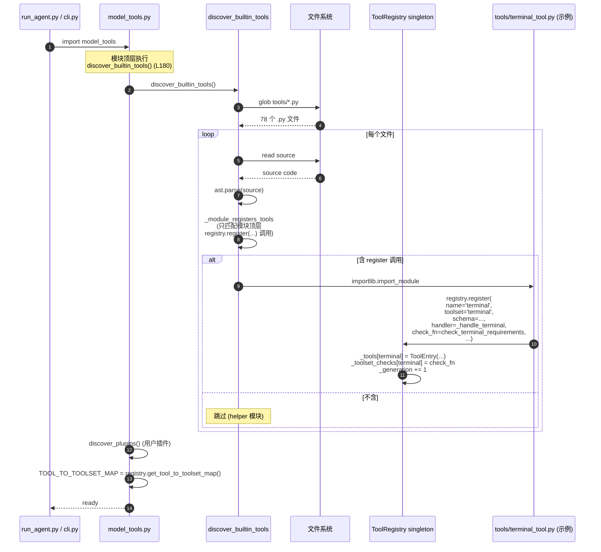

### 2.3 防止 Shadowing 的注册保护（已核对 L249-272）

```
┌──────────────────────────────────────────────────────────────────┐
│  register() 拒绝跨 toolset 覆盖:                                    │
│                                                                  │
│   场景 1: builtin 工具被 plugin 覆盖                              │
│     • 'memory' 已属 toolset='memory' (内置)                       │
│     • 某 plugin 想再注册 'memory' 属 toolset='plugin-x'           │
│     ─► 拒绝, ERROR 日志:                                          │
│         "Tool registration REJECTED: shadow existing tool ..."    │
│                                                                  │
│   场景 2: 两个 plugin 名字冲突                                     │
│     • 同样拒绝                                                    │
│                                                                  │
│   场景 3: MCP-to-MCP 覆盖 (合法)                                  │
│     • toolset 'mcp-server-a' 的 'web_search'                      │
│     • 后注册的 toolset 'mcp-server-b' 的 'web_search'             │
│     ─► 允许, DEBUG 日志 (MCP server 重启 / 多 server 名字冲突)    │
│                                                                  │
│  ★ 这种保守的覆盖策略防止"陌生 MCP 篡改 builtin"                   │
│     是 Hermes 在保持可扩展性同时控制安全风险的核心机制              │
└──────────────────────────────────────────────────────────────────┘
```

---

## 3. ToolEntry 数据结构

### 3.1 ToolEntry 12 个字段（已核对 L77-106）

```
┌──────────────────────────────────────────────────────────────────────┐
│  class ToolEntry:                                                     │
│   __slots__ = (...)  # 内存优化                                        │
│                                                                      │
│   ┌─ 基础元信息 ───────────────────────────────────────┐               │
│   │  name: str                                          │               │
│   │   ─► tool_call.function.name 匹配项                  │               │
│   │                                                    │               │
│   │  toolset: str                                       │               │
│   │   ─► 所属命名工具组 ('terminal' / 'memory' / ...)    │               │
│   │                                                    │               │
│   │  description: str                                   │               │
│   │   ─► 默认从 schema['description'] 取                 │               │
│   │                                                    │               │
│   │  emoji: str                                         │               │
│   │   ─► UI 展示用 (例: '💻' for terminal)               │               │
│   └────────────────────────────────────────────────────┘               │
│                                                                      │
│   ┌─ 协议契约 ────────────────────────────────────────┐               │
│   │  schema: dict                                       │               │
│   │   ─► OpenAI function-calling 标准 schema             │               │
│   │      含 name / description / parameters             │               │
│   │                                                    │               │
│   │  handler: Callable                                  │               │
│   │   ─► 实际执行的函数 (sync 或 async)                  │               │
│   │      签名: handler(args: dict, **kwargs) -> str     │               │
│   │      返回 JSON 字符串                                │               │
│   │                                                    │               │
│   │  is_async: bool                                     │               │
│   │   ─► True 时 dispatch 自动 _run_async 桥接           │               │
│   └────────────────────────────────────────────────────┘               │
│                                                                      │
│   ┌─ 可用性 ──────────────────────────────────────────┐               │
│   │  check_fn: Callable | None                         │               │
│   │   ─► 探测 "工具能用吗" (Docker daemon?, env var?)    │               │
│   │      30s TTL 缓存                                   │               │
│   │                                                    │               │
│   │  requires_env: List[str]                            │               │
│   │   ─► UI 提示用 (告知用户缺哪个 env var)              │               │
│   └────────────────────────────────────────────────────┘               │
│                                                                      │
│   ┌─ 运行时定制 ──────────────────────────────────────┐               │
│   │  max_result_size_chars: int | None                  │               │
│   │   ─► 工具结果上限 (超出截断)                          │               │
│   │      默认从 budget_config 拉                          │               │
│   │                                                    │               │
│   │  dynamic_schema_overrides: Callable | None          │               │
│   │   ─► 零参数 callable，每次 get_definitions 调用       │               │
│   │      返回 dict 浅 merge 到 schema                    │               │
│   │   例: delegate_task 需要在 description 里反映        │               │
│   │      当前 delegation.max_concurrent_children          │               │
│   │      不能写死 (用户 config 改了得反映)                │               │
│   └────────────────────────────────────────────────────┘               │
└──────────────────────────────────────────────────────────────────────┘
```

### 3.2 schema 字段的 OpenAI Function-calling 标准

```json
{
  "name": "terminal",
  "description": "Execute bash/sh commands in a persistent shell session...",
  "parameters": {
    "type": "object",
    "properties": {
      "command": {
        "type": "string",
        "description": "The shell command to execute"
      },
      "workdir": {
        "type": "string",
        "description": "Working directory (optional, defaults to current)"
      }
    },
    "required": ["command"]
  }
}
```

```
   ★ 关键点:
    • parameters.properties 描述每个参数
    • parameters.required 列必填参数
    • 这就是 LLM 看到的"工具说明书"
    • Hermes 用 get_definitions() 把所有 ToolEntry.schema
      渲染成 [{type: 'function', function: {...}}, ...] 给 LLM
```

### 3.3 dynamic_schema_overrides 实战

> 让工具描述能**反映运行时配置**。

```
   场景: delegate_task 的 description 必须告诉模型
   "你最多并发开 3 个子 agent, 最深 1 层"
   ─────

   静态 schema:
   ┌────────────────────────────────────────────────┐
   │  "description": "Delegate to subagent. ..."     │
   │  ★ 不知道用户 config 改没改 max_concurrent     │
   └────────────────────────────────────────────────┘

   动态 schema_overrides:
   ┌────────────────────────────────────────────────┐
   │  def _delegate_dynamic_schema():                 │
   │      max_c = _get_max_concurrent_children()      │
   │      max_d = _get_max_spawn_depth()              │
   │      return {                                    │
   │          "description":                          │
   │            f"Delegate to subagent. Max "        │
   │            f"{max_c} concurrent at depth {max_d}." │
   │      }                                           │
   │                                                  │
   │  registry.register(                              │
   │      name='delegate_task',                       │
   │      ...,                                        │
   │      dynamic_schema_overrides=                   │
   │          _delegate_dynamic_schema  # callable    │
   │  )                                              │
   └────────────────────────────────────────────────┘

   每次 get_definitions() 调用时:
   ─► 执行 overrides() → merge 到 base schema
   ─► 模型每轮都看到最新限制
```

---

## 4. 模块级自注册协议

> Hermes 工具的"加一个工具"成本极低——**只写一个文件**。

### 4.1 标准工具文件结构

```python
# tools/my_awesome_tool.py
"""My Awesome Tool — does awesome things."""

import os
from tools.registry import registry, tool_result, tool_error


# ① Schema 定义
MY_AWESOME_SCHEMA = {
    "description": "Do something awesome with input X",
    "parameters": {
        "type": "object",
        "properties": {
            "x": {"type": "string", "description": "Input X"}
        },
        "required": ["x"]
    }
}


# ② check_fn (可选)
def check_my_awesome_requirements() -> bool:
    """Return True when the tool is usable."""
    return os.getenv("AWESOME_API_KEY") is not None


# ③ Handler
def _handle_my_awesome(args: dict, **kwargs) -> str:
    x = args.get("x", "")
    if not x:
        return tool_error("x is required")
    # ... do awesome stuff ...
    return tool_result(result=f"Awesome: {x}")


# ④ 模块级注册 (★ 关键)
registry.register(
    name="my_awesome",
    toolset="awesome",
    schema=MY_AWESOME_SCHEMA,
    handler=_handle_my_awesome,
    check_fn=check_my_awesome_requirements,
    requires_env=["AWESOME_API_KEY"],
    description="Do something awesome",
    emoji="✨",
)
```

### 4.2 模块级注册的好处

```
┌──────────────────────────────────────────────────────────────┐
│  无中心列表维护                                                │
│  ─────                                                         │
│   ✗ 反例 (Bad): 每加工具要改 model_tools.py 加一个 if/elif      │
│   ✓ Hermes: import 即注册，新增文件 = 新增工具                  │
│                                                              │
│  Import 即生效                                                 │
│  ─────                                                         │
│   • discover_builtin_tools 启动时 import tools/*.py            │
│   • 每个文件的模块顶层 registry.register() 自然执行             │
│   • 注册表自动填充                                            │
│                                                              │
│  循环导入安全                                                   │
│  ─────                                                         │
│   tools/registry.py    ← 不 import 任何 tools/*.py            │
│         ↑                                                     │
│   tools/*.py           ← import tools.registry                │
│         ↑                                                     │
│   model_tools.py       ← import tools.registry + tools/*.py   │
│         ↑                                                     │
│   run_agent.py / cli.py                                       │
│                                                              │
│  Helper 模块不污染                                              │
│  ─────                                                         │
│   • _is_registry_register_call 只匹配【模块顶层】              │
│     的 registry.register(...) 调用                            │
│   • Helper 模块即使函数内调 register 也不会被自动 discover    │
└──────────────────────────────────────────────────────────────┘
```

---

## 5. 工具自动发现（AST 扫描 + import）

### 5.1 AST 扫描算法（已核对 L29-54）

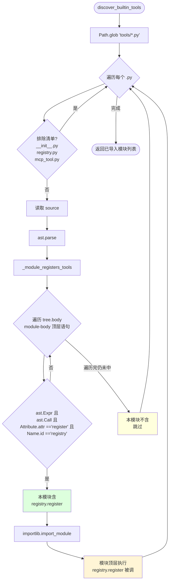

### 5.2 为什么用 AST 而不是简单 import 所有 .py？

```
┌───────────────────────────────────────────────────────────────────┐
│  方案 A: 朴素 import 所有 tools/*.py                                │
│  ─────                                                              │
│   ✗ 副作用风险：helper 模块（如 browser_supervisor.py）也会跑      │
│      module-level 代码                                              │
│   ✗ 启动慢：78 个文件全部 import → 解析 → 执行模块体                │
│   ✗ 错误难定位：某个 helper 文件出错会拖垮整个启动                  │
│                                                                   │
│  方案 B (Hermes): AST 预扫描 + 选择性 import                       │
│  ─────                                                              │
│   ① ast.parse 仅读语法树, 不执行代码 (毫秒级)                       │
│   ② 检查模块顶层是否有 registry.register(...) 调用                 │
│   ③ 只 import 真正会注册工具的模块                                 │
│   ④ Helper 模块 (browser_supervisor / file_state 等) 不被 import   │
│                                                                   │
│   ✓ 启动快                                                          │
│   ✓ 错误隔离                                                        │
│   ✓ 干净 (只有真正的工具被加载)                                     │
└───────────────────────────────────────────────────────────────────┘
```

### 5.3 多源工具发现

```
┌──────────────────────────────────────────────────────────────────┐
│  Hermes 工具来源 4 个层次:                                          │
│                                                                  │
│  ① builtin (内置)                                                  │
│     tools/*.py 中含 registry.register 的                           │
│     启动时 discover_builtin_tools() (model_tools.py:180)           │
│                                                                  │
│  ② plugins (用户/项目/pip 插件)                                    │
│     hermes_cli/plugins/ 注册的扩展                                 │
│     discover_plugins() (model_tools.py:197)                       │
│                                                                  │
│  ③ MCP servers (外部协议)                                          │
│     mcp_tool.py 启动时连接配置的 MCP server                         │
│     每个 server 的工具以 toolset='mcp-<server>' 注册              │
│     支持 notifications/tools/list_changed 动态刷新                 │
│                                                                  │
│  ④ Memory Provider 工具 (Phase 4)                                  │
│     MemoryManager 的 provider 也暴露 tools                         │
│     通过 MemoryManager.get_all_tool_schemas()                     │
│                                                                  │
│  ★ 4 个层次最终都汇入同一个 registry singleton                      │
│  ★ Shadowing 规则统一保护 (builtin > plugins ≠ MCP)                │
└──────────────────────────────────────────────────────────────────┘
```

---

## 6. check_fn 30 秒 TTL 缓存

> 工具可用性探测可能很慢 (Docker daemon ping, SSH key, Playwright binary)，**不能每轮都跑**。

### 6.1 缓存机制（已核对 L121-148）

```
┌──────────────────────────────────────────────────────────────────┐
│  常量与状态:                                                        │
│   _CHECK_FN_TTL_SECONDS = 30.0                                    │
│   _check_fn_cache: Dict[Callable, tuple[float, bool]] = {}        │
│   _check_fn_cache_lock = threading.Lock()                         │
│                                                                  │
│  _check_fn_cached(fn) 算法:                                        │
│  ─────                                                             │
│   now = time.monotonic()                                          │
│                                                                  │
│   ① 查 cache                                                       │
│      • 有 cached (ts, value)                                       │
│      • now - ts < 30s ? 直接返回 value                             │
│                                                                  │
│   ② cache miss / 过期                                              │
│      try: value = bool(fn())                                      │
│      except: value = False  ← 异常吞掉, 当作不可用                  │
│                                                                  │
│   ③ 写回 cache (ts, value)                                         │
│                                                                  │
│  invalidate_check_fn_cache():                                     │
│   • 由 hermes tools enable/disable 调用                            │
│   • 立即丢弃所有缓存                                                │
└──────────────────────────────────────────────────────────────────┘
```

### 6.2 30 秒为什么是甜区？

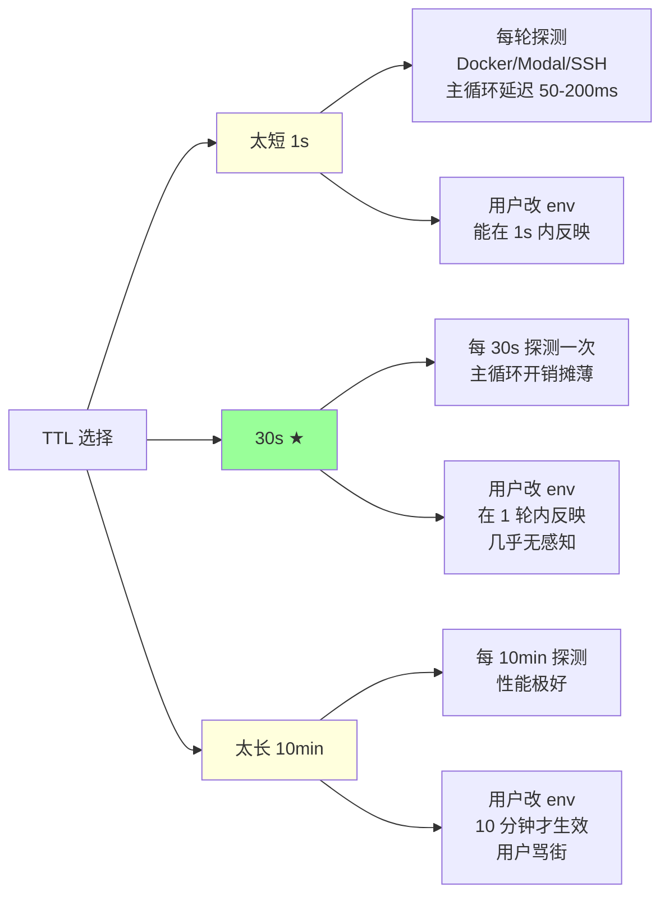

### 6.3 哪些 check_fn 是"慢探测"？

```
┌──────────────────────────────────────────────────────────────┐
│  慢探测举例 (典型 50-300ms):                                    │
│                                                              │
│  ✦ check_terminal_requirements                                │
│     • 探 Docker daemon (socket connect)                       │
│     • 探 Modal SDK 是否装                                      │
│     • 探 SSH host key                                         │
│                                                              │
│  ✦ check_browser_requirements                                 │
│     • 探 Playwright binary 是否装                             │
│     • 探 Chrome / Firefox 可执行文件                          │
│                                                              │
│  ✦ check_computer_use_requirements                            │
│     • 探 cua-driver 是否装                                    │
│     • 探系统权限 (accessibility)                              │
│                                                              │
│  ✦ check_skills_requirements                                  │
│     • 探 ~/.hermes/skills/ 是否存在 + 可读                     │
│                                                              │
│  ✦ MCP server tools                                           │
│     • 每个 tool 都有 server.is_connected 探测                 │
│                                                              │
│  ★ 没缓存的话, 50 个工具 × 100ms = 5 秒/轮的延迟                │
│  ★ 有 30s 缓存, 平均 ~167ms/轮 (摊薄到几乎不可见)             │
└──────────────────────────────────────────────────────────────┘
```

### 6.4 缓存的双层结构

```
┌──────────────────────────────────────────────────────────────┐
│  Hermes 实际有【两层缓存】:                                     │
│                                                              │
│  Layer 1: 全局 30s TTL 缓存                                    │
│  ─────                                                         │
│   • _check_fn_cache (registry.py)                             │
│   • 跨调用持久                                                  │
│   • TTL 后自动 refresh                                         │
│                                                              │
│  Layer 2: 每次 get_definitions 的 per-call cache               │
│  ─────                                                         │
│   • get_definitions() 内 check_results: Dict[Callable, bool] │
│   • 防止同一 get_definitions 内多次问同一 check_fn             │
│   • 避免短时间内（同一帧）的 TTL 时钟读取                       │
│                                                              │
│  Layer 3 (额外): get_tool_definitions 模块级 memo              │
│  ─────                                                         │
│   • model_tools._tool_defs_cache                              │
│   • 键: (frozenset(enabled), frozenset(disabled),             │
│           registry._generation)                                │
│   • _generation 改变 → 缓存失效                                │
│                                                              │
│  3 层一起把 "50 工具每轮 50ms" 摊到 "<1ms 内存查表"             │
└──────────────────────────────────────────────────────────────┘
```

---

## 7. 工具调度全链路 dispatch

> LLM 喊 `tool_calls`，到 handler 真正执行，中间经历什么？

### 7.1 完整链路图

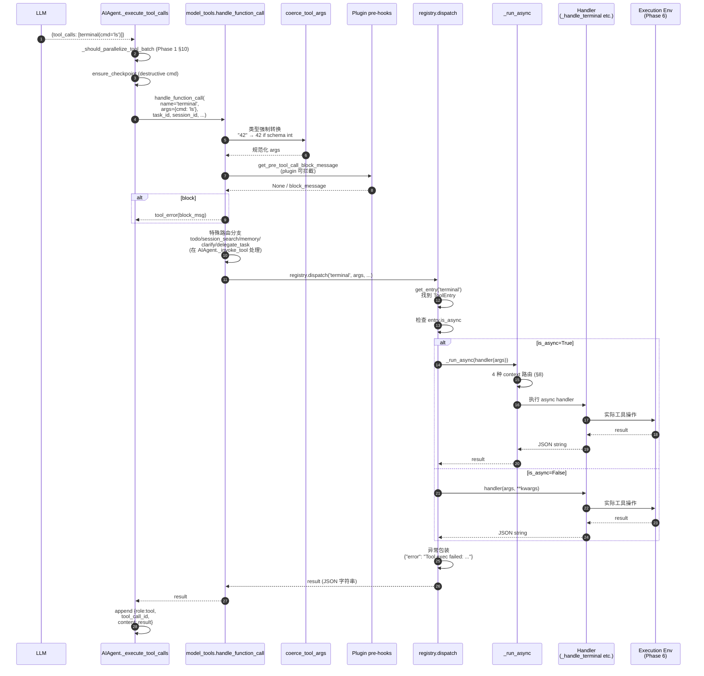

### 7.2 args 类型强制转换

> LLM 偶尔会把数字传成字符串：`{"limit": "10"}` 而非 `{"limit": 10}`。

```
┌──────────────────────────────────────────────────────────────┐
│  coerce_tool_args(name, args) 流程:                            │
│                                                              │
│   ① 拿到工具的 schema (tools.registry.get_schema)              │
│                                                              │
│   ② 遍历 args 的每个 key:                                       │
│      • 找 schema.parameters.properties[key].type              │
│      • 当前 args[key] 类型 ≠ 期望类型 → 尝试强转                │
│                                                              │
│   ③ 规则:                                                      │
│      • "42" → 42        (string → integer)                    │
│      • "true" → True    (string → boolean)                    │
│      • "1.5" → 1.5      (string → number)                     │
│      • 失败 → 保留原值, 让 handler 自己处理报错                │
│                                                              │
│   设计意图:                                                     │
│   ─────                                                        │
│    • 防止 "10" 不是 10 这种纯类型错误的 retry                  │
│    • 模型偶尔输出错类型, 不应该浪费 retry 预算                  │
│    • 比让 handler 自己 cast 更集中、更一致                     │
└──────────────────────────────────────────────────────────────┘
```

### 7.3 异常统一包装

```
   每个 handler 必须返回 JSON 字符串
   ─────

   方式 A: handler 自己 try/except + json.dumps
     • 每个工具都要写 50 行 boilerplate
     • 容易漏掉某种异常

   方式 B (Hermes): dispatch 统一包装
     ┌────────────────────────────────────────────┐
     │  try:                                       │
     │      return handler(args, **kwargs)         │
     │  except Exception as e:                      │
     │      logger.exception(...)                  │
     │      return json.dumps({                    │
     │        "error": f"Tool execution failed: " │
     │                  f"{type(e).__name__}: {e}" │
     │      })                                     │
     └────────────────────────────────────────────┘

   ─► handler 只管 happy path, 异常自动转 JSON
   ─► 模型看到一致的错误格式, retry 矩阵能处理

   ★ 辅助函数 tool_error / tool_result 让 handler 写成:
     return tool_error("file not found", code=404)
     return tool_result(success=True, data=payload)
```

---

## 8. _run_async 4 种调用上下文

> 同一份 async handler，要能在 4 种完全不同的执行环境里安全运行。

### 8.1 4 种 context 矩阵

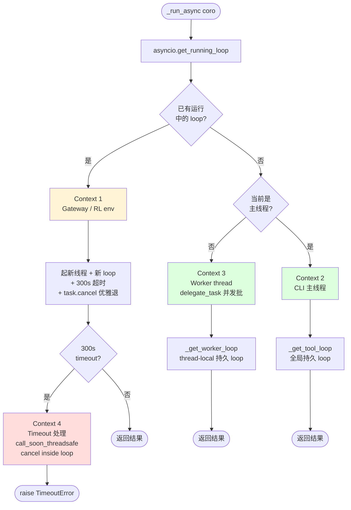

### 8.2 4 种 context 的实际原因

```
┌───────────────────┬──────────────────────────────────────────────┐
│  Context           │  发生场景 + 工程原因                          │
├───────────────────┼──────────────────────────────────────────────┤
│  ① 已有 running    │  Gateway 用 asyncio 跑消息处理循环            │
│  loop (async ctx)  │  RL env 也是 async 框架                       │
│                    │                                              │
│                    │  问题: 在 async 上下文里 await 同步函数会卡死  │
│                    │  方案: 起 daemon 线程 + 它的私有 loop          │
│                    │       工具完成后干净退出                       │
│                    │       300s 超时强制取消                        │
├───────────────────┼──────────────────────────────────────────────┤
│  ② CLI 主线程      │  典型 CLI 单进程, 无 running loop               │
│                    │                                              │
│                    │  问题: asyncio.run 每次新建 loop, 关闭后        │
│                    │       cached httpx/AsyncOpenAI client          │
│                    │       绑在死 loop 上, GC 时 "Event loop          │
│                    │       is closed" 异常                          │
│                    │  方案: _get_tool_loop() 持久全局 loop           │
│                    │       cached client 始终绑活 loop              │
├───────────────────┼──────────────────────────────────────────────┤
│  ③ Worker thread   │  delegate_task 用 ThreadPoolExecutor          │
│                    │  并行跑多个子 Agent                            │
│                    │  也用于并发工具批 (Phase 1 §10)               │
│                    │                                              │
│                    │  问题: worker 跟主线程共享同一 loop 会争抢      │
│                    │       (asyncio loop 不是 thread-safe)         │
│                    │  方案: _get_worker_loop() 用 thread-local      │
│                    │       每 worker 线程独享自己的 loop            │
├───────────────────┼──────────────────────────────────────────────┤
│  ④ Timeout 处理   │  context 1 (gateway) 的 300s 超时              │
│                    │                                              │
│                    │  问题: ThreadPoolExecutor.cancel() 对【已经     │
│                    │       开始执行】的 worker 是 no-op             │
│                    │       直接 raise 会泄漏线程 (worker 还在跑)    │
│                    │  方案: call_soon_threadsafe(t.cancel) 把       │
│                    │       cancel 信号扔进 worker 的 loop           │
│                    │       worker 下一个 await 点会收到 cancel      │
│                    │       优雅退出                                 │
└───────────────────┴──────────────────────────────────────────────┘
```

### 8.3 单文件 vs 三层防御

```
   Hermes 的 sync→async 桥接是【单一真理源】:
   ─────

   ┌────────────────────────────────────────────────┐
   │  model_tools._run_async                         │
   │  ─►  所有 tool handler 必须经过这里              │
   │                                                  │
   │  registry.dispatch:                              │
   │      if entry.is_async:                          │
   │          from model_tools import _run_async      │
   │          return _run_async(handler(args))        │
   │                                                  │
   │  ─► handler 自己不需要懂 4 种 context             │
   │  ─► 只写 async def handle(...) 即可               │
   └────────────────────────────────────────────────┘

   ★ RL 路径额外提供"线程池防御"(agent_loop.py / tool_context.py)
     但每个 handler 仍受 _run_async 保护 (defense-in-depth)
```

---

## 9. Toolsets — 命名工具组合

### 9.1 Toolsets 数据结构（已核对 toolsets.py:78+）

```
┌──────────────────────────────────────────────────────────────┐
│  TOOLSETS: Dict[str, Dict] = {                                │
│                                                              │
│    "web": {                                                   │
│      "description": "Web research and content extraction",     │
│      "tools":    ["web_search", "web_extract"],               │
│      "includes": []      ← 不包含其他 toolset                  │
│    },                                                         │
│                                                              │
│    "research": {                                              │
│      "description": "...",                                    │
│      "tools":    [],                                          │
│      "includes": ["web", "vision"]    ← 组合两个 toolset       │
│    },                                                         │
│                                                              │
│    "hermes-gateway": {                                        │
│      "description": "...",                                    │
│      "tools": [],                                             │
│      "includes": ["hermes-telegram", "hermes-discord", ...]   │
│      ★ 19 个平台都包含 ← 大组合                                │
│    },                                                         │
│                                                              │
│    ...                                                        │
│  }                                                            │
└──────────────────────────────────────────────────────────────┘
```

### 9.2 递归组合 + 循环检测

```mermaid
flowchart TD
    Start[resolve_toolset name=research] --> Check{已 visited?}
    Check -->|是 (循环)| Return1([跳过, 防死循环])
    Check -->|否| AddVisit[visited.add 'research']

    AddVisit --> ReadTools[读取 toolsets 'research' .tools]
    ReadTools --> ReadInc[读取 toolsets 'research' .includes]

    ReadInc --> LoopInc{遍历 includes}
    LoopInc --> Recurse[resolve_toolset 'web']
    Recurse --> Recurse2[resolve_toolset 'vision']

    Recurse --> Merge[合并 tools]
    Recurse2 --> Merge

    Merge --> Final([返回去重 tools 列表])

    style Final fill:#9f9
    style Return1 fill:#ffd
```

### 9.3 三个组合层次实例

```
   Level 1: 单工具集 (atomic)
   ─────
   "web"       = [web_search, web_extract]
   "vision"    = [vision_analyze]
   "terminal"  = [terminal, process]
   "file"      = [read_file, write_file, patch, search_files]

   Level 2: 中级组合 (scenario)
   ─────
   "research"  = web + vision
   "coding"    = terminal + file
   "debugging" = terminal + file + browser

   Level 3: 平台集合 (composite)
   ─────
   "hermes-telegram" = _HERMES_CORE_TOOLS (50+ 工具)
   "hermes-discord"  = _HERMES_CORE_TOOLS + ...
   ...

   "hermes-gateway" = 19 平台合并 (跨平台超集)

   ─────
   ★ 三层一统通过 includes 实现, 不区分 atomic / composite
   ★ 用户也可以 create_custom_toolset 自定义
```

---

## 10. _HERMES_CORE_TOOLS 50+ 核心工具

> Hermes Agent 的"默认装备"——所有平台共享的工具基线。

### 10.1 完整清单（已核对 toolsets.py:31-73）

```
┌─────────────────────────────────────────────────────────────────┐
│  ┌── Web (2) ───────────────────────────────────────────┐         │
│  │  web_search        网页搜索                            │         │
│  │  web_extract       网页内容抓取                         │         │
│  └────────────────────────────────────────────────────────┘         │
│                                                                 │
│  ┌── Terminal + Process (2) ──────────────────────────┐           │
│  │  terminal          bash 命令执行 (7 backend Phase 6) │           │
│  │  process           后台进程管理                       │           │
│  └────────────────────────────────────────────────────┘           │
│                                                                 │
│  ┌── File (4) ────────────────────────────────────────┐           │
│  │  read_file         读文件                            │           │
│  │  write_file        写文件 (自动 checkpoint)          │           │
│  │  patch             局部 find/replace                 │           │
│  │  search_files      ripgrep 风格搜索                   │           │
│  └────────────────────────────────────────────────────┘           │
│                                                                 │
│  ┌── Vision + Image Gen (2) ──────────────────────────┐           │
│  │  vision_analyze    图片分析 (multimodal)             │           │
│  │  image_generate    图像生成                          │           │
│  └────────────────────────────────────────────────────┘           │
│                                                                 │
│  ┌── Skills (3) ──────────────────────────────────────┐           │
│  │  skills_list       Tier 1 列表 (Phase 4)            │           │
│  │  skill_view        Tier 2/3 详情                     │           │
│  │  skill_manage      create/edit/patch/write/delete    │           │
│  └────────────────────────────────────────────────────┘           │
│                                                                 │
│  ┌── Browser (12) ────────────────────────────────────┐           │
│  │  browser_navigate / snapshot / click / type /        │           │
│  │  scroll / back / press / get_images / vision /       │           │
│  │  console / cdp / dialog                              │           │
│  └────────────────────────────────────────────────────┘           │
│                                                                 │
│  ┌── TTS (1) ─────────────────────────────────────────┐           │
│  │  text_to_speech    语音合成                          │           │
│  └────────────────────────────────────────────────────┘           │
│                                                                 │
│  ┌── Planning & Memory (3) ───────────────────────────┐           │
│  │  todo              待办列表 (per-session)             │           │
│  │  memory            内置 memory tool (Phase 4)        │           │
│  │  session_search    跨会话 FTS5 搜索 (Phase 3)         │           │
│  └────────────────────────────────────────────────────┘           │
│                                                                 │
│  ┌── Interaction (1) ─────────────────────────────────┐           │
│  │  clarify           向用户问澄清问题 (永远串行)         │           │
│  └────────────────────────────────────────────────────┘           │
│                                                                 │
│  ┌── Code Execution + Delegation (2) ─────────────────┐           │
│  │  execute_code      Python/JS 沙箱 (RPC 风格)          │           │
│  │  delegate_task     子 Agent 委派 (§ 12)              │           │
│  └────────────────────────────────────────────────────┘           │
│                                                                 │
│  ┌── Automation (2) ──────────────────────────────────┐           │
│  │  cronjob           cron 调度 (Phase 7)               │           │
│  │  send_message      跨平台发消息 (gated)              │           │
│  └────────────────────────────────────────────────────┘           │
│                                                                 │
│  ┌── Home Assistant IoT (4) ──────────────────────────┐           │
│  │  ha_list_entities / ha_get_state /                   │           │
│  │  ha_list_services / ha_call_service                  │           │
│  │  ★ gated on HASS_TOKEN                              │           │
│  └────────────────────────────────────────────────────┘           │
│                                                                 │
│  ┌── Kanban (8) (多 Agent 协作) ──────────────────────┐           │
│  │  kanban_show / list / complete / block /            │           │
│  │  heartbeat / comment / create / link / unblock      │           │
│  │  ★ gated on HERMES_KANBAN_TASK                       │           │
│  └────────────────────────────────────────────────────┘           │
│                                                                 │
│  ┌── Computer Use (1) ────────────────────────────────┐           │
│  │  computer_use      macOS 桌面控制 (cua-driver)       │           │
│  │  ★ gated on cua-driver 安装                          │           │
│  └────────────────────────────────────────────────────┘           │
│                                                                 │
│  合计 47 个工具 (核心)                                            │
│  + Mixture-of-Agents (moa) / RL Training Tools 等可选            │
│  + 8 个外部 Memory Provider 各 5 个工具 (Phase 4)                │
│  ────                                                            │
│  通常实际启用 ~50-60 个工具                                       │
└─────────────────────────────────────────────────────────────────┘
```

### 10.2 按"能力维度"分类的另一种视角

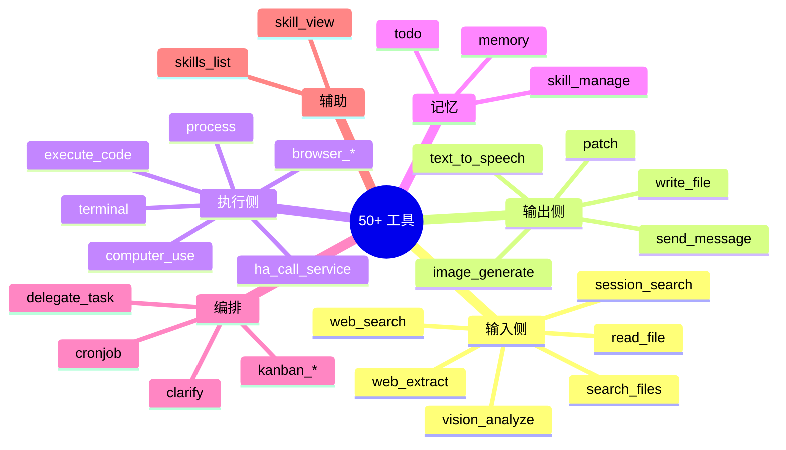

---

## 11. Toolset Distributions（RL Batch 概率采样）

> 给 RL 训练数据生成用——让不同任务类型用不同工具组合。

### 11.1 7 个预定义 distribution（已核对 toolset_distributions.py:29）

```
┌──────────────┬─────────────────────────────────────────────────┐
│  名字          │  工具集 + 概率 (%)                                │
├──────────────┼─────────────────────────────────────────────────┤
│  default       │  web=100 vision=100 image_gen=100 terminal=100  │
│                │  file=100 moa=100 browser=100                   │
│                │  ─► 全开                                         │
├──────────────┼─────────────────────────────────────────────────┤
│  image_gen     │  image_gen=90 vision=90 web=55 terminal=45     │
│                │  moa=10                                          │
│                │  ─► 创意生成场景                                  │
├──────────────┼─────────────────────────────────────────────────┤
│  research      │  web=90 browser=70 vision=50 moa=40            │
│                │  terminal=10                                     │
│                │  ─► 信息检索场景                                  │
├──────────────┼─────────────────────────────────────────────────┤
│  science       │  web=94 terminal=94 file=94 vision=65          │
│                │  browser=50 image_gen=15 moa=10                 │
│                │  ─► 科研问题求解                                  │
├──────────────┼─────────────────────────────────────────────────┤
│  development   │  terminal=80 file=80 moa=60 web=30 vision=10   │
│                │  ─► 编码场景                                      │
├──────────────┼─────────────────────────────────────────────────┤
│  safe          │  web=80 browser=70 vision=60 image_gen=60      │
│                │  moa=50                                          │
│                │  ─► 不含 terminal (适合无信任 sandbox)            │
├──────────────┼─────────────────────────────────────────────────┤
│  balanced      │  全部 50                                         │
│                │  ─► 均匀                                          │
└──────────────┴─────────────────────────────────────────────────┘
```

### 11.2 采样算法

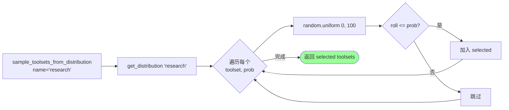

### 11.3 跟 runtime toolsets 的关键区别

```
┌──────────────────────────────────────────────────────────────┐
│                                                              │
│  ★ runtime toolsets (toolsets.py)                             │
│     • 每会话固定使用的工具组合                                  │
│     • 用户配置 / Profile 决定                                   │
│     • 例: "我这次跑用 coding toolset"                          │
│                                                              │
│  ★ distributions (toolset_distributions.py)                   │
│     • 给【批生成】用 (batch_runner.py)                         │
│     • 同一个 distribution 下不同 prompt 看到不同工具组合        │
│     • 模拟真实多样化场景                                        │
│     • 例: 用 "research" 跑 1000 个轨迹，                        │
│         有 70% 含 browser tools, 50% 含 vision                │
│                                                              │
│  ★ 关键点: distributions 是【训练数据增强】的工程实现              │
│     不是 runtime 用                                            │
└──────────────────────────────────────────────────────────────┘
```

---

## 12. Subagent 委派架构

> 复杂任务可以"分包"给子 Agent——但隔离要严格。

### 12.1 delegate_task 工具调用契约

```
   delegate_task 工具的 schema (部分):

   {
     "goal": "调研 Honcho 文档并写一份学习笔记",
     "context": "...background info to give the subagent...",
     "toolsets": ["web", "file"],   # 可选, 默认全 (减黑名单)
     "tasks": [                       # 可选, 批模式
       {"goal": "...", "context": "..."},
       {"goal": "...", "context": "..."}
     ],
     "max_iterations": 32,            # 子 Agent 自己的迭代上限
     "role": "researcher",            # 可选, orchestrator 才能再 delegate
     "acp_command": "code",            # 可选, 通过 ACP 委派给外部 IDE
     "acp_args": [...]
   }
```

### 12.2 _build_child_agent 关键参数

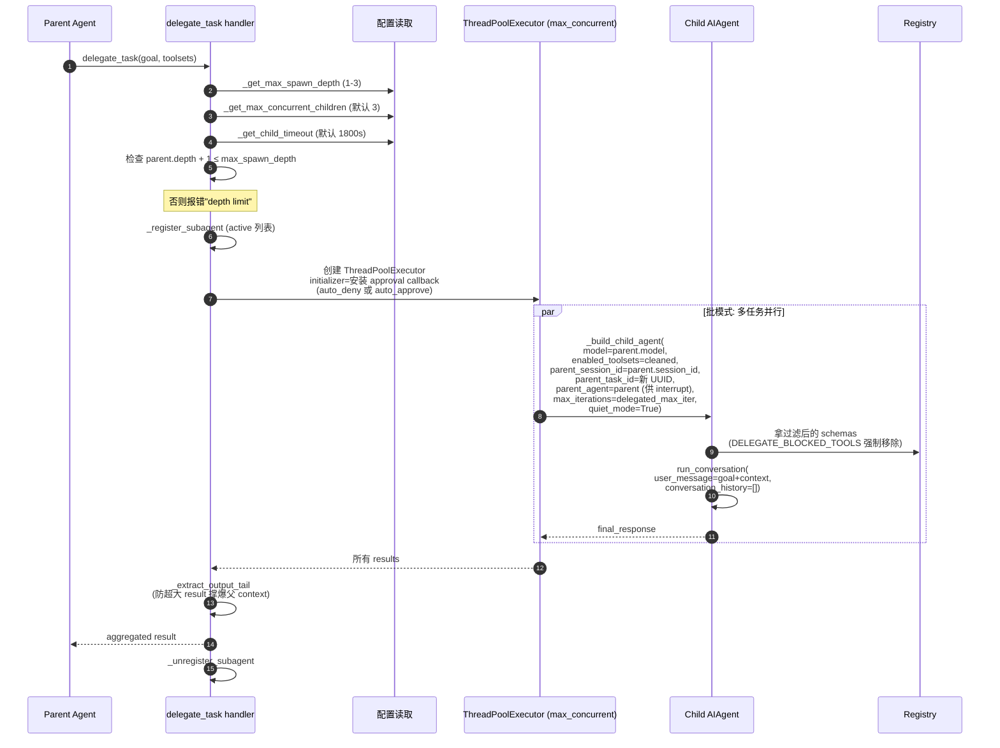

### 12.3 子 Agent 隔离的 7 个维度

```
┌──────────────────────────────────────────────────────────────────┐
│                                                                  │
│  ① 对话历史: 空                                                    │
│     • child 不继承 parent 的 messages                              │
│     • 只看到自己的系统提示 + goal + context                        │
│                                                                  │
│  ② Task ID: 独立                                                  │
│     • child 有自己的 _current_task_id (新 UUID)                   │
│     • 独立 terminal session + 文件操作缓存                         │
│                                                                  │
│  ③ Toolset: 减去黑名单                                            │
│     • DELEGATE_BLOCKED_TOOLS = {                                  │
│         delegate_task, clarify, memory,                          │
│         send_message, execute_code                               │
│       }                                                          │
│     • 即使 parent 传了这些 toolset, registry 也强制剥离             │
│                                                                  │
│  ④ Approval Callback: auto_deny / auto_approve                    │
│     • 不是 input() 阻塞 (会跟 parent TUI 死锁)                     │
│     • 默认 auto_deny (安全)                                       │
│     • 配置 delegation.subagent_auto_approve=true 开 YOLO         │
│                                                                  │
│  ⑤ 输出尾截断                                                      │
│     • _extract_output_tail 截取末尾 ~5K chars                    │
│     • 父只看到子的"答复"，不看中间 tool 调用                       │
│                                                                  │
│  ⑥ Quiet Mode                                                     │
│     • child 不打印到 stdout                                       │
│     • 全部输出由父统一展示 (避免错乱)                              │
│                                                                  │
│  ⑦ Interrupt 可传播                                                │
│     • parent.interrupt() 递归到 active children (Phase 1 §8)     │
│     • child 自然停                                                │
└──────────────────────────────────────────────────────────────────┘
```

---

## 13. DELEGATE_BLOCKED_TOOLS 黑名单

### 13.1 5 个黑名单工具及其禁用理由（已核对 delegate_tool.py:40-48）

```
┌─────────────────┬─────────────────────────────────────────────┐
│  禁用工具         │  禁用理由                                     │
├─────────────────┼─────────────────────────────────────────────┤
│  delegate_task   │  防止递归无限委派                              │
│                  │  (orchestrator role 例外 — 受深度限制)        │
├─────────────────┼─────────────────────────────────────────────┤
│  clarify         │  子 Agent 无法跟用户交互                       │
│                  │  TUI 在 parent 手里，child 调 clarify 死锁    │
├─────────────────┼─────────────────────────────────────────────┤
│  memory          │  防止共享 MEMORY.md 被多 child 并发污染        │
│                  │  (frozen snapshot Phase 4 模式假设单 writer)  │
├─────────────────┼─────────────────────────────────────────────┤
│  send_message    │  跨平台副作用 (发 Telegram / Discord)         │
│                  │  child 不应该有"对外发声"权限                 │
├─────────────────┼─────────────────────────────────────────────┤
│  execute_code    │  child 应该 step-by-step 思考                  │
│                  │  不该写脚本批量做 (那是 parent 该做的)        │
└─────────────────┴─────────────────────────────────────────────┘
```

### 13.2 黑名单的强制执行

```
   即使 parent 主动传 toolsets=["delegation"] 想让 child 也能 delegate:
   ─────

   _build_child_agent 流程:
   ┌───────────────────────────────────────────────┐
   │  ① 解析 parent 传的 toolsets                    │
   │     → 得到 [delegation, web, file]              │
   │                                                │
   │  ② 展开 toolsets 到 tools:                     │
   │     → [delegate_task, web_search, read_file...] │
   │                                                │
   │  ③ 移除 DELEGATE_BLOCKED_TOOLS:                 │
   │     → [web_search, read_file, ...]              │
   │     (delegate_task 被剥)                       │
   │                                                │
   │  ④ orchestrator role 例外:                     │
   │     if role == "orchestrator" and depth < max:  │
   │         保留 delegate_task                      │
   │     ─► 让 orchestrator 能再 delegate            │
   │     ─► 但深度仍然 cap 在 max_spawn_depth         │
   └───────────────────────────────────────────────┘
```

---

## 14. Spawn 深度 + 并发限制

### 14.1 深度限制（已核对 delegate_tool.py:128, 389-422）

```
   MAX_DEPTH = 1 (默认)
   配置: delegation.max_spawn_depth
   clamp 范围: [1, 3]

   ┌─────────────────────────────────────────────────────┐
   │  depth 0: parent agent (用户原对话)                   │
   │     │                                                │
   │     ▼ delegate_task                                  │
   │  depth 1: 第一层 child                                │
   │     │                                                │
   │     ▼ delegate_task (orchestrator role only)         │
   │  depth 2: 第二层 child  (需 max_spawn_depth ≥ 2)     │
   │     │                                                │
   │     ▼ delegate_task                                  │
   │  depth 3: 第三层 child  (需 max_spawn_depth = 3)     │
   │     │                                                │
   │     ✗ 拒绝再 spawn (depth + 1 > 3 = 4)               │
   └─────────────────────────────────────────────────────┘

   默认 MAX_DEPTH=1 含义:
   ─► parent(0) → child(1) → grandchild(2) ✗ 拒绝
   ─► 想用 grandchild 必须配 max_spawn_depth ≥ 2
```

### 14.2 并发限制（已核对 delegate_tool.py:324-360）

```
   ┌─────────────────────────────────────────────────────┐
   │  _get_max_concurrent_children:                       │
   │   配置: delegation.max_concurrent_children            │
   │   默认: 3                                             │
   │   范围: [1, 16]  (clamp)                              │
   │                                                      │
   │  含义: 同一时刻最多有 N 个 child 在跑                  │
   │  实现: ThreadPoolExecutor(max_workers=N)              │
   │                                                      │
   │  超过的任务排队等待                                    │
   └─────────────────────────────────────────────────────┘

   ┌─────────────────────────────────────────────────────┐
   │  _get_child_timeout:                                 │
   │   配置: delegation.child_timeout                     │
   │   默认: 1800s (30 分钟)                               │
   │                                                      │
   │  child 跑超过 timeout → ThreadPoolExecutor 取消       │
   │  ─► 优雅 cancel (call_soon_threadsafe)               │
   │  ─► 不强 kill (避免遗留资源)                          │
   └─────────────────────────────────────────────────────┘
```

### 14.3 spawn pause 机制

```
   set_spawn_paused(True):
   ─► 全局禁止 spawn 新 child
   ─► 用户按 Ctrl+C 后 cleanup 阶段用
   ─► 当前在跑的 child 不受影响, 自然完成

   is_spawn_paused() → 检查标志
```

---

## 15. Subagent vs Background Review 对比

> 两者都是 **fork 出一个独立 AIAgent**，但目的、隔离粒度完全不同。

```
┌─────────────────────┬─────────────────────────┬─────────────────────────┐
│  维度                │  Subagent (Phase 5)     │  Background Review      │
│                      │  delegate_task           │  (Phase 4 Nudge)        │
├─────────────────────┼─────────────────────────┼─────────────────────────┤
│  发起方              │  父 Agent 主动调          │  Hermes 自动触发          │
│                      │  delegate_task 工具      │  (每 N 轮)               │
├─────────────────────┼─────────────────────────┼─────────────────────────┤
│  目的                │  分担【主任务的子任务】   │  从主对话中【提炼沉淀】    │
│                      │  e.g. "调研 X"           │  e.g. "用户偏好简洁"     │
├─────────────────────┼─────────────────────────┼─────────────────────────┤
│  对话历史            │  空                     │  完整 messages_snapshot │
│                      │  (新任务)               │  (要看才能提炼)          │
├─────────────────────┼─────────────────────────┼─────────────────────────┤
│  enabled_toolsets   │  parent 指定 - 黑名单    │  ["memory", "skills"]   │
│                      │  (默认大部分能用)        │  (强制只能写记忆)         │
├─────────────────────┼─────────────────────────┼─────────────────────────┤
│  max_iterations      │  默认 32, 可配           │  16 (review 任务简单)   │
├─────────────────────┼─────────────────────────┼─────────────────────────┤
│  深度限制            │  max_spawn_depth (1-3) │  禁用嵌套 nudge (=0)    │
├─────────────────────┼─────────────────────────┼─────────────────────────┤
│  Approval callback  │  auto_deny / approve    │  auto_deny (强制)       │
├─────────────────────┼─────────────────────────┼─────────────────────────┤
│  状态隔离            │  独立 task_id            │  共享 _memory_store      │
│                      │  独立 terminal session   │  (要写入 parent 看到)   │
├─────────────────────┼─────────────────────────┼─────────────────────────┤
│  线程命名            │  ThreadPoolExecutor      │  daemon thread          │
│                      │  workers                 │  name='bg-review'       │
├─────────────────────┼─────────────────────────┼─────────────────────────┤
│  父侧观察            │  Parent 看到摘要 result  │  主对话不变, 只主动      │
│                      │                         │  显示 "💾 ... saved"    │
├─────────────────────┼─────────────────────────┼─────────────────────────┤
│  典型时长            │  数分钟 - 半小时         │  10-30 秒               │
├─────────────────────┼─────────────────────────┼─────────────────────────┤
│  典型工具用量         │  10-30 次工具调用       │  1-5 次工具调用          │
└─────────────────────┴─────────────────────────┴─────────────────────────┘
```

### 15.1 共同的工程模式

```
┌──────────────────────────────────────────────────────────────────┐
│  两者共享的"fork AIAgent"模板:                                       │
│                                                                  │
│   ① 继承父 runtime (provider / model / api_key)                    │
│     避免 OAuth-only / credential pool 重新解析失败                  │
│                                                                  │
│   ② quiet_mode=True + redirect stdout/stderr                       │
│     不干扰父对话输出                                                │
│                                                                  │
│   ③ 自动 deny 危险命令 (跨线程 input() 死锁防护)                  │
│                                                                  │
│   ④ 资源清理 (close + shutdown_memory_provider)                   │
│     防 event loop / aiohttp / 子进程泄漏                          │
│                                                                  │
│   ★ 这两层异曲同工——本质都是【沙箱化 LLM 调用】                     │
│     一个用来做任务, 一个用来反思                                    │
└──────────────────────────────────────────────────────────────────┘
```

---

## 16. Permission Gate 三层防护

> 每次工具调用都过三道闸门。

### 16.1 三层全景图

```mermaid
flowchart TD
    Call[LLM 喊 tool_call] --> Gate1{Layer 1<br/>check_fn 可用性<br/>(已 30s 缓存)}
    Gate1 -->|不可用| Hidden[工具压根<br/>不在 schemas 里<br/>LLM 看不到]
    Gate1 -->|可用| Gate2{Layer 2<br/>Pre-tool-call hook<br/>plugin block message?}

    Gate2 -->|block| BlockMsg[tool_error<br/>plugin 返回的消息]
    Gate2 -->|放行| Gate3{Layer 3<br/>工具内部审批<br/>(terminal/code_exec)}

    Gate3 --> Detect{detect_hardline<br/>_command?}
    Detect -->|hardline| HardBlock[强制拒绝<br/>不可豁免]
    Detect -->|否| Dangerous{detect_dangerous<br/>_command?}

    Dangerous -->|是| AskUser{有 approval<br/>callback?}
    Dangerous -->|否| Execute[执行]

    AskUser -->|callback 同意| Execute
    AskUser -->|callback 拒绝| Denied[返回 deny error]
    AskUser -->|没有 callback<br/>(subagent/bg-review)| AutoDeny[auto_deny]

    Execute --> Done([返回结果])

    style Hidden fill:#ffd
    style BlockMsg fill:#fdd
    style HardBlock fill:#f99
    style AutoDeny fill:#fdd
    style Denied fill:#fdd
    style Execute fill:#9f9
```

### 16.2 三层职责清晰划分

```
┌────────────────────────────────────────────────────────────────┐
│                                                                │
│  ★ Layer 1: check_fn (registry 层)                              │
│  ─────                                                          │
│    问题: "这工具在当前环境能用吗？"                                │
│    检查: Docker 在跑吗？env var 配了吗？SDK 装了吗？               │
│    时机: get_definitions() 调用时 (每轮一次, 30s 缓存)           │
│    效果: 不可用的工具【从 schema 列表中完全消失】                  │
│                                                                │
│  ★ Layer 2: Pre-tool-call hook (plugin 层)                      │
│  ─────                                                          │
│    问题: "这次调用允许吗？" (plugin 维度)                          │
│    检查: get_pre_tool_call_block_message() 任一 plugin 返回非 None│
│    时机: 派发到 handler 之前                                      │
│    效果: 工具不执行, LLM 看到 plugin 给的拒绝原因                  │
│                                                                │
│  ★ Layer 3: 工具内部审批 (handler 层)                            │
│  ─────                                                          │
│    问题: "这命令安全吗？" (内容维度)                                │
│    检查: terminal 内部 detect_hardline / detect_dangerous       │
│         code_execution 内部沙箱化 / 危险 import                  │
│         browser 内部 dialog 拦截                                  │
│    时机: handler 执行内                                          │
│    效果: 命令真正运行前能拦下来 / 弹审批                          │
│                                                                │
└────────────────────────────────────────────────────────────────┘
```

---

## 17. Hardline + Dangerous 命令检测

### 17.1 两级危险检测（已核对 approval.py:258-465）

```
┌──────────────────────────────────────────────────────────────────┐
│  ① detect_hardline_command  (绝对禁止, 任何模式都不放行)          │
│  ─────                                                             │
│   • rm -rf /                                                       │
│   • dd if=/dev/zero of=/dev/sd*                                    │
│   • :(){:|:&};:  (fork 炸弹)                                       │
│   • shutdown / reboot / halt                                       │
│   • mkfs.* (格式化磁盘)                                            │
│   • mv ~ /dev/null                                                 │
│   • chmod -R 000 /                                                 │
│                                                                  │
│   特性:                                                            │
│    ✗ 即使用户 --yolo / /yolo / approvals.mode=off                 │
│      也【依然拦截】                                                │
│    ✗ 即使用户手动 /approve all 也【依然拦截】                       │
│    ─► 是绝对的硬底线                                               │
│                                                                  │
├──────────────────────────────────────────────────────────────────┤
│  ② detect_dangerous_command  (可豁免, 需用户审批)                  │
│  ─────                                                             │
│   • rm <path>                                                      │
│   • mv <src> <dst>                                                 │
│   • sed -i / truncate / shred                                      │
│   • git reset --hard / git clean / git checkout                    │
│   • > <file>  (覆盖 redirect, 但不含 >>)                          │
│   • curl ... | sh  (从网络下脚本直接跑)                            │
│   • sudo *                                                         │
│                                                                  │
│   特性:                                                            │
│    ✓ 弹审批: "once" / "session" / "always" / "deny"               │
│    ✓ /yolo 可全部放行                                              │
│    ✓ approvals.mode=off 可全部放行                                 │
│    ✓ 已审批的存到 _session_approved / _permanent_approved          │
└──────────────────────────────────────────────────────────────────┘
```

### 17.2 审批决议存储

```
   3 级审批结果:
   ─────

   ┌────────────┬──────────────────────────────────────┐
   │  once       │  仅本次执行, 下次再问                  │
   │             │                                      │
   │  session    │  本会话内所有同类命令放行              │
   │             │  存 _session_approved[session_key]   │
   │             │                                      │
   │  always     │  跨会话永久放行                       │
   │             │  存 _permanent_approved (~/.hermes)  │
   │             │                                      │
   │  deny       │  拒绝, 返回错误                       │
   └────────────┴──────────────────────────────────────┘

   ★ session_key 隔离: Gateway 多用户场景下,
     每个用户的 session_approved 互不影响

   ★ 危险命令模式 key 归一化:
     "rm -rf /tmp/abc" 和 "rm -rf /tmp/xyz" 用同一个 pattern_key
     ─► 一次 approve 跨多个具体命令
```

### 17.3 Gateway 异步审批 (asyncio.Event)

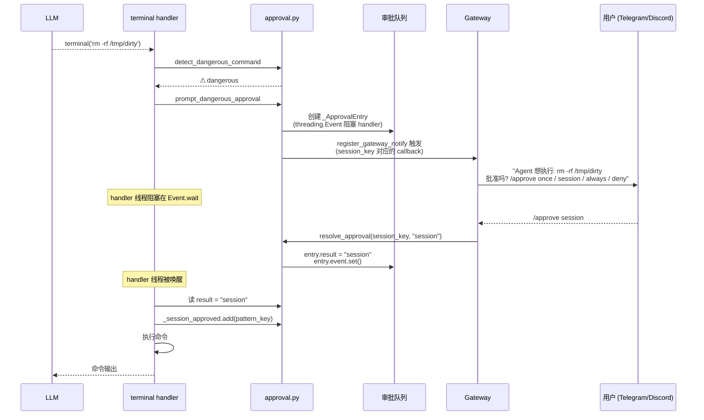

---

## 18. MCP 双角色：Server vs Client

> Hermes 跟 MCP 协议的关系是**双向**的——既能消费别人的 MCP，也能把自己 expose 出去。

### 18.1 双角色对比

```
┌──────────────────────────────────────────────────────────────────┐
│                                                                  │
│   ┌──── Hermes 作为 MCP Client ────┐                              │
│   │                                  │                            │
│   │  tools/mcp_tool.py (3408 行)     │                            │
│   │                                  │                            │
│   │  config.yaml 列举 MCP servers:   │                            │
│   │   mcp:                            │                            │
│   │     servers:                      │                            │
│   │       playwright:                 │                            │
│   │         command: npx ...          │                            │
│   │       github:                     │                            │
│   │         command: docker run ...   │                            │
│   │                                  │                            │
│   │  Hermes 启动时:                   │                            │
│   │   ① spawn 每个 server 进程       │                            │
│   │   ② JSON-RPC 跑 initialize       │                            │
│   │   ③ list_tools                    │                            │
│   │   ④ 每个 server 的工具以           │                            │
│   │      toolset='mcp-<name>'         │                            │
│   │      在 registry 注册              │                            │
│   │                                  │                            │
│   │  ─► 别人写的 MCP 工具变成          │                            │
│   │     Hermes 自己的工具              │                            │
│   └──────────────────────────────────┘                            │
│                                                                  │
│   ─────────────────────────                                       │
│                                                                  │
│   ┌──── Hermes 作为 MCP Server ────┐                              │
│   │                                  │                            │
│   │  mcp_serve.py (897 行)           │                            │
│   │                                  │                            │
│   │  启动:                            │                            │
│   │   hermes mcp serve                │                            │
│   │   ─► stdio MCP server (FastMCP)   │                            │
│   │                                  │                            │
│   │  暴露 10+ 工具给外部 IDE:          │                            │
│   │   • conversations_list             │                            │
│   │   • conversation_get               │                            │
│   │   • messages_read                  │                            │
│   │   • messages_send                  │                            │
│   │   • events_poll / events_wait     │                            │
│   │   • permissions_list_open         │                            │
│   │   • permissions_respond            │                            │
│   │   • attachments_fetch              │                            │
│   │                                  │                            │
│   │  典型用法:                         │                            │
│   │   Claude Code / Cursor 配 Hermes  │                            │
│   │   作为 MCP server                  │                            │
│   │   ─► 在 IDE 里看 Hermes 历史对话    │                            │
│   │   ─► 直接发消息到 Telegram         │                            │
│   │   ─► 处理 Hermes 弹的审批请求      │                            │
│   └──────────────────────────────────┘                            │
└──────────────────────────────────────────────────────────────────┘
```

### 18.2 EventBridge 后台轮询

```
   Hermes-as-Server 需要给 IDE 推 "新消息到了" 事件

   EventBridge (mcp_serve.py:204):
   ─────
   后台守护线程, 每 1s:
   ① 轮询 SessionDB.get_recent_messages
   ② 比对 last_seen_message_id
   ③ 新消息推入 internal queue
   ④ FastMCP 的 events_poll / events_wait 工具
      从 queue 取并返回给 IDE

   ─► IDE 不需要轮询整个数据库
   ─► 长轮询模型, 类似 Slack RTM
```

### 18.3 重要区分（容易混淆）

```
┌──────────────────────────────────────────────────────────────┐
│                                                              │
│  容易混淆的两层 MCP:                                            │
│                                                              │
│  ╳ 不正确的理解:                                                │
│     "Hermes 用 MCP 跟模型通信"                                  │
│     ✗ 错: Hermes 用 OpenAI/Anthropic API (Phase 2 transport)  │
│                                                              │
│  ✓ 正确的理解:                                                  │
│     "MCP 是 Hermes 跟【外部工具 / 编辑器】通信的协议"            │
│                                                              │
│     • Client (mcp_tool.py): 连别人的工具 server 拿能力           │
│     • Server (mcp_serve.py): 把自己的能力暴露给 IDE / 编辑器     │
│                                                              │
│  ★ MCP 在这里类似 LSP 之于编辑器——是工具集成层协议             │
└──────────────────────────────────────────────────────────────┘
```

---

## 19. MCP 动态工具发现

> MCP server 可以**运行时**通知 Hermes "我加了新工具"。

### 19.1 dynamic discovery 流程（已核对 mcp_tool.py:995-1059）

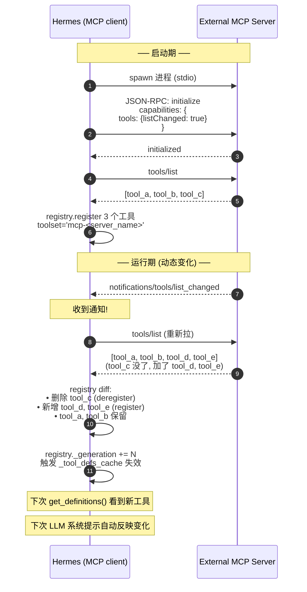

### 19.2 动态发现的实际场景

```
┌──────────────────────────────────────────────────────────────┐
│                                                              │
│  场景: MCP server 配置驱动的工具发现                            │
│  ─────                                                         │
│   • Playwright MCP server 启动后才知道有几个浏览器              │
│     (per-browser 一个工具)                                     │
│   • 安装新插件到 server 后, server 主动 push tools/list_changed │
│   • Hermes 自动同步, 用户重连不用                              │
│                                                              │
│  场景: MCP server 重启                                          │
│  ─────                                                         │
│   • Server 进程挂了, Hermes 自动 reconnect                     │
│   • Server 重启后可能有不同的工具集 (版本升级)                  │
│   • 动态 discovery 让 reconnect 后能力自动对齐                  │
│                                                              │
│  场景: MCP server 切换上下文                                    │
│  ─────                                                         │
│   • 某些 MCP server 根据当前 workspace 提供不同工具             │
│   • Hermes 切 workspace → server 发 list_changed →            │
│     工具自动重新加载                                            │
└──────────────────────────────────────────────────────────────┘
```

---

## 20. 端到端示例：用户请求 → 工具执行

> 把 §1-19 所有概念串成一个真实场景。

**场景**：用户说"帮我看下当前目录有哪些 Python 文件，统计行数最多的 3 个"

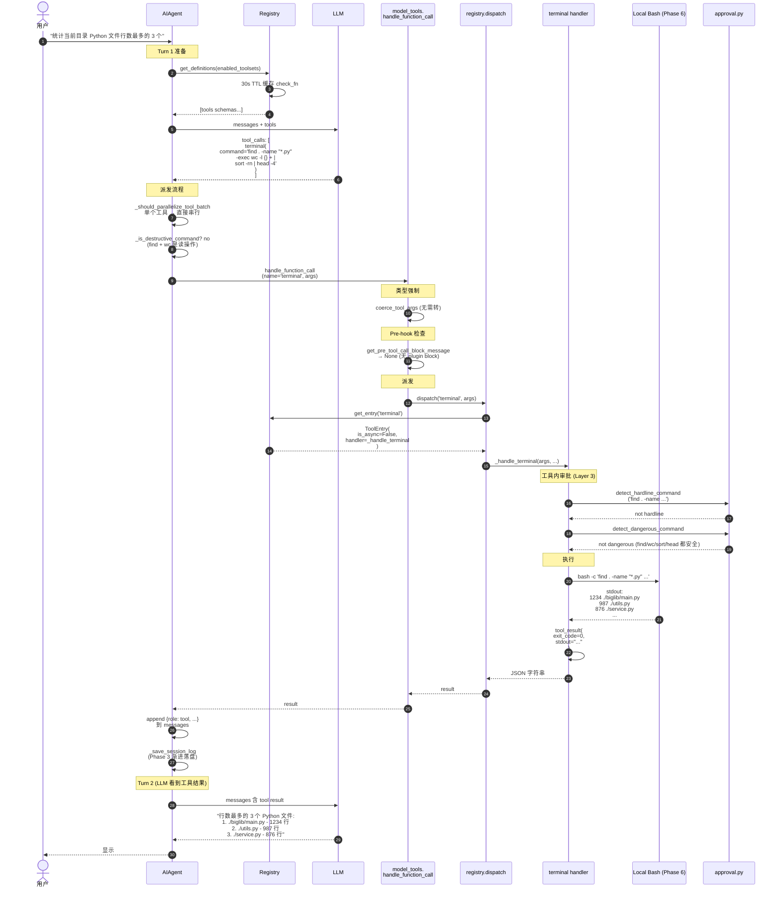

### 20.1 这个例子里的 Phase 5 关键点

```
   ① 工具发现：启动时 discover_builtin_tools 让 terminal 进 registry
   ② check_fn：terminal 工具的 check_terminal_requirements 30s 缓存
   ③ Schema：LLM 看到 terminal 工具的 OpenAI-format schema
   ④ 派发：handle_function_call → dispatch → handler
   ⑤ 类型强制：args 自动 coerce (本例无需)
   ⑥ Permission Gate 三层：
       L1 check_fn 已过 (terminal 可用)
       L2 plugin pre-hook 无拦截
       L3 detect_hardline / detect_dangerous (find 安全)
   ⑦ 同步 handler 直接执行 (is_async=False)
   ⑧ 结果包装为 JSON 字符串返回
   ⑨ Phase 3 渐进落盘
   ⑩ 下一轮 LLM 看到结果, 给用户回答
```

---

## 21. 设计取舍总结表

| # | 设计选择 | 替代方案 | 为什么 Hermes 这样选 |
|---|---|---|---|
| 1 | **模块级 register() 自注册** | 中心注册表 / 装饰器 | 加工具 = 加文件；无中心维护负担；import 即生效 |
| 2 | **AST 预扫描后再 import** | 直接 import 所有 tools/*.py | 避免 helper 模块副作用；启动快；错误隔离 |
| 3 | **ToolEntry 12 字段 + __slots__** | 自由字典 | 内存优化；字段约束防漏属性 |
| 4 | **check_fn 30s TTL 缓存** | 每轮重新探 / 永久缓存 | 平衡"准确性"和"性能"；用户改 env 1 轮内生效 |
| 5 | **3 层 cache (registry + per-call + module memo)** | 单层 | 每层解决不同时间尺度问题 |
| 6 | **_generation 计数器驱动失效** | 时间戳 / 显式 invalidate | MCP 动态注册场景下自动失效；零额外通信 |
| 7 | **dispatch 统一异常包装** | handler 自己 try/except | 一致 error 格式 + retry 矩阵可处理 |
| 8 | **_run_async 4 上下文** | asyncio.run() | 防 cached client 绑死 loop；线程隔离防争抢 |
| 9 | **dynamic_schema_overrides** | 静态 schema | 让 schema 反映运行时配置 (delegation limits) |
| 10 | **Shadowing 保护 (拒绝跨 toolset 覆盖)** | 后注册者赢 | 防 plugin/MCP 篡改 builtin |
| 11 | **MCP-to-MCP 例外允许** | 严格 | MCP server 重启 / 多 server 名字冲突合法 |
| 12 | **Toolset includes 嵌套组合** | 扁平列表 | 复杂场景可声明式表达 ("hermes-gateway") |
| 13 | **DISTRIBUTIONS 概率采样** | 用 toolsets | runtime vs batch 完全分离；RL 数据多样化 |
| 14 | **Subagent 黑名单 5 个工具** | 完全开放 | 防递归 / 死锁 / 共享状态污染 |
| 15 | **auto_deny 默认** | auto_approve / 弹用户 | TUI 死锁防护；安全默认 |
| 16 | **MAX_DEPTH=1 默认** | 任意深 | 防"递归森林"失控；用户可调到 3 |
| 17 | **max_concurrent_children=3** | 不限 | 资源保护 + 实测最优 |
| 18 | **Subagent output_tail 截断** | 全量返回 | 防大输出撑爆父 context |
| 19 | **Permission Gate 三层** | 单层审批 | 关注点分离 (可用 / 允许 / 安全) |
| 20 | **Hardline 不可豁免** | 全部可 yolo | 绝对底线防灾难操作 (rm -rf /) |
| 21 | **Approval 3 级 (once/session/always)** | 二元 yes/no | 减少重复打扰；颗粒度合理 |
| 22 | **Gateway 异步审批 (Event)** | 同步 input() | 跨平台 / 多用户场景下唯一可行 |
| 23 | **MCP 双角色 (server + client)** | 仅 client | 让 Hermes 跟 IDE 生态打通 |
| 24 | **MCP 动态 list_changed** | 启动时一次拉 | server 重启 / 切换 workspace 不用 Hermes 重启 |

---

## 22. 高频 Q&A 储备

```
┌────────────────────────────────────────────────────────────────────┐
│ Q: 怎么加一个新工具？                                                │
│ A: 在 tools/ 下新建 *.py，定义 schema + handler + check_fn，         │
│    模块顶层调 registry.register()。重启 Hermes 自动生效。            │
│    不需要修改任何中心文件。                                          │
├────────────────────────────────────────────────────────────────────┤
│ Q: 工具数量这么多，LLM 不会被工具描述撑爆 context？                  │
│ A: 三种应对:                                                        │
│    ① check_fn 把不可用工具过滤掉（Docker 没装就没 terminal 工具）   │
│    ② enabled_toolsets / disabled_toolsets 用户配置可白名单/黑名单 │
│    ③ Anthropic prompt cache (Phase 1 §5) 让 tool schema 走         │
│       cache 命中，token 成本摊薄                                    │
├────────────────────────────────────────────────────────────────────┤
│ Q: dispatch 时怎么知道 handler 是 async 还是 sync？                  │
│ A: ToolEntry.is_async 字段, 注册时显式声明。dispatch 看这个标志,      │
│    True → 自动走 _run_async；False → 直接 handler(args, **kwargs)。 │
├────────────────────────────────────────────────────────────────────┤
│ Q: Subagent 跟 Phase 4 后台 review 都 fork AIAgent, 啥区别？        │
│ A: 见 §15 详细对比表。简单说:                                        │
│    • Subagent: 父主动委派【子任务】, 用户感知 (LLM 调 delegate_task) │
│    • Review: 系统自动【反思】对话, 用户无感知 (Phase 4 飞轮)        │
├────────────────────────────────────────────────────────────────────┤
│ Q: 黑名单为什么不允许 child 调 memory？                              │
│ A: MEMORY.md 用 frozen snapshot 模式 (Phase 4 §5)。这个模式假设      │
│    "整个会话只有一个 writer"。如果 child 也能写, 多 child 并发会     │
│    破坏 snapshot 不变量。memory 写入只能由父或 background review    │
│    串行进行。                                                       │
├────────────────────────────────────────────────────────────────────┤
│ Q: MCP server 跟 plugin 怎么共存？                                  │
│ A: 都注册到同一个 registry, 但走不同 toolset 命名空间:               │
│    • Plugin: toolset = plugin name (例 'spotify')                  │
│    • MCP:    toolset = 'mcp-' + server name (例 'mcp-playwright')  │
│    Shadowing 保护规则禁止跨 toolset 覆盖, 但允许 MCP-to-MCP 覆盖。   │
├────────────────────────────────────────────────────────────────────┤
│ Q: 模型乱用工具能怎么防？                                            │
│ A: 多层防御:                                                        │
│    ① 工具的 description 写清楚边界 + 反面示例                       │
│    ② check_fn 把不该用的工具压根 hide 掉                            │
│    ③ Permission Gate 三层 (尤其 hardline 永远拦截)                  │
│    ④ Tool Guardrails (run_agent.py) 在 post-call 检测异常模式      │
│    ⑤ Iteration Budget (Phase 1) 防无限调用                          │
│    ⑥ checkpoint_manager 自动备份, 错也能回滚                        │
├────────────────────────────────────────────────────────────────────┤
│ Q: 工具结果太大 (例如 cat 大文件) 怎么办？                            │
│ A: 三层防护:                                                        │
│    ① max_result_size_chars 字段, 每工具单独配                       │
│    ② 默认上限 budget_config.DEFAULT_RESULT_SIZE_CHARS              │
│    ③ Subagent output 额外有 _extract_output_tail                   │
│    超出会自动截断, 末尾加 "...truncated" 提示。                     │
├────────────────────────────────────────────────────────────────────┤
│ Q: 一个 plugin 想替换 builtin 工具怎么办？                          │
│ A: 第一步 deregister 老的, 然后注册新的。直接 register 会被 shadowing │
│    保护拒绝。Plugin 在自己的 initialize hook 里:                    │
│       from tools.registry import registry                          │
│       registry.deregister('memory')                                 │
│       registry.register(name='memory', ...)                        │
└────────────────────────────────────────────────────────────────────┘
```

---

## 23. 必背图 + 自检清单

### 23.1 Phase 5 必背的 5 张图

```
   ╔═══════════════════════════════════════════════════════════════╗
   ║                                                               ║
   ║   📊 图 ①：ToolEntry 12 字段 + 注册时序                          ║
   ║      ──────                                                    ║
   ║      模块级 register → AST 扫描 → import → registry             ║
   ║      Shadowing 保护规则                                          ║
   ║      (§ 2 + § 4 + § 5)                                         ║
   ║                                                               ║
   ║   📊 图 ②：check_fn 30s TTL + 三层缓存                         ║
   ║      ──────                                                    ║
   ║      Registry TTL + Per-call cache + Module memo               ║
   ║      _generation 失效                                          ║
   ║      (§ 6)                                                    ║
   ║                                                               ║
   ║   📊 图 ③：dispatch 全链路 + _run_async 4 contexts            ║
   ║      ──────                                                    ║
   ║      LLM → coerce → pre-hook → dispatch → handler              ║
   ║      Async 桥接 (gateway/CLI/worker/timeout)                    ║
   ║      (§ 7 + § 8)                                              ║
   ║                                                               ║
   ║   📊 图 ④：Subagent 7 维度隔离                                  ║
   ║      ──────                                                    ║
   ║      空历史 / 独立 task_id / 黑名单 / auto_deny /              ║
   ║      output tail / quiet / interrupt 可传播                    ║
   ║      跟 background review 对比表                                ║
   ║      (§ 12 + § 15)                                            ║
   ║                                                               ║
   ║   📊 图 ⑤：Permission Gate 三层                                ║
   ║      ──────                                                    ║
   ║      check_fn / pre-hook / 内部审批                            ║
   ║      Hardline (不可豁免) vs Dangerous (可审批)                  ║
   ║      Gateway 异步审批 (Event)                                   ║
   ║      (§ 16 + § 17)                                            ║
   ║                                                               ║
   ╚═══════════════════════════════════════════════════════════════╝
```

### 23.2 Phase 5 自检清单

> 进入 Phase 6 前必过的能力检测。

- [ ] 能在白板画出 ToolEntry 的 12 个字段及各自作用
- [ ] 能解释为什么 Hermes 选模块级自注册而不是中心列表
- [ ] 能描述 discover_builtin_tools 用 AST 预扫描而非全 import 的工程意图
- [ ] 能背出 check_fn 30 秒 TTL 的设计推导（太短/太长的代价）
- [ ] 能解释三层缓存（registry / per-call / module memo）各解决什么
- [ ] 能完整讲 dispatch 链路（coerce → hook → dispatch → handler）
- [ ] 能说出 _run_async 四种 context 的发生场景与解决方法
- [ ] 能解释 dynamic_schema_overrides 的设计意图（delegate_task 例子）
- [ ] 能列出 Toolset 三层组合（atomic / scenario / composite）
- [ ] 能说出 _HERMES_CORE_TOOLS 大致覆盖哪些类别（10+ 类）
- [ ] 能区分 toolset_distributions 跟 runtime toolsets 的用途
- [ ] 能背出 DELEGATE_BLOCKED_TOOLS 5 个工具及禁用理由
- [ ] 能解释 spawn_depth 默认 1 的含义
- [ ] 能讲清 Subagent vs Background Review 的 7+ 维度差异
- [ ] 能画出 Permission Gate 三层流程
- [ ] 能区分 Hardline vs Dangerous 命令（豁免性差异）
- [ ] 能解释 Gateway 异步审批用 Event 不用 input() 的原因
- [ ] 能说出 MCP 双角色（client vs server）以及典型场景
- [ ] 能讲述 MCP dynamic list_changed 流程

---

## 24. 关键代码地图

```
┌──────────────────────────────────────────────────────────────────────┐
│  Phase 5 关键文件 (按规模)                                              │
├──────────────────────────────────────────────────────────────────────┤
│                                                                      │
│  tools/mcp_tool.py            3408  ─ MCP Client (外部 server)        │
│  tools/delegate_tool.py       2767  ─ Subagent 委派                   │
│  tools/approval.py            1367  ─ 危险命令审批                    │
│  mcp_serve.py                  897  ─ MCP Server (Hermes 暴露)        │
│  model_tools.py                865  ─ 工具总入口 + async 桥接          │
│  toolsets.py                   855  ─ Toolset 命名组合                │
│  tools/registry.py             563  ─ ★ ToolRegistry 中心             │
│  toolset_distributions.py      364  ─ RL batch 概率分布               │
│                                                                      │
│  ─── tools/registry.py 内部 ─────────────────                        │
│  L29-54   _is_registry_register_call / _module_registers_tools       │
│  L57      discover_builtin_tools                                     │
│  L77      class ToolEntry (__slots__, 12 字段)                       │
│  L121     _CHECK_FN_TTL_SECONDS = 30.0                              │
│  L126     _check_fn_cached                                           │
│  L151     class ToolRegistry                                         │
│  L234     register (11 个参数)                                        │
│  L290     deregister (MCP dynamic 用)                                │
│  L320     get_definitions (含 check_fn 过滤 + dynamic_overrides)     │
│  L373     dispatch (async 桥 + 异常包装)                              │
│  L518     module-level registry singleton                            │
│  L537     tool_error / tool_result helpers                           │
│                                                                      │
│  ─── model_tools.py 内部 ─────────────────                           │
│  L40-43   _tool_loop / _worker_thread_local                          │
│  L45      _get_tool_loop (主线程持久 loop)                            │
│  L60      _get_worker_loop (per-thread persistent)                   │
│  L82      _run_async (★ 4 context 分支)                              │
│  L180     discover_builtin_tools() 启动调用                          │
│  L197     discover_plugins() 启动调用                                │
│  L207-209 TOOL_TO_TOOLSET_MAP / TOOLSET_REQUIREMENTS 兼容             │
│  L261     _tool_defs_cache (memoization)                             │
│  L271     get_tool_definitions                                       │
│                                                                      │
│  ─── toolsets.py 内部 ─────────────────                              │
│  L31      _HERMES_CORE_TOOLS (50+ 工具)                              │
│  L78      TOOLSETS dict                                              │
│  L519     "hermes-gateway" 19 个平台超集                              │
│  L528     get_toolset                                                │
│  L579     resolve_toolset (递归 + 循环检测)                          │
│  L766     create_custom_toolset                                      │
│                                                                      │
│  ─── tools/delegate_tool.py 内部 ─────────────────                   │
│  L40      DELEGATE_BLOCKED_TOOLS = {delegate_task, clarify,          │
│                                       memory, send_message,          │
│                                       execute_code}                  │
│  L68      _subagent_auto_deny                                        │
│  L82      _subagent_auto_approve                                     │
│  L128     MAX_DEPTH = 1                                              │
│  L153-167 set_spawn_paused / is_spawn_paused                         │
│  L183     interrupt_subagent                                         │
│  L219     _extract_output_tail                                       │
│  L324     _get_max_concurrent_children (默认 3, clamp [1,16])        │
│  L362     _get_child_timeout (默认 1800s)                            │
│  L389     _get_max_spawn_depth (clamp [1,3])                         │
│  L527     class DelegateEvent (enum)                                 │
│  L564     _build_child_system_prompt                                 │
│                                                                      │
│  ─── tools/approval.py 内部 ─────────────────                        │
│  L62      set_current_session_key (ContextVar)                       │
│  L151     hardline 永远不可豁免                                       │
│  L239     _check_sudo_stdin_guard                                    │
│  L258     detect_hardline_command                                    │
│  L445     detect_dangerous_command                                   │
│  L465-467 _session_approved / _permanent_approved                    │
│  L478     class _ApprovalEntry (含 threading.Event)                  │
│  L492     register_gateway_notify (Gateway 异步审批回调)              │
│                                                                      │
│  ─── tools/mcp_tool.py 内部 ─────────────────                        │
│  L116     _get_mcp_stderr_log (server stderr 收集)                   │
│  L219     Notification types (tools/list_changed)                    │
│  L358     _scan_mcp_description (注入扫描)                            │
│  L487     _format_connect_error                                      │
│  L566     class SamplingHandler                                      │
│  L937     class MCPServerTask                                        │
│  L995     dynamic tool discovery 入口                                │
│  L1059    server 触发 list_changed 时的处理                           │
│                                                                      │
│  ─── mcp_serve.py 内部 ─────────────────                             │
│  L196     class QueueEvent                                           │
│  L204     class EventBridge (后台 SessionDB 轮询)                    │
│  L450     create_mcp_server (FastMCP 实例化)                          │
│  L472     @mcp.tool conversations_list                               │
│  L529     conversation_get                                            │
│  L572     messages_read                                               │
│  L629     attachments_fetch                                           │
│  L671     events_poll                                                 │
│  L731     messages_send                                               │
└──────────────────────────────────────────────────────────────────────┘
```

---

## 25. 一句话总结 + 衔接 Phase 6

### 25.1 Phase 5 一句话总结

```
╔══════════════════════════════════════════════════════════════════════╗
║                                                                      ║
║   Phase 5 的本质：                                                    ║
║                                                                      ║
║   "如何用一套【单文件自包含】的协议，让 50+ 工具能注册、组合、       ║
║    派发、隔离、扩展，并保证安全？"                                    ║
║                                                                      ║
║   答案是 4 个子系统协同:                                              ║
║                                                                      ║
║   ① 【ToolRegistry】 模块级 register() + AST 预扫描发现              ║
║      + ToolEntry 12 字段 + 30s TTL 缓存 + dispatch 统一异常包装     ║
║      ─► 加工具 = 加文件, 启动快, 错误隔离, 高性能                    ║
║                                                                      ║
║   ② 【Toolsets + Distributions】 命名组合 + 嵌套 includes            ║
║      + 概率采样 (RL batch)                                            ║
║      ─► 工具能按场景打包, 给 runtime 和训练数据生成两套机制         ║
║                                                                      ║
║   ③ 【Subagent + 异步桥接】 _run_async 4 上下文 + 7 维度隔离         ║
║      + spawn 深度/并发限制 + 黑名单 5 个工具                          ║
║      ─► 子 Agent 强隔离, 防递归 / 死锁 / 状态污染                    ║
║                                                                      ║
║   ④ 【Permission Gate + MCP】 三层防护 + Hardline 不可豁免           ║
║      + Gateway 异步审批 + MCP 双角色 (server/client) + 动态发现      ║
║      ─► 安全可控 + 生态可扩展                                         ║
║                                                                      ║
║   ──── 这是【Agent 工具系统】教科书级的工程实现 ────                  ║
║                                                                      ║
║         "扩展 100 个工具不烧 token, 不撞 LLM, 不破坏安全。"          ║
║                                                                      ║
╚══════════════════════════════════════════════════════════════════════╝
```

### 25.2 衔接 Phase 6 预告

Phase 5 讲了 Agent **有什么手脚**（工具），但工具实际跑在哪？同一个 `terminal` 工具能跑在本地 / Docker / SSH / Modal / Daytona...

```
┌──────────────────────────────────────────────────────────────┐
│  Phase 6 (Execution Environment) 要回答的问题：                │
│                                                              │
│  • BaseEnvironment 抽象基类 + ProcessHandle 协议             │
│  • 7 种 backend (local/docker/ssh/singularity/modal/         │
│    daytona/vercel_sandbox) 各自的隔离 / 持久化 / 启动开销    │
│  • Session Snapshot 模式 (env vars / funcs / aliases / cwd)  │
│  • Spawn-per-call vs 长连接 shell 的取舍                      │
│  • CWD 同步: stdout marker vs temp file 两种策略              │
│  • Local "CWD 自愈" — 工具删了自己的 CWD 自动回退             │
│  • Modal Snapshot 持久化 (snapshot ID + cleanup 时机)         │
│  • Daytona stop/resume + FileSyncManager 双向同步             │
│  • Vercel Sandbox 限制                                        │
│  • 跨 backend 的统一审批 + 超时                                │
└──────────────────────────────────────────────────────────────┘
```

---

*文档生成时间：基于 Hermes Agent v0.13.0 主分支快照。*
*所有行号均已逐行核对。后续版本演进时行号可能漂移，但模块定位保持稳定。*
*Phase 5 完。下一站：[Phase 6 — Execution Environment](./PHASE_6_EXECUTION_ENV.md)*
