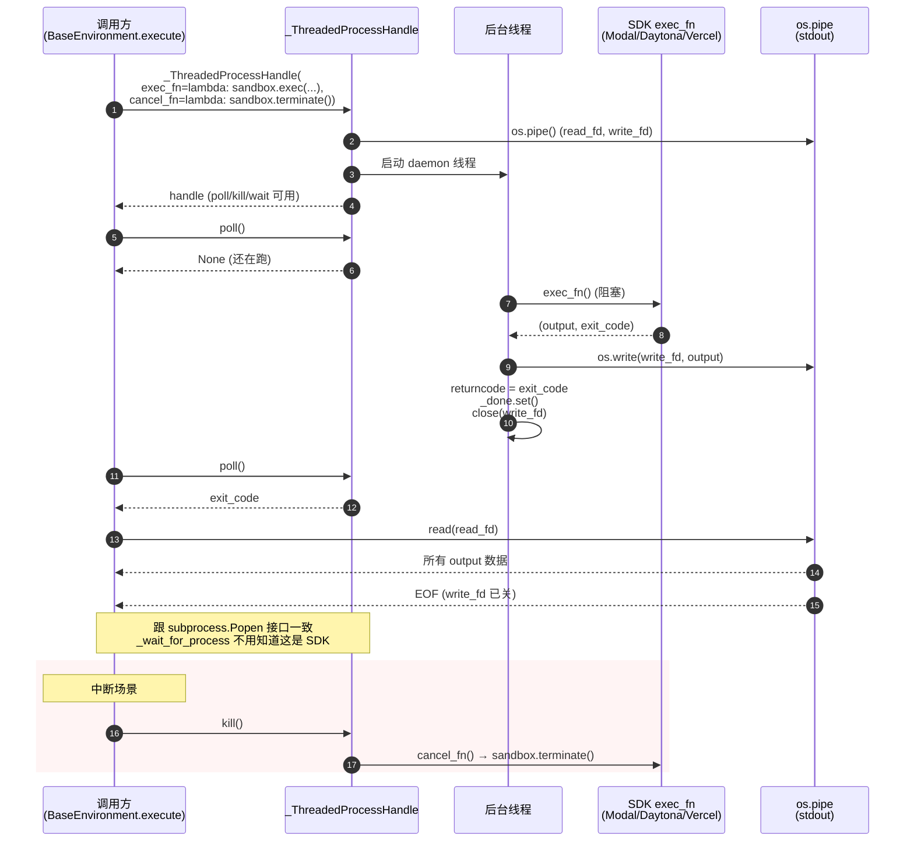
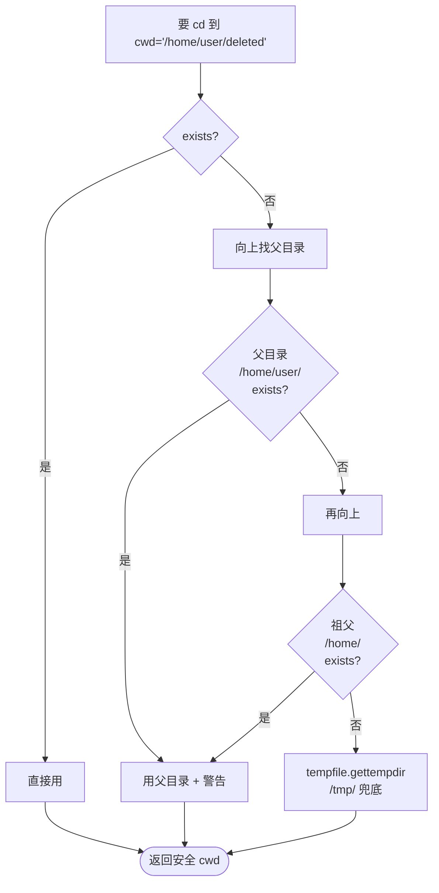
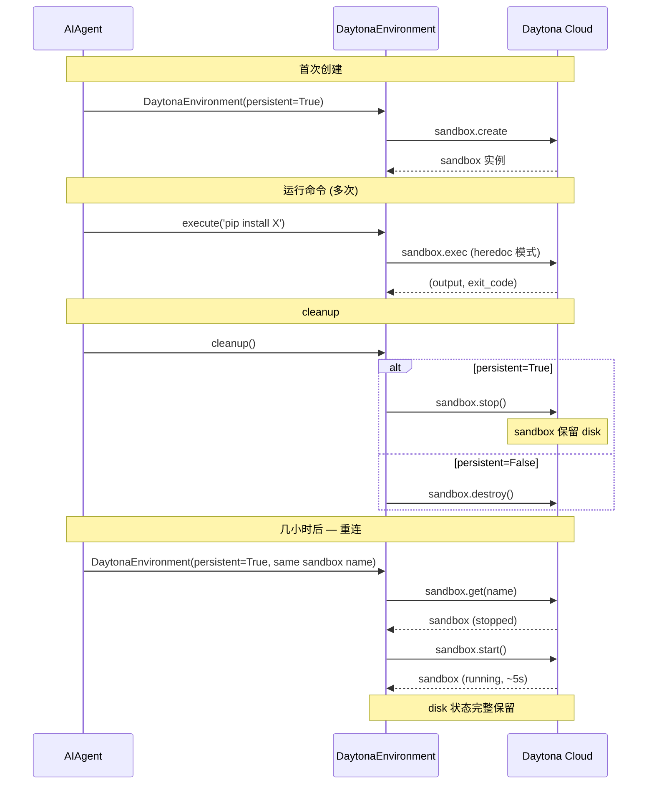
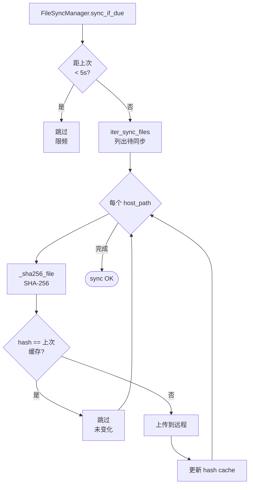
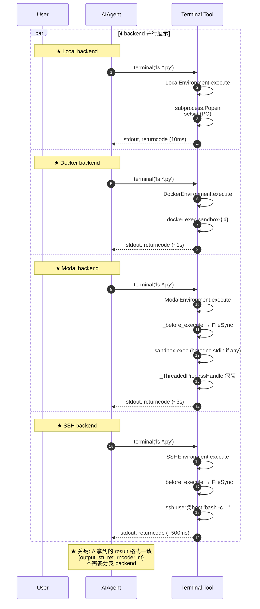

# Phase 6 技术方案：Execution Environment — 七种 Backend

> 本文件以**图形化方式**讲解 Hermes Agent 的"宿主层"——同一个 `terminal` 工具如何在 7 种完全不同的执行环境里以一致语义运行。
>
> 所有引用的文件路径、行号、常量名均已**逐项核对**仓库源码。

---

## 0. 本文件目录

- [1. L6 在系统中的位置](#1-l6-在系统中的位置)
- [2. BaseEnvironment 抽象基类](#2-baseenvironment-抽象基类)
- [3. ProcessHandle 协议（鸭子类型）](#3-processhandle-协议鸭子类型)
- [4. _ThreadedProcessHandle 适配 SDK 后端](#4-_threadedprocesshandle-适配-sdk-后端)
- [5. Session Snapshot 模式](#5-session-snapshot-模式)
- [6. CWD 同步：双策略](#6-cwd-同步双策略)
- [7. _wait_for_process 统一执行循环](#7-_wait_for_process-统一执行循环)
- [8. 七种 Backend 全维度对比](#8-七种-backend-全维度对比)
- [9. Local — 含 CWD 自愈](#9-local--含-cwd-自愈)
- [10. Docker — 容器化 + 持久化可选](#10-docker--容器化--持久化可选)
- [11. SSH — 远程执行 + 文件同步](#11-ssh--远程执行--文件同步)
- [12. Singularity — Overlay FS + SIF Cache](#12-singularity--overlay-fs--sif-cache)
- [13. Modal — 云沙箱 + Snapshot 持久化](#13-modal--云沙箱--snapshot-持久化)
- [14. Daytona — Stop/Resume 模式](#14-daytona--stopresume-模式)
- [15. Vercel Sandbox — Serverless 短暂](#15-vercel-sandbox--serverless-短暂)
- [16. FileSyncManager 共享同步层](#16-filesyncmanager-共享同步层)
- [17. 端到端示例：跨 backend 同一命令](#17-端到端示例跨-backend-同一命令)
- [18. 设计取舍总结表](#18-设计取舍总结表)
- [19. 高频 Q&A 储备](#19-高频-qa-储备)
- [20. 必背图 + 自检清单](#20-必背图--自检清单)
- [21. 关键代码地图](#21-关键代码地图)
- [22. 一句话总结 + 衔接 Phase 7](#22-一句话总结--衔接-phase-7)

---

## 1. L6 在系统中的位置

> Phase 6 解决：**工具实际跑在哪？怎么让 Agent 跨 7 种执行环境用同一份代码？**

```
              ┌────────────────────────────────────────────┐
              │       L3  Capability Layer (Phase 5)        │
              │                                             │
              │  terminal handler                             │
              │    ├─ detect dangerous/hardline              │
              │    ├─ 拿到 env / cwd / cmd                    │
              │    └─ env.execute(command, cwd, ...)          │
              └────────────────┬───────────────────────────┘
                               │
                               ▼
   ╔════════════════════════════════════════════════════════════╗
   ║         L6  Execution Environment                            ║
   ║                                                              ║
   ║  ┌──────────────────────────────────────────────────┐        ║
   ║  │  BaseEnvironment (ABC, 843 行)                    │        ║
   ║  │  • execute() 统一入口                              │        ║
   ║  │  • init_session 捕获 snapshot                      │        ║
   ║  │  • _wait_for_process 通用循环                       │        ║
   ║  │  • _wrap_command CWD 同步逻辑                        │        ║
   ║  │  • _extract_cwd_from_output marker 解析             │        ║
   ║  └──────────────────────────────────────────────────┘        ║
   ║                       │                                       ║
   ║                       ▼ 7 个具体实现                          ║
   ║  ┌─────────┬─────────┬─────────┬─────────┬──────────┐       ║
   ║  │ local   │ docker  │  ssh    │ sing.   │ modal    │       ║
   ║  │ (592)   │ (656)   │ (295)   │ (262)   │ (460)    │       ║
   ║  ├─────────┼─────────┼─────────┼─────────┼──────────┤       ║
   ║  │ daytona │ vercel  │ managed │ file_   │          │       ║
   ║  │ (259)   │ (638)   │ _modal  │ sync    │          │       ║
   ║  │         │         │ (282)   │ (399)   │          │       ║
   ║  └─────────┴─────────┴─────────┴─────────┴──────────┘       ║
   ║                                                              ║
   ║  ┌──────────────────────────────────────────────────┐        ║
   ║  │  共享支撑                                          │        ║
   ║  │  • FileSyncManager (远程 backend 共用)            │        ║
   ║  │  • snapshots.json (Modal/Daytona/Vercel 持久化)   │        ║
   ║  │  • get_sandbox_dir (~/.hermes/sandboxes/)         │        ║
   ║  └──────────────────────────────────────────────────┘        ║
   ╚════════════════════════════════════════════════════════════╝
                               │
                               ▼ 实际执行
              ┌────────────────────────────────────────────┐
              │  Bash / Docker / SSH 远程 / Modal / ...      │
              │  (run command, get stdout/exitcode)          │
              └────────────────────────────────────────────┘
```

### 1.1 核心命题

```
┌──────────────────────────────────────────────────────────────────┐
│                                                                  │
│  Hermes 把"执行环境"做成可插拔的【宿主层】，让 Agent 跑在:           │
│                                                                  │
│   • 用户本机 (local) — 个人开发                                    │
│   • 容器 (docker / singularity) — 隔离 + 可复现                    │
│   • 远程主机 (ssh) — 公司服务器 / 客户机器                          │
│   • 云沙箱 (modal / daytona) — 弹性扩缩 + serverless 冷启复活      │
│   • Serverless (vercel) — 短任务 + 共享 ephemeral                  │
│                                                                  │
│  关键：同一份 terminal 工具代码, 在 7 种环境下行为一致              │
│       (CWD 保留 / env 保留 / 中断响应 / 超时一致)                   │
│                                                                  │
│  这是 Agent 真正做到【从 $5 VPS 到 GPU 集群】部署连续谱的           │
│  工程实现                                                          │
└──────────────────────────────────────────────────────────────────┘
```

---

## 2. BaseEnvironment 抽象基类

> 整个 L6 的"北极星"。所有 backend 都继承并复用 90% 通用逻辑。

### 2.1 BaseEnvironment 全貌（已核对 base.py:288-843）

```
┌──────────────────────────────────────────────────────────────────┐
│  class BaseEnvironment(ABC):                                      │
│                                                                  │
│   ┌─ 类属性 (子类可 override) ─────────────────────────┐         │
│   │  _stdin_mode: "pipe" | "heredoc"                  │         │
│   │   ─► Modal / Daytona 用 heredoc 因为 SDK 无 stdin  │         │
│   │                                                    │         │
│   │  _snapshot_timeout: int = 30                       │         │
│   │   ─► 慢 backend (Modal 冷启) 可调高                 │         │
│   └────────────────────────────────────────────────────┘         │
│                                                                  │
│   ┌─ 实例字段 (constructor 设置) ────────────────────┐           │
│   │  cwd: str        当前工作目录                       │           │
│   │  timeout: int    命令超时                          │           │
│   │  env: dict       环境变量                          │           │
│   │  _session_id: str (uuid hex[:12])                  │           │
│   │  _snapshot_path: str  /tmp/hermes-snap-{id}.sh    │           │
│   │  _cwd_file: str   /tmp/hermes-cwd-{id}.txt        │           │
│   │  _cwd_marker: str  __HERMES_CWD_{id}__            │           │
│   │  _snapshot_ready: bool                             │           │
│   └────────────────────────────────────────────────────┘           │
│                                                                  │
│   ┌─ 抽象方法 (子类必须实现) ────────────────────────┐           │
│   │  @abstractmethod                                  │           │
│   │  def _run_bash(cmd_string, *, login,              │           │
│   │                 timeout, stdin_data)               │           │
│   │  ─► 真正 spawn 一个 bash 进程，返回 ProcessHandle   │           │
│   │                                                    │           │
│   │  @abstractmethod                                  │           │
│   │  def cleanup()                                    │           │
│   │  ─► 释放资源 (容器/沙箱/连接)                       │           │
│   └────────────────────────────────────────────────────┘           │
│                                                                  │
│   ┌─ 核心通用方法 (90% 复用) ──────────────────────┐             │
│   │  execute(command, cwd, *, timeout, stdin_data) │             │
│   │   ─► 统一入口 (★ 90% 逻辑在这)                    │             │
│   │                                                  │             │
│   │  init_session()                                  │             │
│   │   ─► 启动时捕获 snapshot                          │             │
│   │                                                  │             │
│   │  _wrap_command(command, cwd)                    │             │
│   │   ─► 包装 bash script (snapshot + cd + cmd +     │             │
│   │      重导出 env + CWD marker)                    │             │
│   │                                                  │             │
│   │  _wait_for_process(proc, timeout)               │             │
│   │   ─► select 非阻塞 drain + 中断 + 超时检测        │             │
│   │                                                  │             │
│   │  _update_cwd / _extract_cwd_from_output         │             │
│   │   ─► 从输出中解析 CWD marker                       │             │
│   │                                                  │             │
│   │  _embed_stdin_heredoc                            │             │
│   │   ─► SDK backend 把 stdin 嵌成 heredoc            │             │
│   │                                                  │             │
│   │  _before_execute()  hook (远程 backend 用于触发  │             │
│   │                          FileSync)                │             │
│   └────────────────────────────────────────────────────┘           │
└──────────────────────────────────────────────────────────────────┘
```

### 2.2 execute() 统一流程图

```mermaid
flowchart TD
    Start([execute command, cwd]) --> Hook[_before_execute<br/>远程 backend 触发 FileSync]
    Hook --> Prep[_prepare_command<br/>转换 sudo / 处理 stdin]
    Prep --> Rewrite[_rewrite_compound_background<br/>处理 'A && B &' 子壳陷阱]
    Rewrite --> Merge[合并 sudo_stdin + caller stdin]
    Merge --> Heredoc{_stdin_mode<br/>== 'heredoc'?}
    Heredoc -->|是<br/>Modal/Daytona| Embed[_embed_stdin_heredoc<br/>把 stdin 拼成 heredoc]
    Heredoc -->|否<br/>Local/Docker/SSH| KeepPipe[stdin 走管道]
    Embed --> Wrap[_wrap_command<br/>包装 bash script]
    KeepPipe --> Wrap

    Wrap --> Snap{snapshot<br/>_ready?}
    Snap -->|是| SourceSnap[script 开头 source snapshot]
    Snap -->|否| LoginShell[降级用 bash -l<br/>(login=True)]
    SourceSnap --> CD[builtin cd -- 目标 cwd<br/>失败 exit 126]
    LoginShell --> CD
    CD --> RunCmd[eval 用户命令]
    RunCmd --> Dump[重导出 env 到 snapshot]
    Dump --> Marker[printf CWD marker<br/>__HERMES_CWD_{id}__path__HERMES_CWD_{id}__]
    Marker --> ExitCmd[exit 用户命令 exitcode]

    ExitCmd --> Run[子类 _run_bash<br/>spawn 进程]
    Run --> Wait[_wait_for_process<br/>poll + drain + 中断]
    Wait --> Update[_update_cwd<br/>解析 marker]
    Update --> Return([return output + returncode])

    style Hook fill:#fff5d6
    style Wrap fill:#dfd
    style Run fill:#dfd
    style Wait fill:#ffd
    style Return fill:#9f9
```

### 2.3 _wrap_command 包装的实际 bash 脚本

```bash
# 这是 BaseEnvironment._wrap_command 包装出来的最终脚本骨架:

source /tmp/hermes-snap-abc123.sh >/dev/null 2>&1 || true
   ↑ 加载 snapshot (env / functions / aliases)

builtin cd -- '/home/user/project' || exit 126
   ↑ 跳到目标目录 (失败立刻退出)

eval 'ls -la'                  # ← 用户命令 (escape 后)
__hermes_ec=$?                  # ← 抓 exit code

export -p > /tmp/hermes-snap-abc123.sh 2>/dev/null || true
   ↑ 把当前 env 重写回 snapshot (last-writer-wins)

pwd -P > /tmp/hermes-cwd-abc123.txt 2>/dev/null || true
   ↑ 写 cwd 到 temp file (local backend 读这)

printf '\n__HERMES_CWD_abc123__%s__HERMES_CWD_abc123__\n' "$(pwd -P)"
   ↑ 输出 cwd marker (远程 backend 解析这)

exit $__hermes_ec
   ↑ 退出用户命令的 exit code
```

---

## 3. ProcessHandle 协议（鸭子类型）

### 3.1 ProcessHandle Protocol（已核对 base.py:187-202）

```
┌──────────────────────────────────────────────────────────────┐
│  class ProcessHandle(Protocol):                               │
│                                                              │
│   # 4 个必备方法 (subprocess.Popen 原生满足)                   │
│                                                              │
│   def poll() -> int | None                                    │
│   ─► 探测进程是否还在跑                                        │
│                                                              │
│   def kill() -> None                                          │
│   ─► 终止进程                                                  │
│                                                              │
│   def wait(timeout) -> int                                    │
│   ─► 阻塞等待结束                                              │
│                                                              │
│   @property stdout -> IO[str] | None                          │
│   ─► 输出流 (供 _wait_for_process drain)                      │
│                                                              │
│   @property returncode -> int | None                          │
│   ─► 退出码 (poll 之后才有)                                    │
│                                                              │
│  ★ 用 Protocol 而非继承 = 鸭子类型                            │
│   ─► subprocess.Popen 直接当 ProcessHandle 用                  │
│   ─► SDK 后端实现一个适配器即可                                │
└──────────────────────────────────────────────────────────────┘
```

### 3.2 为什么用 Protocol 而不是基类

```
┌──────────────────────────────────────────────────────────────────┐
│  方案 A: 继承                                                      │
│  ─────                                                             │
│   class MyHandle(BaseHandle):                                     │
│       def poll(self): ...                                         │
│                                                                  │
│   ✗ subprocess.Popen 已经存在, 不能改它的基类                       │
│   ✗ 需要 wrapper / adapter                                        │
│                                                                  │
│  方案 B (Hermes): Protocol 鸭子类型                                │
│  ─────                                                             │
│   class ProcessHandle(Protocol):                                  │
│       def poll(self) -> int | None: ...                           │
│                                                                  │
│   ✓ subprocess.Popen 不用改, 静态类型检查能识别它满足 Protocol     │
│   ✓ SDK adapter (_ThreadedProcessHandle) 也能直接用                │
│   ✓ Python 运行时不强制检查, 只验 attribute 存在                   │
└──────────────────────────────────────────────────────────────────┘
```

---

## 4. _ThreadedProcessHandle 适配 SDK 后端

> Modal/Daytona/Vercel 的 SDK 调用是**阻塞同步函数**（`sandbox.exec()`返回 `(output, exit_code)`），无法直接当 `subprocess.Popen` 用。

### 4.1 _ThreadedProcessHandle 工作机制（已核对 base.py:205-271）



### 4.2 接口统一带来的好处

```
┌──────────────────────────────────────────────────────────────┐
│  统一了 ProcessHandle 接口后:                                   │
│                                                              │
│  • _wait_for_process 不需要分支判断                            │
│   ─► 通用 select drain + 中断 + 超时 + 心跳逻辑                │
│   ─► 一份代码服务 7 个 backend                                 │
│                                                              │
│  • 测试更简单                                                  │
│   ─► mock 一个 ProcessHandle 就能单测 _wait_for_process         │
│                                                              │
│  • 新增 backend 成本低                                          │
│   ─► 实现 _run_bash + cleanup 即可                             │
│   ─► 复用全部生命周期逻辑                                       │
└──────────────────────────────────────────────────────────────┘
```

---

## 5. Session Snapshot 模式

> 同一个 backend 内的多次 `terminal` 调用要**记住 env 变化**——但 backend 不维护长连接 shell。

### 5.1 问题与方案

```
┌──────────────────────────────────────────────────────────────────┐
│  问题:                                                             │
│   命令 1: export FOO=bar                                          │
│   命令 2: echo $FOO                                                │
│                                                                  │
│  方案 A: 长连接 shell                                              │
│   ✗ ssh 长连接经常 reset, docker exec 也是 spawn-per-call         │
│   ✗ Modal/Daytona SDK 是 stateless                                │
│   ✗ 维护"持久 shell"代码复杂, 跨平台差异大                          │
│                                                                  │
│  方案 B (Hermes): spawn-per-call + snapshot                       │
│   ✓ 每次都新 bash 进程                                             │
│   ✓ 命令前 source snapshot 恢复 env                                │
│   ✓ 命令后 export -p 重写回 snapshot                               │
│   ─► 跨命令 env 像 "持续会话"                                      │
│                                                                  │
│  ★ snapshot 文件位置:                                              │
│   /tmp/hermes-snap-{12 字符 session id}.sh                        │
│   ─► 内嵌环境内, 命令可读                                          │
└──────────────────────────────────────────────────────────────────┘
```

### 5.2 init_session 流程（已核对 base.py:351-400）

```mermaid
flowchart TD
    Start([backend 构造完成]) --> Init[BaseEnvironment.init_session]
    Init --> Bootstrap[bash bootstrap 脚本:]

    Bootstrap --> Step1[export -p > snapshot.sh<br/>★ 导出所有 env vars]
    Step1 --> Step2[declare -f >> snapshot.sh<br/>★ 导出 shell functions<br/>(过滤 _ 开头的内部)]
    Step2 --> Step3[alias -p >> snapshot.sh<br/>★ 导出 aliases]
    Step3 --> Step4[echo 'shopt -s expand_aliases'<br/>★ 确保 alias 在非 interactive 也生效]
    Step4 --> Step5[echo 'set +e' '+u'<br/>★ 关闭 errexit/nounset 防止<br/>用户命令意外中断]
    Step5 --> Step6[cd 用户 cwd]
    Step6 --> Step7[pwd -P > cwd_file]
    Step7 --> Step8[printf CWD marker]

    Step8 --> Run[bash -l 执行 bootstrap]
    Run --> Success{成功?}
    Success -->|是| Ready[_snapshot_ready = True<br/>后续命令 source snapshot]
    Success -->|否| Fallback[_snapshot_ready = False<br/>每次都 bash -l 重新加载 profile]

    style Ready fill:#9f9
    style Fallback fill:#ffd
```

### 5.3 三类资源被 snapshot

```
┌──────────────────────────────────────────────────────────────┐
│  Snapshot 保存的 3 类资源:                                       │
│                                                              │
│  ① 环境变量                                                    │
│   • export PATH=...                                          │
│   • export FOO=bar                                           │
│   • export PYTHON_PATH=...                                   │
│                                                              │
│  ② Shell 函数                                                  │
│   • function deploy() { kubectl apply ... }                  │
│   • function chk() { ... }                                   │
│   ★ 过滤 _开头的内部函数 (declare -f | grep -vE '^_[^_]')      │
│                                                              │
│  ③ Aliases                                                    │
│   • alias ll='ls -la'                                        │
│   • alias gst='git status'                                   │
│   ★ shopt -s expand_aliases 让 alias 在 non-interactive 起效   │
│                                                              │
│  ─────                                                        │
│  不在 snapshot:                                                │
│   ✗ shell 当前进程相关 (PID, history)                          │
│   ✗ 文件描述符 (open files)                                    │
│   ✗ 后台作业 (jobs 表)                                         │
│   ─► 这些是"真 shell"才有, spawn-per-call 模型本就没有          │
└──────────────────────────────────────────────────────────────┘
```

---

## 6. CWD 同步：双策略

> 用户 `cd /tmp` 后下一条命令必须看到自己在 /tmp——但 backend 没有持久 shell。

### 6.1 双策略对比

```
┌──────────────────────────────────────────────────────────────────┐
│                                                                  │
│  ┌── 策略 A: 临时文件 (Local) ──────────────┐                     │
│  │                                            │                   │
│  │  命令包装末尾:                              │                   │
│  │    pwd -P > /tmp/hermes-cwd-{id}.txt       │                   │
│  │                                            │                   │
│  │  下一次 execute() 前:                       │                   │
│  │    self.cwd = open(cwd_file).read().strip()│                   │
│  │                                            │                   │
│  │  ✓ 简单, 不污染 stdout                       │                   │
│  │  ✗ 不适用远程 backend (host fs ≠ remote fs) │                   │
│  └────────────────────────────────────────────┘                   │
│                                                                  │
│  ┌── 策略 B: stdout marker (远程) ──────────┐                     │
│  │                                            │                   │
│  │  命令包装末尾:                              │                   │
│  │    printf '\n{MARKER}%s{MARKER}\n' $(pwd) │                   │
│  │                                            │                   │
│  │  _extract_cwd_from_output():                │                   │
│  │    output.rfind(MARKER) 找最后一对           │                   │
│  │    取中间字符串 = cwd                        │                   │
│  │    从 result 中 strip marker 行              │                   │
│  │                                            │                   │
│  │  ✓ 跨网络 / 跨容器都行                       │                   │
│  │  ✗ marker 字符串占用一点带宽                  │                   │
│  └────────────────────────────────────────────┘                   │
│                                                                  │
│  ★ marker 设计:                                                    │
│    __HERMES_CWD_{session_id}__/path/to/dir__HERMES_CWD_{id}__    │
│                                                                  │
│   ★ session_id 在 marker 里 → 多个 backend 实例并存不串            │
│   ★ 头尾两个 marker → 中间路径就算含空格 / 特殊字符也能精确抽出      │
└──────────────────────────────────────────────────────────────────┘
```

### 6.2 _extract_cwd_from_output 算法（已核对 base.py:724-756）

```mermaid
flowchart TD
    Start[parse output] --> RFind[output.rfind MARKER<br/>找最右的 marker (结束位)]
    RFind --> Found1{找到?}
    Found1 -->|否| Skip[跳过<br/>命令可能崩了]
    Found1 -->|是| RFind2[output.rfind MARKER<br/>start, last 范围<br/>找开始位]
    RFind2 --> Found2{找到 且不重叠?}
    Found2 -->|否| Skip
    Found2 -->|是| Extract[取中间内容<br/>= cwd 路径]

    Extract --> Update[self.cwd = cwd_path]
    Update --> Strip[strip marker 行<br/>从 result.output 移除]
    Strip --> Done([完成])

    Skip --> Done
    style Done fill:#9f9
```

---

## 7. _wait_for_process 统一执行循环

> 这是 base.py 里**最重要的 200 行**——所有 backend 共享这套执行监控逻辑。

### 7.1 4 个并行职责

```
┌──────────────────────────────────────────────────────────────────┐
│  _wait_for_process 同时做 4 件事:                                  │
│                                                                  │
│  ① 非阻塞 stdout drain                                            │
│   • select.select(fd, 0.1s timeout)                              │
│   • os.read(4096) raw bytes                                       │
│   • IncrementalDecoder UTF-8 跨 chunk 边界                        │
│   • errors="replace" 兜底                                         │
│                                                                  │
│  ② 进程退出检测                                                    │
│   • proc.poll() 主循环每 200ms 调一次                              │
│   • 退出后 idle 3 次 (~300ms) 再退 drain 防 grandchild 持 pipe     │
│                                                                  │
│  ③ 中断检测                                                        │
│   • is_interrupted() 检查 thread-local 标志                        │
│   • 触发: self._kill_process(proc) → returncode=130              │
│                                                                  │
│  ④ 超时检测                                                        │
│   • time.monotonic() > deadline                                   │
│   • 触发: self._kill_process(proc) → returncode=124              │
│                                                                  │
│  ⑤ 心跳上报 (subjob, gateway 用)                                  │
│   • touch_activity_if_due 每 10s 调一次 activity_callback         │
│   • 让 gateway 知道 "agent 还活着"                                 │
└──────────────────────────────────────────────────────────────────┘
```

### 7.2 主循环时序（已核对 base.py:483-707）

```mermaid
flowchart TB
    Start[启动 drain 线程<br/>启动 deadline 定时] --> Loop{proc.poll<br/>== None?}

    Loop -->|否 进程已退| Final[join drain 线程 2s<br/>close stdout<br/>return output + returncode]

    Loop -->|是 还在跑| Int{is_interrupted?}
    Int -->|是| Kill1[_kill_process<br/>join drain 2s<br/>return + Command interrupted<br/>returncode=130]

    Int -->|否| TO{time > deadline?}
    TO -->|是| Kill2[_kill_process<br/>return + Command timed out<br/>returncode=124]

    TO -->|否| Activity[touch_activity_if_due<br/>10s cadence 心跳]
    Activity --> Sleep[time.sleep 0.2s]
    Sleep --> Loop

    Loop -->|KeyboardInterrupt<br/>SystemExit| Cleanup[_kill_process<br/>(防 orphan PPID=1)]
    Cleanup --> Reraise[raise]

    style Final fill:#9f9
    style Kill1 fill:#ffd
    style Kill2 fill:#ffd
    style Cleanup fill:#fdd
```

### 7.3 "grandchild 持 pipe" 陷阱（已核对 base.py:505-516）

```
┌──────────────────────────────────────────────────────────────────┐
│  场景:                                                             │
│   用户命令: setsid uvicorn app:main & disown                       │
│   ─► bash 启动 setsid                                              │
│   ─► setsid 启动 uvicorn (grandchild)                              │
│   ─► bash 退出                                                     │
│   ─► uvicorn 仍在跑, 持有 bash 的 stdout pipe (继承自 fork)        │
│                                                                  │
│  传统 drain (for line in proc.stdout):                            │
│   • readline 阻塞等 EOF                                             │
│   • 只要 grandchild 还在跑, pipe 不 EOF                            │
│   • Hermes terminal 工具卡死整个会话                                │
│                                                                  │
│  Hermes 方案 (base.py:550-571):                                   │
│   • select(fd, 0.1s) 非阻塞 poll                                  │
│   • bash 退出后, 监测 idle 100ms × 3 次                            │
│   • 3 次都没数据 → 退 drain (即使 pipe 未 EOF)                     │
│   • grandchild 后续写入流入孤儿 pipe (kernel 自动回收)              │
│                                                                  │
│  这是 #8340 的修复:                                                │
│   "setsid ... & disown" 不再让 terminal 工具无限等待                │
└──────────────────────────────────────────────────────────────────┘
```

---

## 8. 七种 Backend 全维度对比

### 8.1 全维度矩阵

```
┌──────────┬────────┬─────────┬─────────┬─────────┬────────┬────────┬────────┐
│ 维度      │ local  │ docker  │ ssh     │ singul. │ modal  │daytona │vercel  │
├──────────┼────────┼─────────┼─────────┼─────────┼────────┼────────┼────────┤
│ 行数      │ 592    │ 656     │ 295     │ 262     │ 460    │ 259    │ 638    │
├──────────┼────────┼─────────┼─────────┼─────────┼────────┼────────┼────────┤
│ 隔离      │ 无 (host)│ 容器  │ 远程host│ Overlay │ 云沙箱  │ 云沙箱  │serverl.│
│           │         │         │         │ FS      │         │         │        │
├──────────┼────────┼─────────┼─────────┼─────────┼────────┼────────┼────────┤
│ 启动延迟  │ ~10ms  │ ~1s     │ ~200ms  │ ~500ms  │ ~30s   │ ~5s    │ ~2s    │
├──────────┼────────┼─────────┼─────────┼─────────┼────────┼────────┼────────┤
│ 持久化    │ 原生 FS│ Volume  │ 远程 FS │ overlay │snapshot│stop/   │ snapshot│
│           │         │ mount   │         │         │ ID     │resume  │ id     │
├──────────┼────────┼─────────┼─────────┼─────────┼────────┼────────┼────────┤
│ 文件同步  │ 无需   │ 无需    │ FileSync│ 无需    │FileSync│FileSync│FileSync│
│           │ (host) │(bind mt)│ Manager │ (bind)  │Manager │Manager │Manager │
├──────────┼────────┼─────────┼─────────┼─────────┼────────┼────────┼────────┤
│ _stdin    │ pipe   │ pipe    │ pipe    │ pipe    │ pipe   │heredoc │ pipe   │
│ _mode     │        │         │         │         │        │        │        │
├──────────┼────────┼─────────┼─────────┼─────────┼────────┼────────┼────────┤
│ Snapshot │ 30s    │ 30s     │ 60s     │ 30s     │ 120s   │ 60s    │ 60s    │
│ Timeout  │        │         │         │         │ (冷启) │        │        │
├──────────┼────────┼─────────┼─────────┼─────────┼────────┼────────┼────────┤
│ Process  │subproc │ docker  │ ssh + p │ apptain │_Thread │_Thread │_Thread │
│ Handle   │.Popen  │ exec    │ subproc │ er exec │edHandle│edHandle│edHandle│
├──────────┼────────┼─────────┼─────────┼─────────┼────────┼────────┼────────┤
│ Cleanup  │ 进程组 │ rm -f   │ ssh     │ instance│sandbox.│sandbox.│sandbox.│
│ 动作     │ kill   │ contain │ connect │ stop    │termin- │stop or │stop or │
│           │ (setsid│ er      │ close   │         │ ate    │destroy │destroy │
│           │  PG)   │         │         │         │        │        │        │
├──────────┼────────┼─────────┼─────────┼─────────┼────────┼────────┼────────┤
│ CWD 同步 │ temp   │ marker  │ marker  │ marker  │ marker │marker  │ marker │
│           │ file   │ stdout  │ stdout  │ stdout  │ stdout │ stdout │ stdout │
├──────────┼────────┼─────────┼─────────┼─────────┼────────┼────────┼────────┤
│ 特殊机制  │ CWD 自愈│ persist │ host    │ SIF     │ snapshot│stop/   │transi- │
│           │ +shell │ ent vol │ key 校验│ cache   │ id 文件 │resume  │ent     │
│           │ init   │ 可选    │         │         │         │        │ retry  │
└──────────┴────────┴─────────┴─────────┴─────────┴────────┴────────┴────────┘
```

### 8.2 部署连续谱（成本 × 隔离）

```
   隔离强 ▲
          │           Modal (~30s start, $0.001/min)
          │              ★ snapshot 跨会话, 适合 batch
          │         ●
          │
          │      Daytona (~5s, 持久 stop/resume)
          │      ●
          │
          │   Vercel Sandbox (~2s, ephemeral)
          │   ●
          │
          │  Docker (~1s, host-bound)
          │ ●        Singularity (~500ms, overlay)
          │           ●
          │
          │     SSH (~200ms, 远程主机)
          │      ●
          │
          │  Local (~10ms, 零隔离)
          │  ●
          └──────────────────────────────────────────► 启动开销
            0ms   100ms   1s    5s    30s
```

---

## 9. Local — 含 CWD 自愈

> 跑在用户本机，最快，但要应对各种古怪场景。

### 9.1 Local 特有逻辑

```
┌──────────────────────────────────────────────────────────────────┐
│  class LocalEnvironment(BaseEnvironment):                         │
│                                                                  │
│   ┌─ 关键设计 ────────────────────────────────────────┐         │
│   │                                                    │         │
│   │  ① CWD 自愈 (_resolve_safe_cwd)                    │         │
│   │     • 工具命令删了自己的 cwd → 下次 cd 失败 (exit 126) │         │
│   │     • 解决: 探测当前 cwd 是否存在                    │         │
│   │       不存在 → 回退到最近存在的祖先目录              │         │
│   │       彻底无解 → tempfile.gettempdir()              │         │
│   │                                                    │         │
│   │  ② Shell init 文件预 source                         │         │
│   │     • bashrc / zshrc / fish.config 等               │         │
│   │     • 用户 alias / function 自动可用                 │         │
│   │                                                    │         │
│   │  ③ Subprocess env 净化 (_sanitize_subprocess_env)  │         │
│   │     • _PROVIDER_ENV_BLOCKLIST 屏蔽 LLM key 给       │         │
│   │       子进程 (防 key leak 到 user 命令)              │         │
│   │     • 例: OPENAI_API_KEY 不传给 bash                │         │
│   │                                                    │         │
│   │  ④ Process group kill (os.setsid)                  │         │
│   │     • subprocess.Popen 用 preexec_fn=os.setsid     │         │
│   │     • _kill_process kill 整个 PG                    │         │
│   │     • 防 grandchild orphan (PPID=1)                 │         │
│   └────────────────────────────────────────────────────┘         │
└──────────────────────────────────────────────────────────────────┘
```

### 9.2 _resolve_safe_cwd 流程图



---

## 10. Docker — 容器化 + 持久化可选

### 10.1 关键参数

```
┌──────────────────────────────────────────────────────────────────┐
│  DockerEnvironment(<cwd>, <timeout>,                              │
│                    persistent_filesystem=False,  # ★ 关键          │
│                    image='hermes/sandbox:latest',                  │
│                    forward_env=[...],  # 哪些 host env 传入容器     │
│                    run_as_host_user=True,  # 容器内用户 = host UID  │
│                    ...)                                            │
│                                                                  │
│  persistent_filesystem 双模式:                                     │
│                                                                  │
│  ┌─ False (默认, ephemeral) ──────────────────────────┐           │
│  │  • Volume 是 tmpfs (内存)                          │           │
│  │  • cleanup 时 docker rm -f, 数据全丢                │           │
│  │  • 适合 batch / 临时任务                            │           │
│  └────────────────────────────────────────────────────┘           │
│                                                                  │
│  ┌─ True (持久化) ────────────────────────────────────┐           │
│  │  • Volume 挂载到 host 的                            │           │
│  │    {TERMINAL_SANDBOX_DIR}/{session_id}              │           │
│  │  • cleanup 时仅停止容器, 不删数据                    │           │
│  │  • 下次同 session_id 重连同卷                       │           │
│  │  • 适合长会话                                       │           │
│  └────────────────────────────────────────────────────┘           │
└──────────────────────────────────────────────────────────────────┘
```

### 10.2 安全 args

```
┌──────────────────────────────────────────────────────────────┐
│  _build_security_args (docker.py:180):                        │
│                                                              │
│   • --security-opt=no-new-privileges                          │
│     ─► 防止 setuid 提权                                       │
│                                                              │
│   • --cap-drop=ALL                                            │
│     ─► 移除所有 Linux capabilities                            │
│                                                              │
│   • run-as-host-user 时:                                      │
│     --user=$(id -u):$(id -g)                                  │
│     ─► 容器内进程不是 root, 防写入 host 文件时权限错乱        │
│                                                              │
│   • 容器内 sleep infinity 跑底层进程                          │
│     ─► docker exec 进入做命令                                 │
│     ─► 无固定 lifetime, 由 cleanup / 闲置回收触发              │
└──────────────────────────────────────────────────────────────┘
```

---

## 11. SSH — 远程执行 + 文件同步

```
┌──────────────────────────────────────────────────────────────────┐
│  SSHEnvironment 关键设计:                                          │
│                                                                  │
│   ① subprocess + ssh 命令                                          │
│     • 不用 paramiko (避免依赖)                                     │
│     • 直接 ssh user@host 'bash -c {wrapped}'                       │
│                                                                  │
│   ② FileSyncManager 处理本地 → 远程同步                            │
│     • ~/.hermes/skills/ → ~/.hermes/skills/ (远程)                │
│     • ~/.hermes/memories/ → 同步                                  │
│     • 限频 + 内容 hash 校验                                        │
│                                                                  │
│   ③ host key 校验                                                  │
│     • 第一次连接 prompt 用户确认                                    │
│     • known_hosts 写入                                             │
│                                                                  │
│   ④ Snapshot 跑在远程                                              │
│     • /tmp/hermes-snap-{id}.sh 是远程的                            │
│     • 同 session 内多次 ssh 共用同一文件                            │
│     • 60s snapshot timeout (远程慢)                                │
└──────────────────────────────────────────────────────────────────┘
```

---

## 12. Singularity — Overlay FS + SIF Cache

> 给科研集群 / HPC 用，Apptainer 是 Singularity 的现代分支。

```
┌──────────────────────────────────────────────────────────────────┐
│  SingularityEnvironment 关键设计:                                  │
│                                                                  │
│   ① SIF 镜像构建 + 缓存                                            │
│     • _get_or_build_sif(image_uri):                               │
│       - docker:// 或 oras:// 拉取 → 转成 .sif 文件                 │
│       - 缓存到 _get_apptainer_cache_dir()                          │
│       - 同一 image_uri 只构建一次                                   │
│                                                                  │
│   ② Overlay 持久化 (persistent_filesystem=True)                    │
│     • 创建 overlay.img 在 scratch 目录                              │
│     • 容器写入落到 overlay, 镜像本身不变                            │
│     • 多次启动 mount 同一 overlay → 持久                            │
│                                                                  │
│   ③ apptainer instance start/stop                                  │
│     • 后台跑 instance, 命令通过 instance:// exec                   │
│     • 比每次冷启快                                                  │
│                                                                  │
│   ★ 跟 Docker 的核心差异:                                          │
│    • Singularity 默认 user namespace, rootless                    │
│    • SIF 是只读镜像 + overlay 可写, Docker 是分层 layered           │
│    • 在 HPC 共享集群上更友好                                        │
└──────────────────────────────────────────────────────────────────┘
```

---

## 13. Modal — 云沙箱 + Snapshot 持久化

> Modal 是 serverless 容器平台，Hermes 用它做"按需冷启 + 跨会话状态保留"。

### 13.1 Modal Snapshot 机制（已核对 modal.py:38-69）

```mermaid
sequenceDiagram
    autonumber
    participant U as User
    participant A as AIAgent
    participant M as ModalEnvironment
    participant S as Modal Cloud
    participant File as ~/.hermes/<br/>modal_snapshots.json

    Note over U,A: 会话 1 (首次)
    U->>A: hermes (新会话)
    A->>M: 构造 ModalEnvironment(task_id='abc')
    M->>File: _load_snapshots() → 查 task_id='abc'
    File-->>M: 没有
    M->>S: Sandbox.create from base image
    S-->>M: sandbox 实例
    M->>M: init_session (cold start ~30s)

    Note over M,S: 用户跑了一堆命令...
    M->>S: exec 'pip install ...'
    M->>S: exec 'wget ... ; ...'
    M->>S: ...

    Note over U,A: 用户 /reset 或退出
    A->>M: cleanup()
    M->>S: sandbox.snapshot_filesystem()
    S-->>M: snapshot_id 'sn_xyz'
    M->>File: _store_direct_snapshot(<br/>  task_id='abc', snapshot_id='sn_xyz')
    M->>S: sandbox.terminate()

    Note over U,A: 几小时后 — 会话 2
    U->>A: hermes (恢复同 task_id)
    A->>M: ModalEnvironment(task_id='abc')
    M->>File: 查 task_id='abc'
    File-->>M: snapshot_id='sn_xyz'
    M->>S: Sandbox.from_snapshot('sn_xyz')
    S-->>M: sandbox 实例 (含上次的 FS)

    Note over M: ★ pip install 的包仍在<br/>★ wget 下载的文件仍在<br/>但进程不在 (那是新沙箱)
```

### 13.2 持久化的语义

```
┌──────────────────────────────────────────────────────────────┐
│  Modal "Hibernate when idle, wake on demand" 实际含义:           │
│                                                              │
│  ✓ 文件系统【持久】                                            │
│    • pip install 的包                                         │
│    • wget 下载的文件                                          │
│    • 写入的配置                                               │
│                                                              │
│  ✗ 进程【不持久】                                              │
│    • 长跑的 server (uvicorn 等) 会死                          │
│    • Background 作业丢失                                      │
│    • 在跑的命令被打断                                          │
│                                                              │
│  ✗ 网络状态不持久                                              │
│    • TCP 连接断了                                              │
│                                                              │
│  ★ 用户感受:                                                   │
│   "重新进入沙箱, 像从硬盘启动到上次关机状态"                    │
│   (类似 cold boot, 不是 sleep/resume)                          │
└──────────────────────────────────────────────────────────────┘
```

### 13.3 ManagedModal — Gateway 托管 Modal

> 给 Hermes Gateway 跑商业服务用，是 ModalEnvironment 的特殊版本。

```
┌──────────────────────────────────────────────────────────────┐
│  ManagedModalEnvironment (282 行):                            │
│                                                              │
│   • Hermes Gateway 自己持有 Modal token                       │
│   • 用户不用配 Modal account                                  │
│   • snapshotBeforeTerminate=true: cleanup 自动 snapshot       │
│   • persistentFilesystem 模式可配                              │
│                                                              │
│  ★ 给"用户不想配云账号但要持久沙箱"的场景                       │
└──────────────────────────────────────────────────────────────┘
```

---

## 14. Daytona — Stop/Resume 模式

> Daytona 是另一个 dev sandbox 平台，模型更接近"VM 暂停"。

### 14.1 Daytona vs Modal 对比

```
┌──────────────────────┬────────────────────────────────────────┐
│  维度                 │  Modal               │  Daytona        │
├──────────────────────┼──────────────────────┼─────────────────┤
│  持久化方式           │  snapshot ID         │  stop/resume    │
│                       │  (filesystem only)   │  (sandbox stays)│
├──────────────────────┼──────────────────────┼─────────────────┤
│  恢复延迟             │  ~30s (cold start    │  ~5s (resume    │
│                       │   from image)        │   from disk)    │
├──────────────────────┼──────────────────────┼─────────────────┤
│  进程持久             │  ✗ 完全冷启           │  ⚠ 不保证         │
│                       │                      │  (平台可能 GC)  │
├──────────────────────┼──────────────────────┼─────────────────┤
│  Stdin Mode          │  pipe                │  heredoc ★       │
│                       │                      │  (SDK 无 stdin) │
├──────────────────────┼──────────────────────┼─────────────────┤
│  Cleanup 行为         │  terminate +         │  stop / destroy │
│                       │  store snapshot      │  (持久 vs 非持久)│
├──────────────────────┼──────────────────────┼─────────────────┤
│  典型用法             │  Batch / RL 训练      │  长会话开发     │
│                       │  跨会话恢复          │  持久工作环境   │
└──────────────────────┴──────────────────────┴─────────────────┘
```

### 14.2 Daytona 流程



---

## 15. Vercel Sandbox — Serverless 短暂

```
┌──────────────────────────────────────────────────────────────────┐
│  VercelSandboxEnvironment 关键设计:                                │
│                                                                  │
│   ① Serverless 短任务                                              │
│     • 适合一次性命令, 不适合长会话                                   │
│                                                                  │
│   ② Snapshot 持久化 (同 Modal 模式)                                │
│     • _snapshot_store_path 存 ~/.hermes/vercel_snapshots.json    │
│     • cleanup 时 sandbox.snapshot, 下次 from_snapshot              │
│                                                                  │
│   ③ Transient error retry                                          │
│     • _is_transient_vercel_error (HTTP 502/503/504, 网络故障)      │
│     • _retry_vercel_call 指数退避                                  │
│     • 比 SSH / Modal 更激进重试 (serverless 不稳定)                 │
│                                                                  │
│   ④ FileSyncManager + heredoc stdin                                │
└──────────────────────────────────────────────────────────────────┘
```

---

## 16. FileSyncManager 共享同步层

> 远程 backend (SSH/Modal/Daytona/Vercel) 共享的本地↔远程文件同步组件。

### 16.1 同步的文件清单（已核对 file_sync.py:49）

```
┌──────────────────────────────────────────────────────────────┐
│  iter_sync_files() 默认同步:                                   │
│                                                              │
│   Host (本地)                 → Remote (容器内 /root/.hermes)  │
│   ──────────                  ──────────                       │
│                                                              │
│   ~/.hermes/memories/MEMORY.md  → /root/.hermes/memories/...   │
│   ~/.hermes/memories/USER.md    → /root/.hermes/memories/...   │
│   ~/.hermes/skills/ (递归)      → /root/.hermes/skills/        │
│   ~/.hermes/cli-config.yaml     → /root/.hermes/cli-config.yaml│
│                                                              │
│   ★ 目的: 让远程 Agent 也能用同一份 memory + skills            │
│   ★ 不同步: state.db (太大且每个会话独立), credentials (安全)  │
└──────────────────────────────────────────────────────────────┘
```

### 16.2 增量同步算法



### 16.3 Backend 调 sync 的时机

```
┌──────────────────────────────────────────────────────────────┐
│  _before_execute hook (BaseEnvironment:762):                  │
│                                                              │
│   远程 backend override:                                       │
│     def _before_execute(self):                                │
│         self._sync_manager.sync_if_due()                      │
│                                                              │
│   ─► 每次 execute() 前自动跑                                   │
│   ─► 5s 限频 + hash 比对 → 实际同步成本极低                    │
│   ─► 用户改了 MEMORY.md, 下次工具调用前已同步                  │
└──────────────────────────────────────────────────────────────┘
```

---

## 17. 端到端示例：跨 backend 同一命令

> 同样的"读取当前目录 Python 文件"，在 4 个 backend 上跑。



---

## 18. 设计取舍总结表

| # | 设计选择 | 替代方案 | 为什么 Hermes 这样选 |
|---|---|---|---|
| 1 | **BaseEnvironment ABC + 90% 代码复用** | 每 backend 自己实现 | 维护成本低；新 backend 只写 ~200 行 |
| 2 | **ProcessHandle Protocol（鸭子类型）** | 抽象基类 | subprocess.Popen 不能改基类；Protocol 兼容性更好 |
| 3 | **_ThreadedProcessHandle 适配 SDK** | 各 backend 写自己的 wait 逻辑 | SDK 同步函数 → 后台线程 → 统一接口 |
| 4 | **Spawn-per-call + Snapshot** | 长连接 shell | 跨 backend 一致；snapshot 模拟 session 状态 |
| 5 | **Snapshot 含 functions + aliases** | 仅 env vars | 用户自定义 shell function / alias 也能跨命令 |
| 6 | **过滤 _ 开头函数** | 全部导出 | 排除 bash 内部 helper 避免错乱 |
| 7 | **set +e / +u** | 默认 | 用户命令偶发错误不要终止 snapshot reload |
| 8 | **CWD 双策略（temp file + marker）** | 单一策略 | 本地无法走 stdout（污染）；远程无法走文件（host fs 不可见） |
| 9 | **CWD marker 含 session_id** | 固定 marker | 多 backend 实例并存不串 |
| 10 | **select-based drain（非阻塞）** | for line in stdout | 解决"grandchild 持 pipe"陷阱（#8340） |
| 11 | **drain 退出后 idle 3 次再退** | 立刻退 | 兜底捕获 bash 退出瞬间未 flush 的数据 |
| 12 | **0.2s poll 间隔** | 更短/更长 | 平衡中断响应 + CPU 占用 |
| 13 | **10s 心跳 activity_callback** | 无 / 每秒 | 让 Gateway 知道 agent 还活着，但不刷屏 |
| 14 | **KeyboardInterrupt 时 kill PG** | 让信号传递 | 防 Python 退出后 grandchild orphan (PPID=1) |
| 15 | **Local CWD 自愈** | 用户手动 cd | 工具删除自己的 cwd 是常见场景（mktemp + rm） |
| 16 | **Docker persistent_filesystem 可选** | 总是临时 / 总是持久 | 用户场景不同，配置驱动 |
| 17 | **Modal snapshot vs Daytona stop/resume** | 同一种 | 两个云平台 API 不同，各自最优实现 |
| 18 | **FileSyncManager 共用（远程 4 backend）** | 各自实现 | 同步策略复杂（hash + 限频 + 增量），共用减 bug |
| 19 | **FileSync 只同步 memory + skills** | 全 ~/.hermes | state.db 太大；credentials 安全风险 |
| 20 | **_before_execute hook 触发 sync** | 显式调用 | 每次 execute 自动跑，用户无感 |
| 21 | **Heredoc stdin (Modal/Daytona)** | pipe stdin | SDK 没 stdin 概念，heredoc 嵌入命令 |
| 22 | **Singularity 用 SIF cache** | 每次构建 | docker:// → SIF 转换很慢，cache 命中后 0 成本 |
| 23 | **Vercel transient retry** | 不重试 | Serverless 平台 502/503 频繁，retry 是必备 |

---

## 19. 高频 Q&A 储备

```
┌────────────────────────────────────────────────────────────────────┐
│ Q: 同一个 terminal 工具怎么在 7 种环境一致工作？                      │
│ A: BaseEnvironment ABC 提供 execute() 统一入口，每个 backend 只实现  │
│    _run_bash() + cleanup()。其他 90% 逻辑（CWD/snapshot/中断/超时/  │
│    drain）由基类完成。                                                │
├────────────────────────────────────────────────────────────────────┤
│ Q: spawn-per-call 怎么模拟 session 状态？                            │
│ A: Snapshot 文件 (/tmp/hermes-snap-{id}.sh)。每次命令前 source       │
│    snapshot (env/functions/aliases)，命令后 export -p 重写。本质是    │
│    "状态外置到文件"。                                                  │
├────────────────────────────────────────────────────────────────────┤
│ Q: 我的 setsid 进程会被 grandchild pipe 问题影响吗？                  │
│ A: 不会。Hermes 用 select-based drain (base.py:550-571)，bash 退出  │
│    后 idle 3 次就退 drain，不等 grandchild 释放 pipe。issue #8340    │
│    专门修了这个。                                                     │
├────────────────────────────────────────────────────────────────────┤
│ Q: 本地命令删了自己的 cwd 会怎样？                                   │
│ A: LocalEnvironment._resolve_safe_cwd 探测 cwd 是否存在，不存在则    │
│    向上找父目录，最终兜底 tempfile.gettempdir()。下次 execute 不崩。 │
├────────────────────────────────────────────────────────────────────┤
│ Q: Modal "hibernate when idle" 是真睡眠还是冷启？                    │
│ A: 实际是【冷启 from snapshot】，不是 sleep/resume:                  │
│    • 文件系统从快照恢复 (~30s)                                      │
│    • 进程全部冷启 (uvicorn 等长跑服务死)                              │
│    • 网络连接断                                                      │
│    Daytona 的 stop/resume 更接近真睡眠 (~5s)，但平台可能 GC 也不保进程。│
├────────────────────────────────────────────────────────────────────┤
│ Q: SSH backend 怎么让 MEMORY.md 同步到远程？                         │
│ A: FileSyncManager 在 _before_execute 自动调 sync_if_due (5s 限频)。 │
│    SHA-256 hash 比对，只传 changed 文件。用户改 MEMORY.md 下次 tool  │
│    调用前自动同步。                                                  │
├────────────────────────────────────────────────────────────────────┤
│ Q: 写新 backend 要多少代码？                                          │
│ A: 看 Daytona (259 行) 是最小例子:                                   │
│    • __init__ 配 SDK                                                │
│    • _run_bash 调 SDK + 用 _ThreadedProcessHandle 包装               │
│    • cleanup                                                        │
│    • _before_execute (FileSync 触发)                                │
│    其他全部继承自 BaseEnvironment。                                  │
├────────────────────────────────────────────────────────────────────┤
│ Q: 我能为 Hermes 加 LXC / Firecracker 后端吗？                       │
│ A: 完全可以。新建 tools/environments/lxc.py:                         │
│    1. 继承 BaseEnvironment                                          │
│    2. 实现 _run_bash + cleanup                                      │
│    3. 在 terminal_tool.py 的工厂里加分支                              │
│    4. check_fn 探测 lxc-create 是否在 PATH                          │
│    完整对接约 200-400 行代码。                                       │
├────────────────────────────────────────────────────────────────────┤
│ Q: 中断 (Ctrl+C) 怎么传到正在跑的远程命令？                          │
│ A: 三层传播:                                                        │
│    ① Phase 1 §8: AIAgent.interrupt 设标志                            │
│    ② BaseEnvironment._wait_for_process 200ms 检测                    │
│    ③ self._kill_process(proc) → SDK 后端调 sandbox.terminate()      │
│    总响应时间 < 0.5s。                                                │
└────────────────────────────────────────────────────────────────────┘
```

---

## 20. 必背图 + 自检清单

### 20.1 Phase 6 必背的 5 张图

```
   📊 图 ①  BaseEnvironment 类图（abstract + 通用）
   📊 图 ②  _wrap_command 包装出的 bash 脚本结构
   📊 图 ③  _wait_for_process 四并行职责（drain/poll/中断/超时/心跳）
   📊 图 ④  7 backend 全维度矩阵
   📊 图 ⑤  Modal snapshot 跨会话恢复时序
```

### 20.2 自检清单

- [ ] 能解释 ProcessHandle Protocol 为什么用鸭子类型
- [ ] 能讲清 Snapshot 模式怎么模拟 session 状态
- [ ] 能区分 CWD 双策略（temp file vs marker）的适用场景
- [ ] 能解释 grandchild 持 pipe 陷阱及 Hermes 解法
- [ ] 能描述 Local CWD 自愈逻辑
- [ ] 能区分 Modal snapshot vs Daytona stop/resume 的本质差异
- [ ] 能讲清 FileSyncManager 同步什么、不同步什么
- [ ] 能列出 7 个 backend 各自的启动延迟与隔离强度
- [ ] 能在白板写出新加一个 backend 的 4 步流程

---

## 21. 关键代码地图

```
┌──────────────────────────────────────────────────────────────────────┐
│  tools/environments/                          总 4899 行                │
│                                                                      │
│  base.py                  843   ★ BaseEnvironment ABC + ProcessHandle  │
│  ├ L96    get_sandbox_dir                                              │
│  ├ L187   class ProcessHandle (Protocol)                              │
│  ├ L205   class _ThreadedProcessHandle                                │
│  ├ L279   _cwd_marker                                                  │
│  ├ L288   class BaseEnvironment(ABC)                                  │
│  ├ L351   init_session (snapshot 创建)                                │
│  ├ L417   _wrap_command                                                │
│  ├ L483   _wait_for_process (★ 统一执行循环)                          │
│  ├ L724   _extract_cwd_from_output                                    │
│  └ L776   execute() (统一入口)                                         │
│                                                                      │
│  docker.py                656   ─ Docker backend                       │
│  ├ L101   find_docker                                                  │
│  ├ L180   _build_security_args                                        │
│  ├ L274   class DockerEnvironment                                     │
│  └ L566   _run_bash                                                    │
│                                                                      │
│  vercel_sandbox.py        638   ─ Vercel serverless                    │
│  ├ L77    _is_transient_vercel_error                                  │
│  ├ L93    _retry_vercel_call                                          │
│  └ L142   _snapshot_store_path                                        │
│                                                                      │
│  local.py                 592   ─ Local backend (CWD 自愈)            │
│  ├ L21    _resolve_safe_cwd                                           │
│  ├ L52    _build_provider_env_blocklist                               │
│  ├ L178   _find_bash                                                  │
│  ├ L353   _prepend_shell_init                                         │
│  └ L374   class LocalEnvironment                                      │
│                                                                      │
│  modal.py                 460   ─ Modal 云沙箱 + snapshot              │
│  ├ L38    _load_snapshots / _save_snapshots                           │
│  ├ L46    _direct_snapshot_key                                        │
│  ├ L62    _store_direct_snapshot                                      │
│  └ L69    _delete_direct_snapshot                                     │
│                                                                      │
│  file_sync.py             399   ─ 远程 backend 共用同步                │
│  ├ L49    iter_sync_files                                             │
│  ├ L93    _sha256_file                                                │
│  └ L107   class FileSyncManager                                       │
│                                                                      │
│  ssh.py                   295   ─ SSH 远程                             │
│  ├ L36    class SSHEnvironment                                        │
│  └ L72    self._sync_manager = FileSyncManager(...)                   │
│                                                                      │
│  managed_modal.py         282   ─ Gateway 托管 Modal                  │
│  ├ L36    class ManagedModalEnvironment                               │
│  └ L163   snapshotBeforeTerminate                                     │
│                                                                      │
│  singularity.py           262   ─ Singularity/Apptainer + SIF cache   │
│  ├ L92    _get_apptainer_cache_dir                                    │
│  ├ L107   _get_or_build_sif                                           │
│  └ L156   class SingularityEnvironment                                │
│                                                                      │
│  daytona.py               259   ─ Daytona stop/resume                  │
│  ├ L30    class DaytonaEnvironment                                    │
│  ├ L38    _stdin_mode = "heredoc"                                     │
│  └ L233   cleanup (stop or destroy)                                    │
│                                                                      │
│  modal_utils.py           199   ─ Modal 辅助函数                       │
│  __init__.py               14   ─ 公开符号                            │
└──────────────────────────────────────────────────────────────────────┘
```

---

## 22. 一句话总结 + 衔接 Phase 7

### 22.1 Phase 6 一句话总结

```
╔══════════════════════════════════════════════════════════════════════╗
║                                                                      ║
║   Phase 6 的本质：                                                    ║
║                                                                      ║
║   "如何把 7 种完全不同的执行环境抽象成【一个统一的 ProcessHandle      ║
║    接口】，让 Agent 调 terminal 工具时不用关心运行环境？"             ║
║                                                                      ║
║   答案是 3 个工程招式:                                                 ║
║                                                                      ║
║   ① 【BaseEnvironment ABC + 90% 通用代码】                          ║
║      execute / _wrap_command / _wait_for_process / CWD 解析         ║
║      ─► 新 backend 只写 _run_bash + cleanup                         ║
║                                                                      ║
║   ② 【Spawn-per-call + Snapshot 模式】                              ║
║      • 每次新 bash 进程, source snapshot 恢复状态                    ║
║      • 命令后 export -p 重写 snapshot                                ║
║      ─► env / functions / aliases 跨命令保留                         ║
║                                                                      ║
║   ③ 【CWD 双策略 + ProcessHandle 鸭子类型 + FileSync】              ║
║      • Local: temp 文件; 远程: stdout marker                          ║
║      • subprocess.Popen 与 _ThreadedProcessHandle 接口统一            ║
║      • SSH/Modal/Daytona/Vercel 共用 FileSyncManager                 ║
║                                                                      ║
║   ──── 这是 Agent 真正做到【从 $5 VPS 到 GPU 集群】部署连续谱        ║
║         的工程实现 ────                                                ║
║                                                                      ║
╚══════════════════════════════════════════════════════════════════════╝
```

### 22.2 衔接 Phase 7 预告

Phase 6 解决"工具跑在哪"，Phase 7 解决"用户从哪发命令"——20+ 平台 / TUI / IDE / Cron 全部对接。

---

*文档生成时间：基于 Hermes Agent v0.13.0 主分支快照。*
*Phase 6 完。下一站：[Phase 7 — Interface](./PHASE_7_INTERFACE.md)*
