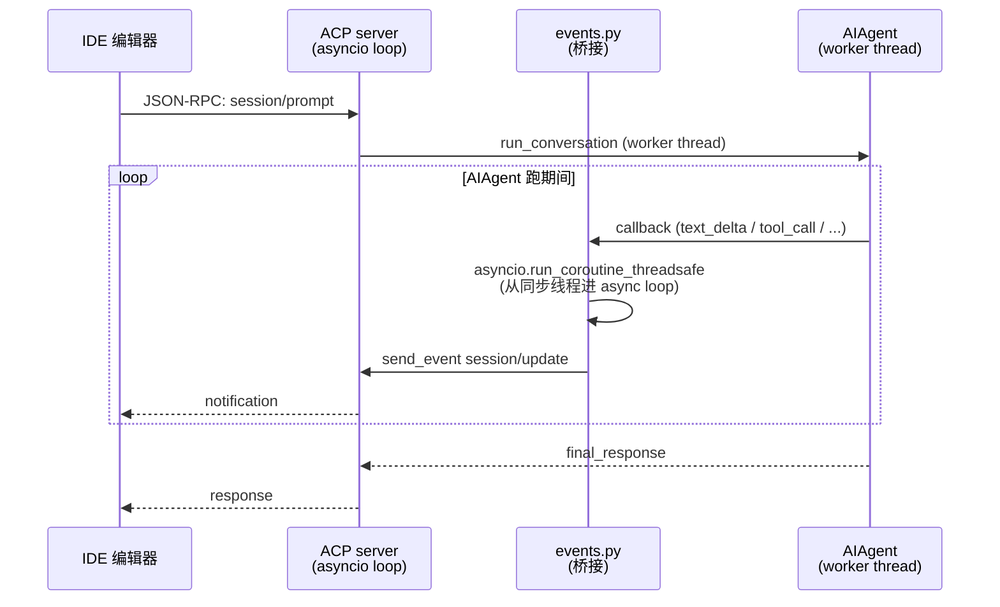
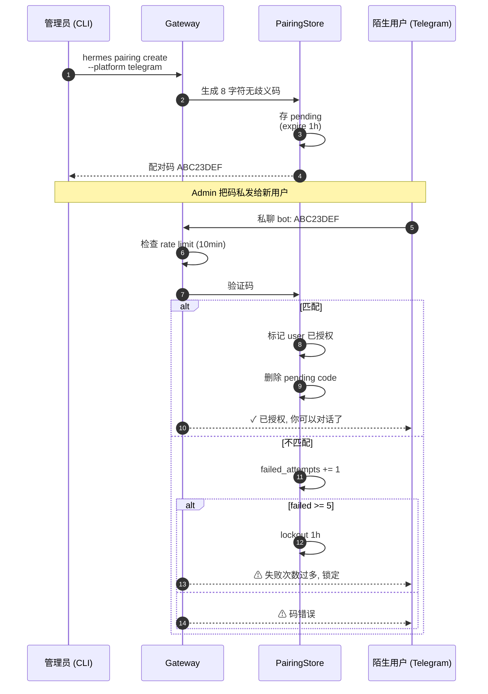
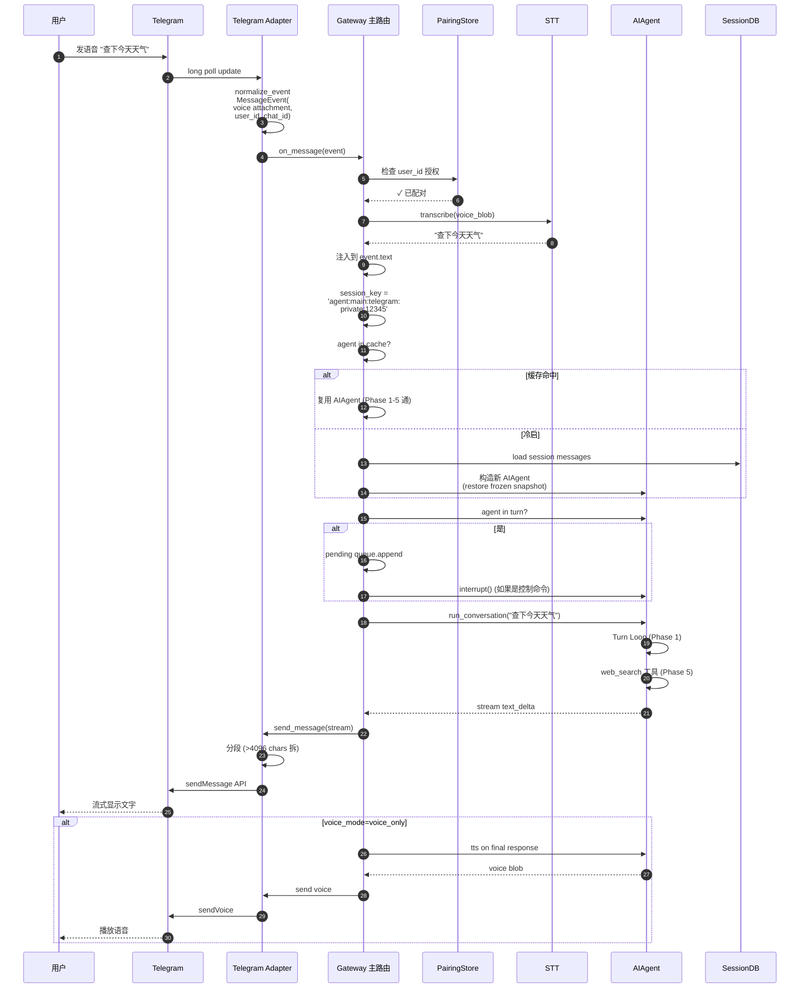

# Phase 7 技术方案：Interface — 接入层

> 本文件以**图形化方式**讲解 Hermes Agent 的"北向接入层"——同一份 AIAgent 内核如何对接 CLI / TUI / Gateway (20+ IM) / ACP IDE / MCP Server / Cron 调度。
>
> 所有引用的文件路径、行号、平台清单均已**逐项核对**仓库源码。

---

## 0. 本文件目录

- [1. L1 在系统中的位置](#1-l1-在系统中的位置)
- [2. 7 种接入形态全景](#2-7-种接入形态全景)
- [3. Gateway 单进程多 Adapter 模型](#3-gateway-单进程多-adapter-模型)
- [4. 20+ 平台 Adapter 清单](#4-20-平台-adapter-清单)
- [5. BasePlatformAdapter 协议](#5-baseplatformadapter-协议)
- [6. 两级消息守卫](#6-两级消息守卫)
- [7. Session Key 路由格式](#7-session-key-路由格式)
- [8. CLI vs TUI 双进程架构](#8-cli-vs-tui-双进程架构)
- [9. tui_gateway 内部](#9-tui_gateway-内部)
- [10. ACP IDE 协议适配](#10-acp-ide-协议适配)
- [11. MCP Server (mcp_serve.py)](#11-mcp-server-mcp_servepy)
- [12. Cron 调度器](#12-cron-调度器)
- [13. 斜杠命令统一解析](#13-斜杠命令统一解析)
- [14. 语音 Transcription 流水线](#14-语音-transcription-流水线)
- [15. DM Pairing 安全机制](#15-dm-pairing-安全机制)
- [16. Auto-Continue（消息打断恢复）](#16-auto-continue消息打断恢复)
- [17. 端到端示例：Telegram 一句话](#17-端到端示例telegram-一句话)
- [18. 设计取舍总结表](#18-设计取舍总结表)
- [19. 高频 Q&A 储备](#19-高频-qa-储备)
- [20. 必背图 + 自检清单](#20-必背图--自检清单)
- [21. 关键代码地图](#21-关键代码地图)
- [22. 一句话总结 + 衔接 Phase 8](#22-一句话总结--衔接-phase-8)

---

## 1. L1 在系统中的位置

> Phase 7 解决：**用户从哪进入 Hermes？所有接入形态如何共享同一个 AIAgent 内核？**

```
   ╔══════════════════════════════════════════════════════════════╗
   ║              L1  Interface Layer (接入层)                      ║
   ║                                                                ║
   ║  ┌──────────┬──────────┬──────────┬──────────┬──────────┐   ║
   ║  │   CLI    │   TUI    │ Gateway  │   ACP    │   MCP    │   ║
   ║  │          │ (Ink+TS) │ (20+ IM) │  (IDE)   │  Server  │   ║
   ║  │ cli.py   │ ui-tui/  │ gateway/ │ acp_     │ mcp_     │   ║
   ║  │ +hermes_ │ +tui_    │  run.py  │ adapter/ │ serve.py │   ║
   ║  │ cli/     │ gateway/ │          │          │          │   ║
   ║  └──────────┴──────────┴──────────┴──────────┴──────────┘   ║
   ║                                                                ║
   ║  ┌──────────┬───────────────────┐                              ║
   ║  │  Cron    │  Web Dashboard /  │                              ║
   ║  │ Sched.   │  Voice Pipeline   │                              ║
   ║  │ cron/    │ web/ + transcribe │                              ║
   ║  └──────────┴───────────────────┘                              ║
   ║                       │                                         ║
   ║                       ▼ 都构造 AIAgent 实例                     ║
   ║  ┌──────────────────────────────────────────────────┐         ║
   ║  │  AIAgent (Phase 1)                                │         ║
   ║  │  • 同一份 run_conversation                         │         ║
   ║  │  • 同一份斜杠命令体系                              │         ║
   ║  │  • 同一份状态层 (SQLite, Phase 3)                  │         ║
   ║  └──────────────────────────────────────────────────┘         ║
   ╚══════════════════════════════════════════════════════════════╝
```

### 1.1 核心命题

```
┌──────────────────────────────────────────────────────────────────┐
│                                                                  │
│  Hermes 的 L1 设计原则: 【AIAgent 不变, 接入层都是它的客户端】     │
│                                                                  │
│   ✓ 同一份命令体系 (/new, /reset, /model, /compress, /usage 等)    │
│   ✓ 同一份状态层 (SQLite session 表, 跨 interface 一致)            │
│   ✓ 同一份配置 (~/.hermes/, profile)                              │
│   ✓ 同一份记忆/技能 (MEMORY.md, USER.md, ~/.hermes/skills/)        │
│                                                                  │
│   ✗ 接入层只负责:                                                  │
│      • 输入收发 (CLI stdin / IM API / IDE 协议 / cron tick)         │
│      • 输出适配 (终端渲染 / 平台消息格式 / SSE event)               │
│      • 平台特定的 quirks (markdown 格式 / mentions / 表情)           │
│                                                                  │
│  这是支撑【$5 VPS 跑 7×24, 用户在 5 个平台无缝切换】的工程基石     │
└──────────────────────────────────────────────────────────────────┘
```

---

## 2. 7 种接入形态全景

```
┌──────────────────┬──────────────────────────────────┬──────────────────┐
│  接入形态         │  特性                             │  典型用户         │
├──────────────────┼──────────────────────────────────┼──────────────────┤
│  CLI             │  纯文本交互, 单进程                │  开发者本地       │
│  (cli.py 13540)  │  适合长会话开发                    │                  │
├──────────────────┼──────────────────────────────────┼──────────────────┤
│  TUI             │  Ink (TS+React) 前端 + Python 后端│  开发者本地       │
│  (ui-tui +       │  多行编辑 / 命令补全 / 流式渲染    │  追求体验         │
│  tui_gateway)    │  JSON-RPC 通信                    │                  │
├──────────────────┼──────────────────────────────────┼──────────────────┤
│  Gateway         │  单进程多 IM adapter              │  $5 VPS 7×24      │
│  (gateway/ 25)   │  Telegram / Discord / Slack /...   │  跨设备访问       │
│                  │  20+ 平台同时跑                    │                  │
├──────────────────┼──────────────────────────────────┼──────────────────┤
│  ACP             │  IDE 协议 (async JSON-RPC stdio)   │  VSCode / Cursor  │
│  (acp_adapter/)  │  把 AIAgent 包成编辑器 agent       │  / Zed 用户       │
├──────────────────┼──────────────────────────────────┼──────────────────┤
│  MCP Server      │  FastMCP 暴露对话给 IDE / 工具      │  Claude Code     │
│  (mcp_serve.py)  │  10+ MCP tool (conv_list 等)       │  生态用户         │
├──────────────────┼──────────────────────────────────┼──────────────────┤
│  Cron            │  嵌入式调度 (60s tick)             │  自动化任务       │
│  (cron/)         │  每个 job 起独立 AIAgent           │  日报 / 巡检      │
├──────────────────┼──────────────────────────────────┼──────────────────┤
│  Voice           │  faster-whisper / Groq / OpenAI    │  IM 语音消息      │
│  (provider/)     │  STT → 文本注入对话                 │                  │
└──────────────────┴──────────────────────────────────┴──────────────────┘
```

---

## 3. Gateway 单进程多 Adapter 模型

> Hermes Gateway 是 L1 最复杂的部分——20+ 个 IM 平台共享一个进程。

### 3.1 Gateway 进程结构（已核对 gateway/run.py:1-1000）

```
┌──────────────────────────────────────────────────────────────────┐
│  hermes gateway start                                              │
│                                                                  │
│  Gateway 主进程 (单进程, asyncio):                                  │
│  ┌──────────────────────────────────────────────────────────┐    │
│  │                                                          │    │
│  │  ┌─── Platform Adapters (并行任务) ──────────────┐       │    │
│  │  │                                                │       │    │
│  │  │  • Telegram bot (long polling)                 │       │    │
│  │  │  • Discord gateway (websocket)                 │       │    │
│  │  │  • Slack socket mode                           │       │    │
│  │  │  • WhatsApp Business API                       │       │    │
│  │  │  • Signal (signal-cli RPC)                     │       │    │
│  │  │  • Matrix (matrix-nio)                         │       │    │
│  │  │  • Mattermost / DingTalk / Feishu /            │       │    │
│  │  │    WeCom / 微信 / QQbot / SMS / Email /         │       │    │
│  │  │    Home Assistant / BlueBubbles /              │       │    │
│  │  │    Yuanbao / Webhook / MSGraph                 │       │    │
│  │  │                                                │       │    │
│  │  │  每个 adapter:                                  │       │    │
│  │  │   • on_message → MessageEvent 归一             │       │    │
│  │  │   • 调 _message_handler 主路由                 │       │    │
│  │  │   • send_message 出向                           │       │    │
│  │  └────────────────────────────────────────────────┘       │    │
│  │                       │                                   │    │
│  │                       ▼                                   │    │
│  │  ┌─── 主路由 (_message_handler) ─────────────────┐       │    │
│  │  │                                                │       │    │
│  │  │  • 提取 session_key                             │       │    │
│  │  │  • 检查认证 (allow_users / DM pairing)         │       │    │
│  │  │  • 检查会话已有 agent? (interrupt / queue)     │       │    │
│  │  │  • 解析斜杠命令 (跨平台统一)                    │       │    │
│  │  │  • 构造 / 复用 AIAgent                          │       │    │
│  │  │  • run_conversation                            │       │    │
│  │  │  • 流式回写 adapter                             │       │    │
│  │  └────────────────────────────────────────────────┘       │    │
│  │                                                          │    │
│  │  ┌─── 后台子系统 ────────────────────────────────┐       │    │
│  │  │  • Cron tick (每 60s)                          │       │    │
│  │  │  • Restart notification check                   │       │    │
│  │  │  • Idle session reaper                          │       │    │
│  │  │  • Approval queue worker                        │       │    │
│  │  │  • DM Pairing approval flow                     │       │    │
│  │  └────────────────────────────────────────────────┘       │    │
│  └──────────────────────────────────────────────────────────┘    │
│                                                                  │
│  ★ 单进程 = 共享内存的 AIAgent cache (1h idle)                    │
│  ★ asyncio = 高并发不阻塞                                          │
│  ★ 持久状态全部在 ~/.hermes/state.db (Phase 3)                    │
└──────────────────────────────────────────────────────────────────┘
```

### 3.2 Adapter 是 asyncio Task

```
   每个启用的 platform 是一个独立的 asyncio.Task:

   tasks = []
   for platform in enabled_platforms:
       adapter = platform.create_adapter(config)
       task = asyncio.create_task(adapter.run())
       tasks.append(task)

   await asyncio.gather(*tasks)

   ─► Telegram 慢了不阻塞 Discord
   ─► 任一 adapter 抛 unhandled exception 会被 _global_exception_handler 捕获
   ─► 不影响其他 adapter
```

---

## 4. 20+ 平台 Adapter 清单

### 4.1 实际平台 (已核对 gateway/platforms/, 32 个 .py 文件)

```
┌──────────────────────────────────────────────────────────────────┐
│  分类                       │  Adapter                            │
├─────────────────────────────┼──────────────────────────────────────┤
│  ★ 主流 IM                  │                                      │
│   Telegram                   │  telegram.py + telegram_network.py  │
│   Discord                    │  discord.py                         │
│   Slack                      │  slack.py                           │
│   WhatsApp                   │  whatsapp.py                        │
│   Signal                     │  signal.py + signal_rate_limit.py   │
│                             │                                      │
│  ★ 企业 IM                  │                                      │
│   Microsoft Teams            │  msgraph_webhook.py                 │
│   Mattermost                 │  mattermost.py                      │
│   Matrix                     │  matrix.py                          │
│   钉钉 DingTalk              │  dingtalk.py                        │
│   飞书 Feishu                │  feishu.py + feishu_comment*.py     │
│   企微 WeCom                 │  wecom.py + wecom_callback.py +     │
│                             │  wecom_crypto.py                    │
│                             │                                      │
│  ★ 国内 IM                  │                                      │
│   微信 Weixin               │  weixin.py                          │
│   QQbot                      │  yuanbao*.py / qqbot/               │
│   元宝 Yuanbao              │  yuanbao.py + yuanbao_media.py +    │
│                             │  yuanbao_proto.py + yuanbao_sticker  │
│                             │                                      │
│  ★ 其他渠道                  │                                      │
│   Email (IMAP/SMTP)         │  email.py                           │
│   SMS (Twilio)               │  sms.py                             │
│   BlueBubbles (iMessage)    │  bluebubbles.py                     │
│   Home Assistant             │  homeassistant.py                   │
│   Webhook (通用)             │  webhook.py                         │
│                             │                                      │
│  ★ 服务端                    │                                      │
│   API Server                 │  api_server.py                      │
└──────────────────────────────────────────────────────────────────┘
```

### 4.2 平台特性差异

```
┌─────────────────┬──────────────────────────────────────────────┐
│  特性            │  典型差异                                     │
├─────────────────┼──────────────────────────────────────────────┤
│  消息格式        │  Telegram Markdown V2 vs Discord Markdown    │
│                  │  vs Slack mrkdwn vs WhatsApp 纯文本           │
├─────────────────┼──────────────────────────────────────────────┤
│  Mention 语法    │  Telegram @user vs Discord <@123>            │
│                  │  vs Slack <@U123> — _telegramize_command_    │
│                  │  mentions L68 做归一                           │
├─────────────────┼──────────────────────────────────────────────┤
│  消息大小限制     │  Telegram 4096 / Discord 2000 / WhatsApp ... │
│                  │  超出自动分段                                  │
├─────────────────┼──────────────────────────────────────────────┤
│  Topic / Thread  │  Telegram topics / Discord threads /         │
│                  │  Slack threads — session_key 编码 thread_id   │
├─────────────────┼──────────────────────────────────────────────┤
│  推送方式         │  Telegram long poll / Discord websocket /    │
│                  │  Slack socket mode / WhatsApp webhook        │
├─────────────────┼──────────────────────────────────────────────┤
│  速率限制         │  Signal: signal_rate_limit.py 特殊处理       │
│                  │  Telegram 30 msg/s 全局限                     │
│                  │  WhatsApp 按 quality rating 限制              │
├─────────────────┼──────────────────────────────────────────────┤
│  鉴权方式         │  Telegram Bot Token / Discord Bot Token /    │
│                  │  WeCom 双层 (CorpID + Secret) /              │
│                  │  WeCom callback HMAC-SHA1 + AES 加解密       │
└─────────────────┴──────────────────────────────────────────────┘
```

---

## 5. BasePlatformAdapter 协议

### 5.1 抽象接口

```
┌──────────────────────────────────────────────────────────────┐
│  class BasePlatformAdapter(ABC):                              │
│                                                              │
│   # 必须实现 (abstract)                                        │
│                                                              │
│   async def run(self):                                        │
│      """主循环, 持续接收消息"""                                  │
│                                                              │
│   async def send_message(self, chat_id, content, **opts):    │
│      """出向: 发消息"""                                         │
│                                                              │
│   def normalize_event(self, raw) -> MessageEvent:             │
│      """把平台原生消息归一化"""                                  │
│                                                              │
│   # 可选 hooks                                                 │
│                                                              │
│   async def on_message(self, event):                          │
│      """收到消息时触发, 默认调主 handler"""                       │
│                                                              │
│   async def disconnect(self):                                 │
│      """优雅关闭"""                                            │
│                                                              │
│   def supports_voice(self) -> bool: ...                       │
│   def supports_images(self) -> bool: ...                      │
│   def supports_thread(self) -> bool: ...                      │
│   def supports_typing_indicator(self) -> bool: ...            │
└──────────────────────────────────────────────────────────────┘
```

### 5.2 MessageEvent 数据类

```
   MessageEvent:
     platform: str             ─ 'telegram' / 'discord' / ...
     session_key: str          ─ agent:main:telegram:private:123456
     chat_id: str              ─ 平台 ID
     user_id: str              ─ 平台用户 ID
     chat_type: str            ─ private / group / channel / thread
     text: str                 ─ 文本内容
     attachments: list         ─ 图片 / 音频 / 文件
     thread_id: str | None     ─ topic / thread ID
     reply_to: str | None      ─ 回复哪条
     timestamp: float
     raw: dict                 ─ 原始平台 payload (兜底)
```

---

## 6. 两级消息守卫

> Gateway 处理消息时面对一个核心问题：**如果 agent 正在跑，新消息怎么办？**

### 6.1 两级守卫流程

```mermaid
flowchart TD
    Msg[平台消息到达] --> Adapter[adapter.on_message]
    Adapter --> Norm[normalize_event → MessageEvent]

    Norm --> Level1{Level 1<br/>会话有<br/>active agent?}

    Level1 -->|否| Direct[直接 _message_handler]

    Level1 -->|是| Special{斜杠命令<br/>是 control?}
    Special -->|是<br/>/stop /new /queue<br/>/status /approve /deny| Bypass[绕过 guard<br/>inline 派发<br/>(立即生效)]
    Special -->|否| Pending[加入 _pending_messages<br/>queue]

    Pending --> Interrupt{含 'stop' 或<br/>auto_continue<br/>策略允许?}
    Interrupt -->|是| Trigger[触发 agent.interrupt<br/>跳出当前 turn]
    Interrupt -->|否| Wait[等当前 turn 完成]

    Trigger --> Drain[turn 退出后<br/>drain pending<br/>新消息成为下轮 user msg]
    Wait --> Drain

    Direct --> Process[正常处理]
    Bypass --> Process
    Drain --> Process

    style Bypass fill:#9f9
    style Trigger fill:#fff5d6
    style Wait fill:#ffd
```

### 6.2 control commands（绕过守卫）

```
┌──────────────────────────────────────────────────────────────┐
│  以下命令在 agent 跑动时也必须立即响应:                          │
│                                                              │
│  • /stop     ─ 强制中断当前 turn                                │
│  • /new      ─ 开新 session                                    │
│  • /queue    ─ 列出 pending 消息                                │
│  • /status   ─ agent 当前状态 / 已跑时长                         │
│  • /approve  ─ 批准危险命令                                      │
│  • /deny     ─ 拒绝危险命令                                      │
│                                                              │
│  这些通过 GATEWAY_KNOWN_COMMANDS 白名单识别                     │
│  在 _is_control_interrupt_message (L810) 判定                  │
└──────────────────────────────────────────────────────────────┘
```

### 6.3 _pending_messages 队列模型

```
   Agent 跑 turn N 的时候, 新消息进队:
   ─────

   [user_msg_1, user_msg_2, user_msg_3]
                                    ↑
                              累加到这

   turn N 完成 → drain queue:
   ─────

   ① 拼接到 turn N+1 的 user_message:
     "user_msg_1\n\nuser_msg_2\n\nuser_msg_3"

   ② 或者: interrupt 立即中断 + 把所有 pending 拼起来

   ─► 用户连续发的话不丢, 但也不并发跑多个 turn
```

---

## 7. Session Key 路由格式

> 把"哪个用户的哪个会话"压缩成一个字符串。

### 7.1 格式定义

```
   session_key = "agent:main:{platform}:{chat_type}:{chat_id}"

   例子:
   ─────
   agent:main:telegram:private:123456789           # 私聊
   agent:main:telegram:group:-1001234567890        # 群
   agent:main:telegram:topic:-100123_5              # 群 topic
   agent:main:discord:dm:user_id_str                # Discord DM
   agent:main:discord:guild:guild_id:channel_id     # Discord 频道
   agent:main:slack:channel:C01234:thread_ts        # Slack thread
   agent:main:cli:default                            # CLI 单用户

   ─► 唯一标识 "哪个用户在哪里跟 Hermes 对话"
   ─► chat_id 编码 thread/topic, 让 thread 内对话独立
```

### 7.2 Session key 在系统中的角色

```mermaid
flowchart LR
    Msg[消息到达] --> Build[platform + chat_id + thread]
    Build --> Key[session_key]

    Key --> A[查 SessionDB:<br/>该 key 有未结束 session?]
    A -->|有| Resume[get_messages_as_conversation<br/>resume]
    A -->|无| New[create_session<br/>新 session]

    Key --> B[查 AIAgent cache:<br/>该 key 有活 agent?]
    B -->|有 (未过 1h idle)| Reuse[复用 cached agent]
    B -->|无| Build[构造新 AIAgent]

    Key --> C[Approval / Memory<br/>scope 隔离]
    C --> Scope[_session_approved<br/>memory provider session]

    style Resume fill:#dfd
    style Reuse fill:#dfd
```

### 7.3 跨平台 Handoff

```
   场景: 用户在 Telegram 开始, 想在 CLI 继续
   ─────

   1. Telegram 内输入: /handoff cli
   2. Gateway 把 session_state 写到 sessions 表:
      sessions.handoff_state = JSON.dumps({
        target_platform: 'cli',
        target_session_id: ...,
      })
   3. 用户在 CLI: hermes resume --from-handoff
   4. CLI 读 handoff_state, 接管会话
   5. handoff_state 清空

   ─► messages 历史完整带过来
   ─► memory + skills 本来就是全局共享
   ─► 用户感受"换设备继续聊"
```

---

## 8. CLI vs TUI 双进程架构

### 8.1 CLI（单进程）

```
   hermes (无参数)

   cli.py 主进程:
   ┌──────────────────────────────────────┐
   │  prompt_toolkit 文本输入框           │
   │  + 历史 / 补全 / 多行编辑              │
   │  ─►                                   │
   │  AIAgent.run_conversation 同进程      │
   │  ─►                                   │
   │  stdout 渲染 (rich / 自家 ANSI)       │
   └──────────────────────────────────────┘
```

### 8.2 TUI（双进程）

```
   hermes tui

   ┌────────────────────────────────────┐
   │  ui-tui (Node.js + Ink + React)     │
   │  ─►                                  │
   │  • 多窗格布局                         │
   │  • 任务状态侧栏                       │
   │  • 命令补全                           │
   │  • 流式输出渲染                       │
   └────────────────────────────────────┘
            │
            │ JSON-RPC over stdio
            ▼
   ┌────────────────────────────────────┐
   │  tui_gateway (Python)               │
   │  ─►                                  │
   │  • server.py JSON-RPC handler        │
   │  • transport.py stdio 协议            │
   │  • slash_worker.py 命令派发           │
   │  • event_publisher.py 流式事件        │
   │  • render.py 输出格式化               │
   │  • ws.py (WebSocket 备用)            │
   │  ─►                                  │
   │  AIAgent.run_conversation             │
   └────────────────────────────────────┘
```

### 8.3 为什么 TUI 用双进程？

```
┌──────────────────────────────────────────────────────────────┐
│  问题: Python 终端 UI 库 (urwid / textual) 都不够强             │
│  ─►                                                            │
│  方案: 用 Ink (React for terminals, TypeScript)                │
│  • 现代化 UI 抽象 (component / hooks / props)                  │
│  • 丰富的终端组件生态                                          │
│  • 容易跨平台 (Node.js)                                        │
│                                                              │
│  但 AIAgent 是 Python 写的, 不能直接 import                    │
│  ─►                                                            │
│  TS 进程 ──JSON-RPC stdio──► Python 后端 ──► AIAgent           │
│                                                              │
│  ★ 类似 VSCode 的语言服务器架构                                │
│  ★ Node.js 渲染 + Python 业务, 各取所长                        │
└──────────────────────────────────────────────────────────────┘
```

---

## 9. tui_gateway 内部

### 9.1 模块清单

```
   tui_gateway/
   ├── entry.py            ─ 启动入口
   ├── server.py           ─ JSON-RPC server 实现
   ├── transport.py        ─ stdio 协议 (line-delimited JSON)
   ├── slash_worker.py     ─ 斜杠命令派发 worker
   ├── event_publisher.py  ─ 流式事件发布器
   ├── render.py           ─ 输出格式化 (markdown / code 高亮)
   └── ws.py               ─ WebSocket 备用 transport
```

### 9.2 JSON-RPC 主要方法

```
   tui_gateway 暴露给 Ink 前端的方法:

   • run_conversation(message, opts)     ─ 发消息, 流式回事件
   • interrupt()                         ─ 中断当前 turn
   • slash_command(name, args)           ─ 执行斜杠命令
   • list_sessions()                     ─ 列会话历史
   • switch_session(id)                  ─ 切换会话
   • get_status()                        ─ 当前 agent 状态
   • set_model(provider, model)          ─ 切换模型
   • set_profile(name)                   ─ 切换 profile

   流式 events (server → client):
   • text_delta { content }
   • tool_call_start { name, args }
   • tool_call_result { output }
   • reasoning_delta { content }
   • status { message }
   • error { error }
   • finish { reason }
```

---

## 10. ACP IDE 协议适配

> ACP = Agent Communication Protocol，让 VSCode/Cursor/Zed 等编辑器直接当 Agent 用。

### 10.1 ACP 是什么？

```
┌──────────────────────────────────────────────────────────────┐
│  ACP (Agent Communication Protocol):                          │
│                                                              │
│   类似 LSP (Language Server Protocol) 但面向 AI Agent:        │
│   • 客户端: 编辑器 (Cursor / Zed Pro / VSCode 插件)            │
│   • 服务端: agent 实现 (Hermes 是其中之一)                     │
│   • 协议: JSON-RPC over stdio                                  │
│                                                              │
│   编辑器通过 ACP:                                              │
│   • 启动 agent 会话                                            │
│   • 发送 user prompt                                           │
│   • 接收 streaming 响应                                        │
│   • 看 agent 用的工具                                           │
│   • 批准 / 拒绝危险操作                                         │
│                                                              │
│   ─► Hermes 通过 acp_adapter 把自己包装成 ACP server           │
└──────────────────────────────────────────────────────────────┘
```

### 10.2 acp_adapter 模块清单

```
   acp_adapter/
   ├── __main__.py         ─ hermes acp 入口
   ├── entry.py            ─ asyncio main
   ├── server.py           ─ ACP JSON-RPC server
   ├── auth.py             ─ ACP 鉴权 (借 hermes_cli 凭证)
   ├── session.py          ─ ACP session 跟踪
   ├── events.py           ─ AIAgent callback → ACP event 桥接
   ├── permissions.py      ─ 危险操作审批
   └── tools.py            ─ Tool call event 格式化
```

### 10.3 跨线程桥接



### 10.4 ACP 关键设计

```
┌──────────────────────────────────────────────────────────────┐
│  ① AIAgent 跑在 worker thread (同步代码)                       │
│   • run_conversation 是 sync, 不能直接放 asyncio loop          │
│                                                              │
│  ② ACP server 是 asyncio (JSON-RPC stdio I/O)                  │
│                                                              │
│  ③ 跨线程桥接 = asyncio.run_coroutine_threadsafe              │
│   • worker 调 callback → 提交 coroutine 到主 event loop        │
│   • 主 loop 异步发 JSON-RPC notification                       │
│                                                              │
│  ★ 这是 "把同步内核包成 async 服务" 的标准 pattern             │
│   类似 Phase 5 §15 的后台 review fork 模式                     │
└──────────────────────────────────────────────────────────────┘
```

---

## 11. MCP Server (mcp_serve.py)

> 已在 Phase 5 §18 详细讲过，这里补充流程层面。

### 11.1 MCP Server 启动链路

```
   hermes mcp serve
       ↓
   mcp_serve.py main:
   ① 创建 EventBridge (后台轮询 SessionDB)
   ② create_mcp_server (FastMCP 实例)
   ③ 注册 10+ 工具
      • conversations_list / conversation_get
      • messages_read / messages_send
      • events_poll / events_wait
      • permissions_list_open / permissions_respond
      • attachments_fetch
   ④ FastMCP.run() 走 stdio JSON-RPC
       ↓
   外部 MCP client (Claude Code / Cursor):
   • 看 Hermes 历史对话
   • 发消息到 Telegram (通过 Hermes)
   • 处理 Hermes 弹的审批请求
```

---

## 12. Cron 调度器

### 12.1 嵌入式调度模型（已核对 cron/scheduler.py）

```
┌──────────────────────────────────────────────────────────────────┐
│  Cron 跑在 Gateway 主进程的后台线程, 不是独立 daemon:               │
│                                                                  │
│  Gateway 启动时:                                                   │
│  ┌─────────────────────────────────────────────┐                  │
│  │  asyncio.create_task(cron_ticker(60s))      │                  │
│  └─────────────────────────────────────────────┘                  │
│                                                                  │
│  每 60s tick:                                                      │
│  ┌─────────────────────────────────────────────┐                  │
│  │  ① 加文件锁 (~/.hermes/cron/.tick.lock)     │                  │
│  │     ─► 防止多 Gateway 实例同时 tick           │                  │
│  │                                              │                  │
│  │  ② 读 ~/.hermes/cron/jobs.json               │                  │
│  │                                              │                  │
│  │  ③ get_due_jobs (按 cron expr 算 next_run)  │                  │
│  │                                              │                  │
│  │  ④ 每个 due job:                              │                  │
│  │    • 起独立 AIAgent (全新 session)            │                  │
│  │    • 注入 skills (job.skills)                 │                  │
│  │    • run_conversation(job.prompt)             │                  │
│  │    • _deliver_result 发到 target              │                  │
│  │      (telegram:chat_id / discord:.../...)     │                  │
│  │    • mark_job_run, advance_next_run           │                  │
│  └─────────────────────────────────────────────┘                  │
└──────────────────────────────────────────────────────────────────┘
```

### 12.2 Job 数据结构 (jobs.json)

```json
{
  "id": "a1b2c3d4",
  "name": "每日 AI 资讯",
  "prompt": "总结今天 AI 圈最重要的 5 件事...",
  "schedule": {
    "kind": "cron",
    "expr": "0 9 * * *"
  },
  "skills": ["ai-news-summary"],
  "deliver": "telegram:-1001234567890",
  "toolsets": ["web", "research"],
  "enabled": true,
  "next_run_at": "2025-05-21T09:00:00Z",
  "last_run_at": "2025-05-20T09:00:00Z",
  "origin": {
    "platform": "telegram",
    "user_id": "...",
    "session_key": "..."
  }
}
```

### 12.3 防递归 + 防注入

```
┌──────────────────────────────────────────────────────────────┐
│  防递归: 执行期间禁用 cronjob 工具集                              │
│   • Cron 跑的 AIAgent 不能再调 cronjob_create                  │
│   • 否则 job 互相 spawn 形成炸弹                                │
│                                                              │
│  防 prompt injection:                                          │
│   • CronPromptInjectionBlocked 异常类 (scheduler.py:45)        │
│   • 用户传 prompt 经过同 memory 一样的注入扫描                  │
│   • 命中模式直接拒绝                                            │
└──────────────────────────────────────────────────────────────┘
```

### 12.4 多投递目标

```
   一个 job 可以同时投递到多平台:

   deliver:
     telegram:chat_id_a + discord:channel_b + email:foo@bar.com

   _resolve_delivery_targets 解析:
     [{platform: 'telegram', target: 'chat_id_a'},
      {platform: 'discord',  target: 'channel_b'},
      {platform: 'email',    target: 'foo@bar.com'}]

   并行投递, 失败不影响其他
```

---

## 13. 斜杠命令统一解析

### 13.1 命令体系（已核对 hermes_cli/commands.py）

```
┌──────────────────────────────────────────────────────────────────┐
│  resolve_command(name) — 全局唯一解析入口                          │
│                                                                  │
│   1. lowercase + 去 / 前缀                                         │
│   2. 查 _COMMAND_LOOKUP (alias 也支持)                            │
│   3. 返回 CommandDef 或 None                                       │
│                                                                  │
│  ★ CLI / TUI / Gateway / ACP 都用同一份 resolve_command            │
│  ★ 跨平台一致性: /new 在哪都新会话, /compress 都触发压缩           │
└──────────────────────────────────────────────────────────────────┘
```

### 13.2 命令分类

```
┌─────────────────┬──────────────────────────────────────────────┐
│  类别            │  典型命令                                      │
├─────────────────┼──────────────────────────────────────────────┤
│  会话             │  /new /reset /retry /undo /resume /branch    │
├─────────────────┼──────────────────────────────────────────────┤
│  上下文           │  /compress [focus] /usage /insights          │
├─────────────────┼──────────────────────────────────────────────┤
│  模型             │  /model /provider /yolo /personality         │
├─────────────────┼──────────────────────────────────────────────┤
│  Skills          │  /skills /skill-name (skills/<name>)         │
├─────────────────┼──────────────────────────────────────────────┤
│  控制             │  /stop /steer /interrupt                     │
├─────────────────┼──────────────────────────────────────────────┤
│  审批             │  /approve [once|session|always]              │
│                  │  /deny                                        │
├─────────────────┼──────────────────────────────────────────────┤
│  Gateway 专属    │  /queue /status /pair /handoff                │
├─────────────────┼──────────────────────────────────────────────┤
│  Cron            │  /cron list / add / remove / enable / disable│
├─────────────────┼──────────────────────────────────────────────┤
│  调试             │  /platforms /sethome /debug                  │
└─────────────────┴──────────────────────────────────────────────┘
```

---

## 14. 语音 Transcription 流水线

### 14.1 入向语音 (用户发语音)

```mermaid
flowchart TD
    Voice[平台收到语音消息] --> Detect[检测音频格式]
    Detect --> Route{选 STT provider}

    Route -->|local (默认)| Whisper[faster-whisper<br/>local 150MB 模型]
    Route -->|paid| API1[Groq Whisper API<br/>OpenAI Whisper API]
    Route -->|other| API2[Mistral Voxtral<br/>xAI Grok STT]

    Whisper --> Text[transcript]
    API1 --> Text
    API2 --> Text

    Text --> Inject[作为 user message<br/>注入 AIAgent]
    Inject --> Process[正常处理]

    Text --> Dedup[per-chat 去重<br/>(gateway/run.py:1350)]
    Dedup --> Inject
```

### 14.2 出向语音 (Agent 用 TTS 回复)

```
   voice_mode 配置 (per-chat):
   ─────
   • off        ─ 永不发语音
   • voice_only ─ 用户发语音 → Agent 回语音
                  用户发文字 → Agent 回文字
   • all        ─ 总是回语音

   tts pipeline (tools/tts_tool.py):
   ─────
   • text_to_speech 工具
   • ElevenLabs / OpenAI TTS / 自托管
   • 流式音频生成 (边算边发)
```

---

## 15. DM Pairing 安全机制

> Gateway 的关键安全防护：陌生人不能跟 bot 对话。

### 15.1 三层授权（已核对 gateway/pairing.py）

```
┌──────────────────────────────────────────────────────────────────┐
│  Gateway 鉴权决策树:                                                │
│                                                                  │
│  消息到达 → 是否授权？                                              │
│                                                                  │
│  ① GATEWAY_ALLOW_ALL_USERS=true                                   │
│     ─► 允许所有人 (调试用, 不推荐生产)                              │
│                                                                  │
│  ② {PLATFORM}_ALLOW_ALL_USERS=true                                │
│     ─► 该平台所有人 (如 TELEGRAM_ALLOW_ALL_USERS)                  │
│                                                                  │
│  ③ {PLATFORM}_ALLOWED_USERS 含此 user_id                          │
│     ─► env 白名单                                                  │
│                                                                  │
│  ④ DM Pairing 数据库 (~/.hermes/pairing/{platform}.json)          │
│     ─► 通过配对码授权                                              │
│                                                                  │
│  ⑤ 都不命中 → 拒绝, 不响应                                          │
└──────────────────────────────────────────────────────────────────┘
```

### 15.2 Pairing 码生成（已核对 pairing.py:36-50）

```
┌──────────────────────────────────────────────────────────────┐
│  常量:                                                         │
│   CODE_LENGTH = 8                                             │
│   ALPHABET = '23456789ABCDEFGHJKLMNPQRSTUVWXYZ'              │
│     ─► 32 字符无歧义 (去掉 0/O/1/I/L)                          │
│   PAIRING_CODE_TTL = 3600   # 1 小时过期                       │
│   RATE_LIMIT_SECONDS = 600   # 1 req/user/10min                │
│   MAX_PENDING_PER_PLATFORM = 3                                │
│   MAX_FAILED_ATTEMPTS = 5    # 触发锁定                         │
│                                                              │
│  code = secrets.choice(ALPHABET) * 8                          │
│   ─► 32^8 ≈ 1 万亿种, 暴力穷举无效                             │
└──────────────────────────────────────────────────────────────┘
```

### 15.3 Pairing 流程



### 15.4 安全特性

```
┌──────────────────────────────────────────────────────────────┐
│  • 8 字符无歧义 (去 0/O/1/I/L)  ★ 用户能精准报告               │
│  • secrets.choice 真随机                                      │
│  • 1h TTL 自动过期                                             │
│  • 每平台最多 3 个 pending                                     │
│  • 10min 每用户限流 (防穷举)                                   │
│  • 5 次失败锁定                                                │
│  • 文件 chmod 0600 (仅 owner 可读)                            │
│  • 码不写日志                                                  │
└──────────────────────────────────────────────────────────────┘
```

---

## 16. Auto-Continue（消息打断恢复）

> 长对话被 IM 断开了，agent 该如何恢复？

```
┌──────────────────────────────────────────────────────────────────┐
│  Auto-continue 机制 (gateway/run.py:143-244):                      │
│                                                                  │
│  问题:                                                             │
│   • 用户发消息 → Agent 跑 100 秒                                   │
│   • 用户离开 IM 应用                                                │
│   • Agent 完成, 但用户没看到                                        │
│   • 用户回来, IM 显示个流式中断的消息                                │
│                                                                  │
│  方案:                                                             │
│   _is_fresh_gateway_interruption (L177):                          │
│     ─► 检测对话最后一条 assistant 消息是中断态                       │
│     ─► 用户回来后自动重发 / 补全                                    │
│                                                                  │
│   _auto_continue_freshness_window (L143):                          │
│     ─► 多久内的中断算 "fresh" 可恢复                                │
│     ─► env var: AUTO_CONTINUE_FRESHNESS_WINDOW (默认 N min)        │
└──────────────────────────────────────────────────────────────────┘
```

---

## 17. 端到端示例：Telegram 一句话

> 完整 sequence 把 L1 所有子系统串起来。



---

## 18. 设计取舍总结表

| # | 设计选择 | 替代方案 | 为什么 Hermes 这样选 |
|---|---|---|---|
| 1 | **AIAgent 不变, 接入层都是客户端** | 每接入定制 agent | 同一份命令体系 / 状态层 / 记忆 |
| 2 | **Gateway 单进程 asyncio + 多 adapter Task** | 多进程 / 多线程 | 共享内存 cache, 简单, 资源少 |
| 3 | **两级消息守卫 (control / pending)** | 单一队列 | 让 `/stop` 在 agent 跑时也能立刻生效 |
| 4 | **session_key 编码 chat + thread** | 仅 chat_id | thread 内对话独立, 同群多线程不串 |
| 5 | **TUI 双进程 (Ink + Python)** | 纯 Python TUI | Ink 终端 UI 强；JSON-RPC 解耦 |
| 6 | **ACP 跨线程桥接** | sync ACP | AIAgent 同步, ACP I/O 异步, 必须桥接 |
| 7 | **Cron 嵌入 Gateway 进程** | 独立 daemon | 单进程简单；文件锁防多 Gateway 重复 tick |
| 8 | **Cron job 跑新 AIAgent** | 复用现有 | 隔离 / 防干扰；fresh session 清晰 |
| 9 | **每 tick 60s** | 1s / 5min | 平衡精度 + 资源 |
| 10 | **Cronjob 工具禁用** | 默认开 | 防 job 创建 job 形成炸弹 |
| 11 | **Voice multi-provider chain** | 单一 provider | local 优先 (free) + paid 备用 |
| 12 | **Voice transcript 注入 user msg** | 单独字段 | Agent 看到的还是文字, 不用懂语音 |
| 13 | **DM Pairing 8 字符无歧义** | 6 / 数字 / UUID | 安全 (32^8) + 用户能精准报告 |
| 14 | **Pairing 1h TTL + 限频 + 锁定** | 不限制 | 防穷举 / 防滥用 |
| 15 | **斜杠命令统一 resolve_command** | 各接入自实现 | 跨平台一致；新增命令一处生效 |
| 16 | **Control commands 绕过 guard** | 全部排队 | `/stop` 必须立刻生效, 不能等 |
| 17 | **Auto-continue 检测中断** | 用户手动 retry | IM 场景下用户回来直接看到结果 |
| 18 | **20+ platform adapter 独立文件** | 单文件多类 | 平台 quirks 多, 隔离便于维护 |

---

## 19. 高频 Q&A 储备

```
┌────────────────────────────────────────────────────────────────────┐
│ Q: 我配了 5 个 IM 平台, Hermes 会起几个进程？                       │
│ A: 1 个 Gateway 主进程 + 1 个 asyncio loop, 内部每个平台是一个 Task。│
│    资源占用: 启动后约 100-200 MB RAM (含 AIAgent cache + adapters)。  │
├────────────────────────────────────────────────────────────────────┤
│ Q: 用户在 Telegram 跟 Discord 同时发消息, agent 会乱吗？             │
│ A: 不会。两个消息走不同 session_key:                                │
│      agent:main:telegram:private:xxx                               │
│      agent:main:discord:dm:yyy                                     │
│    AIAgent 实例独立, 状态独立 (但共享 MEMORY.md / Skills)。          │
├────────────────────────────────────────────────────────────────────┤
│ Q: TUI 为什么要双进程？性能不损耗吗？                                 │
│ A: JSON-RPC stdio 开销 < 1ms，对终端 UI 不感知。换来:               │
│    • Ink 完整 React 组件生态                                        │
│    • 前后端可独立升级 (不强绑 Python 版本)                          │
│    • 后端可远程跑 (前端 ssh, 后端在云上)                            │
├────────────────────────────────────────────────────────────────────┤
│ Q: Cron 怎么保证两个 Gateway 实例不重复跑？                          │
│ A: ~/.hermes/cron/.tick.lock 文件锁。每 tick 先尝试 acquire,         │
│    失败就跳过。fcntl/msvcrt 跨平台兼容。                            │
├────────────────────────────────────────────────────────────────────┤
│ Q: 我用 Telegram 跟 bot 聊一半切到 CLI, 历史能恢复吗？              │
│ A: 能。两种方式:                                                    │
│    ① /handoff cli 在 Telegram 触发, CLI hermes resume               │
│    ② 直接 hermes resume <session_id> (session_id 从 sessions 表看)  │
├────────────────────────────────────────────────────────────────────┤
│ Q: MCP Server 跟 ACP 啥区别？                                       │
│ A:                                                                 │
│    • MCP: 把 Hermes 内部状态 (对话/审批/事件) expose 给外部工具      │
│    • ACP: 让 Hermes 自己变成编辑器的 agent (类似 LSP 给 IDE)         │
│    一个是"被用", 一个是"主动服务"。                                  │
├────────────────────────────────────────────────────────────────────┤
│ Q: DM Pairing 安全等级够吗？                                        │
│ A: 8 字符 / 32 字符表 = 32^8 = 1.1 万亿种。配合:                    │
│    • 1h TTL (穷举窗口很短)                                          │
│    • 10min/user 限频                                                │
│    • 5 次失败锁 1h                                                  │
│    实际穷举成功概率 < 10^-9，可忽略。                                │
├────────────────────────────────────────────────────────────────────┤
│ Q: 语音 transcription 可以关吗？                                    │
│ A: 可以。voice_mode=off (per-chat 或全局)。                          │
│    用户发语音时, agent 看到的是 "[Audio attachment]" 而非转录文本。   │
└────────────────────────────────────────────────────────────────────┘
```

---

## 20. 必背图 + 自检清单

### 20.1 Phase 7 必背的 5 张图

```
   📊 图 ①  L1 七种接入形态全景
   📊 图 ②  Gateway 单进程多 Adapter 模型
   📊 图 ③  两级消息守卫 + control commands 旁路
   📊 图 ④  session_key 路由格式与 cache 复用
   📊 图 ⑤  Cron 嵌入式 60s tick + 文件锁防多机重复
```

### 20.2 自检清单

- [ ] 能列出 7 种接入形态及典型用户
- [ ] 能解释 Gateway 单进程多 adapter 为什么不需要多进程
- [ ] 能描述两级消息守卫流程 + control commands 列表
- [ ] 能解释 session_key 编码 chat_type + chat_id + thread 的意义
- [ ] 能讲清 TUI 双进程架构为什么用 Ink + Python
- [ ] 能描述 ACP 跨线程桥接 (worker thread + asyncio loop)
- [ ] 能讲清 Cron 嵌入式 60s tick + 文件锁 + fresh AIAgent + cronjob 工具禁用
- [ ] 能区分 MCP Server 跟 ACP 两个协议
- [ ] 能讲清 DM Pairing 安全机制 (8 字符无歧义 + TTL + 限频 + 锁定)
- [ ] 能解释 Auto-continue 检测中断 + 自动恢复

---

## 21. 关键代码地图

```
┌──────────────────────────────────────────────────────────────────────┐
│  L1 关键文件                                                            │
├──────────────────────────────────────────────────────────────────────┤
│                                                                      │
│  cli.py                  13540  ─ CLI 命令派发 + 主交互循环           │
│  hermes_cli/             ~80 .py ─ CLI 子命令 (config/auth/...)       │
│                                                                      │
│  ui-tui/                 ─ Ink TS 前端                                │
│  tui_gateway/                                                         │
│  ├ entry.py                  ─ 启动                                    │
│  ├ server.py                 ─ JSON-RPC handler                       │
│  ├ transport.py              ─ stdio 协议                              │
│  ├ slash_worker.py           ─ 命令派发                                │
│  ├ event_publisher.py        ─ 流式事件                                │
│  ├ render.py                 ─ 输出格式化                              │
│  └ ws.py                     ─ WebSocket 备用                          │
│                                                                      │
│  gateway/                  25 个文件                                    │
│  ├ run.py                    ─ Gateway 主进程                          │
│  ├ session.py                ─ session_key 路由                        │
│  ├ pairing.py                ─ DM Pairing                              │
│  ├ delivery.py               ─ 出向消息投递                            │
│  ├ mirror.py                 ─ 跨平台镜像                              │
│  ├ slash_access.py           ─ 斜杠命令访问控制                        │
│  ├ status.py                 ─ /status 实现                            │
│  ├ shutdown_forensics.py     ─ 优雅退出诊断                            │
│  └ platforms/   32 个文件     ─ 平台 adapter                            │
│                                                                      │
│  acp_adapter/                                                         │
│  ├ __main__.py               ─ hermes acp 入口                         │
│  ├ entry.py                                                           │
│  ├ server.py                 ─ ACP JSON-RPC                            │
│  ├ session.py                                                         │
│  ├ events.py                 ─ AIAgent → ACP 事件桥                    │
│  ├ permissions.py            ─ 审批                                    │
│  └ tools.py                                                           │
│                                                                      │
│  acp_registry/             ─ ACP 客户端注册                            │
│  mcp_serve.py        897    ─ MCP Server (Phase 5 § 18 详讲)          │
│                                                                      │
│  cron/                                                                │
│  ├ scheduler.py              ─ 60s tick 调度器                         │
│  ├ jobs.py                   ─ Job 持久化                              │
│  └ __init__.py                                                        │
│                                                                      │
│  providers/                  ─ TTS / STT provider                      │
│                                                                      │
│  ─── 关联 ───                                                         │
│  hermes_cli/commands.py     ─ 斜杠命令统一解析                          │
│  tools/transcription_tools.py ─ STT 多 provider 链                     │
│  tools/voice_mode.py          ─ per-chat 语音模式                       │
└──────────────────────────────────────────────────────────────────────┘
```

---

## 22. 一句话总结 + 衔接 Phase 8

### 22.1 Phase 7 一句话总结

```
╔══════════════════════════════════════════════════════════════════════╗
║                                                                      ║
║   Phase 7 的本质：                                                    ║
║                                                                      ║
║   "如何让同一份 AIAgent 内核同时服务 CLI / TUI / 20+ IM 平台 /        ║
║    IDE 协议 / MCP Server / Cron, 用户在哪都看到同一个 Hermes？"       ║
║                                                                      ║
║   答案是 4 个工程支柱:                                                ║
║                                                                      ║
║   ① 【AIAgent 不变, 接入层是客户端】                                  ║
║      • 同一份命令体系 / 状态层 / 记忆 / 配置                          ║
║      • 接入层只管输入输出适配                                          ║
║                                                                      ║
║   ② 【Gateway 单进程多 Adapter (asyncio Task)】                       ║
║      • 共享内存 cache, 资源省                                          ║
║      • 两级消息守卫 (control 绕过 + 普通 pending)                     ║
║      • session_key 编码 chat_type + thread_id                         ║
║                                                                      ║
║   ③ 【双进程 TUI + ACP 跨线程桥接】                                  ║
║      • Ink (TS+React) 渲染 + Python 业务, JSON-RPC stdio              ║
║      • async ACP server + sync AIAgent (run_coroutine_threadsafe)    ║
║                                                                      ║
║   ④ 【Cron 嵌入 + DM Pairing + Voice Multi-provider】                ║
║      • 60s tick, 文件锁防多机, fresh AIAgent                          ║
║      • 8 字符无歧义码 + TTL + 限频 + 锁定                              ║
║      • faster-whisper local 优先, paid API 备用                       ║
║                                                                      ║
║   ──── 这是【$5 VPS 跑 7×24, 用户跨设备无缝】的工程基石 ────         ║
║                                                                      ║
╚══════════════════════════════════════════════════════════════════════╝
```

### 22.2 衔接 Phase 8 预告

Phase 1-7 讲清了 Hermes 的 7 层主架构。最后 Phase 8 讲贯穿全栈的横切关注点——配置、可观测性、安全。

---

*文档生成时间：基于 Hermes Agent v0.13.0 主分支快照。*
*Phase 7 完。下一站：[Phase 8 — Cross-cutting](./PHASE_8_CROSS_CUTTING.md)*
