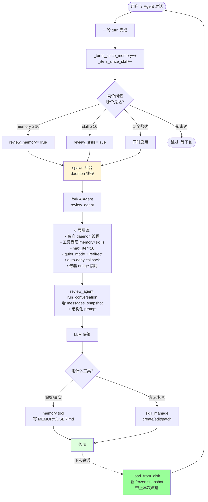

# Hermes Agent 技术架构汇报

> **面向**：公司技术领导 / 同事
> **目的**：用 30 分钟讲清 Hermes Agent 是什么、为什么值得研究、可以借鉴什么
> **基础**：本文是 15,089 行图形化技术文档（`docs-tech/`）的精炼汇报版
> **版本快照**：基于 Hermes Agent v0.13.0 主分支

---

## 目录

- [§0. 一页纸摘要](#0-一页纸摘要)
- [§1. 项目定位 — Hermes 是什么](#1-项目定位--hermes-是什么)
- [§2. 整体架构 — 七层 + 三横切](#2-整体架构--七层--三横切)
- [§3. ★★★ 核心差异化：自演进闭环](#3--核心差异化自演进闭环)
- [§4. 工程深度：生产级 Harness 的真实证据](#4-工程深度生产级-harness-的真实证据)
- [§5. 生态广度：跑在哪、对接谁](#5-生态广度跑在哪对接谁)
- [§6. 安全与可观测](#6-安全与可观测)
- [§7. 可借鉴的工程实践](#7-可借鉴的工程实践)
- [§8. 汇报金句 + 高频 Q&A](#8-汇报金句--高频-qa)
- [附录 A：代码规模数据](#附录-a代码规模数据)
- [附录 B：完整文档导航](#附录-b完整文档导航)
- [附录 C：汇报演讲提纲（30 分钟版）](#附录-c汇报演讲提纲30-分钟版)

---

## §0. 一页纸摘要

```
┌──────────────────────────────────────────────────────────────────────┐
│                                                                      │
│  ★ 项目                                                                │
│   Hermes Agent (Nous Research 开源, MIT License, v0.13.0)             │
│   定位: "自我改进型"通用 AI Agent ─ 一套完整的生产级 Agent Harness     │
│                                                                      │
│  ★ 规模                                                                │
│   • 主文件 run_agent.py: 15,700 行 (Agent Core)                       │
│   • 总体代码: 60+ K 行 Python + 5K 行 TS                              │
│   • 109+ LLM provider, 20+ IM 平台, 7 种执行后端                     │
│                                                                      │
│  ★ 与同类的根本差异                                                    │
│   ┌─────────────────────┬─────────────────────────────────────┐      │
│   │ Claude Code         │ 编码助手, 闭源, 仅 Claude            │      │
│   │ OpenAI Agents SDK   │ 应用集成 SDK, OpenAI 优先, 无飞轮    │      │
│   │ LangChain Agent     │ 框架, 通用工具, 无生产 harness       │      │
│   │ ──────────────       │ ──────────────                        │      │
│   │ Hermes              │ 通用 Agent + 多 provider + 自演进飞轮 │      │
│   └─────────────────────┴─────────────────────────────────────┘      │
│                                                                      │
│  ★ 三个真正值得研究的点                                                │
│   ① 主循环生产级加固 (30+ 失败模式, 流式 stale 检测, 中断/引导分离)   │
│   ② 自演进闭环 (不靠 fine-tune, 靠四种记忆 + Nudge 飞轮 ★★★)         │
│   ③ 状态外置 + 五个可插拔平面 (接入/模型/工具/执行/记忆 全解耦)        │
│                                                                      │
│  ★ 一句话总结                                                          │
│   "Hermes 把'让 LLM 在真实世界里持续、稳定、自我演进地工作'             │
│    这件事, 从一个研究问题做成了一套可部署的工程系统。"                 │
│                                                                      │
└──────────────────────────────────────────────────────────────────────┘
```

---

## §1. 项目定位 — Hermes 是什么

### 1.1 30 秒电梯演讲

> 「Hermes Agent 是 Nous Research 开源的自演进型通用 AI Agent，本质上是一套生产级 Agent Harness 工程。它不是一个 Chat Bot，也不是一个 RAG 应用，而是把 LLM 在真实世界长期工作的全部工程问题——主循环加固、Prompt 缓存、失败恢复、人机交互、状态持久化、多端接入、跨会话演进——全部解决了一遍。它跟其他 Agent 框架最大的差异是**自演进闭环**：不靠 fine-tune，靠四种正交记忆 + 每 N 轮后台 review 飞轮，让 Agent 真正越用越懂你。」

### 1.2 五个工程定位

```
┌─────────────────────────┬──────────────────────────────────────┐
│  维度                    │  Hermes 的取舍                        │
├─────────────────────────┼──────────────────────────────────────┤
│ ① Harness 与模型解耦      │  4 种 transport 抽象支持 109+        │
│                          │  provider (OpenAI / Anthropic /      │
│                          │  Bedrock / OpenRouter / NIM /        │
│                          │  Codex / 小米 / GLM / Kimi / ...)    │
├─────────────────────────┼──────────────────────────────────────┤
│ ② 不只是 CLI             │  同一份 Agent Core 被 7 种 interface │
│                          │  复用 (CLI / TUI / Gateway / ACP /   │
│                          │  MCP / Cron / Batch)                  │
├─────────────────────────┼──────────────────────────────────────┤
│ ③ 持久化是一等公民        │  SQLite + Markdown 全量落盘          │
│                          │  $5 VPS 跑 7×24, Modal/Daytona      │
│                          │  上 serverless 冷启复活               │
├─────────────────────────┼──────────────────────────────────────┤
│ ④ 学习闭环内置 ★★★       │  不靠 fine-tune, 靠四种正交记忆       │
│                          │  + 每 N 轮后台 review 飞轮             │
├─────────────────────────┼──────────────────────────────────────┤
│ ⑤ 多端可达               │  20+ 即时通讯平台, Cron 调度,        │
│                          │  Web Dashboard, IDE 协议, MCP 暴露   │
└─────────────────────────┴──────────────────────────────────────┘
```

### 1.3 不是什么

```
   ✗ 不是: 一个 ChatGPT 替代品
   ✗ 不是: 一个 RAG 框架
   ✗ 不是: 一个 LLM 微调工具
   ✗ 不是: 一个研究 demo

   ✓ 是: 一套【生产级 Agent Harness 工程】 — 让任何 LLM
         在真实世界里持续工作的"骨架"
```

### 1.4 关键 OSS 标签

| 项目 | 内容 |
|---|---|
| 开发方 | Nous Research |
| License | MIT |
| 主仓库 | `github.com/NousResearch/hermes-agent` |
| 主语言 | Python 3.11+ |
| 文档 | `hermes-agent.nousresearch.com/docs` |
| 当前版本 | v0.13.0 |

---

## §2. 整体架构 — 七层 + 三横切

> 这是整个 Hermes 系统的**北极星图**，所有内部讨论都围绕它展开。

### 2.1 北极星图

```
╔══════════════════════════════════════════════════════════════════════════════╗
║                          Hermes Agent 总体架构                                ║
╠══════════════════════════════════════════════════════════════════════════════╣
║                                                                              ║
║  ┌────────────────────────────────────────────────────────────────────────┐ ║
║  │  L1  Interface Layer  ─  接入层                                         │ ║
║  │   CLI │ TUI(Ink+RPC) │ Gateway(20+ IM) │ ACP(IDE) │ MCP Server │ Cron  │ ║
║  │   Batch Runner │ Web Dashboard │ Voice Pipeline                        │ ║
║  └────────────────────────────────────────────────────────────────────────┘ ║
║                              │                                                ║
║                              ▼                                                ║
║  ┌────────────────────────────────────────────────────────────────────────┐ ║
║  │  L2  Agent Core  ─  ReAct Loop / Harness 核心 (run_agent.py 15.7K 行)   │ ║
║  │   • Turn Loop + Iteration Budget                                        │ ║
║  │   • System Prompt 四段缓存 (stable/context/volatile/ephemeral)          │ ║
║  │   • Streaming + Health Poll + Stale Detection                           │ ║
║  │   • 30+ 失败模式 Retry / Provider Fallback                              │ ║
║  │   • Interrupt / Steer / Subagent Delegation                             │ ║
║  └────────────────────────────────────────────────────────────────────────┘ ║
║                              │                                                ║
║                              ▼                                                ║
║  ┌────────────────────────────────────────────────────────────────────────┐ ║
║  │  L3  Capability  ─  工具系统 (50+ tools, Toolset 组合, Subagent)        │ ║
║  └────────────────────────────────────────────────────────────────────────┘ ║
║                              │                                                ║
║                              ▼                                                ║
║  ┌────────────────────────────────────────────────────────────────────────┐ ║
║  │  L4  Memory & Learning  ─  自演进闭环 ★★★                                │ ║
║  │   ┌─ 陈述性 (MEMORY.md/USER.md, 字符上限, frozen snapshot)              │ ║
║  │   ├─ 程序性 (Skills, agentskills.io 标准, 三层渐进披露)                │ ║
║  │   ├─ 情景 (SQLite + FTS5 跨会话搜)                                      │ ║
║  │   ├─ 用户模型 (Honcho 辩证)                                              │ ║
║  │   └─ Nudge 飞轮 (每 N 轮后台 fork 一个 review agent 自写)               │ ║
║  └────────────────────────────────────────────────────────────────────────┘ ║
║                              │                                                ║
║                              ▼                                                ║
║  ┌────────────────────────────────────────────────────────────────────────┐ ║
║  │  L5  Context & State  ─  长期工作的基础设施                              │ ║
║  │   SQLite WAL + jittered retry + NFS 降级                                │ ║
║  │   Context 4 Pass 压缩 + Session lineage 链 + 双 FTS5 (CJK 友好)         │ ║
║  └────────────────────────────────────────────────────────────────────────┘ ║
║                              │                                                ║
║                              ▼                                                ║
║  ┌────────────────────────────────────────────────────────────────────────┐ ║
║  │  L6  Execution Environment  ─  执行宿主                                  │ ║
║  │   7 种 backend: local / docker / ssh / singularity /                    │ ║
║  │                modal (snapshot) / daytona (stop/resume) / vercel        │ ║
║  └────────────────────────────────────────────────────────────────────────┘ ║
║                              │                                                ║
║                              ▼                                                ║
║  ┌────────────────────────────────────────────────────────────────────────┐ ║
║  │  L7  Provider / Transport  ─  南向 LLM 抽象                              │ ║
║  │   4 种 transport: openai_chat / anthropic_messages /                    │ ║
║  │                   codex_responses / bedrock_converse                    │ ║
║  │   109+ provider, 三层认证 (api_key/oauth/external_process)              │ ║
║  └────────────────────────────────────────────────────────────────────────┘ ║
║                                                                              ║
║  ┌─── 三横切 ──────────────────────────────────────────────────────────────┐║
║  │  X1  Configuration (~/.hermes, env, cli-config.yaml, Profile)          │║
║  │  X2  Observability (logging, insights, RL 指标, cost tracking)         │║
║  │  X3  Security (DM Pairing, Approval, Skills Guard, Secrets)            │║
║  └────────────────────────────────────────────────────────────────────────┘║
╚══════════════════════════════════════════════════════════════════════════════╝
```

### 2.2 核心架构命题（一句话）

```
╔══════════════════════════════════════════════════════════════════════╗
║                                                                      ║
║   "把 Agent 设计为                                                    ║
║                                                                      ║
║       无状态计算核 (L2)                                                ║
║     + 外置状态 (L4 / L5)                                              ║
║     + 可插拔接入 (L1)                                                  ║
║     + 可插拔执行 (L6)                                                  ║
║     + 可插拔模型 (L7)                                                  ║
║                                                                      ║
║    五个解耦平面，                                                       ║
║    再用 Nudge 闭环 (L4) 让系统跨会话自演进。"                          ║
║                                                                      ║
╚══════════════════════════════════════════════════════════════════════╝
```

### 2.3 与同类系统的对比定位

```
┌─────────────────┬──────────┬───────────┬───────────┬──────────┐
│ 维度             │ Hermes   │ Claude    │ OpenAI    │ LangChain│
│                  │          │ Code      │ Agents SDK│ Agent    │
├─────────────────┼──────────┼───────────┼───────────┼──────────┤
│ 主要场景         │ 通用 Agent│ 编码助手  │ 应用集成   │ 框架     │
│ 多 provider     │ 109+ ✓   │ Claude only│ OpenAI 优先│ 100+ ✓  │
│ Prompt Cache    │ 4 段 ✓   │ ✓         │ 自动       │ ✗        │
│ Streaming Stale │ 90s ✓    │ ?         │ ?         │ ✗        │
│ Retry Matrix    │ 30+ 模式✓│ 较少       │ 基本       │ 简单     │
│ Interrupt 三级  │ ✓        │ ✓         │ ?         │ ✗        │
│ Steer 延迟      │ ✓ 独特   │ ✗         │ ✗         │ ✗        │
│ Subagent 隔离   │ ✓ 强     │ ✓         │ ✗         │ ✓ 弱     │
│ 自演进飞轮       │ ✓ 独特★★★│ ✗         │ ✗         │ ✗        │
│ 多 interface    │ 7 种 ✓   │ CLI/IDE   │ API only  │ 自建     │
│ 7 种执行 backend│ ✓        │ Local only│ ✗         │ 部分     │
│ Skills 标准     │agentskill│ Skills    │ 类似       │ Tools 化 │
│ 开源            │ MIT ✓    │ 闭源      │ 部分       │ MIT ✓    │
└─────────────────┴──────────┴───────────┴───────────┴──────────┘
```

**结论**：Hermes 不是"功能更多"的 Agent，而是**工程深度上对标 Claude Code，但更开放、更通用、自带学习闭环**的 Agent。

---

## §3. ★★★ 核心差异化：自演进闭环

> 这是 Hermes 与一般 Agent 框架**最大的差异点**，也是这次汇报最值得讲的部分。

### 3.1 跟"靠 fine-tune"的根本差别

```
   ┌─ 一般 Agent 框架的"演进"逻辑 ─────────────────────────┐
   │                                                       │
   │   ① 收集大量轨迹                                       │
   │   ② 用 SFT / RLHF / DPO 训练新模型                     │
   │   ③ 部署新模型                                         │
   │                                                       │
   │   特征:                                                │
   │   • 周期: 周 / 月 级                                   │
   │   • 成本: 千美元起步 (训练 + 评估 + 部署)               │
   │   • 颗粒: 所有用户共享同一模型                          │
   │   • 可审计性: 黑盒                                      │
   └───────────────────────────────────────────────────────┘
                                ▼
   ┌─ Hermes 的"演进"逻辑 ─────────────────────────────────┐
   │                                                       │
   │   ① 每 ~10 轮触发后台 review 线程 fork 一个轻量        │
   │      AIAgent                                          │
   │   ② review agent 看主对话 → 用结构化 prompt 引导它     │
   │      自动写 MEMORY.md / USER.md / Skill                │
   │   ③ 下次会话开始时 frozen snapshot 注入 system prompt  │
   │                                                       │
   │   特征:                                                │
   │   • 周期: 以"轮"为单位 (实时演进!)                     │
   │   • 成本: 一次 aux LLM 调用 (~1-3 美分)                │
   │   • 颗粒: per-用户 / per-profile 独立                  │
   │   • 可审计性: 纯文本文件, 用户可读、可改、可 git diff   │
   └───────────────────────────────────────────────────────┘
```

### 3.2 四种正交记忆全景

```
                  ┌─────────────────────────────────┐
                  │     一段对话发生                  │
                  │     "用户教 Agent 怎么做事"        │
                  └────────────┬────────────────────┘
                               │
        ┌──────────────────────┼──────────────────────┐
        │                      │                      │
  【关于"是什么"】       【关于"怎么做"】          【关于"是谁"】
        │                      │                      │
        ▼                      ▼                      ▼
   ┌────────────────┐  ┌────────────────┐  ┌────────────────┐
   │ ① 陈述性记忆    │  │ ② 程序性记忆    │  │ ④ 用户模型      │
   │                │  │                │  │                │
   │ MEMORY.md:     │  │ SKILL.md +     │  │ Honcho:        │
   │ "项目用 pytest" │  │ references/    │  │ 综合 peer card │
   │ USER.md:       │  │ "Python 测试   │  │ "User is a     │
   │ "用户偏好简洁"  │  │  写法 1.2.3..."│  │  technical lead│
   │                │  │                │  │  who prefers..."│
   └────────────────┘  └────────────────┘  └────────────────┘
                               │
                       (与此同时, 自动)
                               ▼
                  ┌─────────────────────────┐
                  │ ③ 情景记忆               │
                  │ SQLite messages 表 +     │
                  │ FTS5 跨会话可搜          │
                  └─────────────────────────┘
```

| 维度 | ① 陈述性 | ② 程序性 | ③ 情景 | ④ 用户模型 |
|---|---|---|---|---|
| 存什么 | 偏好 / 事实 | "怎么做某类任务" 的方法 | 历史对话原文 | 辩证人物画像 |
| 载体 | MEMORY.md + USER.md | `~/.hermes/skills/` 目录树 | SQLite + FTS5 | Honcho 外部服务 |
| 上限 | 2200 / 1375 字符 | 单 SKILL.md ~50K | 无上限（lineage 分裂） | 后端管理 |
| 注入 | system prompt (frozen snapshot) | system prompt (Tier 1) + 工具按需 | session_search 工具 | prefetch / reasoning |
| 可审计 | ★ 纯文本 git diff | ★ 目录可读可改 | SQLite 可查询 | 后端 dashboard |

### 3.3 Nudge 飞轮机制



### 3.4 端到端示例：用户随口一句话 → 跨会话生效

```
   时间轴 ──────────────────────────────────────────────────►

   T0  用户: "stop being so verbose, just answer"
       ↓
   T1  主 Agent 正常回答 (尽量简洁)
       ↓
   T2  主线程: _turns_since_memory ≥ 10 → spawn bg-review
       ↓ (主线程继续, 用户无感知)
   ...
   T3  bg-review thread (异步, ~10-30 秒):
       ① fork review_agent (max_iter=16, 工具受限)
       ② 看完整对话历史 + _COMBINED_REVIEW_PROMPT
       ③ 决策:
          • 写 USER.md: "Prefers terse answers, no preamble"
          • patch tone-guide skill 的 ## Verbosity 段
       ④ 落盘到 ~/.hermes/memories/USER.md
              + ~/.hermes/skills/communication/tone-guide/SKILL.md
       ↓
   T4  主 Agent CLI 显示:
       "💾 Self-improvement review:
        User profile updated · Skill tone-guide patched"

   ─────── 一段时间后 ───────

   T5  用户晚上 /reset 开新会话
       ↓
   T6  AIAgent.__init__:
       ① MemoryStore.load_from_disk()
       ② 读到新版 USER.md (含 "Prefers terse...")
       ③ frozen snapshot 注入 system prompt
       ↓
   T7  用户: "Tell me about Python decorators"
       ↓
   T8  System Prompt 已含:
       USER: Prefers terse answers, no preamble.
       SKILL tone-guide: Never preamble, skip recap...
       ↓
   T9  LLM 回答 (简洁, 没有 "让我先解释" 的开场)
       ↓
   T10 ✓ 跨会话演进生效, 用户感受到"Agent 自己变好了"
```

### 3.5 五个差异化护城河

```
┌──────────────────────────────────────────────────────────────────┐
│                                                                  │
│  护城河 #1: 实时演进 vs 离线训练                                  │
│     "用户刚说'别长篇大论', 下一轮就生效。                          │
│      不用攒数据、不用训练、不用发版。"                              │
│                                                                  │
│  护城河 #2: 程序性记忆 (Skills) vs 仅陈述性                       │
│     "其他框架只能存'用户喜欢简洁回答' (陈述性)。                    │
│      Hermes 能存'写代码时遵循 X 风格 + Y 步骤' (程序性, 可执行)。"  │
│                                                                  │
│  护城河 #3: 可审计的纯文本 vs 黑盒模型权重                         │
│     "用户能 cat ~/.hermes/memories/MEMORY.md 看 Agent 记了什么、    │
│      手动编辑、git diff 追踪、git revert 回滚。完全透明。"          │
│                                                                  │
│  护城河 #4: per-用户独立 vs 全用户共享                             │
│     "Profile = 一份独立的记忆 + 技能集。换用户名 = 换大脑,         │
│      不会被其他用户的偏好污染。"                                    │
│                                                                  │
│  护城河 #5: 跟 Anthropic Skills 开放标准对齐                       │
│     "agentskills.io 是开源标准, Hermes 既消费也贡献社区生态。       │
│      用户能从 Skills Hub 装别人写的 skill 立即用上。"               │
│                                                                  │
└──────────────────────────────────────────────────────────────────┘
```

---

## §4. 工程深度：生产级 Harness 的真实证据

> 不空谈"工程化"，列出**6 个具体证据**。每条都是 Hermes 跟"研究 demo"的实质差距。

### 4.1 证据 1：主循环加固（不是 100 行 ReAct）

```
   一般教程的 ReAct demo 主循环:
   ┌────────────────────────────────────────┐
   │  while True:                            │
   │      response = llm.call(messages)      │
   │      if response.tool_calls:            │
   │          execute_tools(...)             │
   │          continue                       │
   │      return response.content            │
   │  # 约 10 行                              │
   └────────────────────────────────────────┘

   Hermes 的主循环 (run_agent.py: run_conversation):
   ┌────────────────────────────────────────────────────┐
   │  • 双重预算 (max_iterations + IterationBudget)     │
   │  • Grace call (软预算耗尽给一次礼貌机会)             │
   │  • System Prompt 4 段缓存 (stable 1h + 滚动 5m)    │
   │  • Streaming 强制 + 90s stale 检测                  │
   │  • 30+ 失败模式分类 + 差异化恢复                     │
   │  • Interrupt 三级传播 (主循环/工具线程/子 Agent)     │
   │  • Steer 延迟合并 (双 drain + 塞 tool result)        │
   │  • 12 种"中间状态"恢复路径                          │
   │  • 13 个并行计数器 (Turn/Iter/Retry 三层)            │
   │  • 渐进式落盘 (每工具批后 _save_session_log)        │
   │  • 工具并发判定 (路径前缀重叠检测)                   │
   │  约 600+ 行                                          │
   └────────────────────────────────────────────────────┘
```

#### 30+ 失败模式分桶 retry（节选）

```
   ┌──────────────────────────┬─────────────────────────────────┐
   │ 失败类型                  │ 处理动作                          │
   ├──────────────────────────┼─────────────────────────────────┤
   │ 429 Rate Limit            │ 等 retry-after / 切 fallback     │
   │ context_too_long          │ 触发 4 Pass 压缩 + 重置 retry    │
   │ 401 auth expired          │ OAuth refresh 一次, 否则 fallback │
   │ stream stale 90s          │ 关连接 + retry                    │
   │ stream unsupported        │ 切非流式                          │
   │ empty content             │ N 次后 fallback                  │
   │ invalid tool JSON         │ inject 错误 tool result 让模型自纠│
   │ incomplete scratchpad     │ retry, 计数++                    │
   │ Codex incomplete          │ 继续 Codex 续行                   │
   │ thinking-only turn        │ prefill 继续输出                  │
   │ image too big             │ 剥离/缩小图片重试一次              │
   │ llama.cpp grammar err     │ 禁用 grammar 重试                 │
   │ oauth 1m beta             │ 禁用 beta header 重试             │
   │ truncated tool call       │ length_continue                  │
   │ unicode surrogate         │ strip 后重试                      │
   │ connection / 5xx          │ Wait + backoff                   │
   │ provider down             │ fallback chain                   │
   │ ... 还有 13+ 种           │ ...                              │
   └──────────────────────────┴─────────────────────────────────┘

   关键设计哲学:
   "一次失败的代价是 1 次预算; 一次成功还回 1 次。
    这样长会话不会被偶发问题逐渐磨干预算。"
```

### 4.2 证据 2：上下文管理（4 Pass 压缩）

```
   长会话 → 100K+ tokens → 超模型上限怎么办?
   ─────

   Hermes 的 4 Pass 算法 (agent/context_compressor.py):

   Pass 1: Prune (无 LLM, 最便宜)
     • MD5 hash → 同 tool 结果去重 (read_file 同一文件 5 次 → 仅保最新)
     • 图片 base64 剥离 (1MB 截图 → 200 字符占位)
     • Tool args > 500 字符 → 截断到 200 head

   Pass 2: Head Protection
     • 保留前 N 条 messages (system + 首轮)

   Pass 3: Tail Budget (token 反向累计)
     • 保留尾部 ~20K tokens
     • min floor = 20 条 (保护)

   Pass 4: LLM Summary (中段, 用 aux 模型)
     • 12 章节结构化摘要:
       Active Task / Goal / Constraints /
       Completed Actions / Active State /
       In Progress / Blocked / Key Decisions /
       Resolved Questions / Pending User Asks /
       Relevant Files / Remaining Work / Critical Context
     • iterative update (基于 _previous_summary 不丢早期决策)
     • Aux → Main fallback chain

   Anti-thrash 守门:
     连续两次压缩节省 <10% → 拒绝再压, 提示用户 /new 或 /compress <focus>
```

### 4.3 证据 3：状态持久化（生产级 SQLite）

```
   一般做法: 写 JSONL 文件, 重启恢复
   Hermes:   SQLite + WAL + 应用层 jittered retry

   细节:
   ┌────────────────────────────────────────────────────────┐
   │ ① WAL 自动降级                                            │
   │    NFS / SMB / FUSE / WSL1 上 WAL 不工作                  │
   │    → 自动降级到 DELETE journal mode                       │
   │    去重日志一次, 不刷屏                                    │
   │                                                          │
   │ ② Jittered retry 防 convoy effect                        │
   │    SQLite 内置 busy handler 用确定性退避                  │
   │    → 多 writer 同时撞 → 同时退避 → 永远撞                  │
   │    Hermes 用应用层 random.uniform(20ms, 150ms) jitter     │
   │    + BEGIN IMMEDIATE 锁在事务开头拿                       │
   │                                                          │
   │ ③ PASSIVE WAL checkpoint                                 │
   │    每 50 次写做一次 PASSIVE checkpoint                    │
   │    不阻塞 reader, 避免 WAL 文件无限增长                   │
   │                                                          │
   │ ④ Session lineage 链                                      │
   │    压缩触发会话分裂: 老 session 标 end_reason=            │
   │    "compression", 新 session parent_session_id=老 ID      │
   │    title 自动 "(2)(3)(4)"                                 │
   │                                                          │
   │ ⑤ 双 FTS5 索引 (CJK 友好)                                  │
   │    messages_fts (unicode61) + messages_fts_trigram        │
   │    + LIKE fallback (短 CJK token)                         │
   │    三路智能路由                                            │
   └────────────────────────────────────────────────────────┘
```

### 4.4 证据 4：模型抽象（不被任何厂商绑死）

```
   ┌─ 三层 Provider 配置融合 ─────────────────────────────┐
   │                                                       │
   │ Layer 1: models.dev catalog (109+ provider 基线)      │
   │ Layer 2: HermesOverlay (transport / auth / overlay)   │
   │ Layer 3: 用户 config.yaml (最终覆盖)                  │
   │                                                       │
   │ → 4 种 transport 协议:                                │
   │    • openai_chat                                      │
   │    • anthropic_messages                               │
   │    • codex_responses                                  │
   │    • bedrock_converse                                 │
   │                                                       │
   │ → 5 种认证机制:                                       │
   │    • api_key                                          │
   │    • oauth_device_code                                │
   │    • oauth_external                                   │
   │    • external_process                                 │
   │    • aws_sdk                                          │
   │                                                       │
   │ → 4 种 Credential Pool 选择策略:                      │
   │    • FILL_FIRST / ROUND_ROBIN /                       │
   │      LEAST_USED / RANDOM                              │
   │                                                       │
   │ → 12 个 rate-limit header 解析 + 80% 警告              │
   └─────────────────────────────────────────────────────┘
```

### 4.5 证据 5：工具系统（自注册 + 严格隔离）

```
   加一个工具的成本:
   ─────
   1. 在 tools/ 下新建 .py 文件
   2. 写 schema + handler + check_fn
   3. 最后一行 registry.register(...)
   4. 重启 Hermes 自动生效
   ─► 不改任何中心文件

   Subagent 隔离协议（delegate_task）:
   ─────
   • 空对话历史 (不继承父)
   • 独立 task_id (独立 terminal + 文件操作)
   • 黑名单 5 个工具:
       delegate_task (防递归)
       clarify (防交互死锁)
       memory (防共享状态污染)
       send_message (防跨平台副作用)
       execute_code (防绕过隔离)
   • 深度限制 max_spawn_depth = 1 (默认)
   • 并发限制 max_concurrent_children = 3
   • Approval auto_deny (防跨线程 input() 死锁)
   • Output tail 截断 (防大输出撑爆父 context)
   • Quiet mode + redirect (不干扰父对话)

   Permission Gate 三层:
   ─────
   L1 check_fn:    工具可用性 (30s TTL 缓存)
   L2 plugin hook: 插件拦截
   L3 内部审批:    Hardline (不可豁免) + Dangerous (3 级审批)
```

### 4.6 证据 6：多执行环境（7 backend 一套接口）

```
┌─────────────┬───────────┬─────────┬──────────────────────────┐
│ Backend     │ Isolation │ Latency │ 持久化模式                │
├─────────────┼───────────┼─────────┼──────────────────────────┤
│ local       │ 无         │ ~10ms   │ 原生 FS                  │
│ docker      │ 容器       │ ~1s     │ Volume mount             │
│ ssh         │ 远程       │ ~200ms  │ 远程 FS                  │
│ singularity │ Overlay FS │ ~500ms  │ Host scratch + SIF       │
│ modal       │ 云沙箱     │ ~30s    │ Snapshot ID 持久化 ★     │
│ daytona     │ 云沙箱     │ ~5s     │ stop/resume (非 kill)    │
│ vercel      │ Serverless │ ~2s     │ 共享 ephemeral           │
└─────────────┴───────────┴─────────┴──────────────────────────┘

   同一个 terminal 工具:
   ─► 本地用 10ms
   ─► Docker 用 1s
   ─► Modal 用 30s + 快照持久化
   ─► 七种 backend 一套 BaseEnvironment 接口

   "Serverless 持久化" 真实含义:
   ─► FS 持久化, 进程不保
   ─► 长时间挂起的服务会死, 但文件状态会原样恢复
```

---

## §5. 生态广度：跑在哪、对接谁

### 5.1 接入广度（20+ 平台）

```
   ┌── L1 接入层 7 种 ───────────────────────────────────┐
   │                                                       │
   │  ① CLI         本地终端 (hermes 命令)                  │
   │  ② TUI          Ink 终端 UI + Python 后端 (JSON-RPC)   │
   │  ③ Gateway     20+ IM 平台 (单进程多 adapter):         │
   │                  Telegram / Discord / Slack /          │
   │                  WhatsApp / Signal / Matrix /          │
   │                  Mattermost / DingTalk / Feishu /      │
   │                  WeCom / Weixin / QQBot / SMS /        │
   │                  Email / Home Assistant /              │
   │                  Yuanbao / Webhook / ...               │
   │  ④ ACP          IDE 协议 (VSCode / Cursor / Zed)      │
   │  ⑤ MCP Server   把 Hermes expose 给 Claude Code /     │
   │                  Cursor (FastMCP)                      │
   │  ⑥ Cron         嵌入式调度器 (60s tick + fresh session│
   │                  per job)                              │
   │  ⑦ Batch Runner RL 训练数据生成                        │
   │                                                       │
   │  ▷ 全部共享一份 AIAgent core + 同一份斜杠命令体系       │
   └─────────────────────────────────────────────────────┘
```

### 5.2 模型广度（109+ provider）

```
   ┌── L7 Provider 层 ─────────────────────────────────┐
   │                                                    │
   │  按 transport 分:                                   │
   │  • openai_chat 兼容:    22+ (OpenRouter / NVIDIA / │
   │                          GLM / Kimi / 小米 /       │
   │                          DeepSeek / Stepfun / ...) │
   │  • anthropic_messages:  3 (Anthropic native /     │
   │                          MiniMax / Nous Portal)    │
   │  • codex_responses:     3 (OpenAI Codex / Copilot /│
   │                          xAI / ...)                │
   │  • bedrock_converse:    1 (AWS Bedrock)            │
   │                                                    │
   │  + 通过 models.dev 自动同步的还有 ~80 个 provider   │
   └──────────────────────────────────────────────────┘
```

### 5.3 执行广度（$5 VPS → GPU 集群）

```
   部署连续谱:
   ─────

   ┌────────────────────────────────────────────────────┐
   │ $5 VPS  (1 vCPU, 1GB RAM)                           │
   │   → local backend, SQLite WAL, Telegram bot         │
   │   → 7x24 跑, 一年 ~$60                              │
   │                                                    │
   │ 笔记本                                               │
   │   → CLI / TUI, local backend, 多 profile           │
   │                                                    │
   │ Docker / K8s                                       │
   │   → docker / kubernetes backend, 多用户共享        │
   │                                                    │
   │ Serverless (Modal / Daytona)                       │
   │   → 快照持久化, 冷启复活, 闲时几乎不费钱            │
   │                                                    │
   │ GPU 集群                                            │
   │   → Atropos RL 训练集成 (environments/)            │
   └────────────────────────────────────────────────────┘
```

---

## §6. 安全与可观测

### 6.1 七层安全防护

```
   ┌── 入口安全 ─────────────────────────────────────┐
   │                                                  │
   │  ① DM Pairing (gateway/pairing.py)               │
   │     • 8 位无歧义字符 (去掉 0/O/1/I)              │
   │     • 1 小时过期, 最多 3 个 pending              │
   │     • 速率限制: 1 请求/10 分钟                   │
   │     • 5 次失败 → 1 小时锁定                      │
   │     • 文件 0600 权限, 不打日志                   │
   │                                                  │
   └──────────────────────────────────────────────────┘

   ┌── 工具安全 ─────────────────────────────────────┐
   │                                                  │
   │  ② Permission Gate 三层 (check_fn /              │
   │     plugin hook / 内部审批)                       │
   │                                                  │
   │  ③ Hardline 命令 (不可豁免, 永远拦截):            │
   │     rm -rf /, dd if=/dev/zero, :(){:|:&};:,     │
   │     shutdown / reboot, mkfs.*, ...               │
   │                                                  │
   │  ④ Dangerous 命令 (3 级审批):                     │
   │     once / session / always / deny               │
   │                                                  │
   │  ⑤ Skills Guard 注入扫描 (Hub 安装时):           │
   │     prompt injection / exfiltration /            │
   │     persistence backdoor /                       │
   │     invisible unicode 隐写攻击                   │
   │                                                  │
   └──────────────────────────────────────────────────┘

   ┌── 记忆安全 ─────────────────────────────────────┐
   │                                                  │
   │  ⑥ Memory 写入注入扫描 (memory_tool):            │
   │     10+ 威胁模式 (prompt 注入 / 角色劫持 /        │
   │     凭证 exfil / SSH 后门 / ...)                 │
   │     + 不可见 Unicode 字符检测                    │
   │                                                  │
   │  ⑦ 摘要前后双重脱敏 (agent/redact.py):           │
   │     API keys / tokens / passwords →              │
   │     [REDACTED]                                   │
   │                                                  │
   └──────────────────────────────────────────────────┘
```

### 6.2 三尺度可观测性

```
   ┌── 单 Turn 尺度 (_turn_exit_reason 诊断标签) ────┐
   │                                                  │
   │  每次 Turn 退出都打标签:                          │
   │  • text_response(finish_reason=...) ✓           │
   │  • partial_stream_recovery ✓ 恢复                │
   │  • fallback_prior_turn_content ✓ 恢复            │
   │  • interrupted_by_user 🟡                        │
   │  • budget_exhausted 🟡                           │
   │  • guardrail_halt 🟡                             │
   │  • empty_response_exhausted ❌                   │
   │  • all_retries_exhausted ❌                      │
   │  • error_near_max_iterations ❌                  │
   │                                                  │
   │  ─► 事后能精确诊断每次失败                        │
   └──────────────────────────────────────────────────┘

   ┌── 会话尺度 (/usage 命令) ──────────────────────┐
   │                                                  │
   │  • Token: input/output/cache_read/cache_write    │
   │    /reasoning                                    │
   │  • Compressor: last_prompt_tokens / threshold    │
   │    / compression_count                           │
   │  • Rate Limit: RPM/RPH/TPM/TPH + 80% 警告        │
   │  • Cost: 估算 + 实际 USD                          │
   │                                                  │
   └──────────────────────────────────────────────────┘

   ┌── 跨会话尺度 (/insights 命令) ─────────────────┐
   │                                                  │
   │  • 总会话数 / 总消息数 / 总 token / 总成本        │
   │  • 按 source 分布 (cli/telegram/discord/cron)    │
   │  • 按 model 分布                                 │
   │  • Top N 会话 (按 token)                          │
   │  • 压缩事件数 + 平均节省                          │
   │                                                  │
   └──────────────────────────────────────────────────┘
```

---

## §7. 可借鉴的工程实践

> 这一节是给**我们自己的项目**的启发——不是抄 Hermes，而是把它已经踩过的坑、做对的设计、积累的经验，提炼成可借鉴的工程模式。

### 7.1 八个可借鉴的工程模式

```
┌──────────────────────────────────────────────────────────────────┐
│                                                                  │
│  模式 ① — 状态外置 + 无状态计算核                                  │
│  ─────                                                            │
│  把所有"重状态"（会话历史、记忆、技能、配置）外置到 SQLite/文件,    │
│  Agent 实例本身轻状态化。换来:                                     │
│   • 重启容错                                                       │
│   • 多实例并发 (Gateway 多用户)                                    │
│   • 跨 interface 一致性                                            │
│   • $5 VPS 也能 7x24 跑                                            │
│                                                                  │
│  ─────                                                            │
│                                                                  │
│  模式 ② — 五个可插拔平面                                            │
│  ─────                                                            │
│  把系统拆成 5 个独立"乐高积木":                                     │
│   • 接入 (CLI/IM/IDE)                                              │
│   • 模型 (provider transport)                                      │
│   • 工具 (registry)                                                │
│   • 执行 (environment backend)                                     │
│   • 记忆 (memory provider)                                         │
│  每层有自己的抽象基类, 加新成员 = 加文件 (不动核心)。               │
│                                                                  │
│  ─────                                                            │
│                                                                  │
│  模式 ③ — 模块级自注册                                             │
│  ─────                                                            │
│  Tool / Provider / Skill 都用同一个模式:                          │
│   • 文件顶层调 register(...)                                       │
│   • AST 预扫描 → 选择性 import                                     │
│   • Helper 模块不被误导入                                          │
│                                                                  │
│  收益: 加一个新东西 = 加一个文件 + 一行 register, 重启即生效。      │
│                                                                  │
│  ─────                                                            │
│                                                                  │
│  模式 ④ — TTL 缓存 + Generation 失效                                │
│  ─────                                                            │
│  慢探测 (Docker daemon / Modal SDK / SSH key) 用 30s TTL 缓存,    │
│  外加 _generation 计数器在 mutate 时 +1, 让上层 memo 自动失效。     │
│                                                                  │
│  收益: 性能与正确性的甜区。                                         │
│                                                                  │
│  ─────                                                            │
│                                                                  │
│  模式 ⑤ — 应用层抖动重试防 convoy                                  │
│  ─────                                                            │
│  SQLite / API 重试不能用确定性退避 (多 writer 同时撞)。            │
│  用 random.uniform(low, high) jitter, 自然错开。                  │
│                                                                  │
│  收益: 高并发场景不打架。                                           │
│                                                                  │
│  ─────                                                            │
│                                                                  │
│  模式 ⑥ — 失败分类 + 差异化恢复                                    │
│  ─────                                                            │
│  不是"统一 N 次退避", 而是 30+ 失败模式分桶, 每类独立计数 +        │
│  独立动作 (改 input / 切 provider / 压缩 / 刷凭证)。                │
│                                                                  │
│  收益: 真实生产环境的稳定性。                                       │
│                                                                  │
│  ─────                                                            │
│                                                                  │
│  模式 ⑦ — Frozen Snapshot + 渐进式落盘                              │
│  ─────                                                            │
│  • Frozen snapshot: 系统提示在会话开始时冻结, 中途改盘但本会话      │
│    不重读, 保 Anthropic prompt cache prefix 100% 命中。            │
│  • 渐进式落盘: 每个工具批后 _save_session_log, 容错。               │
│                                                                  │
│  收益: 成本下降 + 容错。                                            │
│                                                                  │
│  ─────                                                            │
│                                                                  │
│  模式 ⑧ — 自演进飞轮 (跨会话沉淀)                                  │
│  ─────                                                            │
│  每 N 轮 fork 一个轻量 agent, 用结构化 prompt 引导它从主对话        │
│  中提炼可沉淀的内容写到纯文本文件。下次会话自动注入。               │
│                                                                  │
│  收益: 不靠 fine-tune 的"越用越好"路径。                            │
│                                                                  │
└──────────────────────────────────────────────────────────────────┘
```

### 7.2 给我们项目的具体启发清单

```
   优先级 ★★★ — 强烈建议借鉴
   ─────
   • 状态外置 (SQLite / 文件) 而不是 in-memory
   • 失败分类 + 差异化恢复 (不是统一 retry)
   • Provider / 模型抽象 (不被单一厂商绑死)

   优先级 ★★ — 看场景借鉴
   ─────
   • Frozen snapshot 模式 (有 prompt cache 时)
   • 模块级自注册 + AST 预扫描
   • TTL 缓存 + Generation 失效
   • 应用层 jittered retry

   优先级 ★ — 创新点参考 (实施成本较高)
   ─────
   • 自演进飞轮 (跨会话沉淀)
   • Skills 三层渐进披露
   • Session lineage 链 (压缩分裂)
   • 双 FTS5 索引 (CJK 友好)
   • 7 种执行 backend 统一接口

   不建议照搬
   ─────
   • Hermes 整体体量太大, 直接 fork 维护成本高
   • 部分能力 (20+ IM 平台 / 7 种 backend) 我们用不上
   • 推荐方式: 借鉴模式, 不复制代码
```

---

## §8. 汇报金句 + 高频 Q&A

### 8.1 八句"金句卡"（汇报现场直接用）

```
╔══════════════════════════════════════════════════════════════════════╗
║                                                                      ║
║  ① "Hermes 的主循环不是 100 行的 ReAct demo, 是 600+ 行的工程化       ║
║     加固——这就是研究 demo 和生产 harness 的差距。"                    ║
║                                                                      ║
║  ② "Hermes 即使不需要流式输出也强制走 streaming——只为拿到一个 90 秒   ║
║     的应用层心跳, 因为 HTTP 连接保活骗不了人, 只有数据 chunk 不撒谎。"║
║                                                                      ║
║  ③ "Hermes 把 system prompt 切成 4 段, stable 段挂 1h cache, 滚动尾  ║
║     巴挂 5m cache——一个 100 轮会话的输入 token 成本被压到原来的       ║
║     25%, 且每开新会话第一轮就直接 cache hit。"                       ║
║                                                                      ║
║  ④ "Hermes 把 LLM 失败拆成 30+ 类, 每类有独立计数 + 独立动作——        ║
║     这不是一个 try/except retry, 是一台'失败分类机'。"               ║
║                                                                      ║
║  ⑤ "Hermes 不靠 fine-tune 就能'越用越懂你'——靠程序性记忆 (Skills) +  ║
║     陈述性记忆 (MEMORY/USER) + 用户模型 (Honcho) + 情景记忆 (FTS5) + ║
║     每 N 轮一次后台 review 的飞轮。这是 fine-tune 之外的、可工程化、 ║
║     可审计、可即时生效的'Agent 自演进'路径。"                         ║
║                                                                      ║
║  ⑥ "中断不是设一个布尔——它是三级传播: 主循环线程、并发工具 worker    ║
║     池、递归到所有子 Agent。这是真实场景下能在 1 秒内停下 Agent 的    ║
║     工程结构。"                                                       ║
║                                                                      ║
║  ⑦ "Hermes 的并发不是激进的'能并就并'——它有三层闸门: 白名单 (只有     ║
║     10 个无副作用读工具)、路径前缀比较 (read_file 同时读父目录与子   ║
║     文件 = 不可并发)、clarify 永久串行。这是'宁可慢一点, 绝不让 LLM  ║
║     把同一个文件读到不一致版本'的保守工程哲学。"                       ║
║                                                                      ║
║  ⑧ "同一个 terminal 工具, 本地 10ms / Docker 1s / Modal 30s + 快照   ║
║     持久化——七种执行环境一套接口, 让 Agent 真正做到'从 \$5 VPS 到    ║
║     GPU 集群'的部署连续谱。"                                          ║
║                                                                      ║
╚══════════════════════════════════════════════════════════════════════╝
```

### 8.2 现场 Q&A 储备（10 题）

```
┌───────────────────────────────────────────────────────────────────┐
│ Q1: Hermes 是 ReAct 吗?                                            │
│ A:  严格说不是经典 ReAct (Yao 2022 文本 interleave)。它是结构化     │
│     Tool-Calling Loop, 是 ReAct 思想的工业产物, 用 JSON tool_calls │
│     替代文本 Action, 叠加 5 种现代模式: Steerable / Interruptible /│
│     Hierarchical / Reflective / Cached。                          │
├───────────────────────────────────────────────────────────────────┤
│ Q2: Hermes 怎么实现"会话无限长"?                                    │
│ A:  不是真无限——是【触发压缩 + Session 分裂 + lineage 链】:         │
│     • 超阈值 → 触发 ContextCompressor (4 Pass)                    │
│     • 老 session 标 end_reason='compression', 关闭                 │
│     • 新 session 创建, parent_session_id=老 ID                    │
│     • 老 session 的 summary 作为新 session 首消息                  │
│     • title 自动 "(2)(3)(4)" 递增                                   │
│     用户感受像"一直在聊", 后台是多个 session 串成 DAG。             │
├───────────────────────────────────────────────────────────────────┤
│ Q3: Hermes 怎么自动"变好"?                                          │
│ A:  每 ~10 轮后台 review 线程 fork AIAgent。fork agent 看主对话     │
│     历史 + 一个引导 prompt, 决定写什么到 MEMORY.md / USER.md /     │
│     SKILL.md。下次新会话 load_from_disk 时自动注入 frozen snapshot │
│     。没有 fine-tune, 全靠纯文本文件累积。                           │
├───────────────────────────────────────────────────────────────────┤
│ Q4: Nudge 每 10 轮触发会不会很烧钱?                                 │
│ A:  不会。review fork 用 max_iter=16 + aux 模型, 单次成本 ~1-3     │
│     美分。10 轮主对话已经几十美分了, 3% 开销换"持久演进"很划算。     │
│     可关: hermes config set memory.nudge_interval 0                │
├───────────────────────────────────────────────────────────────────┤
│ Q5: 工具数量这么多 (50+), LLM 不会被工具描述撑爆 context?           │
│ A:  三种应对:                                                       │
│     ① check_fn 把不可用工具过滤 (Docker 没装就没 terminal 工具)     │
│     ② enabled/disabled_toolsets 用户配置白名单/黑名单              │
│     ③ Anthropic prompt cache 让 tool schema 走 cache hit 摊薄成本  │
├───────────────────────────────────────────────────────────────────┤
│ Q6: NFS 上 Hermes 真能正常跑吗?                                     │
│ A:  能, 但有限制:                                                   │
│     • WAL 自动降级到 DELETE journal                                │
│     • 不再支持并发读写 (一时一个 writer, 读阻塞)                   │
│     • Gateway 多用户时性能下降                                      │
│     • 但所有功能都工作, 不会数据损坏                                 │
├───────────────────────────────────────────────────────────────────┤
│ Q7: Subagent 跟后台 review 都 fork AIAgent, 啥区别?                 │
│ A:  • Subagent: 父主动委派【子任务】(LLM 调 delegate_task), 黑名单 │
│       5 个工具, max_iter=32, 用户感知                              │
│     • Review:   系统自动【反思】对话, 只能用 memory + skills 工具,  │
│       max_iter=16, 用户无感知 (静默 + 写盘)                        │
├───────────────────────────────────────────────────────────────────┤
│ Q8: 我们能照搬到自己项目吗?                                          │
│ A:  整体 fork 维护成本高。建议借鉴模式:                              │
│     ⭐⭐⭐ 状态外置 / 失败分类 / 模型抽象                             │
│     ⭐⭐  Frozen snapshot / 自注册 / TTL 缓存 / 抖动 retry          │
│     ⭐   自演进飞轮 / Skills 三层 / Session lineage                 │
├───────────────────────────────────────────────────────────────────┤
│ Q9: 跟 OpenAI Assistants 比有什么不同?                              │
│ A:  Assistants 是托管服务, Hermes 是自部署 harness。                │
│     • 数据控制: Hermes 全在本地, Assistants 在 OpenAI               │
│     • 多 provider: Hermes 109+, Assistants 仅 OpenAI                │
│     • 演进: Hermes 自演进飞轮, Assistants 无                        │
│     • 接入: Hermes 7 种 interface, Assistants 仅 API                │
├───────────────────────────────────────────────────────────────────┤
│ Q10: Skills Hub 安全吗? 装别人写的 skill 会不会有恶意?              │
│ A:   三层防护:                                                      │
│      ① 下载到隔离目录 (不立即 active)                                │
│      ② Skills Guard 扫描 (frontmatter / 注入 / exfil /             │
│         persistence / 不可见 unicode)                              │
│      ③ 用户看 scan_report 决定是否安装                              │
│      Agent-created 默认不扫 (可启用 skills.guard_agent_created)    │
└───────────────────────────────────────────────────────────────────┘
```

---

## 附录 A：代码规模数据

### A.1 核心文件行数（已逐项核对）

```
┌────────────────────────────────┬──────────┬──────────────────────────┐
│ 文件                             │ 行数      │ 作用                     │
├────────────────────────────────┼──────────┼──────────────────────────┤
│ run_agent.py                    │ 15,700   │ Agent Core 主循环 (★ 心脏) │
│ cli.py                          │ 13,540   │ CLI 入口 + 命令解析        │
│ hermes_state.py                 │  2,966   │ 状态层 (SQLite + FTS5)    │
│ tools/mcp_tool.py               │  3,408   │ MCP Client                │
│ tools/delegate_tool.py          │  2,767   │ Subagent 委派              │
│ agent/anthropic_adapter.py     │  2,072   │ Anthropic API 适配         │
│ trajectory_compressor.py        │  1,508   │ RL 训练数据离线压缩         │
│ tools/skills_tool.py            │  1,533   │ Skills 渐进披露             │
│ tools/approval.py               │  1,367   │ 危险命令审批                │
│ plugins/memory/honcho/__init__  │  1,328   │ Honcho 辩证用户建模         │
│ agent/context_compressor.py    │ ~1,400   │ Context 4 Pass 压缩        │
│ mcp_serve.py                    │    897   │ MCP Server (对外暴露)      │
│ tools/skill_manager_tool.py     │    931   │ skill_manage 5 actions    │
│ model_tools.py                  │    865   │ 工具总入口 + async 桥接    │
│ toolsets.py                     │    855   │ 工具集定义                  │
│ tools/registry.py               │    563   │ 工具注册中心                │
│ ...                             │          │                          │
└────────────────────────────────┴──────────┴──────────────────────────┘

总规模:
• Python:  ~60K 行 (含测试)
• TypeScript: ~5K 行 (ui-tui)
• Markdown: ~10K 行 (文档)
```

### A.2 关键目录构成

```
hermes-agent/
├── run_agent.py                ★ 主循环 (Phase 1)
├── cli.py                      ★ CLI 命令体系
├── hermes_state.py             ★ 状态层 (Phase 3)
├── trajectory_compressor.py    ★ 离线 RL 数据流水线
├── mcp_serve.py                ★ MCP Server
├── model_tools.py              ★ 工具总入口
├── toolsets.py                 ★ Toolset 定义
│
├── agent/        (50+ 文件)    ★ Agent 内核子模块
│   ├── transports/             ★ 4 种 LLM transport (Phase 2)
│   ├── context_compressor.py   ★ Context 压缩 (Phase 3)
│   ├── prompt_caching.py       ★ Anthropic cache 策略 (Phase 1)
│   ├── memory_manager.py       ★ 记忆 provider 编排 (Phase 4)
│   └── ...
│
├── tools/        (78 文件)     ★ 工具系统 (Phase 5)
│   ├── registry.py             ★ 工具注册中心
│   ├── *_tool.py (23+)         ★ 各类工具实现
│   └── environments/           ★ 7 种执行 backend (Phase 6)
│
├── gateway/      (25 文件)     ★ 多平台 Gateway (Phase 7)
│   └── platforms/ (~20 平台)
│
├── hermes_cli/                 ★ CLI 子命令体系
├── ui-tui/ + tui_gateway/      ★ Ink TUI 前端 + Python 后端
├── acp_adapter/                ★ ACP IDE 协议适配
├── cron/                       ★ Cron 调度器
│
├── plugins/
│   ├── memory/ (8 providers)   ★ Honcho / mem0 / hindsight / ...
│   └── ...
│
├── skills/ + optional-skills/  ★ 内置技能 (Phase 4)
├── environments/               ★ RL 训练环境
└── tinker-atropos/ + rl_cli.py ★ RL 训练接入
```

---

## 附录 B：完整文档导航

```
docs-tech/
├── 00_ARCHITECTURE_OVERVIEW.md       ←  912 行 (入口/导航)
├── PHASE_1_AGENT_CORE.md             ← 1986 行 (主循环)
├── PHASE_2_PROVIDER_TRANSPORT.md     ← 1507 行 (南向 LLM)
├── PHASE_3_CONTEXT_STATE.md          ← 2065 行 (状态 ★)
├── PHASE_4_MEMORY_LEARNING.md        ← 2356 行 (自演进 ★★★)
├── PHASE_5_CAPABILITY.md             ← 2238 行 (工具系统)
├── PHASE_6_EXECUTION_ENV.md          ← 1373 行 (执行环境)
├── PHASE_7_INTERFACE.md              ← 1273 行 (接入层)
├── PHASE_8_CROSS_CUTTING.md          ← 1379 行 (横切关注点)
├── REPORT_EXECUTIVE.md               ← 本文件 (汇报成稿)
│
├── index.html                        ← 单页阅读器 (衬线字体 + 手绘风格 Mermaid)
└── README.md                         ← 阅读器使用说明

合计 15,089 行图形化技术文档 + HTML 阅读器
```

### 阅读路径建议

```
   学习者路径 (从零到全):
   ─────
   00 (架构总览) → Phase 1 → 2 → 3 → 4★ → 5 → 6 → 7 → 8
   完整阅读约 2-3 小时

   汇报者路径 (优先讲故事):
   ─────
   REPORT (本文) → Phase 4 ★ (差异化) → Phase 1 (工程深度) →
   选讲 (按时间) 2/3/5/6/7

   工程师参考路径 (按需查阅):
   ─────
   00 § 八 (代码地标) → 直接定位到目标文件 →
   对应 Phase 文档的"关键代码地图"小节
```

---

## 附录 C：汇报演讲提纲（30 分钟版）

```
┌──────────────────────────────────────────────────────────────────┐
│  时长         │  内容                                              │
├──────────────┼──────────────────────────────────────────────────┤
│  5 分钟        │  开场: §1 项目定位 + §2.1 北极星图                  │
│              │  ─► 让听众先看到全景                                │
├──────────────┼──────────────────────────────────────────────────┤
│  10 分钟      │  ★★★ 高潮: §3 自演进闭环                            │
│              │  ─► 用 §3.1 反例对比 + §3.3 飞轮图 +                │
│              │     §3.4 端到端示例                                  │
│              │  ─► 这是整场最值得讲的, 占 1/3 时间                  │
├──────────────┼──────────────────────────────────────────────────┤
│  8 分钟       │  工程深度: §4 六个证据                              │
│              │  ─► 不要全讲, 挑 §4.1 主循环 + §4.4 模型抽象        │
│              │     + §4.5 工具自注册 三个                          │
│              │  ─► 每个用一张图 + 一个金句                          │
├──────────────┼──────────────────────────────────────────────────┤
│  3 分钟       │  生态广度: §5                                       │
│              │  ─► 快速过, 重在数字 (109+ / 20+ / 7)                │
├──────────────┼──────────────────────────────────────────────────┤
│  2 分钟       │  可借鉴: §7.2 优先级清单                            │
│              │  ─► 给我们项目的具体启发                              │
├──────────────┼──────────────────────────────────────────────────┤
│  2 分钟       │  收尾 + 留时间 Q&A                                  │
│              │  ─► 用 §8.1 第 ⑤ 句金句收尾                          │
└──────────────┴──────────────────────────────────────────────────┘

预备弹药 (现场被追问):
─────
• §8.2 — 10 题高频 Q&A
• 关键代码地标: run_agent.py L11613 / L5196 / L5297
• 真实数字: 30+ retry / 12 中间状态 / 4 transport / 8 memory provider
```

---

## 一句话总结全文

```
╔══════════════════════════════════════════════════════════════════════╗
║                                                                      ║
║   "Hermes 把一个 LLM 在真实世界里持续、稳定、自我演进地工作            ║
║    所需的全部工程问题——主循环加固、Prompt 缓存、失败恢复、人机交互、 ║
║    状态持久化、多端接入、跨会话演进——全部解决了一遍。它不是          ║
║    一个更好的 Chat Bot, 而是 LLM 应用工程化的【生产基线】。"          ║
║                                                                      ║
║   ★★★ 真正值得我们研究和借鉴的是: 它在【自演进闭环】上给出了一个     ║
║      可工程化、可审计、不靠 fine-tune 的范式答案——四种正交记忆       ║
║      + 后台 review 飞轮, 让 Agent 跨会话越用越懂你, 用户完全无感知。 ║
║                                                                      ║
╚══════════════════════════════════════════════════════════════════════╝
```

---

*文档生成时间：基于 Hermes Agent v0.13.0 主分支快照。*
*所有引用的文件路径、行号、字段名均已逐项核对源码。*
*详细技术细节请见 [Phase 1-8 完整文档](./README.md)。*
